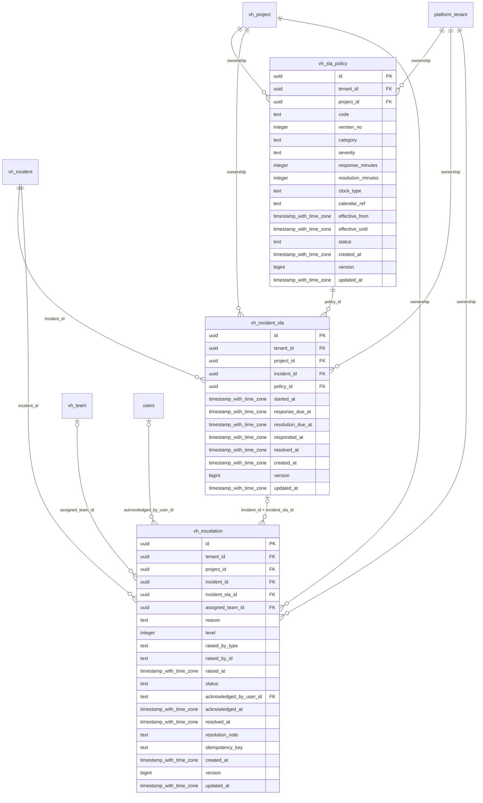

# vinhomes-sla

Generated from Drizzle. External entities in the diagram are foreign-key targets owned by another module.

## vh_escalation

Hồ sơ chuyển cấp khi vi phạm SLA/an toàn/yêu cầu thủ công, người tiếp nhận và kết quả xử lý.

Tenant RLS: **enabled + forced by integrity migrations 0047/0049/0052**.

| Column | PostgreSQL type | Required | Default | Declared values |
|---|---|---|---|---|
| `id` | `uuid` | yes | `gen_random_uuid()` | — |
| `tenant_id` | `uuid` | yes | `—` | — |
| `project_id` | `uuid` | yes | `—` | — |
| `incident_id` | `uuid` | yes | `—` | — |
| `incident_sla_id` | `uuid` | no | `—` | — |
| `assigned_team_id` | `uuid` | no | `—` | — |
| `reason` | `text` | yes | `—` | `RESPONSE_BREACH`, `RESOLUTION_BREACH`, `SAFETY`, `MANUAL` |
| `level` | `integer` | yes | `—` | — |
| `raised_by_type` | `text` | yes | `—` | `HUMAN`, `SYSTEM`, `AGENT` |
| `raised_by_id` | `text` | yes | `—` | — |
| `raised_at` | `timestamp with time zone` | yes | `—` | — |
| `status` | `text` | yes | `—` | `OPEN`, `ACKNOWLEDGED`, `RESOLVED` |
| `acknowledged_by_user_id` | `text` | no | `—` | — |
| `acknowledged_at` | `timestamp with time zone` | no | `—` | — |
| `resolved_at` | `timestamp with time zone` | no | `—` | — |
| `resolution_note` | `text` | no | `—` | — |
| `idempotency_key` | `text` | yes | `—` | — |
| `created_at` | `timestamp with time zone` | yes | `now()` | — |
| `version` | `bigint` | yes | `1` | — |
| `updated_at` | `timestamp with time zone` | yes | `now()` | — |

Primary key: `id`.

Unique keys:

- `vh_escalation_uq_0`: (`tenant_id`, `idempotency_key`).
- `vh_escalation_uq_1`: (`tenant_id`, `id`).
- `vh_escalation_uq_2`: (`tenant_id`, `project_id`, `id`).

Foreign keys:

- (`tenant_id`) → `platform_tenant` (`id`); ON DELETE `restrict`.
- (`tenant_id`, `project_id`) → `vh_project` (`tenant_id`, `id`); ON DELETE `restrict`.
- (`tenant_id`, `project_id`, `incident_id`) → `vh_incident` (`tenant_id`, `project_id`, `id`); ON DELETE `restrict`.
- (`tenant_id`, `project_id`, `incident_id`, `incident_sla_id`) → `vh_incident_sla` (`tenant_id`, `project_id`, `incident_id`, `id`); ON DELETE `restrict`.
- (`tenant_id`, `project_id`, `assigned_team_id`) → `vh_team` (`tenant_id`, `project_id`, `id`); ON DELETE `restrict`.
- (`acknowledged_by_user_id`) → `users` (`id`); ON DELETE `restrict`.

Indexes:

- `vh_escalation_ix_0`: (`acknowledged_by_user_id`).
- `vh_escalation_ix_2`: (`tenant_id`, `project_id`).
- `vh_escalation_ix_3`: (`tenant_id`, `project_id`, `assigned_team_id`).
- `vh_escalation_ix_4`: (`tenant_id`, `project_id`, `incident_id`).
- `vh_escalation_ix_5`: (`tenant_id`, `project_id`, `incident_id`, `incident_sla_id`).

Checks:

- `vh_escalation_reason_ck`: `"vh_escalation"."reason" in ('RESPONSE_BREACH', 'RESOLUTION_BREACH', 'SAFETY', 'MANUAL')`.
- `vh_escalation_raised_by_type_ck`: `"vh_escalation"."raised_by_type" in ('HUMAN', 'SYSTEM', 'AGENT')`.
- `vh_escalation_status_ck`: `"vh_escalation"."status" in ('OPEN', 'ACKNOWLEDGED', 'RESOLVED')`.
- `vh_escalation_ck_0`: `level > 0`.
- `vh_escalation_ck_1`: `status NOT IN ('ACKNOWLEDGED','RESOLVED') OR (acknowledged_by_user_id IS NOT NULL AND acknowledged_at IS NOT NULL)`.
- `vh_escalation_ck_2`: `status<>'RESOLVED' OR (resolved_at IS NOT NULL AND resolution_note IS NOT NULL)`.
- `vh_escalation_ck_3`: `version > 0`.

Cross-row rules and application responsibilities: [database design](../01_DATABASE_ERD_IMPLEMENTATION_COMPLETE.md) and [system flow](../02_BUSINESS_ANALYSIS_IMPLEMENTATION.md).

## vh_incident_sla

Snapshot áp dụng SLA cho một incident, deadline và thời điểm phản hồi/giải quyết thực tế.

Tenant RLS: **enabled + forced by integrity migrations 0047/0049/0052**.

| Column | PostgreSQL type | Required | Default | Declared values |
|---|---|---|---|---|
| `id` | `uuid` | yes | `gen_random_uuid()` | — |
| `tenant_id` | `uuid` | yes | `—` | — |
| `project_id` | `uuid` | yes | `—` | — |
| `incident_id` | `uuid` | yes | `—` | — |
| `policy_id` | `uuid` | yes | `—` | — |
| `started_at` | `timestamp with time zone` | yes | `—` | — |
| `response_due_at` | `timestamp with time zone` | yes | `—` | — |
| `resolution_due_at` | `timestamp with time zone` | yes | `—` | — |
| `responded_at` | `timestamp with time zone` | no | `—` | — |
| `resolved_at` | `timestamp with time zone` | no | `—` | — |
| `created_at` | `timestamp with time zone` | yes | `now()` | — |
| `version` | `bigint` | yes | `1` | — |
| `updated_at` | `timestamp with time zone` | yes | `now()` | — |

Primary key: `id`.

Unique keys:

- `vh_incident_sla_uq_0`: (`tenant_id`, `incident_id`).
- `vh_incident_sla_uq_1`: (`tenant_id`, `id`).
- `vh_incident_sla_uq_2`: (`tenant_id`, `project_id`, `id`).
- `vh_incident_sla_uq_3`: (`tenant_id`, `project_id`, `incident_id`, `id`).

Foreign keys:

- (`tenant_id`) → `platform_tenant` (`id`); ON DELETE `restrict`.
- (`tenant_id`, `project_id`) → `vh_project` (`tenant_id`, `id`); ON DELETE `restrict`.
- (`tenant_id`, `project_id`, `incident_id`) → `vh_incident` (`tenant_id`, `project_id`, `id`); ON DELETE `restrict`.
- (`tenant_id`, `project_id`, `policy_id`) → `vh_sla_policy` (`tenant_id`, `project_id`, `id`); ON DELETE `restrict`.

Indexes:

- `vh_incident_sla_ix_1`: (`tenant_id`, `project_id`).
- `vh_incident_sla_response_ix`: (`tenant_id`, `response_due_at`) WHERE `"vh_incident_sla"."responded_at" is null`.
- `vh_incident_sla_resolution_ix`: (`tenant_id`, `resolution_due_at`) WHERE `"vh_incident_sla"."resolved_at" is null`.
- `vh_incident_sla_ix_2`: (`tenant_id`, `project_id`, `incident_id`).
- `vh_incident_sla_ix_3`: (`tenant_id`, `project_id`, `policy_id`).

Checks:

- `vh_incident_sla_ck_0`: `response_due_at >= started_at`.
- `vh_incident_sla_ck_1`: `resolution_due_at >= response_due_at`.
- `vh_incident_sla_ck_2`: `responded_at IS NULL OR responded_at >= started_at`.
- `vh_incident_sla_ck_3`: `resolved_at IS NULL OR resolved_at >= started_at`.
- `vh_incident_sla_ck_4`: `version > 0`.

Cross-row rules and application responsibilities: [database design](../01_DATABASE_ERD_IMPLEMENTATION_COMPLETE.md) and [system flow](../02_BUSINESS_ANALYSIS_IMPLEMENTATION.md).

## vh_sla_policy

Phiên bản SLA theo dự án/category/severity với thời hạn phản hồi/giải quyết tính theo thời gian liên tục.

Tenant RLS: **enabled + forced by integrity migrations 0047/0049/0052**.

| Column | PostgreSQL type | Required | Default | Declared values |
|---|---|---|---|---|
| `id` | `uuid` | yes | `gen_random_uuid()` | — |
| `tenant_id` | `uuid` | yes | `—` | — |
| `project_id` | `uuid` | yes | `—` | — |
| `code` | `text` | yes | `—` | — |
| `version_no` | `integer` | yes | `—` | — |
| `category` | `text` | yes | `—` | — |
| `severity` | `text` | yes | `—` | `LOW`, `MEDIUM`, `HIGH`, `CRITICAL` |
| `response_minutes` | `integer` | yes | `—` | — |
| `resolution_minutes` | `integer` | yes | `—` | — |
| `clock_type` | `text` | yes | `—` | — |
| `calendar_ref` | `text` | no | `—` | — |
| `effective_from` | `timestamp with time zone` | yes | `—` | — |
| `effective_until` | `timestamp with time zone` | no | `—` | — |
| `status` | `text` | yes | `—` | `DRAFT`, `PUBLISHED`, `RETIRED` |
| `created_at` | `timestamp with time zone` | yes | `now()` | — |
| `version` | `bigint` | yes | `1` | — |
| `updated_at` | `timestamp with time zone` | yes | `now()` | — |

Primary key: `id`.

Unique keys:

- `vh_sla_policy_uq_0`: (`tenant_id`, `project_id`, `code`, `version_no`).
- `vh_sla_policy_uq_1`: (`tenant_id`, `id`).
- `vh_sla_policy_uq_2`: (`tenant_id`, `project_id`, `id`).

Foreign keys:

- (`tenant_id`) → `platform_tenant` (`id`); ON DELETE `restrict`.
- (`tenant_id`, `project_id`) → `vh_project` (`tenant_id`, `id`); ON DELETE `restrict`.

Indexes:

- `vh_sla_policy_ix_1`: (`tenant_id`, `project_id`).

Checks:

- `vh_sla_policy_severity_ck`: `"vh_sla_policy"."severity" in ('LOW', 'MEDIUM', 'HIGH', 'CRITICAL')`.
- `vh_sla_policy_status_ck`: `"vh_sla_policy"."status" in ('DRAFT', 'PUBLISHED', 'RETIRED')`.
- `vh_sla_policy_ck_0`: `version_no > 0`.
- `vh_sla_policy_ck_1`: `clock_type = 'ELAPSED'`.
- `vh_sla_policy_ck_2`: `response_minutes > 0`.
- `vh_sla_policy_ck_3`: `resolution_minutes >= response_minutes`.
- `vh_sla_policy_ck_4`: `effective_until IS NULL OR effective_until > effective_from`.
- `vh_sla_policy_ck_5`: `version > 0`.

Cross-row rules and application responsibilities: [database design](../01_DATABASE_ERD_IMPLEMENTATION_COMPLETE.md) and [system flow](../02_BUSINESS_ANALYSIS_IMPLEMENTATION.md).
