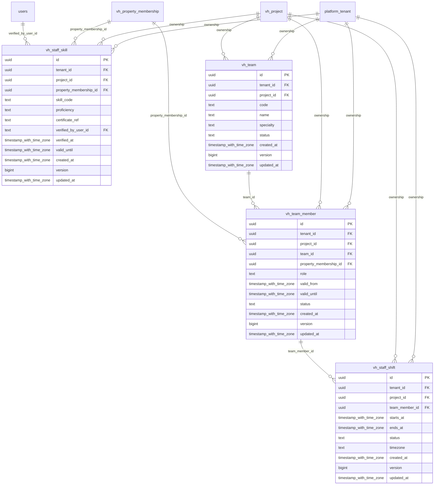

# vinhomes-workforce

Generated from Drizzle. External entities in the diagram are foreign-key targets owned by another module.

## vh_staff_shift

Ca làm việc của thành viên đội, thời gian và trạng thái; không cho ca đang áp dụng chồng nhau của cùng người.

Tenant RLS: **enabled + forced by integrity migrations 0047/0049/0052**.

| Column | PostgreSQL type | Required | Default | Declared values |
|---|---|---|---|---|
| `id` | `uuid` | yes | `gen_random_uuid()` | — |
| `tenant_id` | `uuid` | yes | `—` | — |
| `project_id` | `uuid` | yes | `—` | — |
| `team_member_id` | `uuid` | yes | `—` | — |
| `starts_at` | `timestamp with time zone` | yes | `—` | — |
| `ends_at` | `timestamp with time zone` | yes | `—` | — |
| `status` | `text` | yes | `—` | `PLANNED`, `CONFIRMED`, `COMPLETED`, `CANCELLED` |
| `timezone` | `text` | yes | `—` | — |
| `created_at` | `timestamp with time zone` | yes | `now()` | — |
| `version` | `bigint` | yes | `1` | — |
| `updated_at` | `timestamp with time zone` | yes | `now()` | — |

Primary key: `id`.

Unique keys:

- `vh_staff_shift_uq_0`: (`tenant_id`, `id`).
- `vh_staff_shift_uq_1`: (`tenant_id`, `project_id`, `id`).

Foreign keys:

- (`tenant_id`) → `platform_tenant` (`id`); ON DELETE `restrict`.
- (`tenant_id`, `project_id`) → `vh_project` (`tenant_id`, `id`); ON DELETE `restrict`.
- (`tenant_id`, `project_id`, `team_member_id`) → `vh_team_member` (`tenant_id`, `project_id`, `id`); ON DELETE `restrict`.

Indexes:

- `vh_staff_shift_ix_1`: (`tenant_id`, `project_id`).
- `vh_staff_shift_ix_2`: (`tenant_id`, `project_id`, `team_member_id`).

Checks:

- `vh_staff_shift_status_ck`: `"vh_staff_shift"."status" in ('PLANNED', 'CONFIRMED', 'COMPLETED', 'CANCELLED')`.
- `vh_staff_shift_ck_0`: `ends_at > starts_at`.
- `vh_staff_shift_ck_1`: `version > 0`.

Cross-row rules and application responsibilities: [database design](../01_DATABASE_ERD_IMPLEMENTATION_COMPLETE.md) and [system flow](../02_BUSINESS_ANALYSIS_IMPLEMENTATION.md).

## vh_staff_skill

Năng lực/chứng nhận đã xác minh của nhân viên, cấp độ và hạn hiệu lực.

Tenant RLS: **enabled + forced by integrity migrations 0047/0049/0052**.

| Column | PostgreSQL type | Required | Default | Declared values |
|---|---|---|---|---|
| `id` | `uuid` | yes | `gen_random_uuid()` | — |
| `tenant_id` | `uuid` | yes | `—` | — |
| `project_id` | `uuid` | yes | `—` | — |
| `property_membership_id` | `uuid` | yes | `—` | — |
| `skill_code` | `text` | yes | `—` | — |
| `proficiency` | `text` | yes | `—` | `BASIC`, `QUALIFIED`, `EXPERT` |
| `certificate_ref` | `text` | no | `—` | — |
| `verified_by_user_id` | `text` | yes | `—` | — |
| `verified_at` | `timestamp with time zone` | yes | `—` | — |
| `valid_until` | `timestamp with time zone` | no | `—` | — |
| `created_at` | `timestamp with time zone` | yes | `now()` | — |
| `version` | `bigint` | yes | `1` | — |
| `updated_at` | `timestamp with time zone` | yes | `now()` | — |

Primary key: `id`.

Unique keys:

- `vh_staff_skill_uq_0`: (`tenant_id`, `property_membership_id`, `skill_code`).
- `vh_staff_skill_uq_1`: (`tenant_id`, `id`).
- `vh_staff_skill_uq_2`: (`tenant_id`, `project_id`, `id`).

Foreign keys:

- (`tenant_id`) → `platform_tenant` (`id`); ON DELETE `restrict`.
- (`tenant_id`, `project_id`) → `vh_project` (`tenant_id`, `id`); ON DELETE `restrict`.
- (`tenant_id`, `project_id`, `property_membership_id`) → `vh_property_membership` (`tenant_id`, `project_id`, `id`); ON DELETE `restrict`.
- (`verified_by_user_id`) → `users` (`id`); ON DELETE `restrict`.

Indexes:

- `vh_staff_skill_ix_1`: (`tenant_id`, `project_id`).
- `vh_staff_skill_ix_2`: (`tenant_id`, `project_id`, `property_membership_id`).
- `vh_staff_skill_ix_3`: (`verified_by_user_id`).

Checks:

- `vh_staff_skill_proficiency_ck`: `"vh_staff_skill"."proficiency" in ('BASIC', 'QUALIFIED', 'EXPERT')`.
- `vh_staff_skill_ck_0`: `valid_until IS NULL OR valid_until > verified_at`.
- `vh_staff_skill_ck_1`: `version > 0`.

Cross-row rules and application responsibilities: [database design](../01_DATABASE_ERD_IMPLEMENTATION_COMPLETE.md) and [system flow](../02_BUSINESS_ANALYSIS_IMPLEMENTATION.md).

## vh_team

Đội nghiệp vụ theo dự án/chuyên môn, độc lập với nhóm agent AI.

Tenant RLS: **enabled + forced by integrity migrations 0047/0049/0052**.

| Column | PostgreSQL type | Required | Default | Declared values |
|---|---|---|---|---|
| `id` | `uuid` | yes | `gen_random_uuid()` | — |
| `tenant_id` | `uuid` | yes | `—` | — |
| `project_id` | `uuid` | yes | `—` | — |
| `code` | `text` | yes | `—` | — |
| `name` | `text` | yes | `—` | — |
| `specialty` | `text` | yes | `—` | `TECHNICAL`, `SANITATION`, `SECURITY`, `LANDSCAPE`, `MULTI` |
| `status` | `text` | yes | `—` | `ACTIVE`, `INACTIVE` |
| `created_at` | `timestamp with time zone` | yes | `now()` | — |
| `version` | `bigint` | yes | `1` | — |
| `updated_at` | `timestamp with time zone` | yes | `now()` | — |

Primary key: `id`.

Unique keys:

- `vh_team_uq_0`: (`tenant_id`, `project_id`, `code`).
- `vh_team_uq_1`: (`tenant_id`, `id`).
- `vh_team_uq_2`: (`tenant_id`, `project_id`, `id`).

Foreign keys:

- (`tenant_id`) → `platform_tenant` (`id`); ON DELETE `restrict`.
- (`tenant_id`, `project_id`) → `vh_project` (`tenant_id`, `id`); ON DELETE `restrict`.

Indexes:

- `vh_team_ix_1`: (`tenant_id`, `project_id`).

Checks:

- `vh_team_specialty_ck`: `"vh_team"."specialty" in ('TECHNICAL', 'SANITATION', 'SECURITY', 'LANDSCAPE', 'MULTI')`.
- `vh_team_status_ck`: `"vh_team"."status" in ('ACTIVE', 'INACTIVE')`.
- `vh_team_ck_0`: `version > 0`.

Cross-row rules and application responsibilities: [database design](../01_DATABASE_ERD_IMPLEMENTATION_COMPLETE.md) and [system flow](../02_BUSINESS_ANALYSIS_IMPLEMENTATION.md).

## vh_team_member

Nhân viên/nhà thầu tham gia đội qua property membership, vai trò và khoảng hiệu lực.

Tenant RLS: **enabled + forced by integrity migrations 0047/0049/0052**.

| Column | PostgreSQL type | Required | Default | Declared values |
|---|---|---|---|---|
| `id` | `uuid` | yes | `gen_random_uuid()` | — |
| `tenant_id` | `uuid` | yes | `—` | — |
| `project_id` | `uuid` | yes | `—` | — |
| `team_id` | `uuid` | yes | `—` | — |
| `property_membership_id` | `uuid` | yes | `—` | — |
| `role` | `text` | yes | `—` | `LEAD`, `TECHNICIAN`, `DISPATCHER` |
| `valid_from` | `timestamp with time zone` | yes | `—` | — |
| `valid_until` | `timestamp with time zone` | no | `—` | — |
| `status` | `text` | yes | `—` | `ACTIVE`, `INACTIVE` |
| `created_at` | `timestamp with time zone` | yes | `now()` | — |
| `version` | `bigint` | yes | `1` | — |
| `updated_at` | `timestamp with time zone` | yes | `now()` | — |

Primary key: `id`.

Unique keys:

- `vh_team_member_uq_0`: (`tenant_id`, `id`).
- `vh_team_member_uq_1`: (`tenant_id`, `project_id`, `id`).
- `vh_team_member_uq_2`: (`tenant_id`, `project_id`, `team_id`, `id`).

Foreign keys:

- (`tenant_id`) → `platform_tenant` (`id`); ON DELETE `restrict`.
- (`tenant_id`, `project_id`) → `vh_project` (`tenant_id`, `id`); ON DELETE `restrict`.
- (`tenant_id`, `project_id`, `team_id`) → `vh_team` (`tenant_id`, `project_id`, `id`); ON DELETE `restrict`.
- (`tenant_id`, `project_id`, `property_membership_id`) → `vh_property_membership` (`tenant_id`, `project_id`, `id`); ON DELETE `restrict`.

Indexes:

- `vh_team_member_ix_1`: (`tenant_id`, `project_id`).
- `vh_team_member_ix_2`: (`tenant_id`, `project_id`, `property_membership_id`).
- `vh_team_member_ix_3`: (`tenant_id`, `project_id`, `team_id`).

Checks:

- `vh_team_member_role_ck`: `"vh_team_member"."role" in ('LEAD', 'TECHNICIAN', 'DISPATCHER')`.
- `vh_team_member_status_ck`: `"vh_team_member"."status" in ('ACTIVE', 'INACTIVE')`.
- `vh_team_member_ck_0`: `valid_until IS NULL OR valid_until > valid_from`.
- `vh_team_member_ck_1`: `version > 0`.

Cross-row rules and application responsibilities: [database design](../01_DATABASE_ERD_IMPLEMENTATION_COMPLETE.md) and [system flow](../02_BUSINESS_ANALYSIS_IMPLEMENTATION.md).
