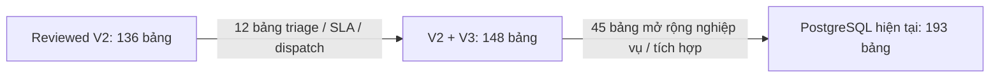

# So sánh số bảng với thiết kế database ban đầu phía Hoàng

Đối chiếu ngày 04/10/2026. Mốc Hoàng ở đây là bản database V2/V3 được đưa vào `develop` qua commit `df8b4aa` của `NguyenHoang151216`. Đây là nội dung được đưa vào qua commit, không phải khẳng định Hoàng tự viết mọi phần hoặc mọi workflow đã chạy hoàn chỉnh.

## 1. Ba mốc so sánh

| Mốc | Số bảng PostgreSQL ứng dụng | Chênh lệch |
|---|---:|---|
| Thiết kế Reviewed V2 ban đầu | 136 | Mốc gốc |
| Thiết kế V2 + V3 Hoàng đưa vào develop | 148 | +12 so với V2; +8,8% |
| Database hiện tại `vinhomes_v3` | 193 | +45 so với V3; +30,4% |

Nếu lấy V2 làm mốc ban đầu, hiện tại tăng **57 bảng, tương đương 41,9%**. Nếu lấy bản V3 đã triển khai schema làm mốc, tăng **45 bảng, tương đương 30,4%**.

Nguồn thiết kế: [DATABASE_IMPLEMENTATION_V3.md](../../../DATABASE_IMPLEMENTATION_V3.md), `server/src/db/design/v2.json`, `v3.json`, `merged.json`. Commit lịch sử `df8b4aa` có 148 tên bảng trong `merged.json`; tất cả 148 tên này còn trong database hiện tại. Không có tên bảng baseline bị mất. Kết quả này xác nhận tập tên bảng, không khẳng định định nghĩa cột/ràng buộc chưa thay đổi.

## 2. V2 → V3: thêm 12 bảng, sửa định nghĩa 6 bảng

12 bảng thêm:

- `triage_policy_versions`, `triage_policy_bindings`, `triage_rules`.
- `ticket_assessments`, `ticket_assessment_evidence`.
- `ticket_triage_decisions`, `ticket_triage_reviews`.
- `ticket_sla_cycles`, `ticket_sla_adjustments`, `ticket_escalations`.
- `dispatch_attempts`, `work_reassignment_requests`.

6 bảng được mô tả lại trong V3: `tickets`, `sla_policies`, `dispatch_queue`, `work_assignments`, `incident_types`, `ticket_events`. Sửa bảng không được tính thành bảng mới.

## 3. V3 → hiện tại: 45 bảng thêm từ migration

| Phần bổ sung | Migration | Bảng mới |
|---|---|---:|
| Operations: QC, vệ sinh, an ninh, nhà thầu, ngân sách | `0001_vinhomes_operations.sql` | 7 |
| QC yêu cầu làm lại | `0002_vinhomes_qc_redo.sql` | 1 |
| Cảnh báo, camera, người liên hệ khẩn cấp | `0003_vinhomes_security.sql` | 4 |
| Phương án, tài sản, đo đạc, bảo trì, review agent, xuất báo cáo, upload | `0004_vinhomes_business_flows.sql` | 9 |
| Hợp đồng Resident: tiếp nhận, kết quả, phản hồi, ảnh, sự kiện, outbox | `0006_resident_contract.sql` | 10 |
| Thông điệp và trạng thái chờ Reception ↔ Supervisor V2 | `0007_reception_supervisor_v2.sql` | 2 |
| Biên nhận lệnh Reception để xử lý gửi lại | `0008_reception_command_receipt.sql` | 1 |
| Technical Agent API: quyền, SOP, cảm biến, kết quả, duyệt, audit | `0009_technical_agent_api.sql` | 11 |
| **Tổng** | | **45** |

Migration `0005`, `0010`, `0011`, `0012` không tạo bảng mới; chúng vẫn có thể thay đổi ràng buộc, hàm hoặc hành vi. Tên module trong bảng trên là phân loại nội dung migration, không phải quy kết toàn bộ việc tạo bảng cho một team.

### Danh sách đủ 45 bảng

**0001 — 7 bảng:** `vh_qc_results`, `vh_cleaning_plans`, `vh_security_checkpoints`, `vh_security_incidents`, `vh_security_handovers`, `vh_contractor_updates`, `vh_budget_approvals`.

**0002 — 1 bảng:** `vh_qc_redo_orders`.

**0003 — 4 bảng:** `security_alert_deliveries`, `security_alerts`, `security_cameras`, `security_emergency_contacts`.

**0004 — 9 bảng:** `vh_ticket_plans`, `vh_assets`, `vh_sensor_readings`, `vh_technical_measurements`, `vh_maintenance_records`, `vh_operational_requests`, `vh_agent_reviews`, `vh_report_exports`, `vh_conversation_uploads`.

**0006 — 10 bảng:** `vh_resident_cases`, `vh_resident_submissions`, `vh_resident_case_tickets`, `vh_resident_photos`, `vh_resident_resolutions`, `vh_resident_resolution_photos`, `vh_resident_resolution_responses`, `vh_resident_public_events`, `vh_resident_command_receipts`, `vh_resident_outbox`.

**0007 — 2 bảng:** `vh_reception_supervisor_messages`, `vh_reception_supervisor_pending`.

**0008 — 1 bảng:** `vh_command_receipt`.

**0009 — 11 bảng:** `vh_technical_agent_grants`, `vh_technical_sop_profiles`, `vh_technical_sensors`, `vh_technical_sensor_samples`, `vh_technical_measurement_records`, `vh_technical_executor_results`, `vh_technical_maintenance_events`, `vh_technical_approval_requests`, `vh_technical_vendors`, `vh_technical_api_receipts`, `vh_technical_api_audit`.

## 4. Quan hệ và mức cập nhật của catalog

- Baseline lịch sử `df8b4aa:server/drizzle/0000_grey_blockbuster.sql` có **545 khóa ngoại**. Database hiện tại có **682**, tăng **137**. Mỗi constraint FK ghép nhiều cột vẫn tính là một khóa ngoại; con số này bao gồm cả ràng buộc thêm vào bảng cũ.
- `merged.json` hiện vẫn mô tả **148 bảng**. Nó chưa phản ánh đầy đủ 45 bảng mở rộng trong migration/database.
- Registry Drizzle xuất ra từ `schema/index.ts` hiện gồm **154 bảng**: baseline 148 + 2 bảng Reception/Supervisor + 4 bảng security. **39 bảng còn lại** tồn tại qua SQL/backend nhưng không nằm trong registry này. Không suy ra chúng là bảng bỏ đi chỉ từ tiền tố `vh_`.
- Có thêm **9 bảng SQLite runtime** ở Reception/Coordination trong lần kiểm kê toàn dự án. Chúng được tính riêng; không cộng vào khi so với kế hoạch 136/148 bảng PostgreSQL. Bảng journal migration cũng tính riêng.

## 5. Bằng chứng và phạm vi

- Kiểm tra lại trực tiếp PostgreSQL `vinhomes_v3`, container `vinhomes-faker-v3-postgres-1`, ngày 04/10/2026: **193 bảng public**, **682 khóa ngoại**.
- Checkout hiện tại: `dev_teamChien_HuyDo`, HEAD `d463f1a9db4a313422eb984a7d23357a5be617f1`. Có thay đổi chưa commit của phiên làm việc khác; đối chiếu này không sửa code hoặc database.
- Catalog chi tiết: [ALL_TABLES.md](./ALL_TABLES.md), [ALL_FOREIGN_KEYS.csv](./ALL_FOREIGN_KEYS.csv), [schema-live.json](./schema-live.json).
- Nếu “bên Hoàng” là **Team Hoàng Reception/Report**, kế hoạch `docs/teams/hoang/PHAN_CONG_3_THANH_VIEN.md` phân công runtime/tools/agent và ghi rõ team không sở hữu database/migration. Do đó 193 là tổng schema dự án, không phải số bảng riêng do Team Hoàng phụ trách.
- Số bảng có thật không chứng minh mọi API, agent hoặc workflow đã nghiệm thu chạy thật.
