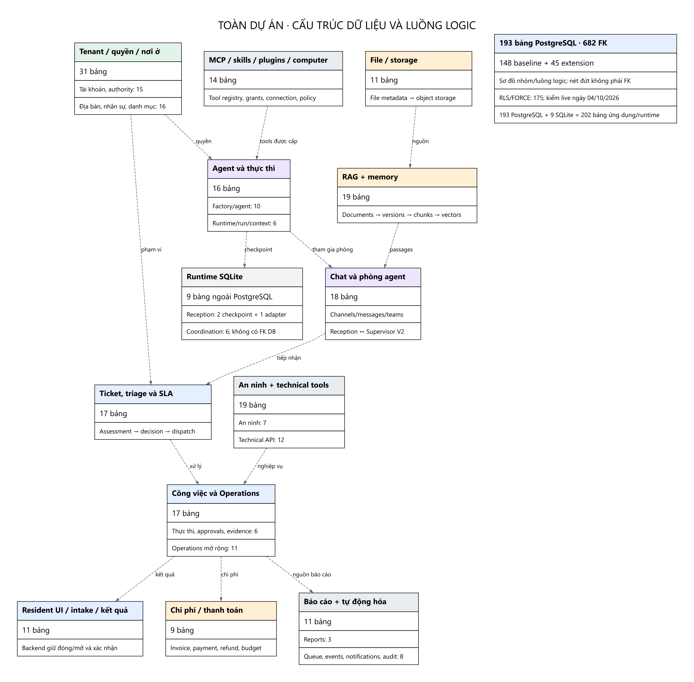

# Toàn bộ dự án: bảng và quan hệ — 04/10/2026

**PostgreSQL nghiệp vụ/platform hiện có 193 bảng ứng dụng và 682 khóa ngoại.** 57 bảng của báo cáo RAG trước là một phần trong 193 bảng này; không cộng thêm 57. Ngoài PostgreSQL còn có 9 bảng SQLite phục vụ runtime Reception/Coordination.

**Cách đọc số 193:** đây là kiểm kê schema đang tồn tại, gồm nền OpenBot/platform, nghiệp vụ Vinhomes và extensions. Không phải 193 bảng tôi vừa tạo, cũng không phải 193 bảng đều cần cho một ticket hoặc đều đã được code dùng. Nhóm 19 RAG/memory là cách chia của báo cáo (14 RAG/review + 5 memory), không phải danh sách riêng của một team. Rà soát lại ngày 04/10 xác nhận không lệch tập tên bảng hoặc định nghĩa 682 FK so với database local; [các điểm diễn giải đã sửa](../SYSTEM_FLOW_AND_MAINTENANCE_2026-10-04/REVIEW_CORRECTIONS.md).

Mốc kiểm live: `2026-10-04T02:27:24.438424+07:00`. Nhánh `dev_teamChien_HuyDo`, commit `d463f1a9db4a313422eb984a7d23357a5be617f1`. Phạm vi là checkout hiện tại và các DB local đã tiếp cận, không đại diện mọi DB trên staging/production hoặc mọi nhánh Git.

## Đếm theo lớp

| Lớp | Số bảng | Diễn giải |
|---|---:|---|
| Design model merged.json | 148 | Baseline thiết kế V2/V3 |
| Drizzle registry hiện tại | 154 | tables.ts = 150, security.ts = 4; không bao phủ đủ extension SQL |
| Migration SQL 0000–0012 | 193 tên bảng duy nhất | 148 baseline + 45 bảng tạo thêm; một số migration chỉ ALTER/seed |
| Live public schema vinhomes_v3 | 193 | 682 FK; RLS 175; FORCE RLS 175 |
| Live public schema vinhomes_connected | 193 | Cùng tập tên bảng, 682 FK; một database triển khai khác |
| Migration journal mỗi PostgreSQL DB | 1 | drizzle.__drizzle_migrations; không tính là bảng ứng dụng |
| Reception checkpoint SQLite | 2 | checkpoints, writes |
| Reception adapter SQLite | 1 | reception_records |
| Coordination SQLite | 6 | checkpoints, acknowledgements, inbox, ledger, records, cursors |

Đếm một bản triển khai PostgreSQL và các kho runtime đã xác minh: **193 + 9 = 202 bảng ứng dụng/runtime**; nếu kể cả bảng journal thì **203 bảng**. Không cộng hai database PostgreSQL giống cấu trúc thành 386 bảng thiết kế.

Kho SQLite không có FK được khai báo trong các bảng đã kiểm. Liên hệ giữa SQLite và PostgreSQL nằm trong IDs/key/JSON và bước backend xác minh, không có ràng buộc FK xuyên database. Redis có thể là runtime cache/lease; không được đếm thành bảng quan hệ PostgreSQL.

## Nhóm nghiệp vụ — mỗi bảng chỉ thuộc một nhóm để đếm

| Nhóm | Số bảng | FK đi ra |
|---|---:|---:|
| 01 Tài khoản, tenant và authority | 15 | 23 |
| 02 Địa bàn, nhân sự và danh mục | 16 | 46 |
| 03 Agent và Factory | 10 | 30 |
| 04 Runtime, run và context | 6 | 34 |
| 05 Chat, phòng agent và Reception | 18 | 77 |
| 06 RAG và memory | 19 | 72 |
| 07 File và storage | 11 | 42 |
| 08 Ticket, triage, SLA và dispatch | 17 | 108 |
| 09 Thực thi, phân công và nghiệm thu | 6 | 36 |
| 10 Chi phí và thanh toán | 9 | 32 |
| 11 Operations mở rộng | 11 | 33 |
| 12 Resident UI, intake và kết quả | 11 | 41 |
| 13 An ninh | 7 | 20 |
| 14 Technical agent API | 12 | 26 |
| 15 Báo cáo | 3 | 14 |
| 16 Tools, MCP, skills và computer | 14 | 28 |
| 17 Automation, events và audit | 8 | 20 |
| **Tổng** | **193** | **682** |

Các nhóm là cách đọc báo cáo, không phải mỗi team sở hữu một DB riêng. Một bảng dùng được bởi nhiều module/team.

## Quan hệ chính

1. **Tenant và tài khoản:** tenants → tenant_memberships ← users. Membership → scoped_user_roles → access_scopes. Vai trò theo scope và thời gian có hiệu lực; không dùng user_roles legacy thay nguồn quyền mới.
2. **Địa bàn và cư dân:** sites → zones → buildings → units; users ↔ units qua unit_residents. Một số FK site_id/zone_id được lưu trực tiếp để kiểm cùng địa bàn; sơ đồ không có nghĩa mọi bảng chỉ nối theo một đường cây.
3. **Reception và ticket:** channels → messages; tickets tham chiếu người yêu cầu, channel, căn hộ/địa bàn, category và management. Tiếp nhận, assessment, evidence, triage decision, SLA và dispatch là các bảng riêng có lịch sử.
4. **Thực thi và phê duyệt:** tickets → work_orders → work_assignments; work_approvals và evidence lưu quyết định/bằng chứng. `work_items` là hàng đợi tác vụ có lease của OpenBot, không phải bảng con công việc hiện trường. Nhân viên hoàn thành không tự đồng nghĩa ticket được đóng; backend quản lý nghiệm thu, cư dân xác nhận và trạng thái cuối.
5. **Agent và phòng:** agents → agent_versions → agent_runs; runtime_session_bindings gắn agent/version/channel/audience. agent_teams → team_members/team_tasks/team_mailbox. Task Board/Mailbox có scope chung, checkpoint runtime không thay dữ liệu nghiệp vụ chính thức.
6. **RAG:** knowledge_bases → knowledge_documents → document_versions → knowledge_chunks → knowledge_embeddings. agent_knowledge_grants nối agents với kho; document_scopes nối tài liệu với địa bàn; document_acl giới hạn chủ thể. retrieval_runs → retrieval_hits lưu trace của lần tìm kiếm.
7. **Memory:** namespace → candidate → review/publication → document/version; run_memory_access và runtime_memory_bindings kiểm quyền và ánh xạ runtime. Đây là lớp dùng chung với RAG, không thêm một kho vector độc lập cho mỗi team.
8. **File, tài chính, báo cáo:** files có file_objects trong storage; file được liên kết tới ticket/chat/document/report qua các trường/bảng nối. Invoice/payment/refund và report_sources tham chiếu nguồn nghiệp vụ tương ứng, không được suy ra chỉ từ một câu chat.

## Cách đọc 682 quan hệ

682 là **682 FK constraints**, không phải 682 luồng nghiệp vụ. Có **655 cặp bảng con–cha khác nhau**; một cặp có thể có nhiều FK theo vai trò (người tạo/người duyệt/actor...). Có **166 FK tới tenants**. Khi bỏ riêng các FK tenant chung, còn **516 FK** tới các bảng khác.

FK ghép `(tenant_id,resource_id)` vừa nối bản ghi vừa ngăn tham chiếu chéo tenant. RLS bật cho 175/193 bảng; 18 bảng không bật trong catalog. Không kết luận mọi bảng không RLS là public: có bảng auth/framework/global cần chính sách ở lớp khác. RLS tenant không thay thế ACL, audience, membership hoặc quyền operation.

Quan hệ n–n dùng bảng nối, ví dụ users ↔ tenants qua tenant_memberships; users ↔ units qua unit_residents; agents ↔ knowledge_bases qua agent_knowledge_grants; documents ↔ access_scopes qua document_scopes.

## Hình chi tiết và danh mục đầy đủ

- [Địa bàn/quyền/cư dân](images/01-authority-location.png).
- [Ticket → công việc → phê duyệt/bằng chứng](images/02-ticket-work.png).
- [Agent → phiên bản/run/phòng](images/03-agent-room.png).
- [ERD toàn bộ 193 bảng — SVG, cần phóng to](images/99-full-erd.svg). Source Graphviz nằm trong diagrams/99-full-erd.dot.
- [Danh mục đầy đủ 193 bảng, cột và khóa](ALL_TABLES.md).
- [Toàn bộ 682 FK](ALL_RELATIONSHIPS.md) · [CSV](ALL_FOREIGN_KEYS.csv).
- [Bản đồ RAG chi tiết](../RAG_DATABASE_MAP_2026-10-04/README.md).
- [Catalog live thô](schema-live.json) chứa cấu trúc/định nghĩa và số dòng, không dump dữ liệu từng dòng.

## Điểm lệch giữa các nguồn schema

Migration và live catalog cùng có 193 bảng. ORM registry mới khai báo 154 bảng; **39 bảng có trong DB/migration nhưng chưa có pgTable trong registry**. Các bảng này phần lớn là `vh_*` extension được FastAPI truy vấn SQL trực tiếp, nên không tự coi là bảng không dùng hoặc legacy chỉ từ tiền tố. Design merged.json dừng ở baseline 148.

Không chạy các Alembic legacy của dịch vụ Vinhomes lên V3 để cộng thêm bảng. Các migration đã áp dụng trong `server/drizzle/**` và catalog live là nguồn đếm cho DB này. Sự trùng số bảng/FK giữa hai DB không chứng minh toàn bộ constraint/function/data giống nhau; báo cáo chỉ kiểm tên bảng và số FK cho DB connected.

So với backup RAG ngày 03/10: cùng 193 bảng nhưng backup có 681 FK; live có 682 FK. Đây là khác biệt constraint ở migration Supervisor 0012, không phải thêm bảng.

## 39 bảng chưa được registry ORM khai báo

- `vh_agent_reviews`.
- `vh_assets`.
- `vh_budget_approvals`.
- `vh_cleaning_plans`.
- `vh_command_receipt`.
- `vh_contractor_updates`.
- `vh_conversation_uploads`.
- `vh_maintenance_records`.
- `vh_operational_requests`.
- `vh_qc_redo_orders`.
- `vh_qc_results`.
- `vh_report_exports`.
- `vh_resident_case_tickets`.
- `vh_resident_cases`.
- `vh_resident_command_receipts`.
- `vh_resident_outbox`.
- `vh_resident_photos`.
- `vh_resident_public_events`.
- `vh_resident_resolution_photos`.
- `vh_resident_resolution_responses`.
- `vh_resident_resolutions`.
- `vh_resident_submissions`.
- `vh_security_checkpoints`.
- `vh_security_handovers`.
- `vh_security_incidents`.
- `vh_sensor_readings`.
- `vh_technical_agent_grants`.
- `vh_technical_api_audit`.
- `vh_technical_api_receipts`.
- `vh_technical_approval_requests`.
- `vh_technical_executor_results`.
- `vh_technical_maintenance_events`.
- `vh_technical_measurement_records`.
- `vh_technical_measurements`.
- `vh_technical_sensor_samples`.
- `vh_technical_sensors`.
- `vh_technical_sop_profiles`.
- `vh_technical_vendors`.
- `vh_ticket_plans`.

## Nguồn

- Catalog PostgreSQL live hai DB local, truy vấn read-only.
- server/src/db/design/merged.json; server/src/db/schema/index.ts/tables.ts/security.ts.
- server/drizzle/0000–0012 và meta/_journal.json.
- SQLite local của agent-reception và agent-coordination, mở mode=ro.
