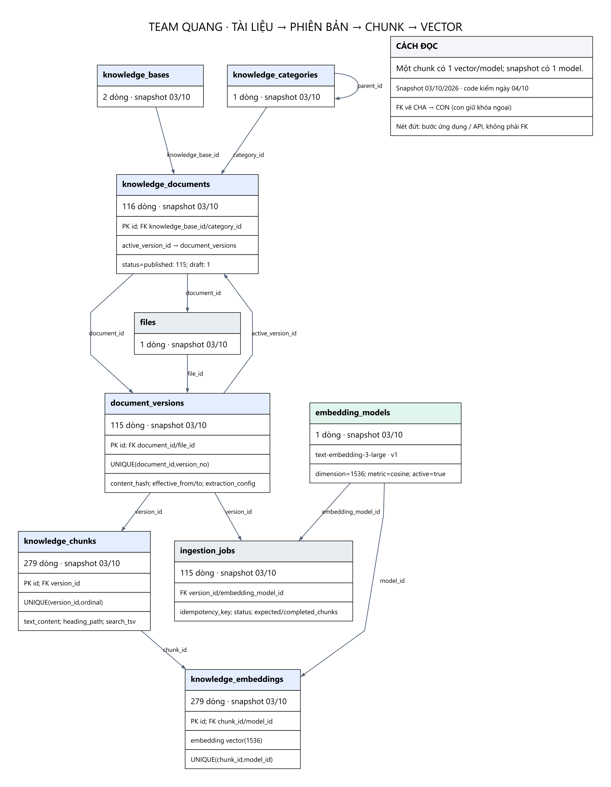
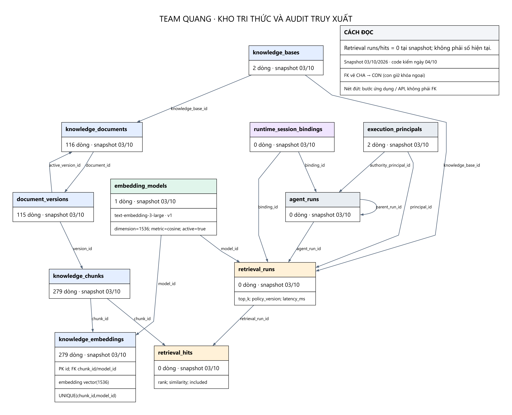

# Team Quang — nạp tài liệu và retrieval

Nhóm này mô tả module `server/src/knowledge/**`. Schema là kho dùng chung của platform; phân team ở đây là trách nhiệm tích hợp trong code/handoff, không xác định người viết từng bảng.

`publish.ts` đăng ký kho, category và file nguồn, ánh xạ folder sang scope thật, cấp knowledge grant cho Reception. `ingest.ts` parse frontmatter, chia heading, tạo version/job, gọi embedding, ghi chunks/vectors cùng transaction, rồi bật active version. File không đổi có thể skipped/unchanged; file biến mất được retired thay vì xóa lịch sử.

115 tài liệu published → 115 phiên bản → 279 chunks → 279 embeddings đang nằm trong snapshot. Tỷ lệ 1 vector/chunk là dữ liệu hiện có một model; schema dùng UNIQUE(chunk_id,model_id), không khóa chunk thành một-một với mọi model.

`retrieval_runs` và `retrieval_hits` đều 0 dòng ở snapshot. Đây chỉ là trạng thái snapshot; không chứng minh code chưa chạy ở thời điểm khác hoặc môi trường khác.

## Các bảng liên quan

| Bảng | Dòng snapshot | Vai trò |
|---|---:|---|
| [knowledge_bases](TABLE_DICTIONARY.md#knowledge_bases) | 2 | Kho tri thức theo tenant/domain; chứa nhiều tài liệu. |
| [knowledge_categories](TABLE_DICTIONARY.md#knowledge_categories) | 1 | Danh mục tài liệu; parent_id tạo cây danh mục. |
| [knowledge_documents](TABLE_DICTIONARY.md#knowledge_documents) | 116 | Định danh tài liệu; trỏ phiên bản đang phục vụ qua active_version_id. |
| [document_versions](TABLE_DICTIONARY.md#document_versions) | 115 | Nội dung có phiên bản, hash, file nguồn, thời gian hiệu lực và metadata. |
| [ingestion_jobs](TABLE_DICTIONARY.md#ingestion_jobs) | 115 | Theo dõi nạp phiên bản bằng một model; chống trùng, trạng thái, lease và số chunks. |
| [knowledge_chunks](TABLE_DICTIONARY.md#knowledge_chunks) | 279 | Đoạn văn bản; heading, thứ tự, hash, ước lượng tokens và chỉ mục từ khóa search_tsv. |
| [embedding_models](TABLE_DICTIONARY.md#embedding_models) | 1 | Danh mục không gian vector: provider/model/revision/dimension/metric/active. |
| [knowledge_embeddings](TABLE_DICTIONARY.md#knowledge_embeddings) | 279 | Vector của một chunk với một model; UNIQUE(chunk_id,model_id). |
| [retrieval_runs](TABLE_DICTIONARY.md#retrieval_runs) | 0 | Nhật ký một lần tra cứu: người, principal, binding, agent run, query, quyền và độ trễ. |
| [retrieval_hits](TABLE_DICTIONARY.md#retrieval_hits) | 0 | Các chunk được xếp hạng trong một retrieval run; lưu similarity và included. |

Xem [thông số](PARAMETERS.md), [toàn bộ FK](RELATIONSHIPS.md) và [từ điển cột/khóa](TABLE_DICTIONARY.md).
