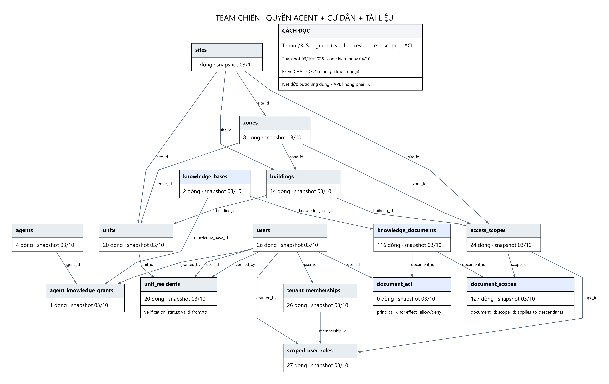

# Team Chiến — DB, authority, phạm vi và storage

Agent grant, quyền cư dân và document ACL/scope là các lớp giao nhau. Backend không tin tenant/user/role do agent tự khai. `/internal/reception/v1/knowledge-authorization` kiểm delegation đang active, agent grant và nơi ở verified; trả targetScopeId, ancestorScopeIds, user/principal/run/binding đã xác minh. Nhiều nơi ở nhưng chưa chọn scope trả 409.

`document_scopes` có 127 dòng cho 115 tài liệu published; bảng nối cho phép một tài liệu nhiều scope. `document_acl` rỗng vẫn có thể được RAG đọc khi scope hợp lệ; keyword endpoint Operations có yêu cầu allow khác, xem PARAMETERS.md.

`files.id` là định danh nguồn bắt buộc của version. Trong publisher hiện tại, một file staged đại diện cả thư mục nguồn; không nên hiểu 115 version = 115 bản file đã tải vào object storage. Kho Markdown gốc nằm riêng ở Data-Vinhome.

Schema storage có `file_objects`, `storage_locations`, upload và processing jobs; số dòng snapshot được ghi dưới đây, không tự suy ra storage đã production.

## Các bảng liên quan

| Bảng | Dòng snapshot | Vai trò |
|---|---:|---|
| [agent_knowledge_grants](TABLE_DICTIONARY.md#agent_knowledge_grants) | 1 | Bảng nối agent với kho được cấp; quyền này vẫn giao với quyền cư dân và tài liệu. |
| [document_scopes](TABLE_DICTIONARY.md#document_scopes) | 127 | Bảng nối tài liệu với địa bàn; applies_to_descendants cho phép áp dụng xuống cấp con. |
| [document_acl](TABLE_DICTIONARY.md#document_acl) | 0 | Allow/deny riêng cho user, role hoặc workspace. |
| [tenants](TABLE_DICTIONARY.md#tenants) | 1 | Ranh giới tenant dùng chung cho dữ liệu và RLS. |
| [domains](TABLE_DICTIONARY.md#domains) | 1 | Miền nghiệp vụ của tenant; knowledge base gắn vào domain. |
| [users](TABLE_DICTIONARY.md#users) | 26 | Tài khoản người dùng, người hỏi, người xuất bản và người duyệt. |
| [tenant_memberships](TABLE_DICTIONARY.md#tenant_memberships) | 26 | Thành viên đang có hiệu lực của tenant. |
| [scoped_user_roles](TABLE_DICTIONARY.md#scoped_user_roles) | 27 | Vai trò management/staff/... trong một phạm vi và thời gian hiệu lực. |
| [access_scopes](TABLE_DICTIONARY.md#access_scopes) | 24 | Địa bàn có kiểu: tenant/site/zone/building/management/...; dùng để giới hạn tài liệu. |
| [sites](TABLE_DICTIONARY.md#sites) | 1 | Đô thị/dự án. |
| [zones](TABLE_DICTIONARY.md#zones) | 8 | Phân khu thuộc site. |
| [buildings](TABLE_DICTIONARY.md#buildings) | 14 | Tòa nhà thuộc site/zone. |
| [units](TABLE_DICTIONARY.md#units) | 20 | Căn hộ thuộc tòa. |
| [unit_residents](TABLE_DICTIONARY.md#unit_residents) | 20 | Cư dân–căn hộ; verification_status và valid_from/to quyết định quyền nơi ở. |
| [management_units](TABLE_DICTIONARY.md#management_units) | 1 | Đơn vị quản lý và chủ quản tài liệu. |
| [management_coverage](TABLE_DICTIONARY.md#management_coverage) | 2 | Phạm vi địa bàn mà một đơn vị quản lý phụ trách. |
| [execution_principals](TABLE_DICTIONARY.md#execution_principals) | 2 | Chủ thể thực thi được backend xác minh; có authz_version. |
| [files](TABLE_DICTIONARY.md#files) | 1 | Định danh file; document_versions.file_id bắt buộc tham chiếu ở đây. |
| [file_objects](TABLE_DICTIONARY.md#file_objects) | 0 | Đối tượng lưu trữ vật lý của một file. |
| [storage_locations](TABLE_DICTIONARY.md#storage_locations) | 1 | Vị trí/bucket lưu trữ; không phải vector store. |
| [file_uploads](TABLE_DICTIONARY.md#file_uploads) | 0 | Phiên upload file. |
| [file_upload_parts](TABLE_DICTIONARY.md#file_upload_parts) | 0 | Các phần của upload nhiều phần. |
| [file_processing_jobs](TABLE_DICTIONARY.md#file_processing_jobs) | 0 | Job xử lý file ở lớp storage. |
| [file_access_logs](TABLE_DICTIONARY.md#file_access_logs) | 0 | Nhật ký truy cập file. |
| [workspaces](TABLE_DICTIONARY.md#workspaces) | 1 | Không gian hoạt động của agent/team. |
| [workspace_members](TABLE_DICTIONARY.md#workspace_members) | 1 | Thành viên workspace; liên quan ACL/audience. |

Xem [thông số](PARAMETERS.md), [toàn bộ FK](RELATIONSHIPS.md) và [từ điển cột/khóa](TABLE_DICTIONARY.md).
