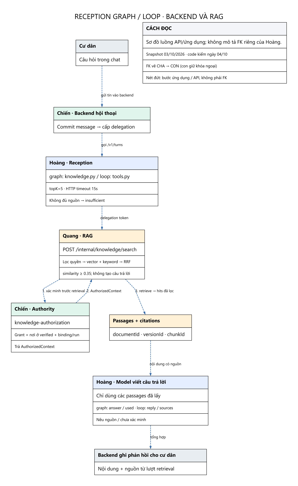

# Team Hoàng — hỏi đáp có nguồn

Backend lưu tin cư dân trước, cấp delegation của lượt rồi gọi Reception. Cư dân đọc câu trả lời qua backend; không gọi trực tiếp service RAG/Reception.

Reception hiện có **hai chế độ**, không phải chỉ một pipeline:

| Chế độ | Code đọc RAG | Cách tổng hợp |
|---|---|---|
| `graph` | `src/runtime/knowledge.py::KnowledgeSearch` | Gọi API với topK=5; model trả `answer` và `used=[rank]`; code kiểm rank, ghép nguồn và citations. Không đủ nguồn thì trả insufficient. Có tối đa một retry khi HTTP 502. |
| `loop` | `src/agent/tools.py::Toolbox._search_knowledge`, `src/agent/loop.py` | Model chọn tool và tổng hợp câu trả lời với `sources`; toolbox giữ passages, vòng loop kiểm phản hồi và ghép nguồn. Không dùng nguyên giao thức `answer/used` của adapter graph; hàm search này không có vòng retry 502 như graph. |

Cả hai dùng delegation, cùng API `/internal/knowledge/search`, topK=5 và HTTP timeout 15 giây. Cấu hình chọn nhánh qua `RECEPTION_AGENT` trong runtime service.

Reception tiêu thụ kho RAG chung qua API. Adapter này không tạo một kho embedding hay schema vector riêng. Channels/messages/reception_sessions/context_snapshots hỗ trợ chat và provenance, không thay thế knowledge_documents/chunks/embeddings.

Các bảng trong trang này là nền chat/context theo schema; không khẳng định mọi nhánh hiện tại đều ghi đủ các bảng đó. Đặc biệt `context_snapshots` có trong schema nhưng chưa thấy writer cho bảng này trong các module Reception/Coordination/Vinhomes/RAG đã rà soát.

`context_snapshots.retrieval_ids` là danh sách JSON: quan hệ logic đã xác minh bởi ứng dụng, không phải FK trực tiếp tới retrieval_runs. `report_sources` lưu dataset/query_template/parameters/watermark và file snapshot của báo cáo; không có FK trực tiếp tới tài liệu, phiên bản hay chunk, và không phải bước bắt buộc của câu hỏi Reception.

## Các bảng liên quan

| Bảng | Dòng snapshot | Vai trò |
|---|---:|---|
| [channels](TABLE_DICTIONARY.md#channels) | 23 | Kênh trao đổi chứa câu hỏi/câu trả lời. |
| [channel_memberships](TABLE_DICTIONARY.md#channel_memberships) | 23 | Thành viên của kênh và audience được đọc. |
| [messages](TABLE_DICTIONARY.md#messages) | 0 | Nội dung trao đổi; câu hỏi và câu trả lời trong luồng Reception. |
| [reception_sessions](TABLE_DICTIONARY.md#reception_sessions) | 0 | Trạng thái phiên Reception; không phải kho vector. |
| [context_snapshots](TABLE_DICTIONARY.md#context_snapshots) | 0 | Context đã chọn của agent run; retrieval_ids là provenance JSON, không phải FK hay quyền truy cập. |

## Report là capability khác của Team Hoàng

`report_sources` được giữ trong từ điển 57 bảng để đối chiếu provenance của Report: dataset/query_template/parameters/watermark/result_hash/file snapshot. **Không nằm trong chuỗi retrieval → passages → citations của câu hỏi Reception**, không có FK trực tiếp tới document/version/chunk. Đặt bảng này dưới trang Hoàng ban đầu dễ làm hiểu nhầm thành một bước RAG; nay tách rõ khỏi danh sách nền Reception.

Xem [thông số](PARAMETERS.md), [toàn bộ FK](RELATIONSHIPS.md) và [từ điển cột/khóa](TABLE_DICTIONARY.md).
