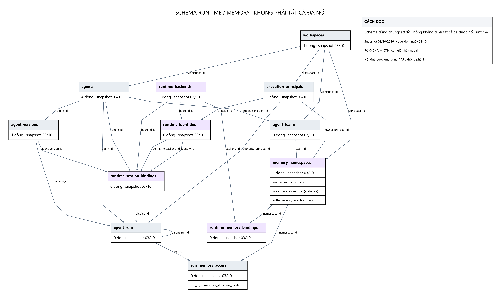

# Team Đông / lớp runtime chung — run, binding và memory

Nhóm này là lớp runtime/memory platform dùng chung và phần liên quan tới Team Đông. Diagram không khẳng định Coordination hiện đang dùng đủ mọi bảng: snapshot có schema không đồng nghĩa mọi đường runtime đã được nối.

**Đừng đồng nhất ba loại state:** `runtime_session_bindings`/`agent_runs` trong PostgreSQL là mapping và audit có authority; `memory_namespaces` và các bảng memory là mô hình bộ nhớ dùng lại; SQLite/checkpointer là tiến độ thực thi graph/phòng. Trong các module runtime/RAG/Vinhomes được rà lại, chưa thấy writer trực tiếp cho `runtime_memory_bindings` và `run_memory_access`. Sơ đồ phần này mô tả FK của schema, không chứng minh lớp memory đó đã vận hành. Coordination Vinhomes hiện dùng DevelopmentStore cho checkpoint/inbox/lease; M2 dùng backend cho admission/release và mirror tasks/messages/runs.

`agent_runs` xác định lượt đang làm việc; `runtime_session_bindings` giữ agent/version/channel/audience. `runtime_identities` ánh xạ principal với backend. RAG audit giữ run/principal/binding để truy về quyền đã dùng.

`memory_namespaces` phân vùng long-term memory; `runtime_memory_bindings` ánh xạ nó sang runtime; `run_memory_access` ghi read/write trong namespace cho một run. Đây là bộ nhớ được quản trị, không phải bản sao vector store của Team Quang. Cần giữ personal memory và shared-team audience đúng quyền.

Không có bảng `memory_namespace_grants` trong snapshot này; không thêm bảng tưởng tượng vào sơ đồ.

## Các bảng liên quan

| Bảng | Dòng snapshot | Vai trò |
|---|---:|---|
| [agents](TABLE_DICTIONARY.md#agents) | 4 | Danh mục agent; agent Lễ tân được cấp knowledge grant. |
| [agent_versions](TABLE_DICTIONARY.md#agent_versions) | 1 | Phiên bản agent được chọn cho một binding/run. |
| [agent_runs](TABLE_DICTIONARY.md#agent_runs) | 0 | Một lượt thực thi agent; nguồn audit và authority cho retrieval. |
| [runtime_backends](TABLE_DICTIONARY.md#runtime_backends) | 1 | Danh mục runtime backend có bật/tắt. |
| [runtime_identities](TABLE_DICTIONARY.md#runtime_identities) | 0 | Ánh xạ execution principal sang định danh runtime. |
| [runtime_session_bindings](TABLE_DICTIONARY.md#runtime_session_bindings) | 0 | Ràng buộc agent, version, channel và audience; token phải phù hợp binding đang active. |
| [runtime_session_operations](TABLE_DICTIONARY.md#runtime_session_operations) | 0 | Nhật ký các thao tác lên phiên runtime; hỗ trợ vòng đời binding. |
| [agent_teams](TABLE_DICTIONARY.md#agent_teams) | 0 | Nhóm agent; có thể là audience/namespace shared team. |
| [memory_namespaces](TABLE_DICTIONARY.md#memory_namespaces) | 1 | Phân vùng bộ nhớ theo owner và audience; đây không phải bảng embedding. |
| [runtime_memory_bindings](TABLE_DICTIONARY.md#runtime_memory_bindings) | 0 | Ánh xạ namespace bộ nhớ của platform sang backend runtime. |
| [run_memory_access](TABLE_DICTIONARY.md#run_memory_access) | 0 | Ghi quyền đọc/ghi namespace của một agent run tại một authz_version. |

Xem [thông số](PARAMETERS.md), [toàn bộ FK](RELATIONSHIPS.md) và [từ điển cột/khóa](TABLE_DICTIONARY.md).
