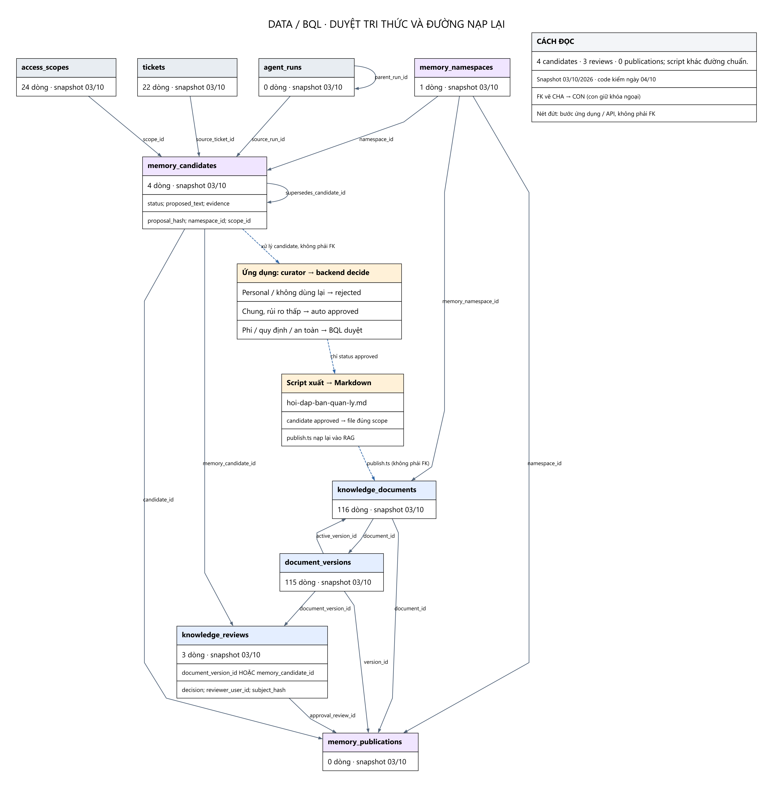

# Nhóm dữ liệu và Ban quản lý — nguồn và tri thức học được

Kho nguồn Data-Vinhome có 169 file, gồm 140 Markdown. Không phải mọi file Markdown đều trở thành tài liệu published: README/AGENTS/nguồn, template rỗng hoặc folder không có scope có thể không được nạp. Định danh folder dưới đây theo dữ liệu thực tế, không phải tên team phát triển.

Luồng demo hiện tại: BQL trả lời → memory_candidates → knowledge_reviews → candidate approved → script export_learned_knowledge.py → file hoi-dap-ban-quan-ly.md → publish.ts → document/version/chunks/vectors. Mũi tên xuất file là bước ứng dụng, không phải FK.

Backend `v3_learning.decide` chia ba nhánh sau curator: **rejected** khi có thông tin cá nhân hoặc không dùng lại được; **approved tự động** cho câu trả lời chung/rủi ro thấp; **pending** cho nội dung phí/quy định/an toàn để BQL duyệt. Curator chỉ cho ý kiến, backend quyết định. Vì vậy câu “người có quyền duyệt mọi candidate” trong mô tả luồng tổng thể trước đây quá rộng so với code hiện tại. Candidate approved vẫn cần export và publish để trở thành tài liệu RAG, không tự có vector ngay.

Schema có đường chuẩn `memory_publications` nối candidate + review + document + version. Snapshot có 4 candidates, 3 reviews nhưng 0 publications; không được nói đường script xuất Markdown đã hoàn thiện cơ chế publication chuẩn chỉ vì câu trả lời được nạp lại.

## Các bảng liên quan

| Bảng | Dòng snapshot | Vai trò |
|---|---:|---|
| [memory_candidates](TABLE_DICTIONARY.md#memory_candidates) | 4 | Tri thức đề xuất từ tương tác/nghiệp vụ, có evidence, namespace, phạm vi và trạng thái duyệt. |
| [knowledge_reviews](TABLE_DICTIONARY.md#knowledge_reviews) | 3 | Duyệt một phiên bản tài liệu HOẶC một ứng viên memory, không phải cả hai. |
| [memory_publications](TABLE_DICTIONARY.md#memory_publications) | 0 | Liên kết ứng viên đã duyệt với tài liệu/phiên bản xuất bản theo cơ chế memory chuẩn. |
| [tickets](TABLE_DICTIONARY.md#tickets) | 22 | Nguồn nghiệp vụ có thể sinh memory candidate. |

Xem [thông số](PARAMETERS.md), [toàn bộ FK](RELATIONSHIPS.md) và [từ điển cột/khóa](TABLE_DICTIONARY.md).

## Dữ liệu đã nạp theo bên cung cấp

| Folder | Tài liệu published | Chunks / embeddings |
|---|---:|---:|
| `00-do-thi` | 12 | 37 |
| `01-vinhomes` | 50 | 112 |
| `02-masterise` | 21 | 74 |
| `04-thap-tang` | 32 | 56 |
| **Tổng** | **115** | **279** |
