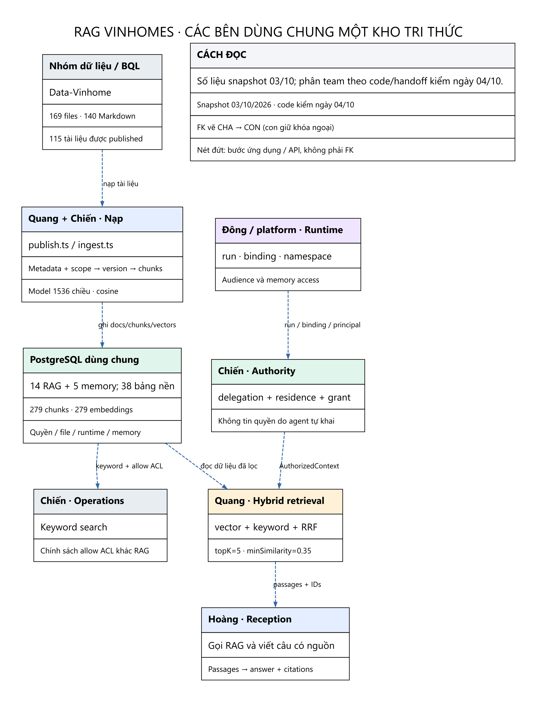

# Bản đồ RAG Vinhomes — 04/10/2026



**RAG không có một database riêng cho mỗi team.** Team Quang triển khai module nạp/truy xuất; Team Chiến cung cấp schema, authority, địa bàn, storage và luồng BQL; Team Hoàng tiêu thụ passages qua API để trả lời; lớp runtime/memory của platform và Team Đông quản trị run/binding/audience. Data-Vinhome là kho tài liệu gốc nằm ngoài database. Phân team này mô tả trách nhiệm trong code và handoff, không quy tác giả từng bảng.

**Đính chính cách đọc sau rà soát lại:** đây là bản đồ cấu trúc và dữ liệu backup, không phải thiết kế tôi tạo thêm 57 bảng. PostgreSQL dùng chung về hạ tầng nhưng dữ liệu vẫn tách quyền theo tenant, kho, scope và ACL. Tên team ở từng trang là vai trò sử dụng/tích hợp, không phải mỗi team sở hữu một DB hoặc một bộ bảng riêng. [Các điểm đã sửa và bằng chứng đối chiếu](../SYSTEM_FLOW_AND_MAINTENANCE_2026-10-04/REVIEW_CORRECTIONS.md).

## Mốc dữ liệu và phạm vi

- Snapshot: backup `RAG-dev_TeamChien-20261003-192812`, database `vinhomes_v3`, platform commit `2c88375ca39748aaa8e607dbba744833ae11da86`.
- Nguồn dữ liệu: Data-Vinhome commit `85b2b0c961ec9c0c9de63d34f0b228cadc5efe1f`.
- Code kiểm ngày 04/10: nhánh dev_TeamChien, commit `a24ecd7568fedebec6d412da73d685bb820c1a5d`.
- Dữ liệu đếm từ database đã khôi phục riêng `rag_docs_20261004`; không dùng số đếm database đang phục vụ để thay số backup.
- Có **14 bảng RAG/tài liệu/quyền/review** và **5 bảng memory/runtime-memory** trong nhóm khảo sát 19 bảng; thêm **38 bảng nền/liên quan** để giải thích quyền, file, chat và runtime, thành **57 bảng có từ điển**. Đây là phạm vi do báo cáo chọn, không phải dự án bắt buộc dùng đủ 57 bảng cho một truy vấn RAG. `report_sources` là bảng Report được đưa vào để đối chiếu provenance, không phải bảng retrieval/citation của Reception. Catalog cấu trúc thô toàn snapshot nằm trong schema-snapshot.json.
- Các hình ERD tập trung quan hệ chính của từng nhóm; bỏ mũi tên tenant/user audit chung để hình dễ đọc. [RELATIONSHIPS.md](RELATIONSHIPS.md) và CSV là danh sách FK đầy đủ.

## Mở theo từng bên

| Bên / phần việc | Markdown | Hình |
|---|---|---|
| Quang: nạp, vector, retrieval/audit | [Chi tiết](01_QUANG_NAP_VA_TRUY_XUAT.md) | [Nạp](images/01-quang-ingestion.png) · [Retrieval](images/02-quang-retrieval.png) |
| Chiến: DB, quyền, scope, file | [Chi tiết](02_CHIEN_QUYEN_VA_FILE.md) | [Authority](images/03-chien-authorization.png) |
| Hoàng: Reception (graph/loop), citations; phân biệt Report | [Chi tiết](03_HOANG_RECEPTION.md) | [Luồng hỏi đáp](images/04-hoang-reception.png) |
| Đông / platform: runtime và memory | [Chi tiết](04_DONG_RUNTIME_MEMORY.md) | [Runtime/memory](images/05-dong-runtime-memory.png) |
| Nhóm data/BQL: nguồn, duyệt, học lại | [Chi tiết](05_DATA_BQL_TRI_THUC_HOC_DUOC.md) | [Duyệt và nạp lại](images/06-data-bql-learning.png) |

**Đọc thông số:** [PARAMETERS.md](PARAMETERS.md). **Đọc tất cả cột/PK/FK/index/CHECK/RLS:** [TABLE_DICTIONARY.md](TABLE_DICTIONARY.md). **Đọc tất cả quan hệ:** [RELATIONSHIPS.md](RELATIONSHIPS.md), [CSV](RELATIONSHIPS.csv). Hình có cả PNG và SVG trong images/; source Graphviz trong diagrams/.

## Từ tài liệu đến vector

```text
115 tài liệu published
    → 115 document_versions
        → 279 knowledge_chunks
            → 279 knowledge_embeddings của 1 model active
```

Database có 116 dòng knowledge_documents: 115 published và 1 draft dùng làm đăng ký nguồn. Có 2 knowledge_bases: kho active và kho sources archived. Không phải 116 tài liệu published hay 2 kho đang cùng phục vụ retrieval.

Mỗi chunk có văn bản, vị trí heading, ordinal và search_tsv; mỗi embedding là 1536 số. Model được lưu trong embedding_models. UNIQUE(chunk_id,model_id) cho phép cùng chunk có vector của nhiều model; snapshot hiện chỉ có một model nên số chunks và vectors bằng nhau.

| Số liệu snapshot | Giá trị |
|---|---:|
| Markdown nguồn, gồm metadata/README/template | 140 |
| Tài liệu published / draft | 115 / 1 |
| Phiên bản | 115 |
| Chunks / vectors | 279 / 279 |
| Kích thước vector | 1536 |
| Độ dài chunk nhỏ nhất / TB / lớn nhất | 40 / 703 / 1199 ký tự PostgreSQL |
| Token count nhỏ nhất / TB / lớn nhất | 14 / 235 / 400 (ước lượng) |
| Document scopes / ACL | 127 / 0 |
| Agent knowledge grants | 1 |
| Retrieval runs / hits | 0 / 0 |
| Memory candidates / reviews / publications | 4 / 3 / 0 |

## Theo bên cung cấp tài liệu

| Folder nguồn | Published docs | Chunks / embeddings |
|---|---:|---:|
| `00-do-thi` | 12 | 37 |
| `01-vinhomes` | 50 | 112 |
| `02-masterise` | 21 | 74 |
| `04-thap-tang` | 32 | 56 |
| **Tổng** | **115** | **279** |

## Các quan hệ cần nhớ

1. knowledge_bases **1–n** knowledge_documents; document_versions giữ FK document_id, còn document giữ active_version_id quay lại phiên bản đang dùng.
2. document_versions **1–n** knowledge_chunks. knowledge_chunks **1–n** knowledge_embeddings theo model; UNIQUE(chunk_id,model_id).
3. knowledge_documents **n–n** access_scopes qua document_scopes; knowledge_documents **1–n** document_acl.
4. agents **n–n** knowledge_bases qua agent_knowledge_grants. Có grant không có nghĩa được đọc mọi scope trong kho.
5. retrieval_runs **1–n** retrieval_hits; mỗi hit tham chiếu chunk, rank và included. Run tham chiếu agent_run, principal, binding, kho và model.
6. memory_candidate có thể được knowledge_review duyệt; memory_publication liên kết ứng viên, review, document và version. Script xuất Markdown là quan hệ ứng dụng, không tự tạo FK publication.

## Những khác biệt cần đọc đúng

- ACL rỗng không có nghĩa public: RAG vẫn lọc quyền cư dân, scope, tenant và phiên bản. Keyword API Operations yêu cầu allow ACL; kết quả hai API có thể khác.
- 0 retrieval audit tại snapshot không chứng minh toàn hệ thống chưa từng tra cứu.
- 4 candidates/3 reviews/0 publications không chứng minh đường publication chuẩn đã hoàn tất. Demo đang có đường script xuất approved Q&A sang Markdown rồi nạp lại.
- files/document_versions không chứng minh mọi file gốc đã được lưu vào object storage. Publisher hiện đăng ký một staged file đại diện thư mục.
- Memory namespace và bộ nhớ runtime không phải một kho embeddings riêng. Sự tồn tại của schema không chứng minh tất cả runtime đã kết nối.
- Learned Q&A hiện có ba nhánh backend: loại thông tin cá nhân/không dùng lại được; tự động duyệt câu trả lời chung rủi ro thấp; chờ BQL duyệt nội dung phí/quy định/an toàn. Không phải mọi candidate đều phải có người bấm duyệt, và approved chưa đồng nghĩa đã nạp vào RAG.
- Sơ đồ Reception ban đầu chỉ mô tả adapter chế độ `graph`; chế độ `loop` có tool và cách tổng hợp câu trả lời riêng, cùng sử dụng API RAG và delegation. Các schema context/memory có trong từ điển không chứng minh đang được ghi ở mọi lượt chat.
- Dữ liệu nguồn và PostgreSQL được chụp riêng trong backup; không có cam kết atomic snapshot giữa filesystem và database.

## Nguồn kiểm chứng

- Backup manifest, rag-json và vinhomes_v3.dump của snapshot 03/10.
- [Schema/metadata](../../../../server/src/db/schema/tables.ts), [domain model](../../../../server/src/db/design/merged.json).
- [RAG types](../../../../server/src/knowledge/types.ts), [retrieval](../../../../server/src/knowledge/retrieve.ts), [SQL store](../../../../server/src/knowledge/pg-store.ts), [chunker](../../../../server/src/knowledge/markdown.ts), [publisher](../../../../server/src/knowledge/publish.ts).
- [Authority](../../../../services/vinhomes-api/src/vinhomes_api/reception_runtime_api.py), [delegation](../../../../services/vinhomes-api/src/vinhomes_api/reception_delegation.py), [Operations search](../../../../services/vinhomes-api/src/vinhomes_api/v3_knowledge.py).
- [Reception adapter](../../../../agent-reception/src/runtime/knowledge.py), [export learned Q&A](../../../../services/vinhomes-api/scripts/export_learned_knowledge.py).
- [Handoff Quang → Hoàng](../../quang/handoffs/2026-10-01-search-knowledge-cho-hoang.md), [handoff runtime Chiến](../handoffs/RECEPTION_RUNTIME_2026-10-02.md). Handoff cũ được đối chiếu code; không lấy số runtime lịch sử làm số hiện tại.
