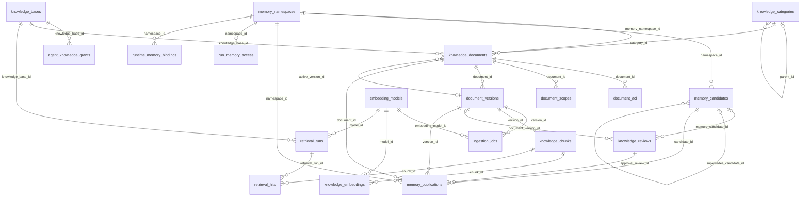

# Quan hệ khóa ngoại RAG và các lớp liên quan

Mỗi dòng dưới đây là FK thực tế của một trong 57 bảng. Mũi tên đọc từ bảng con (nơi giữ FK) sang bảng cha (được tham chiếu). Chỉ liên kết thực thi/API, đường xuất Markdown và tham chiếu trong JSON không được gọi là FK.

| Bảng con · cột FK | Bảng cha · cột đích | Quy tắc |
|---|---|---|
| `access_scopes(tenant_id,building_id)` | `buildings(tenant_id,id)` | `FOREIGN KEY (tenant_id, building_id) REFERENCES buildings(tenant_id, id) ON DELETE RESTRICT` |
| `access_scopes(tenant_id,management_unit_id)` | `management_units(tenant_id,id)` | `FOREIGN KEY (tenant_id, management_unit_id) REFERENCES management_units(tenant_id, id) ON DELETE RESTRICT` |
| `access_scopes(tenant_id,site_id)` | `sites(tenant_id,id)` | `FOREIGN KEY (tenant_id, site_id) REFERENCES sites(tenant_id, id) ON DELETE RESTRICT` |
| `access_scopes(tenant_id)` | `tenants(id)` | `FOREIGN KEY (tenant_id) REFERENCES tenants(id) ON DELETE RESTRICT` |
| `access_scopes(tenant_id,zone_id)` | `zones(tenant_id,id)` | `FOREIGN KEY (tenant_id, zone_id) REFERENCES zones(tenant_id, id) ON DELETE RESTRICT` |
| `agent_knowledge_grants(tenant_id,agent_id)` | `agents(tenant_id,id)` | `FOREIGN KEY (tenant_id, agent_id) REFERENCES agents(tenant_id, id) ON DELETE RESTRICT` |
| `agent_knowledge_grants(granted_by)` | `users(id)` | `FOREIGN KEY (granted_by) REFERENCES users(id) ON DELETE RESTRICT` |
| `agent_knowledge_grants(tenant_id,knowledge_base_id)` | `knowledge_bases(tenant_id,id)` | `FOREIGN KEY (tenant_id, knowledge_base_id) REFERENCES knowledge_bases(tenant_id, id) ON DELETE RESTRICT` |
| `agent_knowledge_grants(tenant_id)` | `tenants(id)` | `FOREIGN KEY (tenant_id) REFERENCES tenants(id) ON DELETE RESTRICT` |
| `agent_runs(actor_user_id)` | `users(id)` | `FOREIGN KEY (actor_user_id) REFERENCES users(id) ON DELETE RESTRICT` |
| `agent_runs(tenant_id,agent_id)` | `agents(tenant_id,id)` | `FOREIGN KEY (tenant_id, agent_id) REFERENCES agents(tenant_id, id) ON DELETE RESTRICT` |
| `agent_runs(tenant_id,authority_principal_id)` | `execution_principals(tenant_id,id)` | `FOREIGN KEY (tenant_id, authority_principal_id) REFERENCES execution_principals(tenant_id, id) ON DELETE RESTRICT` |
| `agent_runs(tenant_id,binding_id)` | `runtime_session_bindings(tenant_id,id)` | `FOREIGN KEY (tenant_id, binding_id) REFERENCES runtime_session_bindings(tenant_id, id) ON DELETE RESTRICT` |
| `agent_runs(tenant_id,channel_id)` | `channels(tenant_id,id)` | `FOREIGN KEY (tenant_id, channel_id) REFERENCES channels(tenant_id, id) ON DELETE RESTRICT` |
| `agent_runs(on_behalf_of_user_id)` | `users(id)` | `FOREIGN KEY (on_behalf_of_user_id) REFERENCES users(id) ON DELETE RESTRICT` |
| `agent_runs(tenant_id,parent_run_id)` | `agent_runs(tenant_id,id)` | `FOREIGN KEY (tenant_id, parent_run_id) REFERENCES agent_runs(tenant_id, id) ON DELETE RESTRICT` |
| `agent_runs(tenant_id,team_member_id)` | `team_members(tenant_id,id)` | `FOREIGN KEY (tenant_id, team_member_id) REFERENCES team_members(tenant_id, id) ON DELETE RESTRICT` |
| `agent_runs(tenant_id)` | `tenants(id)` | `FOREIGN KEY (tenant_id) REFERENCES tenants(id) ON DELETE RESTRICT` |
| `agent_runs(tenant_id,trigger_event_id)` | `ticket_events(tenant_id,id)` | `FOREIGN KEY (tenant_id, trigger_event_id) REFERENCES ticket_events(tenant_id, id) ON DELETE RESTRICT` |
| `agent_runs(tenant_id,version_id)` | `agent_versions(tenant_id,id)` | `FOREIGN KEY (tenant_id, version_id) REFERENCES agent_versions(tenant_id, id) ON DELETE RESTRICT` |
| `agent_teams(tenant_id,channel_id)` | `channels(tenant_id,id)` | `FOREIGN KEY (tenant_id, channel_id) REFERENCES channels(tenant_id, id) ON DELETE RESTRICT` |
| `agent_teams(tenant_id,request_message_id)` | `messages(tenant_id,id)` | `FOREIGN KEY (tenant_id, request_message_id) REFERENCES messages(tenant_id, id) ON DELETE RESTRICT` |
| `agent_teams(requested_by_user_id)` | `users(id)` | `FOREIGN KEY (requested_by_user_id) REFERENCES users(id) ON DELETE RESTRICT` |
| `agent_teams(tenant_id,supervisor_agent_id)` | `agents(tenant_id,id)` | `FOREIGN KEY (tenant_id, supervisor_agent_id) REFERENCES agents(tenant_id, id) ON DELETE RESTRICT` |
| `agent_teams(tenant_id)` | `tenants(id)` | `FOREIGN KEY (tenant_id) REFERENCES tenants(id) ON DELETE RESTRICT` |
| `agent_teams(tenant_id,ticket_id)` | `tickets(tenant_id,id)` | `FOREIGN KEY (tenant_id, ticket_id) REFERENCES tickets(tenant_id, id) ON DELETE RESTRICT` |
| `agent_teams(tenant_id,workspace_id)` | `workspaces(tenant_id,id)` | `FOREIGN KEY (tenant_id, workspace_id) REFERENCES workspaces(tenant_id, id) ON DELETE RESTRICT` |
| `agent_versions(tenant_id,agent_id)` | `agents(tenant_id,id)` | `FOREIGN KEY (tenant_id, agent_id) REFERENCES agents(tenant_id, id) ON DELETE RESTRICT` |
| `agent_versions(created_by)` | `users(id)` | `FOREIGN KEY (created_by) REFERENCES users(id) ON DELETE RESTRICT` |
| `agent_versions(tenant_id,model_profile_id)` | `model_profiles(tenant_id,id)` | `FOREIGN KEY (tenant_id, model_profile_id) REFERENCES model_profiles(tenant_id, id) ON DELETE RESTRICT` |
| `agent_versions(tenant_id)` | `tenants(id)` | `FOREIGN KEY (tenant_id) REFERENCES tenants(id) ON DELETE RESTRICT` |
| `agents(tenant_id,package_id)` | `deployment_packages(tenant_id,id)` | `FOREIGN KEY (tenant_id, package_id) REFERENCES deployment_packages(tenant_id, id) ON DELETE RESTRICT` |
| `agents(tenant_id)` | `tenants(id)` | `FOREIGN KEY (tenant_id) REFERENCES tenants(id) ON DELETE RESTRICT` |
| `agents(tenant_id,workspace_id)` | `workspaces(tenant_id,id)` | `FOREIGN KEY (tenant_id, workspace_id) REFERENCES workspaces(tenant_id, id) ON DELETE RESTRICT` |
| `buildings(tenant_id,site_id)` | `sites(tenant_id,id)` | `FOREIGN KEY (tenant_id, site_id) REFERENCES sites(tenant_id, id) ON DELETE RESTRICT` |
| `buildings(tenant_id)` | `tenants(id)` | `FOREIGN KEY (tenant_id) REFERENCES tenants(id) ON DELETE RESTRICT` |
| `buildings(tenant_id,zone_id)` | `zones(tenant_id,id)` | `FOREIGN KEY (tenant_id, zone_id) REFERENCES zones(tenant_id, id) ON DELETE RESTRICT` |
| `channel_memberships(tenant_id,channel_id)` | `channels(tenant_id,id)` | `FOREIGN KEY (tenant_id, channel_id) REFERENCES channels(tenant_id, id) ON DELETE RESTRICT` |
| `channel_memberships(tenant_id)` | `tenants(id)` | `FOREIGN KEY (tenant_id) REFERENCES tenants(id) ON DELETE RESTRICT` |
| `channel_memberships(user_id)` | `users(id)` | `FOREIGN KEY (user_id) REFERENCES users(id) ON DELETE RESTRICT` |
| `channels(created_by)` | `users(id)` | `FOREIGN KEY (created_by) REFERENCES users(id) ON DELETE RESTRICT` |
| `channels(tenant_id,last_message_agent_id)` | `agents(tenant_id,id)` | `FOREIGN KEY (tenant_id, last_message_agent_id) REFERENCES agents(tenant_id, id) ON DELETE RESTRICT` |
| `channels(tenant_id,package_id)` | `deployment_packages(tenant_id,id)` | `FOREIGN KEY (tenant_id, package_id) REFERENCES deployment_packages(tenant_id, id) ON DELETE RESTRICT` |
| `channels(tenant_id)` | `tenants(id)` | `FOREIGN KEY (tenant_id) REFERENCES tenants(id) ON DELETE RESTRICT` |
| `channels(tenant_id,workspace_id)` | `workspaces(tenant_id,id)` | `FOREIGN KEY (tenant_id, workspace_id) REFERENCES workspaces(tenant_id, id) ON DELETE RESTRICT` |
| `context_snapshots(tenant_id,requested_message_id)` | `messages(tenant_id,id)` | `FOREIGN KEY (tenant_id, requested_message_id) REFERENCES messages(tenant_id, id) ON DELETE RESTRICT` |
| `context_snapshots(tenant_id,run_id)` | `agent_runs(tenant_id,id)` | `FOREIGN KEY (tenant_id, run_id) REFERENCES agent_runs(tenant_id, id) ON DELETE RESTRICT` |
| `context_snapshots(tenant_id)` | `tenants(id)` | `FOREIGN KEY (tenant_id) REFERENCES tenants(id) ON DELETE RESTRICT` |
| `context_snapshots(tenant_id,ticket_id)` | `tickets(tenant_id,id)` | `FOREIGN KEY (tenant_id, ticket_id) REFERENCES tickets(tenant_id, id) ON DELETE RESTRICT` |
| `document_acl(tenant_id,document_id)` | `knowledge_documents(tenant_id,id)` | `FOREIGN KEY (tenant_id, document_id) REFERENCES knowledge_documents(tenant_id, id) ON DELETE RESTRICT` |
| `document_acl(tenant_id)` | `tenants(id)` | `FOREIGN KEY (tenant_id) REFERENCES tenants(id) ON DELETE RESTRICT` |
| `document_acl(user_id)` | `users(id)` | `FOREIGN KEY (user_id) REFERENCES users(id) ON DELETE RESTRICT` |
| `document_acl(tenant_id,workspace_id)` | `workspaces(tenant_id,id)` | `FOREIGN KEY (tenant_id, workspace_id) REFERENCES workspaces(tenant_id, id) ON DELETE RESTRICT` |
| `document_scopes(tenant_id,document_id)` | `knowledge_documents(tenant_id,id)` | `FOREIGN KEY (tenant_id, document_id) REFERENCES knowledge_documents(tenant_id, id) ON DELETE RESTRICT` |
| `document_scopes(tenant_id,scope_id)` | `access_scopes(tenant_id,id)` | `FOREIGN KEY (tenant_id, scope_id) REFERENCES access_scopes(tenant_id, id) ON DELETE RESTRICT` |
| `document_scopes(tenant_id)` | `tenants(id)` | `FOREIGN KEY (tenant_id) REFERENCES tenants(id) ON DELETE RESTRICT` |
| `document_versions(tenant_id,document_id)` | `knowledge_documents(tenant_id,id)` | `FOREIGN KEY (tenant_id, document_id) REFERENCES knowledge_documents(tenant_id, id) ON DELETE RESTRICT` |
| `document_versions(tenant_id,file_id)` | `files(tenant_id,id)` | `FOREIGN KEY (tenant_id, file_id) REFERENCES files(tenant_id, id) ON DELETE RESTRICT` |
| `document_versions(submitted_by)` | `users(id)` | `FOREIGN KEY (submitted_by) REFERENCES users(id) ON DELETE RESTRICT` |
| `document_versions(tenant_id)` | `tenants(id)` | `FOREIGN KEY (tenant_id) REFERENCES tenants(id) ON DELETE RESTRICT` |
| `domains(tenant_id)` | `tenants(id)` | `FOREIGN KEY (tenant_id) REFERENCES tenants(id) ON DELETE RESTRICT` |
| `execution_principals(tenant_id)` | `tenants(id)` | `FOREIGN KEY (tenant_id) REFERENCES tenants(id) ON DELETE RESTRICT` |
| `execution_principals(user_id)` | `users(id)` | `FOREIGN KEY (user_id) REFERENCES users(id) ON DELETE RESTRICT` |
| `execution_principals(tenant_id,workspace_id)` | `workspaces(tenant_id,id)` | `FOREIGN KEY (tenant_id, workspace_id) REFERENCES workspaces(tenant_id, id) ON DELETE RESTRICT` |
| `file_access_logs(tenant_id,actor_principal_id)` | `execution_principals(tenant_id,id)` | `FOREIGN KEY (tenant_id, actor_principal_id) REFERENCES execution_principals(tenant_id, id) ON DELETE RESTRICT` |
| `file_access_logs(actor_user_id)` | `users(id)` | `FOREIGN KEY (actor_user_id) REFERENCES users(id) ON DELETE RESTRICT` |
| `file_access_logs(tenant_id,file_id)` | `files(tenant_id,id)` | `FOREIGN KEY (tenant_id, file_id) REFERENCES files(tenant_id, id) ON DELETE RESTRICT` |
| `file_access_logs(tenant_id,object_id)` | `file_objects(tenant_id,id)` | `FOREIGN KEY (tenant_id, object_id) REFERENCES file_objects(tenant_id, id) ON DELETE RESTRICT` |
| `file_access_logs(tenant_id,run_id)` | `agent_runs(tenant_id,id)` | `FOREIGN KEY (tenant_id, run_id) REFERENCES agent_runs(tenant_id, id) ON DELETE RESTRICT` |
| `file_access_logs(tenant_id)` | `tenants(id)` | `FOREIGN KEY (tenant_id) REFERENCES tenants(id) ON DELETE RESTRICT` |
| `file_objects(tenant_id,file_id)` | `files(tenant_id,id)` | `FOREIGN KEY (tenant_id, file_id) REFERENCES files(tenant_id, id) ON DELETE RESTRICT` |
| `file_objects(tenant_id,location_id)` | `storage_locations(tenant_id,id)` | `FOREIGN KEY (tenant_id, location_id) REFERENCES storage_locations(tenant_id, id) ON DELETE RESTRICT` |
| `file_objects(tenant_id,source_object_id)` | `file_objects(tenant_id,id)` | `FOREIGN KEY (tenant_id, source_object_id) REFERENCES file_objects(tenant_id, id) ON DELETE RESTRICT` |
| `file_objects(tenant_id)` | `tenants(id)` | `FOREIGN KEY (tenant_id) REFERENCES tenants(id) ON DELETE RESTRICT` |
| `file_processing_jobs(tenant_id,file_id)` | `files(tenant_id,id)` | `FOREIGN KEY (tenant_id, file_id) REFERENCES files(tenant_id, id) ON DELETE RESTRICT` |
| `file_processing_jobs(tenant_id,object_id)` | `file_objects(tenant_id,id)` | `FOREIGN KEY (tenant_id, object_id) REFERENCES file_objects(tenant_id, id) ON DELETE RESTRICT` |
| `file_processing_jobs(tenant_id)` | `tenants(id)` | `FOREIGN KEY (tenant_id) REFERENCES tenants(id) ON DELETE RESTRICT` |
| `file_processing_jobs(tenant_id,upload_id)` | `file_uploads(tenant_id,id)` | `FOREIGN KEY (tenant_id, upload_id) REFERENCES file_uploads(tenant_id, id) ON DELETE RESTRICT` |
| `file_upload_parts(tenant_id)` | `tenants(id)` | `FOREIGN KEY (tenant_id) REFERENCES tenants(id) ON DELETE RESTRICT` |
| `file_upload_parts(tenant_id,upload_id)` | `file_uploads(tenant_id,id)` | `FOREIGN KEY (tenant_id, upload_id) REFERENCES file_uploads(tenant_id, id) ON DELETE RESTRICT` |
| `file_uploads(tenant_id,file_id)` | `files(tenant_id,id)` | `FOREIGN KEY (tenant_id, file_id) REFERENCES files(tenant_id, id) ON DELETE RESTRICT` |
| `file_uploads(tenant_id,location_id)` | `storage_locations(tenant_id,id)` | `FOREIGN KEY (tenant_id, location_id) REFERENCES storage_locations(tenant_id, id) ON DELETE RESTRICT` |
| `file_uploads(requested_by)` | `users(id)` | `FOREIGN KEY (requested_by) REFERENCES users(id) ON DELETE RESTRICT` |
| `file_uploads(tenant_id,result_object_id)` | `file_objects(tenant_id,id)` | `FOREIGN KEY (tenant_id, result_object_id) REFERENCES file_objects(tenant_id, id) ON DELETE RESTRICT` |
| `file_uploads(tenant_id)` | `tenants(id)` | `FOREIGN KEY (tenant_id) REFERENCES tenants(id) ON DELETE RESTRICT` |
| `files(tenant_id,accepted_object_id)` | `file_objects(tenant_id,id)` | `FOREIGN KEY (tenant_id, accepted_object_id) REFERENCES file_objects(tenant_id, id) ON DELETE RESTRICT` |
| `files(tenant_id,channel_id)` | `channels(tenant_id,id)` | `FOREIGN KEY (tenant_id, channel_id) REFERENCES channels(tenant_id, id) ON DELETE RESTRICT` |
| `files(tenant_id,document_id)` | `knowledge_documents(tenant_id,id)` | `FOREIGN KEY (tenant_id, document_id) REFERENCES knowledge_documents(tenant_id, id) ON DELETE RESTRICT` |
| `files(tenant_id,owner_principal_id)` | `execution_principals(tenant_id,id)` | `FOREIGN KEY (tenant_id, owner_principal_id) REFERENCES execution_principals(tenant_id, id) ON DELETE RESTRICT` |
| `files(tenant_id,report_id)` | `report_requests(tenant_id,id)` | `FOREIGN KEY (tenant_id, report_id) REFERENCES report_requests(tenant_id, id) ON DELETE RESTRICT` |
| `files(tenant_id)` | `tenants(id)` | `FOREIGN KEY (tenant_id) REFERENCES tenants(id) ON DELETE RESTRICT` |
| `files(tenant_id,ticket_id)` | `tickets(tenant_id,id)` | `FOREIGN KEY (tenant_id, ticket_id) REFERENCES tickets(tenant_id, id) ON DELETE RESTRICT` |
| `files(tenant_id,unit_id)` | `units(tenant_id,id)` | `FOREIGN KEY (tenant_id, unit_id) REFERENCES units(tenant_id, id)` |
| `files(uploaded_by)` | `users(id)` | `FOREIGN KEY (uploaded_by) REFERENCES users(id) ON DELETE RESTRICT` |
| `ingestion_jobs(embedding_model_id)` | `embedding_models(id)` | `FOREIGN KEY (embedding_model_id) REFERENCES embedding_models(id) ON DELETE RESTRICT` |
| `ingestion_jobs(tenant_id)` | `tenants(id)` | `FOREIGN KEY (tenant_id) REFERENCES tenants(id) ON DELETE RESTRICT` |
| `ingestion_jobs(tenant_id,version_id)` | `document_versions(tenant_id,id)` | `FOREIGN KEY (tenant_id, version_id) REFERENCES document_versions(tenant_id, id) ON DELETE RESTRICT` |
| `knowledge_bases(tenant_id,domain_id)` | `domains(tenant_id,id)` | `FOREIGN KEY (tenant_id, domain_id) REFERENCES domains(tenant_id, id) ON DELETE RESTRICT` |
| `knowledge_bases(tenant_id)` | `tenants(id)` | `FOREIGN KEY (tenant_id) REFERENCES tenants(id) ON DELETE RESTRICT` |
| `knowledge_categories(tenant_id,parent_id)` | `knowledge_categories(tenant_id,id)` | `FOREIGN KEY (tenant_id, parent_id) REFERENCES knowledge_categories(tenant_id, id) ON DELETE RESTRICT` |
| `knowledge_categories(tenant_id)` | `tenants(id)` | `FOREIGN KEY (tenant_id) REFERENCES tenants(id) ON DELETE RESTRICT` |
| `knowledge_chunks(tenant_id)` | `tenants(id)` | `FOREIGN KEY (tenant_id) REFERENCES tenants(id) ON DELETE RESTRICT` |
| `knowledge_chunks(tenant_id,version_id)` | `document_versions(tenant_id,id)` | `FOREIGN KEY (tenant_id, version_id) REFERENCES document_versions(tenant_id, id) ON DELETE RESTRICT` |
| `knowledge_documents(tenant_id,active_version_id)` | `document_versions(tenant_id,id)` | `FOREIGN KEY (tenant_id, active_version_id) REFERENCES document_versions(tenant_id, id) ON DELETE RESTRICT` |
| `knowledge_documents(tenant_id,category_id)` | `knowledge_categories(tenant_id,id)` | `FOREIGN KEY (tenant_id, category_id) REFERENCES knowledge_categories(tenant_id, id) ON DELETE RESTRICT` |
| `knowledge_documents(tenant_id,knowledge_base_id)` | `knowledge_bases(tenant_id,id)` | `FOREIGN KEY (tenant_id, knowledge_base_id) REFERENCES knowledge_bases(tenant_id, id) ON DELETE RESTRICT` |
| `knowledge_documents(tenant_id,memory_namespace_id)` | `memory_namespaces(tenant_id,id)` | `FOREIGN KEY (tenant_id, memory_namespace_id) REFERENCES memory_namespaces(tenant_id, id) ON DELETE RESTRICT` |
| `knowledge_documents(tenant_id,owner_management_id)` | `management_units(tenant_id,id)` | `FOREIGN KEY (tenant_id, owner_management_id) REFERENCES management_units(tenant_id, id) ON DELETE RESTRICT` |
| `knowledge_documents(tenant_id)` | `tenants(id)` | `FOREIGN KEY (tenant_id) REFERENCES tenants(id) ON DELETE RESTRICT` |
| `knowledge_embeddings(tenant_id,chunk_id)` | `knowledge_chunks(tenant_id,id)` | `FOREIGN KEY (tenant_id, chunk_id) REFERENCES knowledge_chunks(tenant_id, id) ON DELETE RESTRICT` |
| `knowledge_embeddings(model_id)` | `embedding_models(id)` | `FOREIGN KEY (model_id) REFERENCES embedding_models(id) ON DELETE RESTRICT` |
| `knowledge_embeddings(tenant_id)` | `tenants(id)` | `FOREIGN KEY (tenant_id) REFERENCES tenants(id) ON DELETE RESTRICT` |
| `knowledge_reviews(tenant_id,document_version_id)` | `document_versions(tenant_id,id)` | `FOREIGN KEY (tenant_id, document_version_id) REFERENCES document_versions(tenant_id, id) ON DELETE RESTRICT` |
| `knowledge_reviews(tenant_id,memory_candidate_id)` | `memory_candidates(tenant_id,id)` | `FOREIGN KEY (tenant_id, memory_candidate_id) REFERENCES memory_candidates(tenant_id, id) ON DELETE RESTRICT` |
| `knowledge_reviews(reviewer_user_id)` | `users(id)` | `FOREIGN KEY (reviewer_user_id) REFERENCES users(id) ON DELETE RESTRICT` |
| `knowledge_reviews(tenant_id)` | `tenants(id)` | `FOREIGN KEY (tenant_id) REFERENCES tenants(id) ON DELETE RESTRICT` |
| `management_coverage(tenant_id,management_unit_id)` | `management_units(tenant_id,id)` | `FOREIGN KEY (tenant_id, management_unit_id) REFERENCES management_units(tenant_id, id) ON DELETE RESTRICT` |
| `management_coverage(tenant_id,scope_id)` | `access_scopes(tenant_id,id)` | `FOREIGN KEY (tenant_id, scope_id) REFERENCES access_scopes(tenant_id, id) ON DELETE RESTRICT` |
| `management_coverage(tenant_id,service_category_id)` | `service_categories(tenant_id,id)` | `FOREIGN KEY (tenant_id, service_category_id) REFERENCES service_categories(tenant_id, id) ON DELETE RESTRICT` |
| `management_coverage(tenant_id)` | `tenants(id)` | `FOREIGN KEY (tenant_id) REFERENCES tenants(id) ON DELETE RESTRICT` |
| `management_units(tenant_id)` | `tenants(id)` | `FOREIGN KEY (tenant_id) REFERENCES tenants(id) ON DELETE RESTRICT` |
| `memory_candidates(tenant_id,namespace_id)` | `memory_namespaces(tenant_id,id)` | `FOREIGN KEY (tenant_id, namespace_id) REFERENCES memory_namespaces(tenant_id, id) ON DELETE RESTRICT` |
| `memory_candidates(tenant_id,proposed_by_agent_id)` | `agents(tenant_id,id)` | `FOREIGN KEY (tenant_id, proposed_by_agent_id) REFERENCES agents(tenant_id, id) ON DELETE RESTRICT` |
| `memory_candidates(tenant_id,scope_id)` | `access_scopes(tenant_id,id)` | `FOREIGN KEY (tenant_id, scope_id) REFERENCES access_scopes(tenant_id, id) ON DELETE RESTRICT` |
| `memory_candidates(tenant_id,source_binding_id)` | `runtime_session_bindings(tenant_id,id)` | `FOREIGN KEY (tenant_id, source_binding_id) REFERENCES runtime_session_bindings(tenant_id, id) ON DELETE RESTRICT` |
| `memory_candidates(tenant_id,source_run_id)` | `agent_runs(tenant_id,id)` | `FOREIGN KEY (tenant_id, source_run_id) REFERENCES agent_runs(tenant_id, id) ON DELETE RESTRICT` |
| `memory_candidates(tenant_id,source_ticket_id)` | `tickets(tenant_id,id)` | `FOREIGN KEY (tenant_id, source_ticket_id) REFERENCES tickets(tenant_id, id) ON DELETE RESTRICT` |
| `memory_candidates(subject_user_id)` | `users(id)` | `FOREIGN KEY (subject_user_id) REFERENCES users(id) ON DELETE RESTRICT` |
| `memory_candidates(tenant_id,supersedes_candidate_id)` | `memory_candidates(tenant_id,id)` | `FOREIGN KEY (tenant_id, supersedes_candidate_id) REFERENCES memory_candidates(tenant_id, id) ON DELETE RESTRICT` |
| `memory_candidates(tenant_id)` | `tenants(id)` | `FOREIGN KEY (tenant_id) REFERENCES tenants(id) ON DELETE RESTRICT` |
| `memory_namespaces(tenant_id,owner_principal_id)` | `execution_principals(tenant_id,id)` | `FOREIGN KEY (tenant_id, owner_principal_id) REFERENCES execution_principals(tenant_id, id) ON DELETE RESTRICT` |
| `memory_namespaces(tenant_id,team_id)` | `agent_teams(tenant_id,id)` | `FOREIGN KEY (tenant_id, team_id) REFERENCES agent_teams(tenant_id, id) ON DELETE RESTRICT` |
| `memory_namespaces(tenant_id)` | `tenants(id)` | `FOREIGN KEY (tenant_id) REFERENCES tenants(id) ON DELETE RESTRICT` |
| `memory_namespaces(tenant_id,workspace_id)` | `workspaces(tenant_id,id)` | `FOREIGN KEY (tenant_id, workspace_id) REFERENCES workspaces(tenant_id, id) ON DELETE RESTRICT` |
| `memory_publications(tenant_id,approval_review_id)` | `knowledge_reviews(tenant_id,id)` | `FOREIGN KEY (tenant_id, approval_review_id) REFERENCES knowledge_reviews(tenant_id, id) ON DELETE RESTRICT` |
| `memory_publications(tenant_id,candidate_id)` | `memory_candidates(tenant_id,id)` | `FOREIGN KEY (tenant_id, candidate_id) REFERENCES memory_candidates(tenant_id, id) ON DELETE RESTRICT` |
| `memory_publications(tenant_id,document_id)` | `knowledge_documents(tenant_id,id)` | `FOREIGN KEY (tenant_id, document_id) REFERENCES knowledge_documents(tenant_id, id) ON DELETE RESTRICT` |
| `memory_publications(tenant_id,namespace_id)` | `memory_namespaces(tenant_id,id)` | `FOREIGN KEY (tenant_id, namespace_id) REFERENCES memory_namespaces(tenant_id, id) ON DELETE RESTRICT` |
| `memory_publications(tenant_id)` | `tenants(id)` | `FOREIGN KEY (tenant_id) REFERENCES tenants(id) ON DELETE RESTRICT` |
| `memory_publications(tenant_id,version_id)` | `document_versions(tenant_id,id)` | `FOREIGN KEY (tenant_id, version_id) REFERENCES document_versions(tenant_id, id) ON DELETE RESTRICT` |
| `messages(tenant_id,channel_id)` | `channels(tenant_id,id)` | `FOREIGN KEY (tenant_id, channel_id) REFERENCES channels(tenant_id, id) ON DELETE RESTRICT` |
| `messages(tenant_id,reply_to_id)` | `messages(tenant_id,id)` | `FOREIGN KEY (tenant_id, reply_to_id) REFERENCES messages(tenant_id, id) ON DELETE RESTRICT` |
| `messages(tenant_id,run_id)` | `agent_runs(tenant_id,id)` | `FOREIGN KEY (tenant_id, run_id) REFERENCES agent_runs(tenant_id, id) ON DELETE RESTRICT` |
| `messages(tenant_id,sender_agent_id)` | `agents(tenant_id,id)` | `FOREIGN KEY (tenant_id, sender_agent_id) REFERENCES agents(tenant_id, id) ON DELETE RESTRICT` |
| `messages(sender_user_id)` | `users(id)` | `FOREIGN KEY (sender_user_id) REFERENCES users(id) ON DELETE RESTRICT` |
| `messages(tenant_id,source_event_id)` | `ticket_events(tenant_id,id)` | `FOREIGN KEY (tenant_id, source_event_id) REFERENCES ticket_events(tenant_id, id) ON DELETE RESTRICT` |
| `messages(tenant_id)` | `tenants(id)` | `FOREIGN KEY (tenant_id) REFERENCES tenants(id) ON DELETE RESTRICT` |
| `reception_sessions(tenant_id,binding_id)` | `runtime_session_bindings(tenant_id,id)` | `FOREIGN KEY (tenant_id, binding_id) REFERENCES runtime_session_bindings(tenant_id, id) ON DELETE RESTRICT` |
| `reception_sessions(tenant_id,channel_id)` | `channels(tenant_id,id)` | `FOREIGN KEY (tenant_id, channel_id) REFERENCES channels(tenant_id, id) ON DELETE RESTRICT` |
| `reception_sessions(customer_user_id)` | `users(id)` | `FOREIGN KEY (customer_user_id) REFERENCES users(id) ON DELETE RESTRICT` |
| `reception_sessions(tenant_id,system_agent_id)` | `agents(tenant_id,id)` | `FOREIGN KEY (tenant_id, system_agent_id) REFERENCES agents(tenant_id, id) ON DELETE RESTRICT` |
| `reception_sessions(tenant_id)` | `tenants(id)` | `FOREIGN KEY (tenant_id) REFERENCES tenants(id) ON DELETE RESTRICT` |
| `report_sources(tenant_id,report_id)` | `report_requests(tenant_id,id)` | `FOREIGN KEY (tenant_id, report_id) REFERENCES report_requests(tenant_id, id) ON DELETE RESTRICT` |
| `report_sources(tenant_id,snapshot_file_id)` | `files(tenant_id,id)` | `FOREIGN KEY (tenant_id, snapshot_file_id) REFERENCES files(tenant_id, id) ON DELETE RESTRICT` |
| `report_sources(tenant_id)` | `tenants(id)` | `FOREIGN KEY (tenant_id) REFERENCES tenants(id) ON DELETE RESTRICT` |
| `retrieval_hits(tenant_id,chunk_id)` | `knowledge_chunks(tenant_id,id)` | `FOREIGN KEY (tenant_id, chunk_id) REFERENCES knowledge_chunks(tenant_id, id) ON DELETE RESTRICT` |
| `retrieval_hits(tenant_id,retrieval_run_id)` | `retrieval_runs(tenant_id,id)` | `FOREIGN KEY (tenant_id, retrieval_run_id) REFERENCES retrieval_runs(tenant_id, id) ON DELETE RESTRICT` |
| `retrieval_hits(tenant_id)` | `tenants(id)` | `FOREIGN KEY (tenant_id) REFERENCES tenants(id) ON DELETE RESTRICT` |
| `retrieval_runs(actor_user_id)` | `users(id)` | `FOREIGN KEY (actor_user_id) REFERENCES users(id) ON DELETE RESTRICT` |
| `retrieval_runs(tenant_id,agent_run_id)` | `agent_runs(tenant_id,id)` | `FOREIGN KEY (tenant_id, agent_run_id) REFERENCES agent_runs(tenant_id, id) ON DELETE RESTRICT` |
| `retrieval_runs(tenant_id,binding_id)` | `runtime_session_bindings(tenant_id,id)` | `FOREIGN KEY (tenant_id, binding_id) REFERENCES runtime_session_bindings(tenant_id, id) ON DELETE RESTRICT` |
| `retrieval_runs(tenant_id,knowledge_base_id)` | `knowledge_bases(tenant_id,id)` | `FOREIGN KEY (tenant_id, knowledge_base_id) REFERENCES knowledge_bases(tenant_id, id) ON DELETE RESTRICT` |
| `retrieval_runs(model_id)` | `embedding_models(id)` | `FOREIGN KEY (model_id) REFERENCES embedding_models(id) ON DELETE RESTRICT` |
| `retrieval_runs(tenant_id,principal_id)` | `execution_principals(tenant_id,id)` | `FOREIGN KEY (tenant_id, principal_id) REFERENCES execution_principals(tenant_id, id) ON DELETE RESTRICT` |
| `retrieval_runs(tenant_id)` | `tenants(id)` | `FOREIGN KEY (tenant_id) REFERENCES tenants(id) ON DELETE RESTRICT` |
| `run_memory_access(tenant_id,namespace_id)` | `memory_namespaces(tenant_id,id)` | `FOREIGN KEY (tenant_id, namespace_id) REFERENCES memory_namespaces(tenant_id, id) ON DELETE RESTRICT` |
| `run_memory_access(tenant_id,run_id)` | `agent_runs(tenant_id,id)` | `FOREIGN KEY (tenant_id, run_id) REFERENCES agent_runs(tenant_id, id) ON DELETE RESTRICT` |
| `run_memory_access(tenant_id)` | `tenants(id)` | `FOREIGN KEY (tenant_id) REFERENCES tenants(id) ON DELETE RESTRICT` |
| `runtime_identities(backend_id)` | `runtime_backends(id)` | `FOREIGN KEY (backend_id) REFERENCES runtime_backends(id) ON DELETE RESTRICT` |
| `runtime_identities(tenant_id,principal_id)` | `execution_principals(tenant_id,id)` | `FOREIGN KEY (tenant_id, principal_id) REFERENCES execution_principals(tenant_id, id) ON DELETE RESTRICT` |
| `runtime_identities(tenant_id)` | `tenants(id)` | `FOREIGN KEY (tenant_id) REFERENCES tenants(id) ON DELETE RESTRICT` |
| `runtime_memory_bindings(backend_id)` | `runtime_backends(id)` | `FOREIGN KEY (backend_id) REFERENCES runtime_backends(id) ON DELETE RESTRICT` |
| `runtime_memory_bindings(tenant_id,namespace_id)` | `memory_namespaces(tenant_id,id)` | `FOREIGN KEY (tenant_id, namespace_id) REFERENCES memory_namespaces(tenant_id, id) ON DELETE RESTRICT` |
| `runtime_memory_bindings(tenant_id)` | `tenants(id)` | `FOREIGN KEY (tenant_id) REFERENCES tenants(id) ON DELETE RESTRICT` |
| `runtime_session_bindings(tenant_id,identity_id,backend_id)` | `runtime_identities(tenant_id,id,backend_id)` | `FOREIGN KEY (tenant_id, identity_id, backend_id) REFERENCES runtime_identities(tenant_id, id, backend_id)` |
| `runtime_session_bindings(tenant_id,agent_id)` | `agents(tenant_id,id)` | `FOREIGN KEY (tenant_id, agent_id) REFERENCES agents(tenant_id, id) ON DELETE RESTRICT` |
| `runtime_session_bindings(tenant_id,agent_version_id)` | `agent_versions(tenant_id,id)` | `FOREIGN KEY (tenant_id, agent_version_id) REFERENCES agent_versions(tenant_id, id) ON DELETE RESTRICT` |
| `runtime_session_bindings(backend_id)` | `runtime_backends(id)` | `FOREIGN KEY (backend_id) REFERENCES runtime_backends(id) ON DELETE RESTRICT` |
| `runtime_session_bindings(tenant_id,channel_id)` | `channels(tenant_id,id)` | `FOREIGN KEY (tenant_id, channel_id) REFERENCES channels(tenant_id, id) ON DELETE RESTRICT` |
| `runtime_session_bindings(customer_user_id)` | `users(id)` | `FOREIGN KEY (customer_user_id) REFERENCES users(id) ON DELETE RESTRICT` |
| `runtime_session_bindings(tenant_id,identity_id)` | `runtime_identities(tenant_id,id)` | `FOREIGN KEY (tenant_id, identity_id) REFERENCES runtime_identities(tenant_id, id) ON DELETE RESTRICT` |
| `runtime_session_bindings(started_by_user_id)` | `users(id)` | `FOREIGN KEY (started_by_user_id) REFERENCES users(id) ON DELETE RESTRICT` |
| `runtime_session_bindings(tenant_id,team_member_id)` | `team_members(tenant_id,id)` | `FOREIGN KEY (tenant_id, team_member_id) REFERENCES team_members(tenant_id, id) ON DELETE RESTRICT` |
| `runtime_session_bindings(tenant_id)` | `tenants(id)` | `FOREIGN KEY (tenant_id) REFERENCES tenants(id) ON DELETE RESTRICT` |
| `runtime_session_operations(tenant_id,actor_principal_id)` | `execution_principals(tenant_id,id)` | `FOREIGN KEY (tenant_id, actor_principal_id) REFERENCES execution_principals(tenant_id, id) ON DELETE RESTRICT` |
| `runtime_session_operations(tenant_id,binding_id)` | `runtime_session_bindings(tenant_id,id)` | `FOREIGN KEY (tenant_id, binding_id) REFERENCES runtime_session_bindings(tenant_id, id) ON DELETE RESTRICT` |
| `runtime_session_operations(initiated_by_user_id)` | `users(id)` | `FOREIGN KEY (initiated_by_user_id) REFERENCES users(id) ON DELETE RESTRICT` |
| `runtime_session_operations(tenant_id,result_run_id)` | `agent_runs(tenant_id,id)` | `FOREIGN KEY (tenant_id, result_run_id) REFERENCES agent_runs(tenant_id, id) ON DELETE RESTRICT` |
| `runtime_session_operations(tenant_id)` | `tenants(id)` | `FOREIGN KEY (tenant_id) REFERENCES tenants(id) ON DELETE RESTRICT` |
| `runtime_session_operations(tenant_id,trigger_event_id)` | `ticket_events(tenant_id,id)` | `FOREIGN KEY (tenant_id, trigger_event_id) REFERENCES ticket_events(tenant_id, id) ON DELETE RESTRICT` |
| `scoped_user_roles(granted_by)` | `users(id)` | `FOREIGN KEY (granted_by) REFERENCES users(id) ON DELETE RESTRICT` |
| `scoped_user_roles(tenant_id,membership_id)` | `tenant_memberships(tenant_id,id)` | `FOREIGN KEY (tenant_id, membership_id) REFERENCES tenant_memberships(tenant_id, id) ON DELETE RESTRICT` |
| `scoped_user_roles(tenant_id,scope_id)` | `access_scopes(tenant_id,id)` | `FOREIGN KEY (tenant_id, scope_id) REFERENCES access_scopes(tenant_id, id) ON DELETE RESTRICT` |
| `scoped_user_roles(tenant_id)` | `tenants(id)` | `FOREIGN KEY (tenant_id) REFERENCES tenants(id) ON DELETE RESTRICT` |
| `sites(tenant_id,domain_id)` | `domains(tenant_id,id)` | `FOREIGN KEY (tenant_id, domain_id) REFERENCES domains(tenant_id, id) ON DELETE RESTRICT` |
| `sites(tenant_id)` | `tenants(id)` | `FOREIGN KEY (tenant_id) REFERENCES tenants(id) ON DELETE RESTRICT` |
| `storage_locations(tenant_id)` | `tenants(id)` | `FOREIGN KEY (tenant_id) REFERENCES tenants(id) ON DELETE RESTRICT` |
| `tenant_memberships(tenant_id)` | `tenants(id)` | `FOREIGN KEY (tenant_id) REFERENCES tenants(id) ON DELETE RESTRICT` |
| `tenant_memberships(user_id)` | `users(id)` | `FOREIGN KEY (user_id) REFERENCES users(id) ON DELETE RESTRICT` |
| `tickets(tenant_id,active_sla_cycle_id)` | `ticket_sla_cycles(tenant_id,id)` | `FOREIGN KEY (tenant_id, active_sla_cycle_id) REFERENCES ticket_sla_cycles(tenant_id, id) ON DELETE RESTRICT` |
| `tickets(tenant_id,assigned_team_id)` | `agent_teams(tenant_id,id)` | `FOREIGN KEY (tenant_id, assigned_team_id) REFERENCES agent_teams(tenant_id, id) ON DELETE RESTRICT` |
| `tickets(tenant_id,building_id)` | `buildings(tenant_id,id)` | `FOREIGN KEY (tenant_id, building_id) REFERENCES buildings(tenant_id, id) ON DELETE RESTRICT` |
| `tickets(tenant_id,category_id)` | `service_categories(tenant_id,id)` | `FOREIGN KEY (tenant_id, category_id) REFERENCES service_categories(tenant_id, id) ON DELETE RESTRICT` |
| `tickets(tenant_id,channel_id)` | `channels(tenant_id,id)` | `FOREIGN KEY (tenant_id, channel_id) REFERENCES channels(tenant_id, id) ON DELETE RESTRICT` |
| `tickets(tenant_id,coverage_id)` | `management_coverage(tenant_id,id)` | `FOREIGN KEY (tenant_id, coverage_id) REFERENCES management_coverage(tenant_id, id) ON DELETE RESTRICT` |
| `tickets(tenant_id,current_triage_decision_id)` | `ticket_triage_decisions(tenant_id,id)` | `FOREIGN KEY (tenant_id, current_triage_decision_id) REFERENCES ticket_triage_decisions(tenant_id, id) ON DELETE RESTRICT` |
| `tickets(tenant_id,domain_id)` | `domains(tenant_id,id)` | `FOREIGN KEY (tenant_id, domain_id) REFERENCES domains(tenant_id, id) ON DELETE RESTRICT` |
| `tickets(tenant_id,incident_type_id)` | `incident_types(tenant_id,id)` | `FOREIGN KEY (tenant_id, incident_type_id) REFERENCES incident_types(tenant_id, id) ON DELETE RESTRICT` |
| `tickets(tenant_id,management_unit_id)` | `management_units(tenant_id,id)` | `FOREIGN KEY (tenant_id, management_unit_id) REFERENCES management_units(tenant_id, id) ON DELETE RESTRICT` |
| `tickets(requester_user_id)` | `users(id)` | `FOREIGN KEY (requester_user_id) REFERENCES users(id) ON DELETE RESTRICT` |
| `tickets(tenant_id,site_id)` | `sites(tenant_id,id)` | `FOREIGN KEY (tenant_id, site_id) REFERENCES sites(tenant_id, id) ON DELETE RESTRICT` |
| `tickets(tenant_id,sla_policy_id)` | `sla_policies(tenant_id,id)` | `FOREIGN KEY (tenant_id, sla_policy_id) REFERENCES sla_policies(tenant_id, id) ON DELETE RESTRICT` |
| `tickets(tenant_id)` | `tenants(id)` | `FOREIGN KEY (tenant_id) REFERENCES tenants(id) ON DELETE RESTRICT` |
| `tickets(tenant_id,unit_id)` | `units(tenant_id,id)` | `FOREIGN KEY (tenant_id, unit_id) REFERENCES units(tenant_id, id) ON DELETE RESTRICT` |
| `tickets(tenant_id,zone_id)` | `zones(tenant_id,id)` | `FOREIGN KEY (tenant_id, zone_id) REFERENCES zones(tenant_id, id) ON DELETE RESTRICT` |
| `unit_residents(tenant_id)` | `tenants(id)` | `FOREIGN KEY (tenant_id) REFERENCES tenants(id) ON DELETE RESTRICT` |
| `unit_residents(tenant_id,unit_id)` | `units(tenant_id,id)` | `FOREIGN KEY (tenant_id, unit_id) REFERENCES units(tenant_id, id) ON DELETE RESTRICT` |
| `unit_residents(user_id)` | `users(id)` | `FOREIGN KEY (user_id) REFERENCES users(id) ON DELETE RESTRICT` |
| `unit_residents(verified_by)` | `users(id)` | `FOREIGN KEY (verified_by) REFERENCES users(id) ON DELETE RESTRICT` |
| `units(tenant_id,building_id)` | `buildings(tenant_id,id)` | `FOREIGN KEY (tenant_id, building_id) REFERENCES buildings(tenant_id, id) ON DELETE RESTRICT` |
| `units(tenant_id,site_id)` | `sites(tenant_id,id)` | `FOREIGN KEY (tenant_id, site_id) REFERENCES sites(tenant_id, id) ON DELETE RESTRICT` |
| `units(tenant_id)` | `tenants(id)` | `FOREIGN KEY (tenant_id) REFERENCES tenants(id) ON DELETE RESTRICT` |
| `units(tenant_id,zone_id)` | `zones(tenant_id,id)` | `FOREIGN KEY (tenant_id, zone_id) REFERENCES zones(tenant_id, id) ON DELETE RESTRICT` |
| `workspace_members(tenant_id)` | `tenants(id)` | `FOREIGN KEY (tenant_id) REFERENCES tenants(id) ON DELETE RESTRICT` |
| `workspace_members(user_id)` | `users(id)` | `FOREIGN KEY (user_id) REFERENCES users(id) ON DELETE RESTRICT` |
| `workspace_members(tenant_id,workspace_id)` | `workspaces(tenant_id,id)` | `FOREIGN KEY (tenant_id, workspace_id) REFERENCES workspaces(tenant_id, id) ON DELETE RESTRICT` |
| `workspaces(tenant_id,management_unit_id)` | `management_units(tenant_id,id)` | `FOREIGN KEY (tenant_id, management_unit_id) REFERENCES management_units(tenant_id, id) ON DELETE RESTRICT` |
| `workspaces(tenant_id)` | `tenants(id)` | `FOREIGN KEY (tenant_id) REFERENCES tenants(id) ON DELETE RESTRICT` |
| `zones(tenant_id,site_id)` | `sites(tenant_id,id)` | `FOREIGN KEY (tenant_id, site_id) REFERENCES sites(tenant_id, id) ON DELETE RESTRICT` |
| `zones(tenant_id)` | `tenants(id)` | `FOREIGN KEY (tenant_id) REFERENCES tenants(id) ON DELETE RESTRICT` |

## Mermaid cho 19 bảng lõi

Ký hiệu `||`/`o|` là đầu tham chiếu bắt buộc/tùy chọn; `o{` là 0..n bản ghi con. Cardinality dựa trên FK và UNIQUE trong snapshot, không áp một-một chỉ vì dữ liệu hiện có một model.

Các bảng cha ngoài danh sách lõi vẫn được liệt kê đầy đủ trong bảng FK phía trên và trong CSV.
