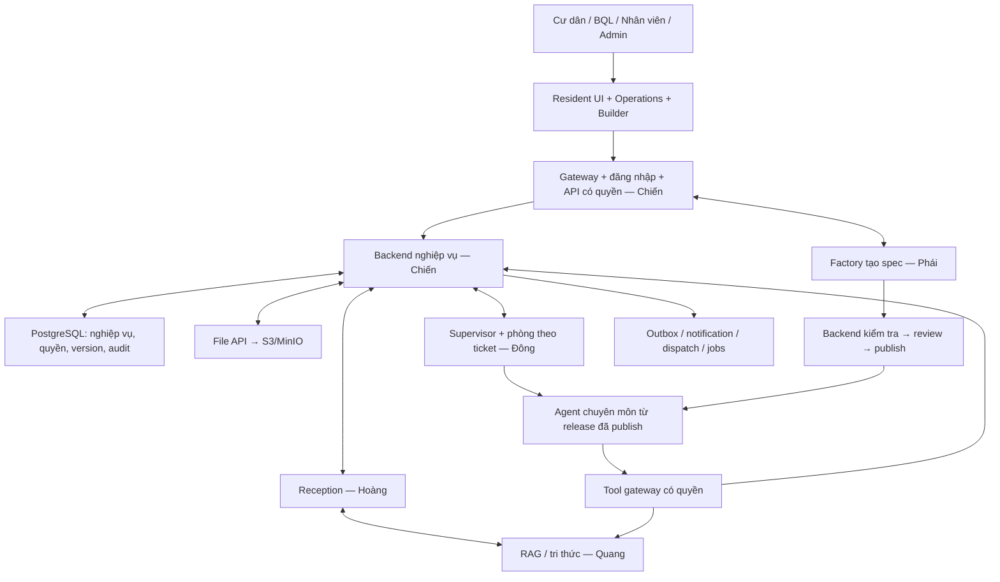
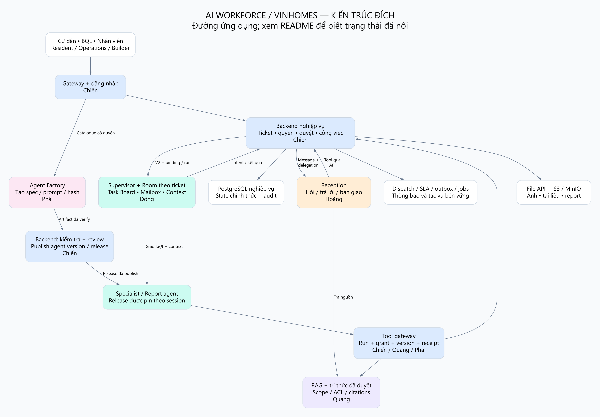
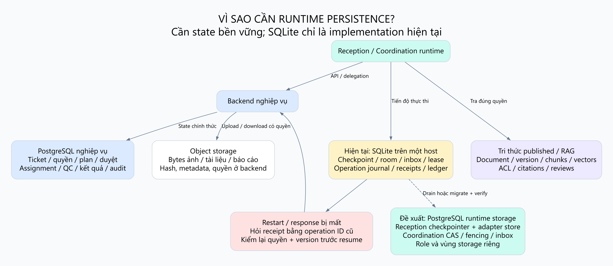
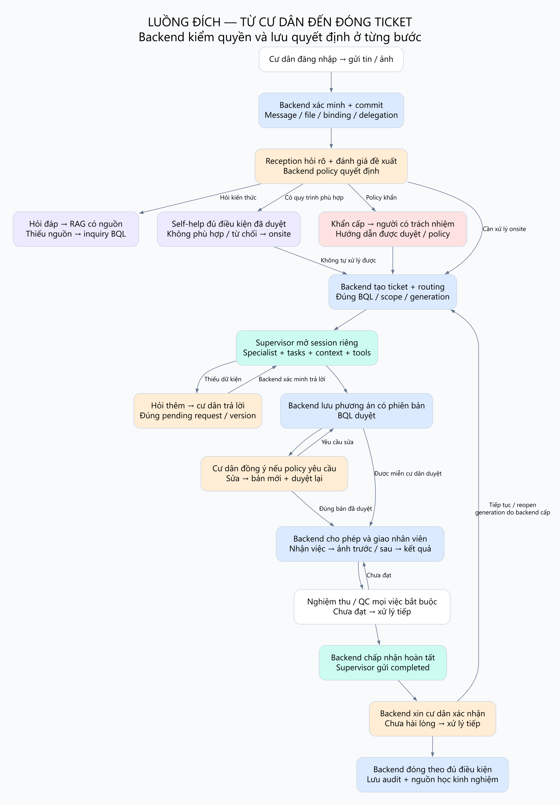
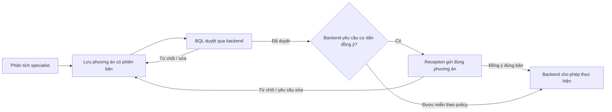
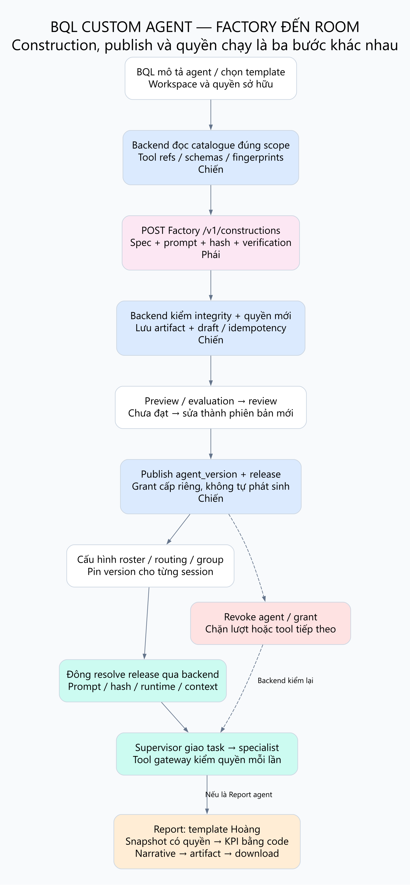

# Toàn bộ luồng AI Workforce / Vinhomes và cách Team Chiến tích hợp

Ngày đối chiếu: **04/10/2026**. Mục tiêu: một tài liệu để hiểu sản phẩm, tìm đúng module khi bảo trì và biết phần nào phải nối tiếp. Đây là bản mô tả và đề xuất tích hợp; không thay code, migration hay phân công gốc.

Nguồn hiện tại: checkout `dev_teamChien_HuyDo`, quan sát HEAD `b2d3f3725ec8e37e5986b13742c9d6211059ba72`, có code Coordination đang sửa chưa commit. Phần Phái đọc từ `origin/devTeamPhai` tại `e994722fa5dc558eb7c9e1bf676b83735319a33b`; **không nằm trong checkout hiện tại**. Những phát hiện từ code chưa commit chỉ là bằng chứng có implementation, không phải nghiệm thu chạy thật.

**Rà soát lại ngày 04/10, HEAD `afa1af8`:** đoạn trên là mốc bản đầu; code M2 đã được commit và có báo cáo kết quả [Supervisor M2](../SUPERVISOR_SESSION_V2_M2_2026-10-04.md). Mục 8 được cập nhật theo bằng chứng đó. [Các điểm đã sửa](REVIEW_CORRECTIONS.md) phân biệt lỗi diễn giải, số liệu snapshot và thay đổi xảy ra sau bản đầu.

Đọc kèm [checklist nối hệ thống và nghiệm thu](INTEGRATION_CHECKLIST.md), [bản đồ database](../DATABASE_MAP_2026-10-04/README.md) và [bản đồ RAG](../RAG_DATABASE_MAP_2026-10-04/README.md).

## 1. Đích đến của dự án

Đích đến là **platform cho BQL tạo và vận hành agent chuyên môn trong một quy trình nghiệp vụ có kiểm soát**. Vinhomes là domain đầu tiên: cư dân phản ánh, Reception tiếp nhận, backend xác minh và chuyển đúng nơi, Supervisor điều phối chuyên môn, người có quyền duyệt, nhân viên thực hiện, nghiệm thu và cư dân xác nhận. Mỗi quyết định có nguồn, phiên bản và lịch sử truy lại được.

Người sử dụng không cần hiểu agent framework hoặc gọi API. Cư dân có một hội thoại và trạng thái yêu cầu; BQL có hàng chờ, phòng làm việc, phương án, phê duyệt và builder; nhân viên có công việc và bằng chứng; admin có account/scope/policy/release review; vận hành có log, retry, backup và cách khôi phục.

Reception là dịch vụ cố định. Supervisor có mẫu logic dùng chung, nhưng mỗi ticket có state riêng. BQL custom **agent chuyên môn/Report agent**, không sửa luật kiểm quyền của backend bằng prompt. Năng lực cấu hình agent của platform và việc xử lý một ticket là hai luồng nối nhau tại **published release**.

Mũi tên là đường gọi ứng dụng, không phải quan hệ FK. Sơ đồ này là kiến trúc đích; trạng thái từng điểm nối ở mục 8.

## 2. Vì sao hiện có SQLite? Có bắt buộc giữ không?

**Cần lưu tiến độ thực thi bền vững; không bắt buộc dùng SQLite.** Biết ticket đang chờ duyệt chưa đủ để biết graph đang dừng ở node nào, agent nào đang có lượt chạy, hoặc một lệnh mạng bị timeout đã thực hiện hay chưa.

Ví dụ: Supervisor đã gửi yêu cầu tạo công việc, backend đã commit nhưng runtime mất kết nối trước khi nhận response. Backend giữ công việc; runtime cần giữ operation ID và trạng thái chưa rõ để hỏi lại kết quả. Nếu chỉ chạy lại từ đầu với ID mới, có thể tạo thêm công việc. Nếu runtime mất checkpoint, backend không nhất thiết có đủ state để tái tạo nguyên vẹn lượt thực thi.

| Loại dữ liệu | Nguồn chính thức | Ví dụ |
|---|---|---|
| Nghiệp vụ | Backend + PostgreSQL | Ticket, generation/version, người có quyền, phương án, phê duyệt, assignment, QC, kết quả |
| Tiến độ thực thi | Runtime persistence | Node graph, checkpoint phòng, task board, lượt đang chạy, action journal, lease, receipt |
| Tri thức dùng lại | Kho RAG/memory đã kiểm quyền và duyệt | Tài liệu published, chunks/vectors, kinh nghiệm đã được duyệt |
| Bytes ảnh/tài liệu | Object storage | File gốc và artifact báo cáo; DB lưu metadata, hash và quyền |

Code hiện tại dùng:

- Reception: `src/persistence/sqlite.py` dùng `AsyncSqliteSaver`; bảng checkpoint/writes của LangGraph. `src/runtime/backend.py::DraftStore` lưu mapping nháp/operation ở file `.records` với bảng `reception_records`.
- Coordination: `src/persistence/sqlite.py::DevelopmentStore` lưu `checkpoints`, `acknowledgements`, `inbox`, `ledger`, `records`; composition Vinhomes thêm `cursors`. Đây là implementation của dự án, không phải một bộ bảng được AgentScope tự sinh.
- Reception chế độ `loop` đọc hội thoại/yêu cầu từ backend mỗi lượt thay vì dùng checkpoint graph cho bộ não đó. Tuy nhiên composition service hiện vẫn khởi tạo SQLite/graph khi startup; chuyển sang `loop` không tự xóa dependency SQLite khỏi service.

SQLite đang thuận tiện cho local/test trên một host. DevelopmentStore chủ động từ chối `mode='production'`. File này không chia sẻ state tự động giữa các máy; lock trong một process cũng không bảo vệ hai replica.

**Đề xuất khi triển khai chung:** dùng PostgreSQL cho runtime persistence, với database/schema và role riêng theo adapter đã kiểm chứng. Có thể dùng chung PostgreSQL cluster với nghiệp vụ để giảm vận hành, nhưng credential runtime chỉ được truy cập storage được cấp. Giữ bảng framework ngoài catalog bảng nghiệp vụ. Đây là đề xuất chưa triển khai.

Đây là khuyến nghị tích hợp của bản hướng dẫn, **không phải quyết định đã được các team chốt hoặc yêu cầu phải thêm một bộ bảng mới ngay**. Môi trường một host có thể tiếp tục DevelopmentStore trong phạm vi phát triển; nhu cầu multi-host/replica và các semantics phải có là tiêu chí chọn storage.

Reception có thể dùng checkpointer PostgreSQL tương thích phiên bản LangGraph đã pin. Coordination cần adapter riêng đáp ứng interface hiện có: checkpoint CAS/version, transaction phòng, inbox dedupe, lease/fencing, acknowledgements, ledger/records và cursor. **Đổi Reception sang PostgresSaver không tự chuyển Coordination hoặc DraftStore.** Không cần chuyển sang một workflow engine mới để làm bước này.

Nguồn framework: [LangGraph SQLite checkpoint](https://github.com/langchain-ai/langgraph/blob/main/libs/checkpoint-sqlite/README.md) mô tả SQLite cho local/test/lightweight deployment; [LangGraph checkpointers](https://github.com/langchain-ai/docs/blob/main/src/oss/langgraph/checkpointers.mdx) có PostgreSQL cho production. Khả năng dùng thực tế phải kiểm với dependency đã pin trong repo.

Khi chuyển storage: dừng nhận session mới → hoàn tất hoặc đối soát session đang chờ → backup file + kiểm tra bản phục hồi → chuyển theo adapter/version đã kiểm chứng → chạy restart/two-worker tests → chuyển traffic. Không xóa SQLite trước khi chứng minh đã giữ được pending request, receipt và checkpoint. Cũng có thể drain hết session cũ rồi chỉ mở session mới trên storage mới nếu không cần chuyển trực tiếp checkpoint framework.

## 3. Các đối tượng phải phân biệt để bảo trì đúng

| Đối tượng | Ý nghĩa và ranh giới |
|---|---|
| Tenant + scope | Tổ chức và phạm vi quyền: khu/tòa/căn hộ/dịch vụ; không lấy từ lời model |
| User/account | Người đăng nhập; management/staff/customer/admin không phải danh tính của agent |
| Workspace BQL | Không gian sở hữu/cấu hình; cần mô hình ownership và thu hồi rõ ràng |
| Phòng BQL / channel | Nơi hiển thị hội thoại, session, agent và trao đổi lâu dài của BQL |
| Cấu hình groupchat | Roster, Supervisor template, cấu hình và phiên bản đã publish; khác phòng đang thực thi |
| Ticket + generation | Yêu cầu nghiệp vụ và lần xử lý; mở lại tạo generation theo quyết định backend |
| Session điều phối / agent_team | State thực thi riêng của `(tenant, ticket, generation)`; có thể hiển thị trong một phòng BQL chung |
| Runtime binding + run | Mapping vào framework đã xác thực và một lần thực thi; không dùng thread ID browser gửi làm quyền |
| Agent version + release | Cấu hình bất biến đã được duyệt/publish; bản nháp không được tự vào phòng |
| Task trong phòng | Việc phân tích giao cho agent; khác công việc hiện trường giao nhân viên |
| Work order + assignment | Công việc nghiệp vụ và một lần giao nhân viên; backend kiểm skill/ca/capacity/quyền |
| Plan/request chờ + ticket_version | Nội dung cụ thể cư dân/BQL đang duyệt; trả lời phải dẫn lại đúng bản đã hiển thị |

Hiện composition Vinhomes dùng một phòng của đơn vị quản lý chứa nhiều session. Kế hoạch gốc muốn mỗi tài khoản management có cấu hình/workspace riêng. **Chưa được coi cấu hình phòng hiện tại là đã hoàn thành ownership/groupchat versioning cho từng BQL**. Chiến cần chốt mô hình đó với Đông, tái sử dụng bảng hiện có trước khi thêm bảng.

Không dùng một mutable state chung cho mọi ticket. Context Builder chỉ gửi ticket, task, kết quả và tin liên quan được agent đọc. Một tin nhắn hiển thị trong phòng BQL chung không đồng nghĩa mọi agent ở mọi session được đọc.

## 4. Luồng hoàn chỉnh từ cư dân đến đóng yêu cầu

### 4.1. Đăng nhập và nhận tin nhắn

1. Cư dân đăng nhập, backend kiểm account, tenant membership và căn hộ đã xác minh. UI gửi nội dung/ảnh vào backend; không gửi tenant/role tùy ý để cấp quyền.
2. Backend ghi message, gắn đúng channel/người gửi, xử lý idempotency và commit. File đi qua upload/finalize/kiểm tra quyền; message chỉ dẫn `file_id` đã được xác minh.
3. Backend tạo hoặc tra binding Reception, mở run cho lượt này và cấp delegation ngắn hạn. Gọi Reception `POST /v1/turns`; runtime dùng delegation khi gọi ngược backend/RAG. Service token xác thực dịch vụ, không thay quyền người cư dân.
4. Hội thoại cư dân được đọc qua backend. UI không đọc file SQLite và không gọi trực tiếp Factory/Coordinator.

### 4.2. Reception quyết định nhánh xử lý

Reception hỏi rõ, diễn đạt và đề xuất assessment. Backend policy/triage mới là nơi xác nhận mức độ, ưu tiên, dấu hiệu khẩn và các điều kiện được phép.

| Nhánh | Cách xử lý |
|---|---|
| Hỏi kiến thức | RAG lọc quyền/scope và bản published, tìm nguồn phù hợp; trả lời có citation. Không đủ nguồn thì hỏi thêm hoặc chuyển BQL, không bịa |
| Câu hỏi thuộc tòa nhưng chưa có nguồn | Tạo inquiry/session qua backend để BQL trả lời. Không ép mọi câu hỏi thành work order sửa chữa |
| Thiếu thông tin | Lưu yêu cầu chờ, hỏi cư dân đúng câu; nhận lại đúng hội thoại/yêu cầu, không mất sau restart |
| Self-help phù hợp | Chỉ hướng dẫn quy trình/điều kiện đã duyệt; ghi đồng ý và outcome. Từ chối/không phù hợp/thất bại thì chuyển onsite; không bắt cư dân thử sửa trước |
| Sự cố cần nhân viên | Thu dữ kiện → nháp → xác minh vị trí → đánh giá → routing → handoff tạo ticket chính thức |
| Khẩn cấp | Backend nhận diện theo policy, chuyển người phụ trách và dùng hướng dẫn đã duyệt; không chờ nhiều lượt agent hoặc tự điều khiển thiết bị |

Self-help workflow và giá tham khảo đầy đủ là mục tiêu C13/Q07/Q08/H07, chưa được chứng minh hoàn thành chỉ vì Reception trả lời được từ RAG. Hướng dẫn khẩn cấp đã duyệt trong code hiện tại là một năng lực riêng.

### 4.3. Backend tạo ticket và routing

Backend giữ `tickets`, sự kiện, assessments/decisions, SLA và lịch sử routing. Routing từ địa bàn, service category, management coverage và quyền thật; không dùng LLM để đoán BQL/tenant. Không có đích hợp lệ hoặc nhiều đích ngang nhau thì vào hàng chờ cần người xử lý. Có handoff được ghi nhận thì mới nói với cư dân đã chuyển.

Đầu ra giao Coordination là input V2 có `ticket_submitted`, dữ liệu ticket, generation/version và mã truy vết. Backend tạo/tra `agent_teams`, thành viên Supervisor, runtime binding và run. Một ticket/generation có một session hiện hành; gửi lại không mở thêm session.

### 4.4. Supervisor mở phòng thực thi của session

1. Runtime đọc inbox bền vững, xác minh message với backend, rồi nhận checkpoint hoặc tạo mới. Đọc inbox chưa có nghĩa xử lý xong.
2. Backend trả danh sách specialist còn active, release published chưa revoked, đúng workspace/phòng và category. Resolver pin chính xác `agent_version_id` và phiên bản Supervisor.
3. Supervisor chia việc phân tích; Room lưu participant, Task Board, Mailbox và kết quả. Context Builder lọc dữ liệu cho từng agent.
4. Runtime gọi từng specialist bằng adapter AgentScope/OpenBot đã chọn. Mỗi lượt có run/operation ID, giới hạn token, deadline và cancellation; lưu kết quả trước khi đánh dấu task xong.
5. Agent tra RAG/SOP/tài sản/lịch sử/sensor qua **tool gateway có grant**. Tool ghi dữ liệu hoặc yêu cầu hành động đi qua backend kiểm quyền/trạng thái/phiên bản. Agent không UPDATE trực tiếp PostgreSQL nghiệp vụ.
6. Thiếu dữ kiện: Supervisor gửi `information_requested`; Reception hỏi cư dân; backend xác minh `information_provided` rồi resume đúng session. Không coi bổ sung dữ kiện là đồng ý phương án.
7. BQL `@agent`: backend xác thực agent ID và session, kiểm thành viên/quyền, rồi Coordinator dựng context và gọi đúng agent. Tên trong message không cấp quyền hoặc tự mời agent vào phòng.

Task Board “phân tích xong” không có nghĩa nhân viên đã sửa xong. Lượt specialist thành công không có nghĩa ticket đã hoàn thành. Lịch sử phòng hiển thị cho BQL là projection của backend; checkpoint runtime mới là nơi tiếp tục lượt, còn backend vẫn quyết định nghiệp vụ.

### 4.5. Lập phương án và phê duyệt

Supervisor tổng hợp phương án: việc gì, ai/nhóm chuyên môn nào, thời gian dự kiến, chi phí và điều kiện. Lưu qua API backend trước khi xin duyệt. Backend cấp phiên bản và lưu nội dung chuẩn.

Trên Reception ↔ Supervisor V2, dùng `plan_approval_requested` và `plan_approved` / `plan_rejected` / `plan_change_requested`; `message` là nội dung. Quyết định chỉ có hiệu lực sau backend kiểm người, nguồn cư dân `source_message_id`, bước chờ, generation/version và trạng thái. Gửi lại cùng ID/nội dung trả kết quả cũ; cùng ID khác nội dung phải conflict.

Một ticket chỉ mở một yêu cầu chờ cư dân tại một thời điểm. Bản sửa có ticket_version mới theo hợp đồng V2, đồng thời pin đúng phiên bản phương án nghiệp vụ; các bước duyệt áp dụng phải làm lại. Backend chỉ được miễn cư dân duyệt khi policy nghiệp vụ cho phép, không do Supervisor tự quyết định.

### 4.6. Giao việc thật, thực hiện và nghiệm thu

Backend tạo work order/assignment theo phương án đã đủ điều kiện. Dispatcher hoặc BQL chọn nhân viên theo ca, chuyên môn, capacity, địa bàn và ưu tiên. Nhân viên nhận/từ chối, báo ETA, chụp ảnh trước/sau, ghi số đo/kết quả/chi phí thực tế rồi báo hoàn thành.

Agent kỹ thuật có thể phân tích bằng chứng, đề xuất QC hoặc yêu cầu bổ sung. Backend và người có thẩm quyền quyết định nghiệm thu. QC không đạt thì yêu cầu làm lại/xử lý tiếp; không gửi hoàn tất cho cư dân chỉ vì nhân viên nhấn xong.

Các thao tác ngắt điện/nước, vào căn hộ, hạn chế khu vực hoặc gọi nhà thầu cần đúng quyền/phê duyệt và người thực hiện. Agent tạo yêu cầu/hỗ trợ phân tích, không tự coi tool call là đã thao tác vật lý.

### 4.7. Thông báo kết quả, xác nhận và đóng

Khi mọi việc bắt buộc xong, QC/evidence và điều kiện backend đều đạt, Supervisor mới được gửi `completed` với `result.outcome = work_completed`. Backend kiểm tra lại, phát thông báo và quản lý cư dân xác nhận kết quả.

`completed` **không tự đóng ticket**. Cư dân chưa hài lòng thì backend ghi phản hồi, mở lại/tiếp tục theo state machine, cấp generation khi cần và vô hiệu quyết định cũ. Nếu nghiệp vụ có bước BQL duyệt đóng session, giữ bước đó. Chỉ backend cập nhật trạng thái cuối sau đủ điều kiện.

Hủy cũng là một request: `cancel_requested` chưa phải đã hủy; chỉ phát `cancelled` khi backend xác nhận. Đang có công việc hiện trường hoặc thao tác không thể hủy thì phải trả tình trạng thật.

### 4.8. Học từ kết quả đã kiểm chứng

Luồng mục tiêu cho giải pháp/quy trình từ ticket: candidate có nguồn → kiểm thông tin cá nhân/phạm vi/điều kiện an toàn → review theo chính sách → publish document/version → chunks/vectors và citation. Nội dung an toàn/quy trình áp dụng cho cư dân cần người có thẩm quyền duyệt theo kế hoạch. Thu hồi bản tri thức phải chặn retrieval và cập nhật quan hệ publication.

Luồng **learned Q&A hiện tại** khác ở bước review: `v3_learning.decide` loại nội dung cá nhân/không dùng lại được; tự động approved câu trả lời chung/rủi ro thấp; giữ pending nội dung phí/quy định/an toàn để BQL duyệt. Vì vậy không mô tả mọi tri thức hiện tại đều do người bấm duyệt. Đây cũng chưa phải lifecycle procedure/actual cost đầy đủ của mục tiêu C13.

Code hiện tại có learned Q&A/candidate review và đường export Markdown rồi nạp lại. Snapshot RAG đã kiểm có `memory_publications = 0`, nên đường này chưa chứng minh lifecycle publication chuẩn. Học quy trình sửa chữa, actual cost và thống kê giá phải có dữ liệu đã xác nhận, lineage và version riêng; không dùng model tự bịa giá, không cần huấn luyện RL để làm việc này.

## 5. Luồng BQL custom agent trên platform

1. BQL đăng nhập, backend xác định workspace/scope sở hữu và quyền tạo agent. BQL nhập tên, vai trò, mô tả, mục tiêu hoặc chọn template Report của Hoàng.
2. Backend đọc catalogue tool/model/knowledge đúng quyền hiện tại. Tool có version/schema và khai báo tác động; không gửi credential vào prompt hoặc Factory.
3. Với construction bằng Factory, backend gọi Phái `POST /v1/constructions` trên mạng nội bộ. Factory tạo spec, `systemPrompt`, `specHash`, verification và generatedSkill; generatedSkill là hướng dẫn sử dụng tool, không tự cấp quyền hoặc tạo runtime mới.
4. Backend kiểm integrity/hash/prompt/fingerprint và quyền nguồn vẫn còn hợp lệ, lưu draft/version với idempotency. Factory trả 200 chỉ có nghĩa construction qua kiểm tra, chưa có nghĩa agent đã lưu hoặc chạy được.
5. Preview/evaluation theo bộ tình huống có expected outcomes, kiểm tool quyền và budget. Gửi review cho role được giao; code hiện tại dùng admin quyết định. Publish tạo **agent_versions / agent_releases bất biến**; revocation/rollback có audit.
6. BQL cấu hình roster/groupchat và phạm vi dịch vụ. Backend xác nhận các agent/release được phép; pin version cho session mới. Không cho sửa draft làm thay đổi agent đang xử lý một ticket.
7. Đông resolve release qua backend, nạp prompt/spec đúng hash vào runtime đã chọn, thêm hướng dẫn phòng bên ngoài core prompt, nhận tool grants và context đã lọc. Supervisor mới giao việc cho agent.
8. Mỗi lần gọi tool và bắt đầu/resume lượt vẫn kiểm quyền mới nhất. Publish không cấp quyền vượt scope; grant bị thu hồi phải chặn hành động tiếp theo.

**Factory không gọi Coordination; Coordination không gọi Factory. Backend là điểm nối artifact/release.** Không chạy construction lại mỗi lần xử lý ticket. Catalogue có RAG “available” cũng không đồng nghĩa có grant cho RAG; Chiến/Quang cần đăng ký ref/schema thật để Phái có thể resolve.

Luồng Report: Hoàng cung cấp template/prompt/metric contract/rendering → Chiến đưa vào Builder và authorized data ports → publish agent của BQL → Đông chạy trong phòng → backend lấy dataset snapshot đúng scope → tính KPI bằng code xác định → model viết narrative từ số đã tính → export job/file → download kiểm lại quyền. Snapshot kỳ báo cáo/timezone/as_of/source lineage phải giữ được; LLM không tự tính số tài chính/KPI hoặc chạy SQL tùy ý.

## 6. Phân công đúng giữa các team

| Team | Sở hữu chính | Bàn giao để Chiến nối | Không được coi là việc đã xong chỉ từ module |
|---|---|---|---|
| **Chiến** | DB/migration/contracts, auth/scope, ticket/routing/triage, binding/gateway, file, approval/work/QC/completion, UI/Builder và composition backend | API thật, source of truth, producer contracts, identity/release/tool catalogue, gateway, UI, integration evidence | Nối module không thay E2E/production acceptance |
| **Đông** | Supervisor/planner/approval orchestration; Room, Task Board, Mailbox, Context Builder, @agent; adapters; checkpoint/recovery và runtime Report | Các ports/signatures, V2 consumer, resolver/released session, tool-call boundary, storage semantics và restart tests | Phòng phân tích chạy được chưa phải giao việc/đóng ticket trọn vòng |
| **Hoàng** | Reception graph/tools/runtime, hỏi bổ sung và chuyển yêu cầu; Report templates/tools/metrics/narrative/artifact | Contract Reception execute/reconcile/delegation; V2 ingress/output; Report bundle và data-port requirements | Reception/RAG chat tốt chưa chứng minh chờ duyệt/nhận sự kiện Supervisor |
| **Quang** | Technical tools, SOP/asset/sensor/evidence support, RAG ingestion/retrieval/eval, knowledge-learning pipeline | Catalogue tool version/schema/effect, authorized ports, RAG contract/citation, pipeline/revocation semantics | Tool host có thật chưa đồng nghĩa specialist trong room đã gọi đúng quyền |
| **Phái** | Agent Factory/spec/compiler/verification; Security tools ở nhánh Phái | Factory HTTP/client DTO, integrity/fingerprint rules, mapping artifact→release, Security tool contracts/provider requirements | Factory verified artifact chưa phải published/runtime-ready agent |

Kế hoạch gốc còn **Team 5 Platform/QA/DevOps** cho CI/deployment/secrets/workers/monitoring/backup/staging. Không tự đồng nhất Team Phái với Team 5: hiện evidence Phái là Factory/Security. Nếu chỉ có năm team bạn nêu, cần giao **một owner vận hành rõ ràng**, có thể do Chiến đầu mối phối hợp nhưng không để trách nhiệm này trống.

Giữ ownership rule/schema ở backend; team agent đề xuất thay đổi qua contract. Chiến làm đầu mối tích hợp, nhưng không cần viết lại planner, Reception, Factory và các tool vốn đã có. Các team tự duy trì test module của mình; Chiến/QA kiểm những đường nối và hành vi nghiệp vụ chung.

## 7. Điểm nối cụ thể để maintain

| Điểm nối | Đường hiện tại / seam | Việc cần giữ hoặc hoàn thiện |
|---|---|---|
| UI → nghiệp vụ | `/api/business/*` → FastAPI `services/vinhomes-api` | Cookie/identity xác minh; production reverse proxy tương đương Vite |
| UI → platform | Hono `server/`, API OpenBot/agent/plugin | Thống nhất account/tenant/workspace; không nhận user ID tự khai để ủy quyền |
| Backend → Reception | `POST /v1/turns`, `agent-reception/src/runtime/service.py` | Sau commit message; delivery/retry bền, per-conversation concurrency và delegation theo lượt |
| Reception → backend | `/internal/reception/v1/execute`, policy evaluate, replies/inquiries | Execute/reconcile cùng operation ID; backend suy actor từ delegation |
| Reception → RAG | `/internal/knowledge/search` | Authority bridge, published/scope/ACL, audit/citations; tránh mở endpoint nội bộ ra browser |
| Backend → Coordination | `/internal/coordination/v1/inbox`, verify/view/authorize/send/results/status | Durable inbox → lease → checkpoint; đúng session/generation/version |
| Coordination → specialist | `Resolver`, `Releases`, `Specialists` trong `src/vinhomes/ports.py`; AgentScope/OpenBot adapters | Pin release, prompt integrity, source_run_id, tool grants, cancellation và receipt |
| Specialist → tools | Tool authorization seam; Quang host `/api/technical/v1` | Signed/delegated run, final permission check, version/grant/idempotency; không dùng `NoTools` trong luồng cần tool |
| Supervisor → phương án/việc/sự kiện | BackendActions/EventVerifier ports của Đông | Bind producers thật vào API có version; không điều phối bằng cách gọi UI route dưới tài khoản giả |
| Backend → Factory | Phái `/v1/constructions` (standalone) | Scoped catalogue → integrity → atomic save → review/release; chưa mount trong checkout này |
| Report runtime → dữ liệu/file | Hoàng reporting ports + backend repositories/export/download | Snapshot nhất quán, quyền từng BQL, provenance, revoke, retry artifact |

Các port local là cấu hình phát triển, không phải thiết kế public API: Hono 3001; FastAPI 8000; Reception 4202; Coordination 4300; specialist OpenBot script 4200; Factory standalone 4010 trên ref Phái; RAG standalone mặc định 8787 hoặc mount vào Hono. Không mở đồng thời hai Reception trên cùng cổng, và không dùng `localhost` để gọi container khác.

## 8. Có gì hiện tại, thiếu gì để thành toàn bộ hệ thống?

| Mảng | Bằng chứng hiện tại | Khoảng trống / giới hạn |
|---|---|---|
| Database | Báo cáo live ngày 04/10: 193 bảng nghiệp vụ PostgreSQL, 682 FK; metadata/RAG/runtime binding có | Catalog `merged.json` còn 148, ORM registry 154; phải cập nhật nguồn chuẩn/drift kiểm chứng, không xem count là feature acceptance |
| Resident/Operations | Connected UI/API/auth, ticket/phương án/assignment/evidence/QC và session surfaces có code | Chưa chạy lại browser trong việc viết tài liệu; một số màn chuyên biệt còn thiếu wiring; dữ liệu địa bàn/coverage vận hành chưa đủ |
| Reception | Python composition thật, delegation, graph/loop, RAG, inquiry/curator | Vòng hỏi/duyệt và event từ Supervisor phải nghiệm thu; startup còn SQLite; TS bootstrap cũ không thay Python service nghiệp vụ |
| Coordination tối thiểu | Đã có inbox → verify → checkpoint → accepted; backend tạo binding/run | README M0/M1 chỉ phản ánh lát cắt 03/10 |
| Coordination M2 | Planner/resolver/release/specialist và room mirror đã commit; báo cáo M2 ghi nhận model thật/E2E database tạm và browser 24/24 bước | Đây là evidence owner ghi trong repo, chưa chạy lại trong lần rà soát tài liệu. Planner dừng `analysis_ready`; BQL lập phương án và xử lý tiếp. Chưa kiểm hai Supervisor song song/restart giữa lượt theo báo cáo M2 |
| Tool/action/event trong Vinhomes composition | Lõi Đông và host kỹ thuật có sẵn để reuse | `NoTools`, `UnboundBackendActions`, `UnboundEvents` vẫn hiện diện; chưa có đường specialist→tool và tự động phương án→thi công trọn vòng |
| Factory/Phái | Standalone service và specs có trên remote ref đã nêu | Chưa ở checkout; production BE wiring bị detach theo README của ref; cần reconnection và reconcile spec cũ với code mới |
| BQL builder/version | Backend room configuration/review/admin approve/release/revoke có code | Chưa chứng minh Factory→artifact→version→runtime đầy đủ; ownership/groupchat config per-BQL cần chốt |
| RAG/learning | Ingestion/retrieval/citation, học Q&A và review có code/dữ liệu snapshot | Publication/revoke/retention chuẩn, repair procedure và price lifecycle chưa chứng minh xong |
| Deployment | Docker/toolchain/scripts/hạ tầng nền có | Production `/api/business` gateway và composition đủ services/worker/store còn phải nối, kiểm và ghi bằng chứng |

Không lấy số test/pass cũ để gọi trạng thái hôm nay. Đợt này kiểm nguồn/code/refs và tạo tài liệu; **không chạy model trả phí, không chạy E2E, không deploy**. Spec Coordination của Phái ngày 02/10 có nhiều mục đã cũ (pin dependency/publish chưa có lúc đó); chỉ dùng wire contract còn phù hợp, không chép toàn bộ bảng “chưa có” vào backlog mới.

Report M2 nêu technical tools còn chưa nối; source Hono lại có host `/api/technical/v1` được mount khi có dependencies/env. Kết luận có thể xác nhận từ code là **host tồn tại có điều kiện, còn Vinhomes specialist vẫn dùng `NoTools`**. Không lấy câu “14 tool chưa được nối vào server” để kết luận host hoàn toàn không tồn tại.

## 9. Cách triển khai dễ bảo trì nhất

Chọn một **baseline tích hợp** và một gateway cho browser. Giữ FastAPI nghiệp vụ và Hono platform theo ranh giới hiện tại; chưa cần viết lại một bên để có E2E. Gateway route rõ `/api/business` tới FastAPI, platform/tool routes tới Hono, với cơ chế identity đã xác minh và kiểm quyền thống nhất. Vite proxy không thay cấu hình production.

Đóng gói Resident UI, Operations/Builder, Hono, FastAPI, Reception Python, Coordination, runtime specialist được chọn, Factory, RAG (mount hoặc standalone), PostgreSQL, object store và các job consumer thực sự cần. Reception/Coordination/Factory và storage là dịch vụ nội bộ; browser đi qua gateway. Chỉ dùng một implementation cho từng capability trong môi trường nghiệm thu để tránh dev/mock cùng có quyền ghi.

Worker hiện có chủ yếu quét routine; cần đăng ký và vận hành rõ outbox/notification, dispatch/SLA, ingestion, report export, learned-knowledge publish nếu các module đó cần worker. Không coi việc có file handler là job đã chạy định kỳ. Mỗi job có claim/lease, dedupe, retry hữu hạn, nơi giữ lỗi và công cụ đối soát.

Tiến hành theo các mốc trong [checklist](INTEGRATION_CHECKLIST.md): nền quyền/storage/gateway → một ticket đến analysis_ready → agent có tool/RAG → phương án/duyệt → thi công/QC/đóng → Factory/custom agent/Report → chịu lỗi và staging. Dùng một loại sự cố và hai phạm vi quyền để chứng minh đường hoàn chỉnh, rồi mở rộng sang vệ sinh/an ninh/nhà thầu.

Mỗi mốc bàn giao gồm: commit/ref, contract version, dữ liệu/role thực dùng, API mount/config, migration/role changes, test commands và kết quả, trace từ đầu đến cuối, gap chưa đạt. Không ghi “xong cả hệ thống” khi còn thao tác tay thay cho bước được yêu cầu tự động.

## 10. Tra lỗi theo triệu chứng

| Triệu chứng | Nơi kiểm trước |
|---|---|
| Cư dân gửi xong không có câu trả lời | Backend message commit/delivery → Reception token/delegation/run → model/RAG → reply receipt; đừng chỉ đọc checkpoint |
| Ticket không tới đúng BQL | Verified unit/scope → coverage/category/routing → destination/workspace; thiếu dữ liệu không sửa bằng prompt |
| Supervisor accepted rồi dừng | Session authority → published specialist catalog → resolver → model/OpenBot config → pause_reason; `analysis_ready` là giới hạn hiện tại |
| Specialist không tra SOP/RAG | Catalogue/grant/release → tool adapter (`NoTools`?) → technical/RAG host mount → final authorization/audit |
| Đồng ý nhưng không chạy | Source message/người duyệt → pending request/version/generation → backend accepted decision → event delivery → checkpoint resume |
| Gửi lại tạo hành động trùng | Idempotency receipt → payload hash → operation journal → lease/fence → remote outcome reconcile |
| Agent mới không vào phòng | Draft/review → release status/hash/revocation → workspace/category/roster → pinned version/provider capability |
| Restart mất session hoặc lệch UI | Runtime checkpoint + inbox/cursor → backend session/room projection → version/generation; không dùng mirror UI để giả state runtime |
| Staff báo xong nhưng chưa đóng | Work order/evidence → QC → mọi việc bắt buộc → resident confirmation → quy định BQL đóng; đây có thể là đúng flow |
| Local chạy, build/deploy gọi API 404 | Gateway `/api/business`, artifact Resident, service DNS, mount optional dependencies và readiness |

Log nên có `trace/correlation`, tenant (theo chính sách log), ticket/generation/version, team/session, binding, agent_version, source_run, operation/message ID, checkpoint version, fence và outcome. Không log delegation token, provider key hoặc toàn bộ nội dung riêng tư mặc định. BQL/operator phải thấy lý do chờ, dependency thiếu, lần retry và thao tác khôi phục được phép.

## 11. Nguồn để cập nhật tài liệu

- [Kế hoạch chung 5 team](../../../KE_HOACH_HOAN_THIEN_5_TEAM.md): scope sản phẩm, ownership, C/H/D/Q/P tasks; là kế hoạch, không phải runtime evidence.
- [Phân công Đông](../../dong/PHAN_CONG_NOI_BO_COORDINATION.md), [phân công Hoàng](../../hoang/PHAN_CONG_3_THANH_VIEN.md), [domain kỹ thuật Quang](../../quang/general.md).
- [Reception README](../../../../agent-reception/README.md), `agent-reception/src/runtime/{service,backend,knowledge}.py` và `src/persistence/sqlite.py`.
- [Coordination README](../../../../agent-coordination/README.md), `agent-coordination/src/vinhomes/{runtime,ports,backend}.py`, `src/persistence/sqlite.py` và groupchat/supervisor cores. Đọc code mới khi README mốc cũ chưa cập nhật.
- [Supervisor M0/M1](../SUPERVISOR_SESSION_V2_M0_M1_2026-10-03.md): bằng chứng và giới hạn lịch sử ngày 03/10.
- [API README](../../../../services/vinhomes-api/README.md); mount thực tại `main.py`; các module `v3_coordination`, `v3_reception_supervisor`, `v3_agent_reviews`, `v3_mutations`, `v3_completion`, `v3_learning`.
- [Frontend/runtime audit trong repo](../REPO_RESEARCH_2026-10-04/FRONTEND_RUNTIME.md), đối chiếu `app/vite.config.ts`, `resident-app/vite.config.ts`, `app/serve.ts`, `server/src/app.ts` cho gateway.
- Phái: `git show origin/devTeamPhai:agent-factory/README.md`, `agent-factory/docs/backend-integration-spec.md`, `coordination-integration-spec.md`; pin ref trước khi giao việc. Coordination spec là đề xuất v0 chưa duyệt, phải reconcile với implementation mới.
