# Giao việc Team Đông — Điều phối và phòng họp agent

Bản cập nhật ngày 30/09/2026 theo luồng đã thống nhất. Đây là thiết kế để triển khai; `agent-coordination/` hiện mới có thư mục giữ chỗ. Các tên file và thông điệp dưới đây là đề xuất.

## 1. Hệ thống cần làm gì?

Lễ tân nhận phản ánh và tạo ticket qua backend. Điều phối mở phòng, chọn các agent chuyên môn phù hợp và cùng lập phương án. Phương án phải được quản lý duyệt, sau đó lễ tân gửi đúng phương án đó cho cư dân đồng ý rồi mới thực hiện.

Nếu cần nhân viên hiện trường: backend giao việc → nhân viên nhận việc → chụp ảnh trước/sau → báo hoàn thành. Sau bước kiểm tra/nghiệm thu theo quy định, lễ tân báo cư dân và xin xác nhận kết quả. Nhân viên báo xong chưa có nghĩa ticket được đóng.

```mermaid
flowchart TB
  S["Cư dân"] <-->|"Phản ánh, hỏi đáp"| LT["Lễ tân"]
  LT -->|"Tạo ticket qua backend"| DP["Điều phối"]
  DP -->|"Mở phòng, chia việc lập phương án"| R["Phòng họp agent"]
  R -->|"Phương án có phiên bản"| DP
  DP -->|"Xin duyệt"| M["Quản lý"]
  M -->|"Từ chối: sửa phương án"| DP
  M -->|"Đồng ý"| LT
  LT -->|"Gửi phương án và chi phí xin đồng ý"| S
  S -->|"Đồng ý / từ chối / yêu cầu sửa"| LT
  LT -->|"Chuyển quyết định đã xác thực"| DP
  DP -->|"Đủ các bước duyệt: cho thực hiện"| R
  R -->|"Yêu cầu giao việc qua backend nếu cần"| NV["Nhân viên"]
  NV -->|"Nhận việc → ảnh trước/sau → báo hoàn thành"| KT["Kiểm tra / nghiệm thu"]
  KT -->|"Đạt: kết quả và chi phí thực tế"| DP
  KT -->|"Chưa đạt: xử lý tiếp"| DP
  DP -->|"Kết quả được phép thông báo"| LT
  LT -->|"Xin xác nhận hoàn thành"| S
  S -->|"Xác nhận / chưa hài lòng"| LT
  LT -->|"Backend đóng hoặc tiếp tục xử lý"| DP
```



Sơ đồ thể hiện luồng nghiệp vụ; thông điệp đi qua API để kiểm quyền và lưu lịch sử. Lễ tân, điều phối và agent cùng sử dụng dữ liệu nghiệp vụ qua backend. Agent không tự ghi trực tiếp vào DB chung.

## 2. Phân công năm DEV

Đường dẫn dưới đây tính từ `agent-coordination/`. Mỗi người viết test cho phần mình trong `tests/` có cấu trúc tương ứng.

### DEV-1 — Tiến: “Bộ não” điều phối

**Phụ trách:** `src/supervisor/**`. File dự kiến: `planner.py`, `turn_policy.py`, `approval_flow.py`.

**Tính năng cần làm:**

- Tách một ticket thành các việc nhỏ, chọn agent làm, chọn lượt và theo dõi việc nào đang chờ/chưa xong.
- Tổng hợp phương án: làm gì, ai làm, thời gian dự kiến, chi phí và điều kiện thực hiện.
- Chờ quản lý duyệt, rồi chờ cư dân đồng ý. Có yêu cầu sửa thì lập bản mới và xin duyệt lại; chưa đủ duyệt thì chưa cho thực hiện.
- Nhận kết quả từng việc, yêu cầu bổ sung khi thiếu và tổng hợp thông báo cuối cùng.
- Đặt giới hạn số lượt để các agent không trao đổi mãi không dừng.

**Làm xong khi:** ticket đi đúng thứ tự duyệt; từ chối quay về sửa; bản cũ không chạy sau khi phương án đã đổi. Mức ưu tiên, SLA và quyền phân công nhân viên vẫn do backend quyết định.

### DEV-2 — Tiến Anh: Phòng họp, agent và `@agent`

**Phụ trách:** `src/agents/**`, `src/groupchat/**`, `src/adapters/agentscope/**`.
File dự kiến: `config_loader.py`, `room.py`, `task_board.py`, `mailbox.py`, `context_builder.py`.

**Tính năng cần làm:**

- Đưa đúng phiên bản agent được phép sử dụng từ Platform vào phòng; giữ riêng phòng của từng ticket.
- Làm **Task Board** — bảng việc chung: việc gì, giao ai, đang làm hay đã xong, kết quả ở đâu. Tiến quyết định chia việc; Tiến Anh làm cơ chế ghi nhận và cập nhật bảng.
- Làm **Mailbox** — gửi tin cho một agent hoặc cả nhóm. Các agent được trao đổi trực tiếp trong phạm vi cho phép; gửi tin không tự cấp quyền thực hiện công việc chưa duyệt.
- Làm **Context Builder** — chọn tin nhắn gần đây, ticket, việc đang làm và kết quả liên quan để gửi cho agent được hỏi. Không gửi toàn bộ lịch sử hoặc dữ liệu ngoài quyền của agent.
- Khi người dùng `@AgentB`: nhận ID đã được hệ thống xác định → kiểm agent thuộc phòng và được phép tham gia → lấy ngữ cảnh phù hợp → gọi AgentB → đưa câu trả lời về đúng phòng.

**Làm xong khi:** hai phòng không lẫn thông tin; agent có ngữ cảnh thực thi riêng nhưng đọc được bảng việc chung đúng quyền; agent không rõ/không được phép thì trả lỗi, không tự mời vào phòng.

Dùng AgentScope 2.0 theo hướng dự án. Trước khi triển khai, kiểm chứng phiên bản cụ thể hỗ trợ Agent Team, Task Board, Mailbox đến đâu; phần thiếu mới bổ sung. Không mặc định tên các thành phần trên là API có sẵn của framework.

### DEV-3 — Nghĩa: Đường nối lễ tân, backend và phòng họp

**Phụ trách:** `src/adapters/backend/**`, `src/adapters/reception/**`, `src/adapters/tools/**`.
File dự kiến: `client.py`, `reception_gateway.py`, `approval_client.py`, `tool_client.py`.

**Tính năng cần làm:**

- Nhận ticket và câu trả lời từ lễ tân; chuyển đúng phòng, đúng lần xử lý.
- Gửi phương án xin duyệt, nhận đồng ý/từ chối/yêu cầu sửa và chuyển cho Tiến.
- Gửi yêu cầu nhận việc cho nhân viên qua backend; nhận sự kiện nhận việc, ảnh và báo hoàn thành.
- Gửi kết quả cho lễ tân để báo đúng cư dân; nhận xác nhận hoàn thành hoặc phản ánh chưa hài lòng.
- Kiểm tra mẫu dữ liệu, người gửi, người nhận và mã yêu cầu. Nhấn/gửi lại nhiều lần không tạo thêm công việc.

**Làm xong khi:** không trả nhầm ticket/người; backend kiểm quyền trước khi chấp nhận quyết định; cùng một phản hồi không được xử lý hai lần. Nghĩa làm phía kết nối của Coordination; màn hình và API cần thay thì bàn giao cho team phụ trách.

### DEV-4 — Huy: Lưu tiến độ và chạy tiếp sau gián đoạn

**Phụ trách:** `src/persistence/**`. File dự kiến: `checkpoint.py`, `resume.py`, `recovery.py`.

**Tính năng cần làm:**

- Lưu phòng, agent, bảng việc, lượt đang chạy và yêu cầu đang chờ duyệt.
- Chờ nhiều giờ vẫn chạy tiếp được; khởi động lại không mất tiến độ.
- Nhận phản hồi rồi tiếp tục đúng phương án và đúng lần xử lý ticket.
- Xử lý mất kết nối, gửi lại, hai tiến trình cùng nhận việc; không gọi nhân viên hoặc thực hiện hành động hai lần.
- Khi ticket mở lại hoặc phương án thay đổi, không dùng quyết định/checkpoint cũ để chạy tiếp.

**Làm xong khi:** tắt dịch vụ ở lúc chờ duyệt hoặc sau khi gọi tool rồi bật lại vẫn tiếp tục đúng. Backend giữ kết quả duyệt/trạng thái nghiệp vụ chính thức; checkpoint chỉ giúp khôi phục thực thi.

### DEV-5 — Khánh Duy: Ghép hệ thống và kiểm thử cả luồng

**Phụ trách:** `src/main.py`, `src/config.py`, `src/contracts/**`, `pyproject.toml`, lockfile, `Dockerfile`, `README.md`, `tests/integration/**`, `tests/contracts/**` và dữ liệu test dùng chung.

**Tính năng cần làm:**

- Ghép bốn phần thành dịch vụ chạy được; cấu hình model, xác thực, báo tình trạng hoạt động và ghi lỗi.
- Chốt phiên bản thư viện và cách các phần gọi nhau. `src/contracts/` dùng mẫu chuẩn đã thống nhất với backend.
- Kiểm thử từ lúc nhận ticket đến lúc cư dân xác nhận; gồm từ chối, sửa phương án, gửi lặp, mất kết nối và hai phòng chạy đồng thời.
- Ghi hướng dẫn chạy, cấu hình cần có và phần đang chờ team khác.

**Làm xong khi:** cả nhóm chạy cùng một cách; có kết quả test cả luồng; nói rõ phần đã chạy thật và phần còn dùng dữ liệu giả. Khánh Duy là người tích hợp của Team Đông, khác Team Platform/QA/DevOps toàn dự án.

## 3. Schema: có cần mẫu riêng cho xin duyệt không?

**Có: cần loại thông điệp và mẫu dữ liệu riêng cho xin duyệt và trả lời duyệt, dùng chung một khung gửi nhận.** Không cần tách thành một dịch vụ riêng. Nếu chỉ gửi câu chat “đồng ý”, hệ thống không biết đang đồng ý phương án nào, bản nào và ở bước nào.

Đây là đề xuất schema nghiệp vụ, chưa phải file JSON Schema đã triển khai. Nghĩa chốt nội dung với team Chiến và Hoàng; team Chiến sở hữu mẫu chuẩn tại `shared/contracts/**`. Khánh Duy tích hợp bộ kiểm tra dữ liệu phía Python.

### Khung chung

Ví dụ dưới đây là một request đã qua backend xác thực; các mã là minh họa. `type` và nội dung `payload` thay đổi theo loại thông điệp.

```json
{
  "contract_version": "1",
  "type": "approval.requested",
  "request_id": "REQ-101",
  "trace_id": "TRACE-01",
  "idempotency_key": "SEND-APP-01",
  "context": {
    "tenant_id": "TENANT-01",
    "principal_id": "PRINCIPAL-01",
    "initiated_by_user_id": "USER-01",
    "domain_id": "DOMAIN-01",
    "workspace_id": "WORKSPACE-01",
    "ticket_id": "TK-123",
    "ticket_generation": 1,
    "binding_id": "BINDING-01",
    "run_id": "RUN-01"
  },
  "payload": {}
}
```

Backend xác minh `context` và tìm đúng phòng/người nhận qua `binding_id`; không tin các mã client tự khai. `ticket_generation` phân biệt lần xử lý khi ticket mở lại. Gửi lại cùng thao tác dùng cùng `idempotency_key`; cùng key nhưng nội dung khác phải báo lỗi.

Khung này mô tả request giữa các dịch vụ. Khi backend phát event, dùng envelope sự kiện theo mục 9.3 của kế hoạch chung, có `event_id` và `aggregate_version`; không dùng nguyên request làm event.

### Các loại thông điệp cần chốt

- `ticket.submitted` — lễ tân → điều phối qua backend: `report`, `facts`, `attachment_ids`; ticket và quyền truy cập đã được backend xác minh.
- `resident.message` — lễ tân → điều phối: `text`, `reply_to_request_id` khi trả lời câu hỏi, `mentioned_agent_id` nếu có.
- `resident.question` — điều phối → lễ tân: `question_id`, `question`; câu trả lời dẫn lại đúng yêu cầu.
- `approval.requested` — xin duyệt: dùng mẫu bên dưới; `stage` phân biệt quản lý duyệt phương án và cư dân đồng ý phương án.
- `approval.responded` — trả lời duyệt: dẫn lại yêu cầu duyệt và phiên bản phương án; đây là phản hồi chờ backend kiểm tra, chưa phải lệnh cho phòng thực hiện.
- `assignment.offered` / `assignment.responded` — backend ↔ nhân viên: `assignment_id`, `assignment_version`, `plan_id`, `plan_version`; câu trả lời là `accept` hoặc `decline`, kèm lý do nếu từ chối.
- `work.completed` — nhân viên → backend: `assignment_id`, `assignment_version`, `result_id`, `result_version`, `before_file_ids`, `after_file_ids`, `summary`, chi phí thực tế nếu có. Backend kiểm ảnh, quyền và bước nghiệm thu trước khi báo cư dân.
- `completion.requested` / `completion.responded` — xin cư dân xác nhận kết quả: dùng mẫu cuối mục này.
- `resident.update` — điều phối → lễ tân: `summary`, `attachment_ids` và trạng thái được backend xác nhận; dùng cho thông báo không cần trả lời.

Các trường bắt buộc/được bỏ và kiểu ID cụ thể được chốt theo từng operation. Mỗi loại cần JSON Schema kiểm tra cấu trúc riêng; chỉ trường hợp phù hợp mới cho phép tiếp tục phòng.

### A. Điều phối nhờ lễ tân gửi phương án cho cư dân

`type = approval.requested`, phần `payload`:

```json
{
  "approval_id": "APP-02",
  "stage": "resident_plan",
  "plan_id": "PLAN-01",
  "plan_version": 2,
  "depends_on_approval_id": "APP-01",
  "recipient_user_id": "RESIDENT-01",
  "delivery_channel": "reception",
  "summary": "Thay đoạn ống rò tại bếp, dự kiến 45 phút.",
  "steps": ["Kiểm tra điểm rò", "Thay đoạn ống", "Kiểm tra lại"],
  "cost": {"amount": 300000, "currency": "VND", "kind": "estimate"},
  "attachment_ids": [],
  "expires_at": "2026-09-30T10:00:00+07:00"
}
```

`APP-01` là lần quản lý đã duyệt **cùng PLAN-01 phiên bản 2**; backend kiểm tra quan hệ này. Bước quản lý dùng cùng mẫu với `stage = management_plan`, người nhận có quyền quản lý và `delivery_channel = management_ui`; không cần `depends_on_approval_id` khi đó là bước đầu.

Lễ tân được diễn đạt dễ hiểu, nhưng phải giữ nguyên nội dung cần duyệt, số tiền và điều kiện. Giao diện hiển thị phương án chuẩn gắn với phiên bản; model không tự viết lại giá hoặc các bước thực hiện. Chưa biết giá thì ghi chưa xác định, không dùng số 0 để ngụ ý miễn phí.

### B. Cư dân trả lời, lễ tân chuyển lại điều phối

`type = approval.responded`, phần `payload`:

```json
{
  "approval_id": "APP-02",
  "stage": "resident_plan",
  "plan_id": "PLAN-01",
  "plan_version": 2,
  "decision": "approve",
  "comment": ""
}
```

`decision` chỉ nhận `approve`, `reject`, `request_changes`. Người trả lời và thời điểm được backend lấy từ phiên đăng nhập/nguồn đã xác thực, không lấy từ lời model.

Backend kiểm người duyệt, hạn duyệt, phiên bản, generation và trạng thái yêu cầu trước khi ghi nhận. Sau đó mới phát sự kiện đã chấp nhận cho điều phối tiếp tục. Phản hồi trùng cùng quyết định trả lại kết quả cũ; phản hồi trái với quyết định đã ghi nhận báo conflict.

Nếu sửa phương án, tăng `plan_version` và tạo yêu cầu duyệt mới; các lượt duyệt cũ không có hiệu lực với bản mới. Hết hạn hoặc chưa trả lời thì tiếp tục chờ/xử lý theo quy định, không tự xem là đồng ý. Nếu câu chat “đồng ý” không xác định rõ đang trả lời yêu cầu nào, lễ tân phải hỏi lại hoặc đưa nút xác nhận.

### C. Xác nhận kết quả sau khi làm xong

Dùng `completion.requested` và `completion.responded` riêng để tránh nhầm với duyệt phương án trước khi làm.

Payload xin xác nhận:

```json
{
  "confirmation_id": "CONF-01",
  "result_id": "RESULT-01",
  "result_version": 1,
  "plan_id": "PLAN-01",
  "plan_version": 2,
  "recipient_user_id": "RESIDENT-01",
  "summary": "Đã thay ống và kiểm tra không còn rò nước.",
  "evidence_file_ids": ["PHOTO-BEFORE", "PHOTO-AFTER"],
  "final_cost": {"amount": 300000, "currency": "VND"}
}
```

Payload trả lời:

```json
{
  "confirmation_id": "CONF-01",
  "result_id": "RESULT-01",
  "result_version": 1,
  "decision": "not_satisfied",
  "comment": "Nước vẫn còn rỉ ở mối nối."
}
```

Quyết định là `confirmed` hoặc `not_satisfied`. Backend kiểm đúng người và đúng kết quả. Nếu chưa hài lòng, đưa về điều phối xử lý tiếp; nếu đã đóng rồi mới mở lại thì dùng generation mới. Cư dân xác nhận xong chỉ đóng ticket khi các điều kiện nghiệp vụ khác cũng đủ.

Phí phát sinh vượt phạm vi/số tiền đã được đồng ý phải xin duyệt bổ sung trước phần việc phát sinh. Xác nhận hoàn thành không thay thế việc đồng ý chi phí, cũng không có nghĩa đã thanh toán.

## 4. Luồng tạo và duyệt agent

**BQL tạo bản nháp → chạy Evaluation → đạt tiêu chí thì gửi admin → admin duyệt → publish phiên bản → phiên bản đó mới được đưa vào phòng.**

Không đạt hoặc admin từ chối thì trả về BQL sửa. Bản sửa phải được đánh giá và duyệt cho chính phiên bản đó; không dùng kết quả của bản cũ. “Pass hết” là đạt bộ tiêu chí do dự án chốt, gồm hành vi chuyên môn, quyền gọi tool và an toàn dữ liệu; không chỉ là gọi model thành công.

Team Chiến làm màn hình, API và trạng thái duyệt/publish. Tiến Anh chỉ nạp phiên bản backend xác nhận đã đủ điều kiện; Khánh Duy kiểm thử agent chưa được duyệt không vào phòng. Phiên đang chạy giữ phiên bản đã chọn, không tự đổi khi BQL sửa agent.

Đây là yêu cầu bổ sung từ luồng mới, cần đồng bộ vào kế hoạch chung và contract của Platform trước khi triển khai.

## 5. Các điểm cần phối hợp

- **Team Hoàng:** lễ tân hiển thị phương án, hỏi thêm, xin duyệt và thông báo kết quả.
- **Team Chiến:** API, quyền người duyệt, lưu phương án/phiên bản, phân công nhân viên, ảnh, phí và đóng/mở ticket. Mẫu schema chuẩn ở `shared/contracts/**` cũng do Chiến quản lý.
- **Phần bắt `@agent`:** Team Chiến làm phía giao diện và backend để đổi tên được nhắc thành ID đúng; Nghĩa chuyển ID kèm câu hỏi vào Coordination; Tiến Anh kiểm tra, dựng ngữ cảnh và trả lời về phòng. Không dùng tên hiển thị làm bằng chứng agent có quyền.
- **Team Quang:** tool nghiệp vụ và RAG để agent sử dụng.
- **Team Platform:** triển khai dịch vụ và test xuyên toàn hệ thống. Team Đông không tự sửa DB, giao diện hoặc cấu hình chung của các team này.

Bộ test chung tối thiểu: quản lý từ chối; cư dân yêu cầu sửa; duyệt nhầm bản cũ; agent chưa được admin duyệt; nhân viên từ chối nhận; ảnh chưa hợp lệ; cư dân chưa hài lòng; gửi phản hồi lặp; khởi động lại lúc chờ; `@agent` sai quyền; hai phòng chạy đồng thời.

Nguồn đối chiếu: [Kế hoạch 5 team](../../KE_HOACH_HOAN_THIEN_5_TEAM.md), [Database V3](../../DATABASE_IMPLEMENTATION_V3.md), [Triage V3](../../DB_AI_Platform_Builder_Vinhomes_V3_Triage_Priority.md). Các bước duyệt tuần tự và duyệt agent bổ sung theo yêu cầu mới của người dùng.
