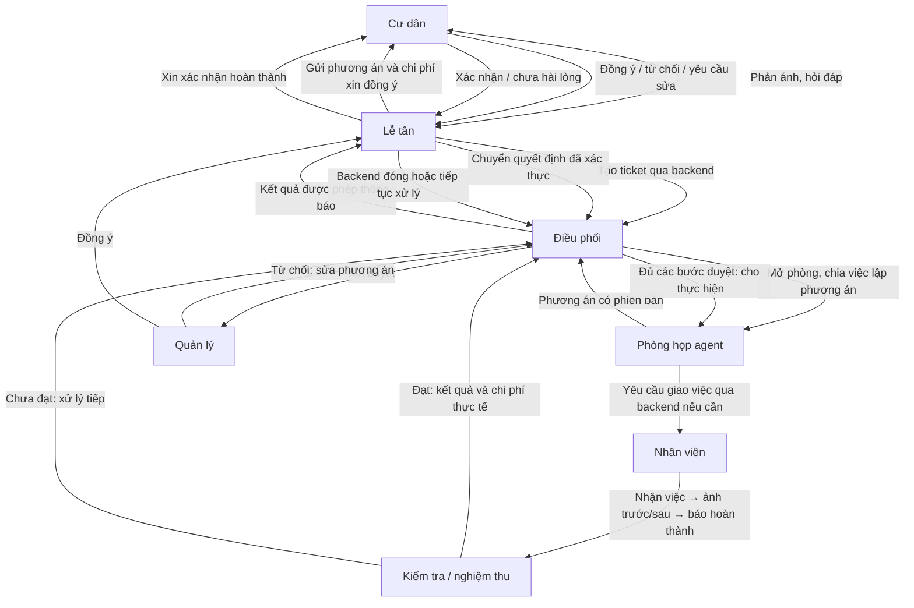

# Giao việc Team Đông — Điều phối và phòng họp agent

Bản cập nhật ngày 01/10/2026. Giữ nguyên schema và phân công V1 để đối chiếu; schema_v2 là phương án mới dùng `message_type` + `message` cho Reception ↔ Supervisor. Phần việc V2 giả định các thành viên đã hoàn thành việc V1 và chỉ giao việc chuyển đổi; đây là giả định lập kế hoạch, không phải xác nhận tình trạng triển khai thực tế.

## 1. Hệ thống cần làm gì?

**schema_v1 (bản cũ)**

Lễ tân nhận phản ánh và tạo ticket qua backend. Điều phối mở phòng, chọn các agent chuyên môn phù hợp và cùng lập phương án. Phương án phải được quản lý duyệt, sau đó lễ tân gửi đúng phương án đó cho cư dân đồng ý rồi mới thực hiện.

Nếu cần nhân viên hiện trường: backend giao việc → nhân viên nhận việc → chụp ảnh trước/sau → báo hoàn thành. Sau bước kiểm tra/nghiệm thu theo quy định, lễ tân báo cư dân và xin xác nhận kết quả. Nhân viên báo xong chưa có nghĩa ticket được đóng.



Sơ đồ thể hiện luồng nghiệp vụ; thông điệp đi qua API để kiểm quyền và lưu lịch sử. Lễ tân, điều phối và agent cùng sử dụng dữ liệu nghiệp vụ qua backend. Agent không tự ghi trực tiếp vào DB chung.

**schema_v2 — Luồng áp dụng sau chuyển đổi**

Lễ tân gửi `ticket_submitted`; Supervisor mở phòng và lập phương án. Khi thiếu thông tin, gửi `information_requested` và nhận `information_provided`. Mỗi ticket chỉ chờ một câu hỏi hoặc một phương án tại một thời điểm.

Supervisor vẫn lấy kết quả quản lý duyệt qua backend. Nếu cần cư dân đồng ý, gửi phương án bằng `plan_approval_requested` và nhận `plan_approved`, `plan_rejected` hoặc `plan_change_requested`. Sự cố chung được backend xác định không cần cư dân xác nhận thì đi tiếp theo quyền đã được duyệt. Sửa phương án phải có phiên bản ticket mới và thực hiện lại các bước duyệt áp dụng.

Giao việc nhân viên và nghiệm thu vẫn qua backend. Supervisor gửi `completed` khi toàn bộ công việc đã hoàn thành và kết quả được phép thông báo. Backend quản lý bước cư dân xác nhận kết quả, chưa hài lòng, đóng/mở ticket và yêu cầu xử lý tiếp. Các loại thông điệp và điều kiện kiểm tra chi tiết nằm trong schema_v2 ở mục 3.

## 2. Phân công năm DEV

Đường dẫn dưới đây tính từ `agent-coordination/`. Mỗi người viết test cho phần mình trong `tests/` có cấu trúc tương ứng. Trong từng DEV, `schema_v1 (bản cũ)` giữ nội dung đã giao; `schema_v2` ngay bên dưới là phần chuyển đổi cần thực hiện trên kết quả V1.

### DEV-1 — Tiến: “Bộ não” điều phối

#### schema_v1 (bản cũ)

**Phụ trách:** `src/supervisor/**`. File dự kiến: `planner.py`, `turn_policy.py`, `approval_flow.py`.

**Tính năng cần làm:**

- Tách một ticket thành các việc nhỏ, chọn agent làm, chọn lượt và theo dõi việc nào đang chờ/chưa xong.
- Tổng hợp phương án: làm gì, ai làm, thời gian dự kiến, chi phí và điều kiện thực hiện.
- Chờ quản lý duyệt, rồi chờ cư dân đồng ý. Có yêu cầu sửa thì lập bản mới và xin duyệt lại; chưa đủ duyệt thì chưa cho thực hiện.
- Nhận kết quả từng việc, yêu cầu bổ sung khi thiếu và tổng hợp thông báo cuối cùng.
- Đặt giới hạn số lượt để các agent không trao đổi mãi không dừng.

**Làm xong khi:** ticket đi đúng thứ tự duyệt; từ chối quay về sửa; bản cũ không chạy sau khi phương án đã đổi. Mức ưu tiên, SLA và quyền phân công nhân viên vẫn do backend quyết định.

#### schema_v2 — Phần chuyển đổi sau khi hoàn thành V1

**Phụ trách:** `src/supervisor/**`; cập nhật `planner.py`, `turn_policy.py`, `approval_flow.py` đã có.

**Việc cần chuyển đổi:**

- Chuyển nhánh xử lý đầu vào sang `message_type`: nhận ticket, thông tin bổ sung, ba quyết định về phương án và yêu cầu hủy. Dùng `message` làm nội dung; quyết định có hiệu lực phải được backend xác nhận.
- Thay output `status`/`customer_message` và các yêu cầu cư dân cũ bằng `message_type`/`message` theo mục 3. Với `plan_approval_requested`, đưa đầy đủ phương án, thời gian, chi phí và điều kiện đã được backend lưu vào `message`.
- Mỗi ticket chỉ mở một yêu cầu chờ cư dân. Khi thiếu thông tin, gửi `information_requested` và nhận `information_provided`; thông tin bổ sung không được tự coi là chấp thuận phương án.
- Giữ bước quản lý duyệt qua backend. Chỉ chờ cư dân khi backend xác định cần; sự cố chung được miễn bước này thì tiếp tục theo quyết định backend. Với `plan_rejected`/`plan_change_requested`, dừng phương án hiện tại để xử lý lại theo quy định; bản sửa lấy `ticket_version` mới và đi lại các bước duyệt áp dụng.
- Tổng hợp tất cả công việc và kết quả kiểm tra/nghiệm thu trước khi gửi `completed` cùng `result`. Bàn giao bước xin cư dân xác nhận kết quả/đóng ticket cho backend. Chỉ gửi `cancelled` sau khi backend xác nhận hủy.

**Làm xong khi:** nhận và phát đúng enum V2; có test hỏi thêm, duyệt/từ chối/sửa, sự cố chung không cần cư dân duyệt, phản hồi bản cũ và hủy; một việc con hoàn thành không làm phát `completed` sớm. Giới hạn lượt, chia việc, quyền phân công và SLA tiếp tục dùng cơ chế đã có.

### DEV-2 — Tiến Anh: Phòng họp, agent và `@agent`

#### schema_v1 (bản cũ)

**Phụ trách:** `src/agents/**`, `src/groupchat/**`, `src/adapters/agentscope/**`.
File dự kiến: `config_loader.py`, `room.py`, `task_board.py`, `mailbox.py`, `context_builder.py`.

**Tính năng cần làm:**

- Đưa đúng phiên bản agent được phép sử dụng từ Platform vào phòng; giữ riêng phòng của từng ticket.
- Làm **Task Board** — bảng việc chung: việc gì, giao ai, đang làm hay đã xong, kết quả ở đâu. Tiến quyết định chia việc; Tiến Anh làm cơ chế ghi nhận và cập nhật bảng.
- Làm **Mailbox** — gửi tin cho một agent hoặc cả nhóm. Các agent được trao đổi trực tiếp trong phạm vi cho phép; gửi tin không tự cấp quyền thực hiện công việc chưa duyệt.
- Làm **Context Builder** — chọn tin nhắn gần đây, ticket, việc đang làm và kết quả liên quan để gửi cho agent được hỏi. Không gửi toàn bộ lịch sử hoặc dữ liệu ngoài quyền của agent.
- Khi người dùng `@AgentB`: nhận ID đã được hệ thống xác định → kiểm agent thuộc phòng và được phép tham gia → lấy ngữ cảnh phù hợp → gọi AgentB → đưa câu trả lời về đúng phòng.

**Làm xong khi:** hai phòng không lẫn thông tin; agent có ngữ cảnh thực thi riêng nhưng đọc được bảng việc chung đúng quyền; agent không rõ/không được phép thì trả lỗi, không tự mời vào phòng.

Dùng AgentScope 2.0 theo hướng dự án. Trước khi triển khai, kiểm chứng phiên bản cụ thể hỗ trợ Agent Team, Task Board, Mailbox đến đâu; phần thiếu mới bổ sung. Không mặc định tên các thành phần trên là API có sẵn của framework.

#### schema_v2 — Phần chuyển đổi sau khi hoàn thành V1

**Phụ trách:** `src/agents/**`, `src/groupchat/**`, `src/adapters/agentscope/**`; cập nhật chỗ tiếp nhận ngữ cảnh trong phòng, Task Board, Mailbox và Context Builder đã có.

**Việc cần chuyển đổi:**

- Cho Context Builder đọc `message_type`, `message`, dữ liệu ticket, `facts` và `file_ids` từ input V2; bỏ phụ thuộc vào `additional_information`/`cancel_request` trên đường Reception ↔ Supervisor.
- Gắn nội dung nhận được với đúng tenant, ticket, generation và phiên bản. Task Board/Mailbox chỉ tiếp tục công việc khi Supervisor đã nhận kết quả kiểm tra hợp lệ của backend; câu chữ “đồng ý” trong `message` không tự mở quyền chạy tool.
- Giữ kết quả từng việc và bằng chứng để Supervisor tổng hợp output V2; không coi việc một agent xong là toàn bộ ticket đã hoàn thành.
- Giữ cơ chế `@agent` đã làm: ID đã xác thực được truyền qua ngữ cảnh định tuyến của backend, không suy ra danh tính hoặc quyền từ tên xuất hiện trong `message`. Hai schema V2 không bổ sung trường `mentioned_agent_id`; Nghĩa và team Chiến nối ngữ cảnh định tuyến hiện có vào phòng.

**Làm xong khi:** phòng và Context Builder nhận được V2, giữ đúng phạm vi dữ liệu và trạng thái chờ; test hai phòng đồng thời, thế hệ/phiên bản cũ và `@agent` sai quyền vẫn đạt. Không cần xây lại Task Board, Mailbox hoặc luồng duyệt/publish agent đã hoàn thành.

### DEV-3 — Nghĩa: Đường nối lễ tân, backend và phòng họp

#### schema_v1 (bản cũ)

**Phụ trách:** `src/adapters/backend/**`, `src/adapters/reception/**`, `src/adapters/tools/**`.
File dự kiến: `client.py`, `reception_gateway.py`, `approval_client.py`, `tool_client.py`.

**Tính năng cần làm:**

- Nhận ticket và câu trả lời từ lễ tân; chuyển đúng phòng, đúng lần xử lý.
- Gửi phương án xin duyệt, nhận đồng ý/từ chối/yêu cầu sửa và chuyển cho Tiến.
- Gửi yêu cầu nhận việc cho nhân viên qua backend; nhận sự kiện nhận việc, ảnh và báo hoàn thành.
- Gửi kết quả cho lễ tân để báo đúng cư dân; nhận xác nhận hoàn thành hoặc phản ánh chưa hài lòng.
- Kiểm tra mẫu dữ liệu, người gửi, người nhận và mã yêu cầu. Nhấn/gửi lại nhiều lần không tạo thêm công việc.

**Làm xong khi:** không trả nhầm ticket/người; backend kiểm quyền trước khi chấp nhận quyết định; cùng một phản hồi không được xử lý hai lần. Nghĩa làm phía kết nối của Coordination; màn hình và API cần thay thì bàn giao cho team phụ trách.

#### schema_v2 — Phần chuyển đổi sau khi hoàn thành V1

**Phụ trách:** `src/adapters/backend/**`, `src/adapters/reception/**`, `src/adapters/tools/**`; cập nhật gateway và các client đã có.

**Việc cần chuyển đổi:**

- Chốt với team Hoàng và Chiến đúng hai schema ở mục 3; chuyển gateway Reception sang `schema_version = 2.0`, `message_type` và `message`. Bản input vẫn kèm đầy đủ dữ liệu ticket; gateway lấy bản dữ liệu đã xác minh, không yêu cầu model tự điền metadata.
- Chuyển nội dung hỏi thêm, quyết định duyệt và hủy sang `message`; đưa `facts`, `file_ids` và `source_message_id` vào đúng trường V2. Thay output `status`/`customer_message` bằng enum mới và `message`; không gửi các payload xin duyệt cư dân V1 trên đường này.
- Giữ các client duyệt quản lý, phân công nhân viên và nghiệm thu qua backend. Backend tra phòng và người nhận từ ngữ cảnh đã xác thực; map `supervisor_run_id`, `correlation_id` và các mã khác theo đúng ý nghĩa, không thay tên cơ học từ envelope V1.
- Chuyển ba loại quyết định phương án vào bước backend kiểm quyền/trạng thái/phiên bản rồi mới báo Tiến tiếp tục. Truy lại nguồn cư dân qua `source_message_id`; phản hồi phải giữ phiên bản đã hiển thị, không tự nâng lên bản mới. Gửi lại cùng bản tin giữ `message_id`; kiểm cả bản tin lặp và quyết định đã ghi nhận.
- Gửi `completed` cho Reception sau khi backend cho phép thông báo. Bỏ trách nhiệm nhận `completion.responded` từ giao thức Reception ↔ Supervisor; phối hợp team Chiến/Hoàng bàn giao màn hình và luồng xác nhận hoàn thành, chưa hài lòng, đóng/mở ticket cho backend. Khi backend yêu cầu xử lý tiếp, đưa ngữ cảnh về đúng ticket/generation.
- Giữ định tuyến `@agent` qua ngữ cảnh backend hiện có. Phối hợp rollout V2 với hai team; không tự chuyển quyết định duyệt V1 thiếu thông tin sang V2 và không để checkpoint đang chờ mất đường trả lời.

**Làm xong khi:** gateway trao đổi V2 cả hai chiều, không nhầm người/phòng; backend chặn phản hồi cũ/sai bước và gửi lặp; có kiểm tra đường đi duyệt quản lý, nhân viên, hủy, hoàn thành và backend yêu cầu xử lý tiếp. API/màn hình backend thuộc team Chiến, Reception thuộc team Hoàng.

### DEV-4 — Huy: Lưu tiến độ và chạy tiếp sau gián đoạn

#### schema_v1 (bản cũ)

**Phụ trách:** `src/persistence/**`. File dự kiến: `checkpoint.py`, `resume.py`, `recovery.py`.

**Tính năng cần làm:**

- Lưu phòng, agent, bảng việc, lượt đang chạy và yêu cầu đang chờ duyệt.
- Chờ nhiều giờ vẫn chạy tiếp được; khởi động lại không mất tiến độ.
- Nhận phản hồi rồi tiếp tục đúng phương án và đúng lần xử lý ticket.
- Xử lý mất kết nối, gửi lại, hai tiến trình cùng nhận việc; không gọi nhân viên hoặc thực hiện hành động hai lần.
- Khi ticket mở lại hoặc phương án thay đổi, không dùng quyết định/checkpoint cũ để chạy tiếp.

**Làm xong khi:** tắt dịch vụ ở lúc chờ duyệt hoặc sau khi gọi tool rồi bật lại vẫn tiếp tục đúng. Backend giữ kết quả duyệt/trạng thái nghiệp vụ chính thức; checkpoint chỉ giúp khôi phục thực thi.

#### schema_v2 — Phần chuyển đổi sau khi hoàn thành V1

**Phụ trách:** `src/persistence/**`; cập nhật `checkpoint.py`, `resume.py`, `recovery.py` đã có.

**Việc cần chuyển đổi:**

- Lưu `schema_version`, loại thông điệp, nội dung cần gửi, `message_id`, `correlation_id`, ticket/generation/version và `supervisor_run_id` để khôi phục đúng lượt. Lưu một yêu cầu cư dân đang chờ cùng bản phương án/câu hỏi đã gửi; backend vẫn là nguồn chính thức về phê duyệt.
- Khi nhận `information_provided` hoặc quyết định phương án, kiểm kết quả backend và phiên bản chờ trước khi resume. Bản sửa, generation mới hoặc bước chờ đã kết thúc phải vô hiệu hóa phản hồi/checkpoint cũ.
- Khi phục hồi, gửi lại bản tin chưa xác nhận với nguyên `message_id` và nội dung; giữ cơ chế chống chạy tool/giao việc hai lần đã có. Hai tiến trình nhận cùng phản hồi chỉ cho một tiến trình tiếp tục.
- Bỏ trạng thái chờ `completion.responded` trong vòng xử lý Supervisor V2; lưu việc đã bàn giao kết quả cho backend. Theo dõi `cancel_requested` như một yêu cầu, chỉ kết thúc do hủy sau kết quả backend.
- Phối hợp DEV-3/DEV-5 chuyển các checkpoint V1 đang dở trước rollout: đối chiếu yêu cầu cũ với bản ghi backend; chỉ chuyển khi xác định đúng ticket, phiên bản và trạng thái. Giữ nguyên dữ liệu gốc nếu không đối chiếu được và đưa ra xử lý có kiểm soát, không tự coi cư dân đã đồng ý.

**Làm xong khi:** khởi động lại khi đang hỏi, chờ duyệt, gửi kết quả hoặc chờ hủy vẫn tiếp tục đúng; phản hồi lặp và hai tiến trình không tạo thêm hành động. Có kịch bản chuyển checkpoint V1, bao gồm bản không đủ dữ liệu để chuyển tự động.

### DEV-5 — Khánh Duy: Ghép hệ thống và kiểm thử cả luồng

#### schema_v1 (bản cũ)

**Phụ trách:** `src/main.py`, `src/config.py`, `src/contracts/**`, `pyproject.toml`, lockfile, `Dockerfile`, `README.md`, `tests/integration/**`, `tests/contracts/**` và dữ liệu test dùng chung.

**Tính năng cần làm:**

- Ghép bốn phần thành dịch vụ chạy được; cấu hình model, xác thực, báo tình trạng hoạt động và ghi lỗi.
- Chốt phiên bản thư viện và cách các phần gọi nhau. `src/contracts/` dùng mẫu chuẩn đã thống nhất với backend.
- Kiểm thử từ lúc nhận ticket đến lúc cư dân xác nhận; gồm từ chối, sửa phương án, gửi lặp, mất kết nối và hai phòng chạy đồng thời.
- Ghi hướng dẫn chạy, cấu hình cần có và phần đang chờ team khác.

**Làm xong khi:** cả nhóm chạy cùng một cách; có kết quả test cả luồng; nói rõ phần đã chạy thật và phần còn dùng dữ liệu giả. Khánh Duy là người tích hợp của Team Đông, khác Team Platform/QA/DevOps toàn dự án.

#### schema_v2 — Phần chuyển đổi sau khi hoàn thành V1

**Phụ trách:** `src/contracts/**`, phần ghép trong `src/main.py`, `README.md`, `tests/contracts/**`, `tests/integration/**` và fixture chung; phối hợp bốn DEV trên nền dịch vụ đã có.

**Việc cần chuyển đổi:**

- Tích hợp đúng một schema input và một schema output V2 từ mẫu chuẩn team Chiến quản lý. Kiểm enum, trường bắt buộc, `source_message_id` cho phản hồi cư dân và `result.outcome = work_completed` khi output là `completed`; báo lỗi rõ khi nhận schema V1 hoặc loại thông điệp sai chiều.
- Thay fixture hợp đồng cũ của Reception ↔ Supervisor bằng V2; giữ fixture V1 cho kiểm tra chuyển đổi/không tương thích. Loại các trường đã bỏ khỏi mẫu V2; API quản lý/nhân viên nội bộ tiếp tục có kiểm thử riêng theo hợp đồng backend.
- Ghép luồng có hỏi thêm, cư dân đồng ý/từ chối/yêu cầu sửa, sự cố chung không cần cư dân đồng ý, hủy được/không được, thất bại và hoàn thành toàn bộ công việc. Kiểm rõ `completed` không tự đóng ticket.
- Kiểm tích hợp backend sở hữu xác nhận hoàn thành và phản ánh chưa hài lòng; Supervisor chỉ nhận lại ngữ cảnh khi backend yêu cầu xử lý tiếp. Giữ các test quyền agent, `@agent`, nhân viên và nghiệm thu hiện có.
- Thêm kiểm thử phiên bản/generation cũ, sai người/sai bước chờ, cùng ID khác nội dung, quyết định lặp bằng ID khác, hai phòng, hai tiến trình và restart. Kiểm một ticket không mở hai yêu cầu chờ cư dân đồng thời.
- Cập nhật README, ví dụ input/output và hướng dẫn rollout phối hợp Reception/backend/Coordination; ghi rõ phiên bản, cách xử lý checkpoint V1 còn dở và những endpoint vẫn đang dùng dữ liệu giả. Không suy ra code đã chạy thật chỉ từ giả định phân công V1 đã hoàn thành.

**Làm xong khi:** cả ba phía dùng cùng V2, các kiểm tra contract và luồng chuyển đổi đạt; nội dung test phân biệt hoàn thành công việc với đóng ticket, và không còn phụ thuộc vào payload duyệt/xác nhận cư dân V1 trên đường Reception ↔ Supervisor.

## 3. Schema: có cần mẫu riêng cho xin duyệt không?

**schema_v1 (bản cũ)** — Giữ nguyên để đối chiếu. Phần schema_v2 bên dưới là hợp đồng mới cho Reception ↔ Supervisor.

**Có: cần loại thông điệp và mẫu dữ liệu riêng cho xin duyệt và trả lời duyệt, dùng chung một khung gửi nhận.** Không cần tách thành một dịch vụ riêng. Nếu chỉ gửi câu chat “đồng ý”, hệ thống không biết đang đồng ý phương án nào, bản nào và ở bước nào.

Đây là đề xuất schema nghiệp vụ, chưa phải file JSON Schema đã triển khai. Nghĩa chốt nội dung với team Chiến và Hoàng; team Chiến sở hữu mẫu chuẩn tại `shared/contracts/**`. Khánh Duy tích hợp bộ kiểm tra dữ liệu phía Python.

### Khung chung

Ví dụ dưới đây là một request đã qua backend xác thực; các mã là minh họa. `type` và nội dung `payload` thay đổi theo loại thông điệp.

```json
{
  "contract_version": "1",
  "type": "approval.requested",
  "request_id": "REQ-101",
  "trace_id": "TRACE-01",
  "idempotency_key": "SEND-APP-01",
  "context": {
    "tenant_id": "TENANT-01",
    "principal_id": "PRINCIPAL-01",
    "initiated_by_user_id": "USER-01",
    "domain_id": "DOMAIN-01",
    "workspace_id": "WORKSPACE-01",
    "ticket_id": "TK-123",
    "ticket_generation": 1,
    "binding_id": "BINDING-01",
    "run_id": "RUN-01"
  },
  "payload": {}
}
```

Backend xác minh `context` và tìm đúng phòng/người nhận qua `binding_id`; không tin các mã client tự khai. `ticket_generation` phân biệt lần xử lý khi ticket mở lại. Gửi lại cùng thao tác dùng cùng `idempotency_key`; cùng key nhưng nội dung khác phải báo lỗi.

Khung này mô tả request giữa các dịch vụ. Khi backend phát event, dùng envelope sự kiện theo mục 9.3 của kế hoạch chung, có `event_id` và `aggregate_version`; không dùng nguyên request làm event.

### Các loại thông điệp cần chốt

- `ticket.submitted` — lễ tân → điều phối qua backend: `report`, `facts`, `attachment_ids`; ticket và quyền truy cập đã được backend xác minh.
- `resident.message` — lễ tân → điều phối: `text`, `reply_to_request_id` khi trả lời câu hỏi, `mentioned_agent_id` nếu có.
- `resident.question` — điều phối → lễ tân: `question_id`, `question`; câu trả lời dẫn lại đúng yêu cầu.
- `approval.requested` — xin duyệt: dùng mẫu bên dưới; `stage` phân biệt quản lý duyệt phương án và cư dân đồng ý phương án.
- `approval.responded` — trả lời duyệt: dẫn lại yêu cầu duyệt và phiên bản phương án; đây là phản hồi chờ backend kiểm tra, chưa phải lệnh cho phòng thực hiện.
- `assignment.offered` / `assignment.responded` — backend ↔ nhân viên: `assignment_id`, `assignment_version`, `plan_id`, `plan_version`; câu trả lời là `accept` hoặc `decline`, kèm lý do nếu từ chối.
- `work.completed` — nhân viên → backend: `assignment_id`, `assignment_version`, `result_id`, `result_version`, `before_file_ids`, `after_file_ids`, `summary`, chi phí thực tế nếu có. Backend kiểm ảnh, quyền và bước nghiệm thu trước khi báo cư dân.
- `completion.requested` / `completion.responded` — xin cư dân xác nhận kết quả: dùng mẫu cuối mục này.
- `resident.update` — điều phối → lễ tân: `summary`, `attachment_ids` và trạng thái được backend xác nhận; dùng cho thông báo không cần trả lời.

Các trường bắt buộc/được bỏ và kiểu ID cụ thể được chốt theo từng operation. Mỗi loại cần JSON Schema kiểm tra cấu trúc riêng; chỉ trường hợp phù hợp mới cho phép tiếp tục phòng.

### A. Điều phối nhờ lễ tân gửi phương án cho cư dân

`type = approval.requested`, phần `payload`:

```json
{
  "approval_id": "APP-02",
  "stage": "resident_plan",
  "plan_id": "PLAN-01",
  "plan_version": 2,
  "depends_on_approval_id": "APP-01",
  "recipient_user_id": "RESIDENT-01",
  "delivery_channel": "reception",
  "summary": "Thay đoạn ống rò tại bếp, dự kiến 45 phút.",
  "steps": ["Kiểm tra điểm rò", "Thay đoạn ống", "Kiểm tra lại"],
  "cost": {"amount": 300000, "currency": "VND", "kind": "estimate"},
  "attachment_ids": [],
  "expires_at": "2026-09-30T10:00:00+07:00"
}
```

`APP-01` là lần quản lý đã duyệt **cùng PLAN-01 phiên bản 2**; backend kiểm tra quan hệ này. Bước quản lý dùng cùng mẫu với `stage = management_plan`, người nhận có quyền quản lý và `delivery_channel = management_ui`; không cần `depends_on_approval_id` khi đó là bước đầu.

Lễ tân được diễn đạt dễ hiểu, nhưng phải giữ nguyên nội dung cần duyệt, số tiền và điều kiện. Giao diện hiển thị phương án chuẩn gắn với phiên bản; model không tự viết lại giá hoặc các bước thực hiện. Chưa biết giá thì ghi chưa xác định, không dùng số 0 để ngụ ý miễn phí.

### B. Cư dân trả lời, lễ tân chuyển lại điều phối

`type = approval.responded`, phần `payload`:

```json
{
  "approval_id": "APP-02",
  "stage": "resident_plan",
  "plan_id": "PLAN-01",
  "plan_version": 2,
  "decision": "approve",
  "comment": ""
}
```

`decision` chỉ nhận `approve`, `reject`, `request_changes`. Người trả lời và thời điểm được backend lấy từ phiên đăng nhập/nguồn đã xác thực, không lấy từ lời model.

Backend kiểm người duyệt, hạn duyệt, phiên bản, generation và trạng thái yêu cầu trước khi ghi nhận. Sau đó mới phát sự kiện đã chấp nhận cho điều phối tiếp tục. Phản hồi trùng cùng quyết định trả lại kết quả cũ; phản hồi trái với quyết định đã ghi nhận báo conflict.

Nếu sửa phương án, tăng `plan_version` và tạo yêu cầu duyệt mới; các lượt duyệt cũ không có hiệu lực với bản mới. Hết hạn hoặc chưa trả lời thì tiếp tục chờ/xử lý theo quy định, không tự xem là đồng ý. Nếu câu chat “đồng ý” không xác định rõ đang trả lời yêu cầu nào, lễ tân phải hỏi lại hoặc đưa nút xác nhận.

### C. Xác nhận kết quả sau khi làm xong

Dùng `completion.requested` và `completion.responded` riêng để tránh nhầm với duyệt phương án trước khi làm.

Payload xin xác nhận:

```json
{
  "confirmation_id": "CONF-01",
  "result_id": "RESULT-01",
  "result_version": 1,
  "plan_id": "PLAN-01",
  "plan_version": 2,
  "recipient_user_id": "RESIDENT-01",
  "summary": "Đã thay ống và kiểm tra không còn rò nước.",
  "evidence_file_ids": ["PHOTO-BEFORE", "PHOTO-AFTER"],
  "final_cost": {"amount": 300000, "currency": "VND"}
}
```

Payload trả lời:

```json
{
  "confirmation_id": "CONF-01",
  "result_id": "RESULT-01",
  "result_version": 1,
  "decision": "not_satisfied",
  "comment": "Nước vẫn còn rỉ ở mối nối."
}
```

Quyết định là `confirmed` hoặc `not_satisfied`. Backend kiểm đúng người và đúng kết quả. Nếu chưa hài lòng, đưa về điều phối xử lý tiếp; nếu đã đóng rồi mới mở lại thì dùng generation mới. Cư dân xác nhận xong chỉ đóng ticket khi các điều kiện nghiệp vụ khác cũng đủ.

Phí phát sinh vượt phạm vi/số tiền đã được đồng ý phải xin duyệt bổ sung trước phần việc phát sinh. Xác nhận hoàn thành không thay thế việc đồng ý chi phí, cũng không có nghĩa đã thanh toán.

### schema_v2 — Bản chốt ngày 01/10/2026

Chỉ dùng **một schema Reception → Supervisor** và **một schema Supervisor → Reception**. `message_type` xác định cách xử lý; `message` chứa nội dung câu hỏi, phương án, phản hồi hoặc thông báo. Các giá trị `message_type` là enum cố định, không suy diễn quyết định duyệt từ câu chữ trong `message`.

Hai schema này chỉ áp dụng cho giao tiếp Reception ↔ Supervisor qua backend. API duyệt quản lý, giao việc/nhận việc nhân viên, nghiệm thu, xác nhận hoàn thành và đóng/mở ticket vẫn thuộc backend. Backend có thể tiếp tục dùng các mã phương án, phê duyệt và kết quả nội bộ; các mã đó không bắt buộc xuất hiện trong hai schema này.

#### Reception gửi cho Supervisor — input

```typescript
type Fact = {
  key: string;
  value: string | number | boolean | null;
  source: "customer_report" | "staff_verified" | "agent_inference";
  source_message_id: string;
};

type ReceptionToSupervisorMessage = {
  schema_version: "2.0";
  message_id: string;
  correlation_id: string;
  sent_at: string;

  message_type:
    | "ticket_submitted"
    | "information_provided"
    | "plan_approved"
    | "plan_rejected"
    | "plan_change_requested"
    | "cancel_requested";
  message: string;
  source_message_id?: string;

  tenant_id: string;
  domain_id: string;
  domain_name: string;
  workspace_id: string;
  team_id: string;

  ticket_id: string;
  ticket_code: string;
  ticket_generation: number;
  ticket_version: string;

  resident: {
    resident_id: string;
    resident_name: string;
    phone_number: string;
  };

  location: {
    location_scope_id: string;
    unit_id: string;
    unit_number: string;
    building_id: string;
    building_code: string;
    building_name: string;
  };

  request: {
    title: string;
    description: string;
    request_kind: "incident" | "service_request";
    category_id?: string;
    priority: "low" | "normal" | "high" | "critical";
    severity: "unknown" | "minor" | "moderate" | "major" | "critical" | "not_applicable";
    is_emergency: boolean;
    triage_decision_id?: string;
    handoff_reason: "needs_staff" | "self_help_declined" | "self_help_failed" | "emergency";
  };

  facts: Fact[];
  file_ids: string[];
  created_at: string;
};
```

- `ticket_submitted`: bàn giao ticket; `message` mô tả yêu cầu của cư dân.
- `information_provided`: câu trả lời hoặc thông tin bổ sung trong `message`; dữ kiện và tệp bổ sung được đưa vào `facts`/`file_ids` của bản dữ liệu ticket gửi kèm.
- `plan_approved`, `plan_rejected`, `plan_change_requested`: quyết định về phương án đang chờ; `message` lưu lời trả lời hoặc yêu cầu sửa của cư dân.
- `cancel_requested`: `message` nêu lý do yêu cầu hủy; yêu cầu này chưa có nghĩa ticket đã bị hủy.

Giữ các trường thông tin ticket bắt buộc như bản schema đính kèm ban đầu: mọi input đều kèm bản dữ liệu ticket tương ứng. Backend/gateway lấy dữ liệu đã xác minh để điền; model không tự tạo lại tên, ID, số điện thoại hoặc địa chỉ. Việc tối giản bản tin thành chỉ ID và nội dung chưa thuộc thay đổi lần này.

`source_message_id` bắt buộc với các input ngoài `ticket_submitted`, để truy lại câu trả lời gốc của cư dân. Đây là mã tin nhắn nguồn, không phải mã câu hỏi mới. `sent_at` là lúc gửi bản tin giữa dịch vụ; thời điểm cư dân gửi tin được tra từ tin nhắn nguồn. `created_at` là thời điểm tạo ticket. Các thời gian dùng chuỗi ISO 8601 có múi giờ.

#### Supervisor gửi cho Reception — output

```typescript
type SupervisorToReceptionResult = {
  schema_version: "2.0";
  message_id: string;
  correlation_id: string;
  sent_at: string;

  message_type:
    | "accepted"
    | "in_progress"
    | "information_requested"
    | "plan_approval_requested"
    | "completed"
    | "failed"
    | "cancelled";
  message: string;

  tenant_id: string;
  workspace_id: string;
  team_id: string;
  ticket_id: string;
  ticket_code: string;
  ticket_generation: number;
  ticket_version: string;

  supervisor_run_id: string;

  result?: {
    outcome: "work_completed" | "needs_human_review" | "unable_to_resolve";
    summary: string;
    work_order_ids: string[];
    evidence_ids: string[];
  };

  error?: {
    code: string;
    retryable: boolean;
    message: string;
  };
};
```

- `accepted`, `in_progress`: đã nhận hoặc đang xử lý; `message` là thông báo cho cư dân.
- `information_requested`: `message` là câu hỏi cần cư dân trả lời; chờ `information_provided`.
- `plan_approval_requested`: `message` là phương án cần đồng ý, gồm việc sẽ làm, thời gian dự kiến, chi phí và điều kiện thực hiện; chờ một trong ba loại quyết định về phương án.
- `completed`: toàn bộ việc trong phạm vi xử lý đã hoàn thành và backend cho phép thông báo sau kiểm tra/nghiệm thu. Bắt buộc có `result` với `outcome = work_completed`. Việc một nhân viên báo xong chưa đủ để gửi loại này.
- `failed`: không xử lý được; `message` giải thích cho cư dân, `result` và/hoặc `error` bổ sung kết quả hoặc lỗi kỹ thuật. `error.message` là thông tin kỹ thuật, không tự chuyển nguyên văn cho cư dân.
- `cancelled`: backend đã xác nhận hủy thành công. Nếu không thể hủy và công việc vẫn tiếp tục, gửi `in_progress` kèm lý do trong `message`.

Không còn `status`, `customer_message`, `requires_resident_approval`, `resident_decision`, `additional_information`, `cancel_request` và `requested_information` trong schema V2. Nội dung trao đổi được chuyển vào `message`; loại thao tác được chuyển vào `message_type`. `facts`, `file_ids`, `result`, `error` và các mã đối chiếu vẫn là dữ liệu có cấu trúc.

#### Quy tắc dùng chung

1. Mỗi ticket trong một `ticket_generation` có tối đa một yêu cầu chờ cư dân trả lời tại một thời điểm: hỏi thông tin hoặc duyệt phương án. Đây là điều kiện phải kiểm tra, không chỉ là thói quen sử dụng. Thông tin bổ sung tự phát vẫn có thể đến, nhưng không tự chuyển thành quyết định duyệt.
2. Backend lưu nguyên phương án đã đưa cho cư dân cùng `ticket_version` và trạng thái chờ. Reception hiển thị đúng phương án, số tiền và điều kiện; chưa xác định giá thì ghi rõ chưa xác định. Mỗi lần thay phương án hoặc thay yêu cầu đang chờ phải có phiên bản ticket mới do backend cấp. Phản hồi giữ phiên bản của yêu cầu mà cư dân đã thấy; gateway không tự gắn phiên bản mới nhất vào một câu trả lời cũ.
3. Backend kiểm người trả lời từ nguồn đã xác thực, tenant, ticket, generation, phiên bản và bước đang chờ trước khi chấp nhận `plan_approved` hoặc phản hồi khác. Chỉ loại thông điệp phù hợp với bước đang chờ mới cho tiếp tục. Câu trả lời mơ hồ phải được Reception làm rõ; `message_type` do model tạo không tự cấp quyền thực hiện.
4. Trước khi chạy, Supervisor vẫn cần kết quả quản lý duyệt qua backend. Nếu backend xác định sự cố chung không cần cư dân đồng ý thì tiếp tục theo quyền đã được duyệt, không gửi `plan_approval_requested`. Không suy ra miễn duyệt chỉ vì bản tin không có cờ duyệt. Sửa phương án hoặc phát sinh vượt phạm vi/chi phí đã đồng ý phải đi lại các bước duyệt áp dụng cho bản mới.
5. `message_id` nhận diện một bản tin; gửi lại cùng bản tin giữ nguyên ID và nội dung. Backend lưu kết quả xử lý theo `(tenant_id, message_id)` để chống xử lý lặp; cùng ID nhưng khác nội dung phải báo conflict. Một quyết định gửi lại bằng ID mới cũng không được thực hiện công việc lần hai: backend đối chiếu quyết định đã lưu cho bước chờ. `correlation_id` dùng theo dõi chuỗi trao đổi, không thay thế kiểm quyền hoặc phiên bản. Backend ánh xạ các mã này sang request/event nội bộ; sự kiện backend vẫn dùng envelope sự kiện của backend.
6. `completed` là hoàn thành công việc của Supervisor, chưa đồng nghĩa ticket đã đóng. Backend sở hữu việc xin cư dân xác nhận, nhận phản ánh chưa hài lòng và quyết định đóng/mở hoặc tiếp tục xử lý. Hai schema này không thêm `completion.requested`/`completion.responded`. Khi cần xử lý tiếp, backend chuyển ngữ cảnh hợp lệ qua gateway; nếu ticket đã đóng rồi mở lại thì dùng generation mới.
7. V2 dùng `schema_version = 2.0` vì thay đổi tên trường và loại thông điệp. Input/output mỗi hướng có một bộ kiểm tra schema; các điều kiện theo `message_type` nằm trong bộ kiểm tra đó. Không tự nhận V1 như V2, không đổi tên các mã v1 `request_id`/`trace_id`/`binding_id` sang mã V2 nếu chưa xác định đúng ý nghĩa. Định tuyến phòng và quyền được backend tra từ ngữ cảnh đã xác thực.

Ví dụ nội dung dưới đây chỉ trích ba trường để đọc nhanh; bản tin thực tế phải có đủ các trường bắt buộc ở hai schema trên:

```json
{
  "message_type": "plan_approval_requested",
  "message": "Thay đoạn ống rò tại bếp, dự kiến 45 phút, chi phí dự kiến 300.000 VND. Anh/chị có đồng ý thực hiện không?",
  "ticket_version": "12"
}
```

```json
{
  "message_type": "plan_approved",
  "message": "Tôi đồng ý phương án và chi phí trên.",
  "ticket_version": "12"
}
```

Luồng trao đổi: `ticket_submitted` → `accepted` → (`information_requested` → `information_provided` nếu thiếu thông tin) → (`plan_approval_requested` → quyết định cư dân nếu cần duyệt) → `in_progress` → `completed`. Đây là luồng minh họa; trường hợp từ chối, sửa, hủy hoặc thất bại được xử lý theo `message_type` tương ứng và trạng thái backend.

## 4. Luồng tạo và duyệt agent

**BQL tạo bản nháp → chạy Evaluation → đạt tiêu chí thì gửi admin → admin duyệt → publish phiên bản → phiên bản đó mới được đưa vào phòng.**

Không đạt hoặc admin từ chối thì trả về BQL sửa. Bản sửa phải được đánh giá và duyệt cho chính phiên bản đó; không dùng kết quả của bản cũ. “Pass hết” là đạt bộ tiêu chí do dự án chốt, gồm hành vi chuyên môn, quyền gọi tool và an toàn dữ liệu; không chỉ là gọi model thành công.

Team Chiến làm màn hình, API và trạng thái duyệt/publish. Tiến Anh chỉ nạp phiên bản backend xác nhận đã đủ điều kiện; Khánh Duy kiểm thử agent chưa được duyệt không vào phòng. Phiên đang chạy giữ phiên bản đã chọn, không tự đổi khi BQL sửa agent.

Đây là yêu cầu bổ sung từ luồng mới, cần đồng bộ vào kế hoạch chung và contract của Platform trước khi triển khai.

## 5. Các điểm cần phối hợp

- **Team Hoàng:** lễ tân hiển thị phương án, hỏi thêm, xin duyệt và thông báo kết quả.
- **Team Chiến:** API, quyền người duyệt, lưu phương án/phiên bản, phân công nhân viên, ảnh, phí và đóng/mở ticket. Mẫu schema chuẩn ở `shared/contracts/**` cũng do Chiến quản lý.
- **Phần bắt `@agent`:** Team Chiến làm phía giao diện và backend để đổi tên được nhắc thành ID đúng; Nghĩa chuyển ID kèm câu hỏi vào Coordination; Tiến Anh kiểm tra, dựng ngữ cảnh và trả lời về phòng. Không dùng tên hiển thị làm bằng chứng agent có quyền.
- **Team Quang:** tool nghiệp vụ và RAG để agent sử dụng.
- **Team Platform:** triển khai dịch vụ và test xuyên toàn hệ thống. Team Đông không tự sửa DB, giao diện hoặc cấu hình chung của các team này.

Bộ test chung tối thiểu: quản lý từ chối; cư dân yêu cầu sửa; duyệt nhầm bản cũ; agent chưa được admin duyệt; nhân viên từ chối nhận; ảnh chưa hợp lệ; cư dân chưa hài lòng; gửi phản hồi lặp; khởi động lại lúc chờ; `@agent` sai quyền; hai phòng chạy đồng thời.

### Phối hợp chuyển sang schema_v2

- **Team Hoàng + Nghĩa:** chuyển cả hai chiều Reception ↔ Supervisor sang `message_type`/`message`; hiển thị đúng phương án đã lưu, giữ phiên bản khi cư dân trả lời và gửi ba quyết định bằng enum tương ứng. Các bước xác nhận hoàn thành của giao diện đi qua backend.
- **Team Chiến + Nghĩa + Tiến:** chuẩn hóa hai schema V2 tại `shared/contracts/**`, kiểm một yêu cầu chờ cư dân/ticket, người trả lời và phiên bản; lưu phương án cùng ticket version, cấp phiên bản mới khi thay phương án/yêu cầu chờ; xác định trường hợp không cần cư dân duyệt. Backend tiếp tục sở hữu quản lý duyệt, phân công, nghiệm thu, chi phí, xác nhận kết quả và đóng/mở ticket.
- **Huy + Nghĩa + Khánh Duy:** chốt cách chuyển yêu cầu/checkpoint V1 đang dở và thứ tự rollout đồng bộ ba phía; không để phản hồi V1 vô tình được hiểu là quyết định V2. Các mã định tuyến hoặc `@agent` còn dùng được giữ trong ngữ cảnh backend đã xác thực.
- **Khánh Duy + Team Platform:** kiểm tra tích hợp cả các luồng V1 còn áp dụng về quyền/nhân viên lẫn luồng V2; ưu tiên hỏi thêm, miễn cư dân duyệt theo backend, sửa phương án, phản hồi cũ/lặp, restart, hủy và việc backend quản lý xác nhận hoàn thành. Phần duyệt/publish agent ở mục 4 tiếp tục áp dụng.

Nguồn đối chiếu: [Kế hoạch 5 team](../../KE_HOACH_HOAN_THIEN_5_TEAM.md), [Database V3](../../DATABASE_IMPLEMENTATION_V3.md), [Triage V3](../../DB_AI_Platform_Builder_Vinhomes_V3_Triage_Priority.md). Các bước duyệt tuần tự và duyệt agent bổ sung theo yêu cầu mới của người dùng.
