# Thiết kế graph Reception — Phan Dũng

Ngày 30/09/2026. Implementation hiện tại: `agent-reception/src/graph/workflow.py`.
Factory: `create_reception_workflow_factory`, topology `pd-workflow-python-2`.
`factory.py` giữ PD01/PD02 harness với marker `pd01-python-1`. Không tự migrate
checkpoint TypeScript. Xem [handoff chuyển Python](PYTHON_MIGRATION.md).

```mermaid
flowchart TD
  START --> receive_message
  receive_message --> assess_request
  assess_request -->|Thông tin hoặc giá| answer_or_escalate
  assess_request -->|Thiếu căn cứ| wait_for_resident
  assess_request -->|Policy xác nhận cần nhân viên| create_ticket_draft
  assess_request -->|Policy cho phép tự xử lý| retrieve_self_help
  assess_request -->|Policy xác nhận khẩn| emergency_handoff
  assess_request -->|Active ticket thiếu profile| load_resident_context
  assess_request -->|Active ticket chưa handoff| collect_incident_details
  assess_request -->|Active ticket có ACK| active_ticket_dialogue
  answer_or_escalate -->|Knowledge đủ| END
  answer_or_escalate -->|Thiếu nguồn| wait_for_resident
  retrieve_self_help --> execute_operation
  execute_operation -->|Self-help offer hoặc hướng dẫn có consent| wait_for_resident
  execute_operation -->|Self-help thành công đã ghi| END
  execute_operation -->|Từ chối hoặc thất bại đã ghi| create_ticket_draft
  emergency_handoff --> execute_operation
  execute_operation -->|Alert ACK chưa ticket| create_ticket_draft
  execute_operation -->|Alert ACK có ticket và profile| collect_incident_details
  execute_operation -->|Alert ACK có ticket thiếu profile| load_resident_context
  create_ticket_draft --> execute_operation
  execute_operation -->|Draft success| load_resident_context
  load_resident_context --> execute_operation
  execute_operation -->|Verified profile| collect_incident_details
  collect_incident_details --> execute_operation
  execute_operation -->|Incident đủ| submit_assessment
  submit_assessment --> execute_operation
  execute_operation -->|Official triage| resolve_management_destination
  resolve_management_destination --> execute_operation
  execute_operation -->|Backend route resolved| handoff_to_supervisor
  handoff_to_supervisor --> execute_operation
  execute_operation -->|ACK persisted + enqueued| wait_for_supervisor
  wait_for_supervisor -->|Chưa đăng ký| execute_operation
  execute_operation -->|Registered| wait_for_supervisor
  execute_operation -->|Buffered event| process_supervisor_event
  wait_for_supervisor -->|Event đã validate → resume| process[Áp dụng event]
  process_supervisor_event --> process
  process -->|Yêu cầu cư dân| wait_for_resident
  process -->|Đang xử lý| wait_for_supervisor
  process -->|Supervisor completed| status[Backend status/evidence confirmation]
  status -->|Confirmed| END
  status -->|Chưa confirmed| wait_for_supervisor
  active_ticket_dialogue -->|Bổ sung, status, cancel, interaction| execute_operation
  active_ticket_dialogue -->|Sự cố mới| END
  wait_for_supervisor -->|Resident resume| receive_message
  wait_for_resident -->|Resident resume| receive_message
  execute_operation -->|Unknown hoặc accepted| wait_for_operation
  wait_for_operation -->|Authorized reconcile cùng key/input| execute_operation
  execute_operation -->|Rejected/unresolved policy hoặc route| human_review
```

Các cạnh đi qua execute_operation biểu diễn plan đã checkpoint và projection output;
plan.after chọn node tiếp theo. Các node chỉ thực hiện business orchestration, không
tự xây HTTP client/auth/persistence/backend. Interrupt operation/resident/review là
khác Supervisor wait sau ACK. `process` trong sơ đồ là helper `_apply_event`, không node
LangGraph riêng; event resume được validate trước consume interrupt.

Hồ sơ chỉ từ verified backend; route từ ticket/backend scope. Model chỉ trích
intent/incident/facts customer_report hoặc agent_inference/interaction answers.
Không có model-supplied tool, tenant, workspace, file IDs hoặc official triage.
Active ticket không quay lại create draft. Unknown mutation không sinh key mới.
Supervisor completed gọi backend status, không tin customer_message để đóng ticket.

Chưa mount runtime production; request chốt contracts và integration ở
[PD03_PD08_INTEGRATION](../../requests/phan-dung/PD03_PD08_INTEGRATION.md).
Graph tests dùng LangGraph Python thật + synthetic ports + InMemorySaver trong tests;
không chứng minh durable storage, auth, actual event delivery hoặc hai replica.

assess_request dùng RECEPTION_SYSTEM_PROMPT + chỉ dẫn node + ASSESSMENT_SCHEMA;
LLM trả proposed_action và flags, validator strict rồi policy/state quyết định
state.decision.next_action. Policy preflight khẩn bỏ qua LLM/retrieval, bình thường
policy recheck đề xuất. History scoped tối đa 24 entries, không raw tool outputs.
request_policy thiếu thì review; không fallback model hoặc producer mock.

Tự xử lý chỉ khi backend eligibility/approval/expiry/consent/procedure version hợp lệ.
Emergency alert không đợi profile/ảnh hoặc tạo ticket thứ hai; official triage/route
được refresh sau alert ACK. Giá/info và retrieval không có kết quả không tự tạo
ticket sửa chữa. Capability mới chưa bind backend thật; realtime output giới hạn
được ghi tại [ASSESS_REQUEST](ASSESS_REQUEST.md).
