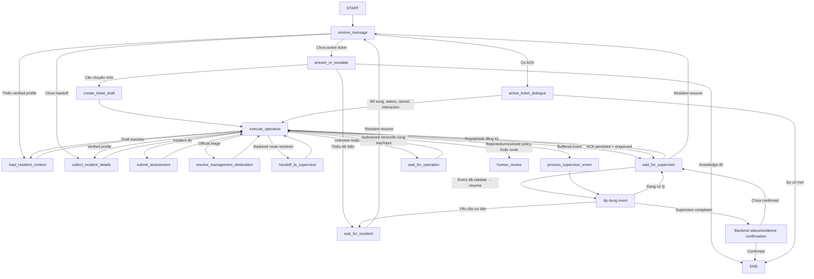

# Thiết kế graph Reception — Phan Dũng

Ngày 30/09/2026. Implementation hiện tại: `agent-reception/src/graph/workflow.py`.
Factory: `create_reception_workflow_factory`, consumer version `pd-workflow-python-1`.
`factory.py` giữ PD01/PD02 harness với marker `pd01-python-1`. Không tự migrate
checkpoint TypeScript. Xem [handoff chuyển Python](PYTHON_MIGRATION.md).

Các cạnh đi qua execute_operation biểu diễn plan đã checkpoint và projection output;
plan.after chọn node tiếp theo. Các node chỉ thực hiện business orchestration, không
tự xây HTTP client/auth/persistence/backend. Interrupt operation/resident/review là
khác Supervisor wait sau ACK. `process` trong sơ đồ là helper `_apply_event`, không node
LangGraph riêng; event resume được validate trước consume interrupt.

Hồ sơ chỉ từ verified backend; route từ ticket/backend scope. Model chỉ trích
intent/incident/facts customer_report hoặc agent_inference/interaction answers.
Không có model-supplied tool, tenant, workspace, file IDs hoặc official triage.
Active ticket không quay lại create draft. Unknown mutation không sinh key mới.
Supervisor completed gọi backend status, không tin customer_message để đóng ticket.

Chưa mount runtime production; request chốt contracts và integration ở
[PD03_PD08_INTEGRATION](../../requests/phan-dung/PD03_PD08_INTEGRATION.md).
Graph tests dùng LangGraph Python thật + synthetic ports + InMemorySaver trong tests;
không chứng minh durable storage, auth, actual event delivery hoặc hai replica.
