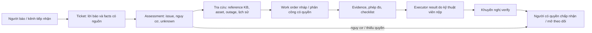

# Mockup dữ liệu Technical Agent A2 — 16 nhóm sự cố

Ngày cập nhật: 2026-10-07. Tất cả mã `SYN-*`, tình huống, thiết bị, số đo và trạng thái trong tài liệu này là **fixture giả lập**. Tài liệu mô tả dữ liệu để thiết kế giao diện, adapter và test. Nó không phải SOP, ticket hoặc quyết định nghiệm thu của Vinhomes.

## 1. Một hồ sơ kỹ thuật được nhìn như thế nào



Mỗi mũi tên là một quyết định có điều kiện. `issue_code` phân loại vấn đề; `severity`, `priority`, SLA và quyền duyệt do backend/policy thật xác định. Fixture giữ `applied_priority=null`, `policy_version=null`; không dùng mô tả của cư dân để tự tạo quyết định chính thức. `MOCK-PROC-*` ở trạng thái `draft`, nên `sop_kb.retrieve` không được trả nó như SOP published. `technical.verify_resolution` chỉ được gọi khi có executor result hợp lệ và cũng không tự đóng ticket.

## 2. Coverage sau khi bổ sung

| Nhóm | Mã | Hồ sơ lifecycle | Trọng tâm mockup |
| --- | --- | --- | --- |
| CB nhảy lặp | 01 | `SYN-T-001` | Nguy cơ cháy/điện, cô lập chỉ là request |
| Đèn/ổ/công tắc | 02 | `SYN-T-006` | Chiếu sáng lối thoát và phạm vi điện chung |
| Máy nước nóng | 03 | `SYN-T-007` | Nước gần điện, model và bảo hành |
| Máy lọc nước | 04 | `SYN-T-008` | Lưu lượng tách khỏi chất lượng nước uống |
| Điều hòa chảy nước | 05 | `SYN-T-002` | Asset, số đo mẫu, evidence trước/sau và result giả lập |
| Rò âm tường | 06 | `SYN-T-003` | Nguồn chưa rõ, quyền vào căn khác |
| Vách tắm rò | 07 | `SYN-T-009` | Kính/phụ kiện lỏng và thử kín nước |
| Bồn cầu rò | 08 | `SYN-T-010` | Hai triệu chứng trong bồn/ra sàn |
| Mùi cống | 09 | `SYN-T-011` | Phân biệt mùi cống, gas và ảnh hưởng sức khỏe |
| Nước yếu/thoát chậm/đầu nối | 10 | `SYN-T-012` | Ba nhánh chẩn đoán độc lập |
| Cửa/cửa sổ | 11 | `SYN-T-013` | Nguy cơ rơi và lối đi bên dưới |
| Tủ bếp xệ | 12 | `SYN-T-014` | Thân tủ/điểm neo khác lỗi cánh |
| Nứt tường/trần | 13 | `SYN-T-004` | Ảnh theo thời gian và đánh giá kết cấu |
| Sơn bong/ẩm | 14 | `SYN-T-015` | Nguồn ẩm trước lớp sơn |
| Sàn hỏng | 15 | `SYN-T-016` | Nguy cơ vấp/cạnh sắc và ẩm nền |
| Nước thải trào | 16 | `SYN-T-005` | Phơi nhiễm, vệ sinh và hậu kiểm |

Các ca 01, 05, 06, 13, 16 nằm trong `POC_LIFECYCLE.jsonl`; 11 ca còn lại nằm trong `ISSUE_LIFECYCLE_EXTENSION.jsonl`. Cả hai tập cùng tham chiếu 16 `PROCEDURE_PROFILES.jsonl`. Mỗi ca mới có ít nhất ba giả thuyết tách khỏi fact, ba loại evidence cần thu và ba biến thể lỗi. Chỉ `SYN-T-002` có result nộp **trong adapter giả lập**; các ca khác chưa nộp, vì vậy không gọi verify hay khẳng định hoàn tất.

## 3. Mockup màn hình tiếp nhận sự cố

```text
┌ Technical A2 / Tiếp nhận ──────────────────────────────────────────────────────┐
│ Ticket SYN-T-007 · Máy nước nóng rò · SYN-B-01 / SYN-U-07                      │
│ Lời báo gốc: “Máy nước nóng phòng tắm rỉ nước; có ổ điện gần đó.”               │
├─────────────────────────────────────────────────────────────────────────────────┤
│ Fact có nguồn                         Chưa xác minh                             │
│ water_leaking = true [cư dân, 10:12]  model / serial / điện có chạm nước?        │
│ near_electrical_outlet = true          bảo hành / owner của thiết bị             │
├─────────────────────────────────────────────────────────────────────────────────┤
│ Tín hiệu nguy cơ: nước gần điện  →  Chuyển người trực ngay                      │
│ Không hiển thị: mức ưu tiên/SLA tự suy, hướng dẫn mở máy, kết luận nguyên nhân  │
│ Việc tiếp theo: xác minh an toàn, model, owner và quyền khảo sát                │
└─────────────────────────────────────────────────────────────────────────────────┘
```

`facts` và `unknown_fields` phải hiển thị riêng. Người dùng được phép sửa/ghi nhận fact mới theo quyền, nhưng không được âm thầm đổi `unknown` thành `false`. Dấu hiệu nguy hiểm đưa sang luồng người trực ngay cả khi chưa có ảnh. `route` là gợi ý trong fixture, không phải quyết định policy V3.

## 4. Mockup màn hình điều phối / work order

```text
┌ Technical A2 / Điều phối ───────────────────────────────────────────────────────┐
│ Ticket SYN-T-010 · Bồn cầu chảy trong lòng + sàn ướt sau xả                     │
│ Asset: SYN-ASSET-08 / MOCK-TOILET-08 · Owner: unit-fixture                      │
│ Work order: draft · Assignment: chưa phân công                                 │
├─────────────────────────────────────────────────────────────────────────────────┤
│ Giả thuyết, đều chưa xác nhận: van/bộ xả; đầu nối cấp; chân bồn/đường thoát     │
│ Checklist theo triệu chứng: [ ] rò trong bồn [ ] rò ra sàn [ ] nước sạch/thải   │
│ SOP thật đúng model: CHƯA CÓ · Profile MOCK-PROC-08: draft                     │
│ Evidence trước: mô tả có, file chưa upload; evidence sau: đang chờ             │
│ Measurement: kế hoạch quan sát sau xả, chưa có value/measured_by                │
├─────────────────────────────────────────────────────────────────────────────────┤
│ Kết quả kỹ thuật viên: chưa nộp  · Verify: KHÔNG CHẠY · Ticket: đang mở          │
└─────────────────────────────────────────────────────────────────────────────────┘
```

`asset.read` có thể trả nhiều kết quả: giao diện phải yêu cầu chọn asset bằng người có quyền, không tự lấy kết quả đầu tiên. Work order nháp không đồng nghĩa đã phân công. Một request cô lập điện, hạn chế khu vực, vào căn hoặc gọi vendor ở trạng thái `PENDING_APPROVAL` không được hiển thị là việc đã thực hiện ngoài hiện trường.

## 5. Mockup màn hình chứng cứ và xác minh

```text
┌ Technical A2 / Rà soát kết quả ─────────────────────────────────────────────────┐
│ SYN-T-002 · Điều hòa chảy nước · result: simulated_submitted                     │
│ Before: SYN-EV-002-BEFORE · After: SYN-EV-002-AFTER                              │
│ Scan: simulated_clean (chỉ trạng thái adapter test; chưa có bytes/hash thật)    │
│ Measurement: drain_flow 1.2 L/min · 08:57Z · SYN-TECH-HVAC-02                    │
│ Checklist: DRAIN_TEST_RECORDED                                                   │
├─────────────────────────────────────────────────────────────────────────────────┤
│ SOP published đúng model: KHÔNG CÓ · Profile mock: draft                        │
│ Khuyến nghị: HUMAN_REVIEW · Người nghiệm thu: chưa có                            │
│ Ticket closed: false · Giá tham khảo: insufficient_data                         │
└─────────────────────────────────────────────────────────────────────────────────┘
```

Con số `1.2 L/min` chỉ dùng để test kiểu dữ liệu, unit và provenance. Nó không phải ngưỡng an toàn. `simulated_clean` không chứng minh có object storage hay file được quét thật. Muốn test submit/verify ở backend, phải seed file fixture và ACL vào test tenant cô lập. Người có quyền là người cuối cùng chấp nhận hoặc yêu cầu tiếp tục theo dõi.

## 6. Mockup 14 tool

`TOOL_BEHAVIOR_MOCKUP.jsonl` có một ca chính và ít nhất hai biến thể lỗi cho **mỗi tool** trong `server/src/technical-tools/catalog.ts`. Record chứa `request_mock.fields` dưới dạng mô tả dữ kiện, `expected.status`, tóm tắt dữ liệu và side effect. Đây là **behavioral mockup**, không phải payload JSON đủ schema để gửi thẳng tới API; cần adapter/test builder chuyển nó theo contract Zod của từng tool. Identity, tenant, role, trace và capability luôn đến từ runtime đã xác thực.

| Tool nhóm | Trạng thái chính được mock | Điểm cần kiểm |
| --- | --- | --- |
| SOP/asset/sensor/history | `NOT_FOUND`, `OK`, `STALE_DATA`, `OK` | Draft SOP không xuất hiện; asset đúng building; sensor stale/bad; lịch sử pending không là kết quả đã xác minh |
| Outage/schedule | `NOT_FOUND`, `OK` | Chỉ active đúng building; lịch notified tương lai không là outage hiện tại |
| Measurement/result/verify/history append | `OK`, `OK`, `OK` với `HUMAN_REVIEW`, `CONFLICT` | Chỉ test adapter cô lập; verify không đóng ticket; append chặn result chưa được chấp nhận |
| Isolation/restriction/entry/vendor | `PENDING_APPROVAL` | Chỉ request, không có hành động vật lý, quyền vào căn hoặc booking |

## 7. Cách dùng các file

`VERIFICATION_BRANCH_MOCKUP.jsonl` bổ sung 6 ca quyết định cho màn hình xác minh: chưa nộp result → `NOT_FOUND`; result đã nộp nhưng không có SOP published hợp lệ → `OK/HUMAN_REVIEW`; thiếu evidence hoặc evidence bị thu hồi → `OK/NEEDS_EVIDENCE`; checklist lỗi/số đo mâu thuẫn → `OK/HUMAN_REVIEW`; đủ check tự động với **SOP test đã seed riêng** → `OK/VERIFIED`. Vế trước dấu `/` là status envelope của tool, vế sau là khuyến nghị xác minh. Cả sáu ca giữ `real_ticket_closed=false`; ca `VERIFIED` không được dùng để nâng profile `draft` hoặc đóng ticket thật.

- **Embedding RAG test:** một file `../mock-corpus/01-vinhomes/quy-trinh-gia-lap-a2.md` vào KB/test tenant cô lập. Chunker tách passage theo heading 16 quy trình. `../corpus/01-vinhomes/cau-hoi-thuong-gap-a2.md` là nguồn tham khảo và ở KB khác.
- **Seed/adapter test:** `POC_LIFECYCLE.jsonl`, `ISSUE_LIFECYCLE_EXTENSION.jsonl`, `TOOL_DATA_FIXTURES.jsonl` và `TOOL_BEHAVIOR_MOCKUP.jsonl`; mapping schema cụ thể phải lấy từ code/backend, không nạp JSONL làm knowledge passage.
- **Agent/triage:** `SUPERVISION_CASES.jsonl` là 80 ca có nhãn; `MULTI_TURN_TRACES.jsonl` là 5 kịch bản điều phối nhiều lượt. Không dùng cùng nội dung target làm context retrieval khi chấm eval.
- **Q07/Q08:** `Q07_LEARNING_FLOW.jsonl` chỉ mô tả draft/rejected, `TOOL_DATA_FIXTURES.jsonl` có một chi phí draft bị loại khỏi giá. Chưa có self-help approved, cost verified hay price policy.

## 8. Dữ liệu thật vẫn cần trước vận hành

SOP và policy V3 đã duyệt theo tòa/model; ticket/work order có consent và khử PII; asset/CMMS và grant đúng building; file evidence có hash/scan; measurement của người/thiết bị thật; outcome, người nghiệm thu, lịch sử bảo trì được xác nhận; dữ liệu giá verified nếu mở chức năng giá. Tất cả fixture ở đây giữ `fixture_only`, không được đổi nhãn thành published để giả hoàn thành quy trình review.
