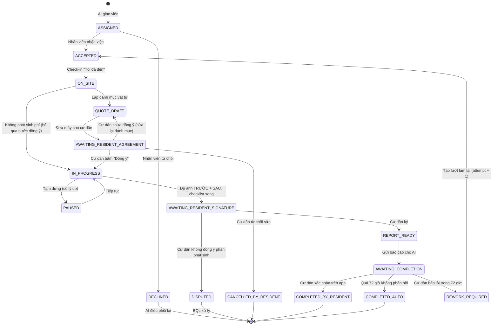

# Luồng nghiệp vụ nhân viên hiện trường (Staff Field Flow)

> **Trạng thái:** Đã chốt (v1.0, 2026-09-30)
> **Phạm vi:** Web/app dành cho nhân viên xử lý sự cố tại căn hộ cư dân (Kỹ thuật viên, Vệ sinh A5, Nhà thầu)
> **Đối tượng đọc:** Team Frontend, Backend, AI Platform
> **Không bao gồm:** Luồng tiếp nhận của cư dân, luồng AI đánh giá sự cố, luồng BQL/kế toán xử lý báo cáo. Tài liệu chỉ mô tả các điểm giao tiếp với những luồng đó.

---

## 1. Bối cảnh

Toàn bộ hệ thống có 5 bước. Tài liệu này mô tả bước ③ và ④:

```
① Cư dân gửi vấn đề
② AI Platform đánh giá (thay lễ tân) ─ nếu là sự cố ─► giao việc cho nhân viên
③ Nhân viên đến xử lý                       ◄── TÀI LIỆU NÀY
④ Nhân viên gửi báo cáo cho AI              ◄── TÀI LIỆU NÀY
⑤ AI Platform xử lý báo cáo (thay kế toán/BQL): hóa đơn, nghiệm thu, đóng ticket
```

**Nguyên tắc của luồng:**
1. Việc thỏa thuận diễn ra **trực tiếp tại nhà cư dân**, không đi qua AI. Nhân viên và cư dân bàn với nhau rồi làm ngay.
2. Cư dân **đồng ý danh mục trước khi sửa** (chỉ bấm nút) và **ký xác nhận sau khi sửa** (chữ ký tay). Cả hai thao tác đều thực hiện trên máy của nhân viên.
3. Nhân viên **gửi một báo cáo duy nhất** sau khi hoàn tất, không gửi báo cáo từng phần.
4. Việc chỉ được tính **Hoàn thành** khi: cư dân bấm xác nhận trên app, **hoặc** đã qua 72 giờ mà cư dân không phản hồi.

---

## 2. Tác nhân

| Tác nhân | Vai trò trong luồng |
|---|---|
| **Nhân viên** (STAFF_TECHNICAL, STAFF_SANITATION_A5, CONTRACTOR) | Người thực hiện chính. Dùng web/app trên điện thoại |
| **Cư dân** | Cầm máy của nhân viên ở 2 thời điểm: đồng ý danh mục và ký xác nhận. Sau đó xác nhận hoàn thành trên app cư dân |
| **AI Platform** | Giao việc (đầu vào) và nhận báo cáo (đầu ra). Theo dõi việc hết hạn 72 giờ |
| **Backend** | Lưu trạng thái, kiểm tra điều kiện chuyển trạng thái, lưu ảnh và chữ ký, chạy tác vụ tự động hoàn thành |
| **BQL** | Chỉ tham gia khi có ngoại lệ (tranh chấp phát sinh, cư dân từ chối) |

---

## 3. Luồng tổng quan

```
Nhận việc → Đến nơi → Bàn với cư dân cần sửa gì
   → Lập danh mục vật tư + chi phí
   → Đưa máy: cư dân đọc → bấm "Đồng ý" (không ký)
   → Sửa (ảnh TRƯỚC, checklist)
   → Chụp evidence SAU
   → Đưa máy: cư dân xem lại danh mục cuối → KÝ xác nhận
   → Gửi báo cáo cho AI
   → Hoàn thành: cư dân xác nhận trên app HOẶC sau 3 ngày không phản hồi
```



---

## 4. Chi tiết từng bước

Mỗi bước được mô tả theo cùng một khung: **Nhân viên làm gì**, **Giao diện**, **Điều kiện để sang bước sau**, **Dữ liệu Backend lưu**, **Sự kiện gửi AI**.

### Bước 1 – Nhận việc

- **Nhân viên:** nhận thông báo, xem chi tiết việc, bấm **Nhận việc** hoặc **Từ chối**.
- **Giao diện hiển thị:**
  - Mô tả của cư dân và ảnh cư dân đã gửi
  - Tóm tắt đánh giá của AI: loại sự cố, mức ưu tiên (P1–P4), nguyên nhân dự đoán
  - Địa chỉ (tòa, tầng, căn hộ), tên và số điện thoại cư dân (nút gọi)
  - Đồng hồ đếm ngược SLA
- **Từ chối:** bắt buộc chọn lý do: `BUSY` (đang bận việc khác), `WRONG_SKILL` (sai chuyên môn), `OFF_SHIFT` (hết ca), `OTHER` (kèm ghi chú).
- **Chuyển trạng thái:** `ASSIGNED → ACCEPTED` hoặc `ASSIGNED → DECLINED`.
- **Sự kiện gửi AI:** `job.accepted` / `job.declined`. Khi nhận `job.declined`, AI phải giao việc cho người khác.

### Bước 2 – Đến nơi

- **Nhân viên:** bấm **Tôi đã đến**.
- **Backend lưu:** `arrived_at`, dùng để tính SLA phản hồi.
- **Trường hợp cư dân không có nhà:** nhân viên bấm **Không gặp được cư dân**. Việc chuyển `PAUSED` với lý do `RESIDENT_ABSENT`, và AI liên hệ cư dân để hẹn lại lịch.
- **Chuyển trạng thái:** `ACCEPTED → ON_SITE`.
- **Sự kiện gửi AI:** `job.arrived`.

### Bước 3 – Bàn với cư dân cần sửa gì

- Diễn ra **ngoài hệ thống**: nhân viên kiểm tra thực tế và trao đổi trực tiếp với cư dân.
- Giao diện cho phép nhập **ghi chú chẩn đoán** (không bắt buộc, có hỗ trợ đọc giọng nói). Ghi chú này được gửi kèm báo cáo.
- Nếu **không cần vật tư và không tính phí** (chỉ kiểm tra hoặc điều chỉnh nhỏ), nhân viên chọn **Không phát sinh chi phí**. Luồng chuyển thẳng `ON_SITE → IN_PROGRESS`, bỏ qua Bước 4–5 và Bước 8.

### Bước 4 – Lập danh mục vật tư và chi phí

- **Nhân viên:** chọn vật tư từ danh mục chuẩn (có đơn giá sẵn). Nếu vật tư không có trong danh mục thì nhập tay. Nhập tiền công và thời gian bảo hành.
- **Giao diện:** tự tính thành tiền của từng dòng và tổng cộng.
- **Chuyển trạng thái:** `ON_SITE → QUOTE_DRAFT`.
- **Backend lưu:** `quote` phiên bản 1 (xem cấu trúc ở mục 5.2).

### Bước 5 – Cư dân đọc danh mục và bấm "Đồng ý"

- **Nhân viên:** bấm **Đưa máy cho cư dân**. Giao diện chuyển sang **Chế độ cư dân** (xem mục 6).
- **Cư dân:** đọc danh mục rồi chọn một trong ba nút:
  - **Đồng ý:** lưu `agreement`, chuyển `IN_PROGRESS`.
  - **Chưa đồng ý, cần sửa lại:** quay về `QUOTE_DRAFT` để nhân viên chỉnh danh mục.
  - **Không sửa nữa:** chuyển `CANCELLED_BY_RESIDENT`. Nhân viên chụp 1 ảnh hiện trạng rồi kết thúc.
- **Lưu ý:** bước này **không ký**, chỉ bấm nút. Backend vẫn lưu đầy đủ bằng chứng: thời điểm, snapshot danh mục, tổng tiền.
- **Sự kiện gửi AI:** `quote.agreed` (AI có thể nhắn xác nhận cho cư dân qua app).

### Bước 6 – Sửa chữa

- **Bắt buộc:** chụp **ít nhất 1 ảnh TRƯỚC** trước khi thao tác.
- **Checklist** theo loại việc (MEP, vệ sinh A5, thang máy…) do Backend cung cấp theo `domain_type`.
- **Phát sinh vật tư:** nhân viên bấm **Thêm vật tư phát sinh**. Dòng mới có `is_additional = true` và **bắt buộc có lý do**. Không cần cư dân đồng ý lại ở bước này; cư dân sẽ xem và ký ở Bước 8.
- **Tạm dừng:** bấm **Tạm dừng** và chọn lý do: `WAITING_PARTS` (cần đặt vật tư), `RESIDENT_ABSENT`, `NEED_SUPPORT` (cần thêm người hoặc chuyên môn khác), `OTHER`. Trạng thái chuyển `PAUSED`, và AI nhận sự kiện `job.paused`.

### Bước 7 – Chụp evidence SAU

- **Bắt buộc:** **ít nhất 1 ảnh SAU**.
- Ảnh phải **chụp trực tiếp bằng camera** trong app, không được chọn từ thư viện. Mỗi ảnh gắn `captured_at` và `capture_phase`.
- **Điều kiện để sang Bước 8** (giao diện khóa nút cho đến khi đủ):
  - [ ] Có ≥ 1 ảnh `BEFORE`
  - [ ] Có ≥ 1 ảnh `AFTER`
  - [ ] Checklist đã tick hết
  - [ ] Mọi dòng phát sinh đều có lý do

### Bước 8 – Cư dân xem danh mục cuối và KÝ xác nhận

- **Nhân viên:** bấm **Đưa máy cho cư dân ký**.
- **Màn hình cư dân** hiển thị tách bạch hai phần:
  ```
  Đã thống nhất trước khi sửa ........ 650.000đ
  Phát sinh trong khi sửa ............ +180.000đ
    • Van khóa DN15 x1 – Lý do: van cũ bị gỉ, không khóa được
  ─────────────────────────────────────────────
  TỔNG CỘNG .......................... 830.000đ
  Bảo hành: 6 tháng
  ```
  Kèm theo là ảnh TRƯỚC và SAU (dạng thumbnail) và ô ký tay.
- **Cư dân chọn:**
  - **Ký xác nhận:** chuyển `REPORT_READY`. Chỉ lưu được khi ô ký không trống.
  - **Không đồng ý phần phát sinh:** chuyển `DISPUTED`. Nhân viên nhập ghi chú, và BQL xử lý. Nhân viên **không tự tranh cãi** với cư dân.
- **Việc không phát sinh phí:** vẫn ký, để xác nhận nhân viên đã đến làm. Màn hình chỉ hiện ảnh và dòng "Không phát sinh chi phí".
- **Ý nghĩa của chữ ký:** xác nhận **khối lượng và chi phí**, **không phải** xác nhận chất lượng. Chất lượng được xác nhận ở Bước 10.

### Bước 9 – Gửi báo cáo cho AI

- **Nhân viên:** xem màn hình tóm tắt rồi bấm **Gửi báo cáo**.
- **Backend:** đóng gói báo cáo (mục 5.4), chuyển `AWAITING_COMPLETION` và đặt `auto_complete_at = submitted_at + 72h`.
- **Sự kiện gửi AI:** `report.submitted` kèm toàn bộ báo cáo. AI dùng báo cáo để lập hóa đơn và gửi thông báo "Vui lòng xác nhận hoàn thành" cho cư dân.
- Sau khi gửi, **nhân viên không sửa được báo cáo** nữa (bất biến).

### Bước 10 – Hoàn thành

Có ba khả năng:

| Trường hợp | Điều kiện | Trạng thái | Ai thực hiện |
|---|---|---|---|
| Cư dân xác nhận | Cư dân bấm "Đã hoàn thành" trên app cư dân | `COMPLETED_BY_RESIDENT` | App cư dân → Backend |
| Tự động | Đến `auto_complete_at` mà không có phản hồi hoặc báo lỗi | `COMPLETED_AUTO` | Tác vụ định kỳ của Backend |
| Báo lỗi | Cư dân báo lỗi **trong** 72 giờ | `REWORK_REQUIRED` | App cư dân → AI → Backend |

- **Làm lại:** tạo lượt mới với `attempt_no + 1`, `rework_of = <job_id cũ>`, giao lại cho **cùng nhân viên** (mặc định). Luồng bắt đầu lại từ Bước 1. Nếu làm lại không phát sinh vật tư mới thì không tính phí.
- **Báo lỗi sau 72 giờ:** tạo **ticket mới** (bảo hành), không mở lại việc cũ.
- **Giao diện nhân viên:** tab "Chờ cư dân xác nhận" hiển thị đếm ngược *"Tự động hoàn thành sau 2 ngày 5 giờ"*. Khi hoàn thành, nhãn ghi rõ là *cư dân xác nhận* hay *tự động*.

---

## 5. Dữ liệu (đề xuất cho Backend)

### 5.1 Job (phiếu công việc của nhân viên)

```ts
interface FieldJob {
  id: string;
  incident_id: string;              // ticket gốc do AI tạo
  assignee_id: string;
  assignee_type: 'STAFF' | 'CONTRACTOR';
  status: FieldJobStatus;           // xem mục 3
  attempt_no: number;               // 1, 2, 3… khi làm lại
  rework_of: string | null;
  priority: 'P1' | 'P2' | 'P3' | 'P4';
  sla_due_at: string;
  accepted_at: string | null;
  arrived_at: string | null;
  started_at: string | null;
  submitted_at: string | null;
  auto_complete_at: string | null;  // submitted_at + 72h
  completed_at: string | null;
  completion_type: 'RESIDENT_CONFIRMED' | 'AUTO_72H' | null;
  no_charge: boolean;               // true = bỏ qua báo giá
  pause_reason: PauseReason | null;
  diagnosis_note: string | null;
  version: number;                  // optimistic locking
}
```

### 5.2 Quote (danh mục vật tư và chi phí)

```ts
interface QuoteLine {
  id: string;
  material_code: string | null;     // null nếu nhập tay
  name: string;
  quantity: number;
  unit: string;
  unit_price: number;               // VND
  amount: number;                   // quantity * unit_price
  is_additional: boolean;           // true = phát sinh trong lúc sửa
  additional_reason: string | null; // bắt buộc khi is_additional = true
}

interface Quote {
  job_id: string;
  lines: QuoteLine[];
  labor_cost: number;
  warranty_months: number;
  agreed_total: number;             // tổng lúc cư dân bấm "Đồng ý"
  additional_total: number;         // tổng các dòng phát sinh
  final_total: number;              // agreed_total + additional_total
}
```

### 5.3 Bằng chứng xác nhận của cư dân

```ts
interface ResidentAgreement {       // Bước 5 – bấm nút
  job_id: string;
  quote_snapshot: QuoteLine[];      // bản sao danh mục tại thời điểm đồng ý
  total: number;
  agreed_at: string;
  device_id: string;
}

interface ResidentSignature {       // Bước 8 – ký tay
  job_id: string;
  quote_snapshot: QuoteLine[];      // danh mục cuối cùng
  final_total: number;
  signature_image_url: string;      // PNG, nền trong suốt
  signer_name: string | null;       // không bắt buộc
  signed_at: string;
  device_id: string;
  checksum_sha256: string;          // hash(snapshot + ảnh chữ ký), chống sửa đổi
}
```

### 5.4 Báo cáo gửi AI (payload của `report.submitted`)

```json
{
  "job_id": "JOB-2026-0412",
  "incident_id": "INC-2026-318",
  "attempt_no": 1,
  "assignee": { "id": "usr-tech-01", "name": "Nguyễn Văn Hùng", "type": "STAFF" },
  "timeline": {
    "accepted_at": "…", "arrived_at": "…", "started_at": "…", "submitted_at": "…"
  },
  "diagnosis_note": "Van cấp nước bồn cầu bị gỉ, rò rỉ ở khớp nối",
  "no_charge": false,
  "quote": { "lines": [], "labor_cost": 200000, "agreed_total": 650000, "additional_total": 180000, "final_total": 830000, "warranty_months": 6 },
  "resident_agreement": { "agreed_at": "…", "total": 650000 },
  "resident_signature": { "signed_at": "…", "signature_image_url": "…", "checksum_sha256": "…" },
  "evidence": [
    { "phase": "BEFORE", "url": "…", "captured_at": "…" },
    { "phase": "AFTER",  "url": "…", "captured_at": "…" }
  ],
  "checklist": [{ "id": "…", "label": "…", "done": true }],
  "auto_complete_at": "…"
}
```

---

## 6. Chế độ cư dân (Resident Handover Mode)

Đây là màn hình hiển thị khi nhân viên đưa máy cho cư dân (Bước 5 và Bước 8). Yêu cầu:

- **Toàn màn hình**, ẩn toàn bộ menu và nút điều hướng của app nhân viên. Cư dân không thể bấm sang phần khác.
- **Chữ lớn** (tối thiểu 18px), độ tương phản cao, vì người dùng có thể là người lớn tuổi.
- **Chỉ hiển thị** thông tin cư dân cần biết: tình trạng hư hỏng, danh mục, tổng tiền, bảo hành. Không hiện mã nội bộ, ID hay SLA.
- **Ô ký** (chỉ ở Bước 8) chiếm tối thiểu 40% chiều cao màn hình, có nút **Ký lại**.
- Sau khi cư dân thao tác xong, hiện màn hình **"Cảm ơn quý cư dân, vui lòng trả máy cho nhân viên"**. Nhân viên phải bấm giữ khoảng 1 giây để thoát, tránh cư dân bấm nhầm.

---

## 7. Quy tắc kiểm tra (Backend bắt buộc kiểm tra, không chỉ dựa vào giao diện)

| # | Quy tắc | Áp dụng khi |
|---|---|---|
| R1 | Chỉ người được giao (`assignee_id`) hoặc đúng tổ chức nhà thầu mới được thao tác | Mọi thao tác |
| R2 | Phải có `agreement` trước khi chuyển `IN_PROGRESS` (trừ khi `no_charge = true`) | Bước 5 → 6 |
| R3 | Phải có ≥ 1 ảnh `BEFORE` trước khi thêm ảnh `AFTER` | Bước 6 – 7 |
| R4 | Phải có ≥ 1 `BEFORE`, ≥ 1 `AFTER`, checklist đã tick hết | Chuyển sang `AWAITING_RESIDENT_SIGNATURE` |
| R5 | Dòng `is_additional = true` bắt buộc có `additional_reason` | Lưu quote |
| R6 | Chữ ký không được trống, và `quote_snapshot` phải khớp quote hiện tại | Bước 8 |
| R7 | Báo cáo, chữ ký và agreement là **bất biến** sau khi gửi | Sau Bước 9 |
| R8 | Chỉ nhận báo lỗi của cư dân khi `now < auto_complete_at` | Bước 10 |
| R9 | Tác vụ tự động hoàn thành phải idempotent: chỉ chạy với job đang `AWAITING_COMPLETION` | Bước 10 |
| R10 | Tạm dừng bắt buộc có `pause_reason` | Mọi lúc |

---

## 8. Danh sách sự kiện (Backend ↔ AI Platform)

| Sự kiện | Chiều | Khi nào | AI cần làm gì |
|---|---|---|---|
| `job.assigned` | AI → BE | AI giao việc | – |
| `job.accepted` | BE → AI | Bước 1 | Báo cư dân "Nhân viên đang đến" |
| `job.declined` | BE → AI | Bước 1 | Giao việc cho người khác |
| `job.arrived` | BE → AI | Bước 2 | Cập nhật tiến độ cho cư dân |
| `quote.agreed` | BE → AI | Bước 5 | Lưu làm cơ sở tính phí |
| `job.paused` / `job.resumed` | BE → AI | Bước 6 | Nếu `RESIDENT_ABSENT` thì hẹn lại lịch; nếu `WAITING_PARTS` thì báo cư dân thời gian dự kiến |
| `job.cancelled_by_resident` | BE → AI | Bước 5 | Đóng ticket, ghi lý do |
| `job.disputed` | BE → AI | Bước 8 | Chuyển BQL xử lý |
| `report.submitted` | BE → AI | Bước 9 | Lập hóa đơn, gửi cư dân yêu cầu xác nhận hoàn thành |
| `resident.confirmed` | App cư dân → BE | Bước 10 | Đóng ticket |
| `resident.reported_issue` | App cư dân → AI → BE | Bước 10 | Đánh giá lỗi, yêu cầu Backend tạo lượt làm lại |
| `job.auto_completed` | BE → AI | Bước 10 | Đóng ticket, ghi chú "tự động hoàn thành" |

---

## 9. Các trường hợp ngoại lệ

| Tình huống | Xử lý |
|---|---|
| Cư dân không có nhà | `PAUSED / RESIDENT_ABSENT`, AI hẹn lại lịch |
| Không có sẵn vật tư | `PAUSED / WAITING_PARTS`. Khi quay lại, tiếp tục từ `IN_PROGRESS`, không cần đồng ý lại (trừ khi danh mục thay đổi) |
| Cư dân không đồng ý danh mục | Nhân viên chỉnh lại, hoặc cư dân chọn "Không sửa nữa" → `CANCELLED_BY_RESIDENT` |
| Cư dân không đồng ý phần phát sinh | `DISPUTED`, BQL xử lý |
| Mất mạng khi đang làm | Giao diện lưu nháp (ảnh, checklist, chữ ký) trên máy và đồng bộ khi có mạng. Chữ ký giữ nguyên `signed_at` là thời điểm ký thực tế |
| Nhân viên bấm nhầm "Gửi báo cáo" | Không hoàn tác được (R7). Nếu sai sót, BQL xử lý thủ công |
| Khu vực chung (không có cư dân) | *Chưa chốt – xem mục 10* |

---

## 10. Vấn đề còn mở

| # | Câu hỏi | Người quyết định |
|---|---|---|
| Q1 | Việc ở khu vực chung (hành lang, sảnh, thang máy) thì ai ký thay cư dân, hay bỏ qua bước ký? | Nghiệp vụ / BQL |
| Q2 | Có ngưỡng tiền nào mà dù cư dân đã đồng ý vẫn phải chờ BQL duyệt không? | Nghiệp vụ / BQL |
| Q3 | Việc làm lại có bắt buộc giao cho cùng nhân viên không? | Nghiệp vụ |
| Q4 | Mốc 72 giờ tính theo giờ thực hay theo ngày làm việc (trừ lễ, Tết)? | Nghiệp vụ |
| Q5 | Danh mục vật tư chuẩn và đơn giá do ai quản lý, cập nhật ở đâu? | Backend / BQL |
| Q6 | Ảnh chữ ký lưu ở đâu, thời gian lưu trữ bao lâu (phục vụ tranh chấp)? | Backend |

---

## 11. Phạm vi Frontend

| Màn hình | Thuộc bước |
|---|---|
| Danh sách "Việc của tôi" (tab Mới giao / Đang làm / Chờ xác nhận) | 1, 10 |
| Chi tiết việc dạng stepper (Nhận → Đến nơi → Thực hiện → Báo cáo) | 1–9 |
| Lập danh mục vật tư | 4, 6 |
| Chế độ cư dân: Đồng ý | 5 |
| Chụp ảnh và checklist | 6, 7 |
| Chế độ cư dân: Ký xác nhận | 8 |
| Tóm tắt và gửi báo cáo | 9 |
| Lịch sử | – |

Frontend dùng dữ liệu mock (`app/src/features/vinhomes-operations/mock/`) cho đến khi Backend có API theo mục 5 và mục 8.

---

## 12. Luồng nhân viên vệ sinh A5 (CLEANING)

> Đã chốt v1.0 (2026-09-30). Áp dụng cho task có `domain_type` là `SANITATION` hoặc `LANDSCAPE`.

### 12.1 Bối cảnh

Ví dụ: trời mưa, người đi lại làm bẩn và trơn sàn sảnh. Cư dân báo qua app cư dân → Ticket → AI Platform giao việc cho nhân viên vệ sinh.

So với luồng kỹ thuật viên, luồng vệ sinh **không có** danh mục vật tư, không có bước cư dân đồng ý hay ký tên, và không có thời gian chờ 72 giờ. Việc được tính hoàn thành ngay khi nhân viên gửi.

### 12.2 Luồng

```
Nhận việc → Đến nơi
   → Chụp ảnh TRƯỚC
   → Đặt biển cảnh báo sàn ướt (chỉ với việc làm ướt sàn)
   → Lau / làm sạch
   → Chụp ảnh SAU
   → Hoàn thành
   → AI báo cư dân: "Đã làm sạch, sàn đang ướt, vui lòng đi cẩn thận"
```

- Các bước phải làm **đúng thứ tự**. Biển cảnh báo phải được đặt **trước khi lau**, vì sàn bắt đầu ướt ngay lúc lau.
- Nhân viên tự thu biển khi sàn khô. Hệ thống **không theo dõi** việc thu biển.
- Việc cần biển cảnh báo (`sign_required = true`): `issueType` là `SPILL` hoặc `STAIN_REMOVAL`, hoặc kế hoạch làm sạch có bước `MOP_FLOOR`, `PRESSURE_WASH` hoặc `DEEP_CLEAN`. Các việc khác, như thu gom rác hay cắt tỉa cây, bỏ qua bước này.

### 12.3 Trạng thái

```
ASSIGNED → ACCEPTED → (check-in) IN_PROGRESS → DONE
                         ⇅ PAUSED
ASSIGNED → DECLINED
```

| Trạng thái | WO status tương ứng |
|---|---|
| ASSIGNED, ACCEPTED | ASSIGNED |
| IN_PROGRESS | IN_PROGRESS |
| PAUSED | BLOCKED |
| DONE | COMPLETED |
| DECLINED | CANCELLED |

Lý do tạm dừng: `MISSING_SUPPLIES` (thiếu hóa chất/dụng cụ), `AREA_OCCUPIED` (khu vực đang có người), `NEED_SUPPORT`, `OTHER` (bắt buộc ghi chú).

### 12.4 Dữ liệu bổ sung trên `FieldFlow`

```ts
kind: 'CLEANING';
sign_required: boolean;
sign_placed_at: string | null;   // thời điểm đặt biển
cleaned_at: string | null;       // thời điểm xác nhận đã làm sạch
report_final_note: string;       // ghi chú (không bắt buộc)
```

### 12.5 Quy tắc Backend bắt buộc kiểm tra

| # | Quy tắc |
|---|---|
| C1 | Chỉ được đặt biển sau khi đã có ≥ 1 ảnh `BEFORE` |
| C2 | Chỉ được xác nhận "đã làm sạch" sau khi có ảnh `BEFORE`, và đã đặt biển nếu `sign_required` |
| C3 | Chỉ được chụp ảnh `AFTER` sau khi đã xác nhận làm sạch (giao diện bắt buộc) |
| C4 | Chỉ được `DONE` khi có đủ: ảnh `BEFORE`, biển cảnh báo (nếu cần), `cleaned_at`, ảnh `AFTER` |

### 12.6 Sự kiện gửi AI

| Sự kiện | Khi nào | AI cần làm gì |
|---|---|---|
| `job.accepted` / `job.declined` / `job.arrived` / `job.paused` | Như luồng kỹ thuật viên | Như luồng kỹ thuật viên |
| `cleaning.completed` | Nhân viên bấm Hoàn thành | Báo cư dân đã làm sạch, kèm cảnh báo sàn ướt nếu `sign_required`. Đóng ticket |

Payload của `cleaning.completed` gồm: `job_id`, `incident_id`, `sign_required`, `sign_placed_at`, `cleaned_at`, `evidence[]` (BEFORE/AFTER), `note`.

---

## 13. Luồng nhân viên an ninh (SECURITY)

> Đã chốt v1.0 (2026-09-30). Áp dụng cho task có `domain_type = 'SECURITY'` phát sinh từ phản ánh của cư dân.
> Công việc tuần tra, lập biên bản chủ động và bàn giao ca vẫn nằm ở mục "An ninh", không thuộc luồng này.

### 13.1 Bối cảnh

Ví dụ: căn hàng xóm hát karaoke to sau 22h. Cư dân chat trên app cư dân → AI Platform → giao việc cho nhân viên an ninh.

### 13.2 Luồng

```
Nhận việc → Đến nơi
   → Chụp ảnh hiện trường (BẮT BUỘC)
   → Gõ cửa, nhắc nhở hộ bị phản ánh (LUÔN phải gặp, không có nhánh "đã hết ồn")
   → Kết quả:
        ├─ Hợp tác, đã giảm ồn  → Hoàn thành
        ├─ Không mở cửa         → Hoàn thành (AI theo dõi; nếu bị phản ánh tiếp thì chuyển BQL)
        └─ Không hợp tác        → Ghi chú diễn biến (bắt buộc) → Hoàn thành, AI chuyển BQL
   → AI báo người phản ánh: "An ninh đã nhắc nhở hộ gây ồn"
```

Các nguyên tắc:
- **Ẩn danh người phản ánh.** API giao việc cho nhân viên **không được** trả về tên, căn hộ hay số điện thoại của người phản ánh. Chỉ trả về căn bị phản ánh.
- **Ảnh bắt buộc**, lưu với `capture_phase = 'OTHER'`. Giao diện nhắc nhân viên không chụp mặt người và không chụp vào trong căn hộ.
- **Không có** giấy nhắc nhở và **không có** nút hỗ trợ khẩn trong app.
- **Hiển thị số lần tái diễn:** số phản ánh cùng loại tại cùng căn trong 7 ngày gần nhất. Backend hoặc AI nên trả sẵn trường `repeat_count_7d`. Frontend hiện đang tự đếm trên mock.

### 13.3 Trạng thái

Giống luồng vệ sinh: `ASSIGNED → ACCEPTED → IN_PROGRESS (⇅ PAUSED) → DONE`, và có thể `DECLINED`.
Lý do tạm dừng: `NEED_SUPPORT`, `OTHER` (bắt buộc ghi chú).

### 13.4 Dữ liệu bổ sung trên `FieldFlow`

```ts
kind: 'SECURITY';
security_outcome: 'COOPERATED' | 'NO_ANSWER' | 'UNCOOPERATIVE' | null;
report_final_note: string;   // bắt buộc khi UNCOOPERATIVE
```

### 13.5 Quy tắc Backend bắt buộc kiểm tra

| # | Quy tắc |
|---|---|
| S1 | Chỉ được `DONE` khi có ≥ 1 ảnh `OTHER` và đã chọn `security_outcome` |
| S2 | `UNCOOPERATIVE` bắt buộc có `report_final_note` |
| S3 | Không bao giờ trả danh tính người phản ánh trong API dành cho nhân viên |

### 13.6 Sự kiện gửi AI

| Sự kiện | AI cần làm gì |
|---|---|
| `security.completed` với `COOPERATED` | Báo người phản ánh: đã nhắc nhở. Đóng ticket |
| `security.completed` với `NO_ANSWER` | Báo người phản ánh. Đánh dấu căn; nếu bị phản ánh tiếp trong 7 ngày thì chuyển BQL |
| `security.completed` với `UNCOOPERATIVE` | Báo người phản ánh là đã chuyển BQL. Tạo việc cho BQL, kèm ghi chú và ảnh |

Payload gồm: `job_id`, `incident_id`, `target_apartment`, `security_outcome`, `note`, `evidence[]`, `arrived_at`, `completed_at`.

---

## 14. Sự cố cần nhà thầu (không đi qua app nhân viên)

> Đã chốt v1.0 (2026-09-30).

### 14.1 Luồng

Ví dụ: trần hành lang chung bị nứt, thang máy hỏng. Đây là việc ở khu vực chung, cần đơn vị bên ngoài có chuyên môn.

```
Cư dân phản ánh trên app → AI Platform phân loại: cần nhà thầu
   → Chuyển ticket cho BQL (kèm gợi ý bảo hành, xem 14.3)
   → BQL tự liên hệ nhà thầu (email / Zalo / điện thoại) theo hợp đồng hoặc bảo hành
   → BQL cập nhật tiến độ trên màn hình BQL → AI báo cư dân
```

- **Nhà thầu không dùng app nhân viên.** Họ là đơn vị bên ngoài, không cấp tài khoản nội bộ. Vai trò `CONTRACTOR` đã bị gỡ khỏi danh sách chọn vai trò.
- **Không thu phí cư dân** vì đây là khu vực chung. Chi phí do BQL chi trả theo hợp đồng.

### 14.2 Yêu cầu tối thiểu cho màn hình BQL (thuộc team BQL, không thuộc app nhân viên)

Nếu thiếu hai trạng thái dưới đây, cư dân sẽ không bao giờ nhận được phản hồi và ticket không bao giờ được đóng.

| Nút | Dữ liệu | AI làm gì |
|---|---|---|
| **Đã liên hệ nhà thầu** | tên nhà thầu, ngày hẹn dự kiến, bảo hành hay có phí | Báo cư dân: "Đã có đơn vị xử lý, dự kiến ngày …" |
| **Đã khắc phục xong** | ghi chú, ảnh (tùy chọn) | Báo cư dân đã khắc phục, đóng ticket |

### 14.3 Gợi ý bảo hành (AI, dựa trên hồ sơ thiết bị)

Khi chuyển ticket cho BQL, AI tra hồ sơ thiết bị/hạng mục (đơn vị lắp đặt, hạn bảo hành, hợp đồng bảo trì):
- **Còn bảo hành:** gợi ý gọi đúng nhà thầu đã lắp đặt. Không thuê đơn vị khác, vì phát sinh chi phí và có thể làm mất quyền bảo hành.
- **Hết bảo hành:** BQL tự chọn nhà thầu và duyệt chi phí.

Backend cần có **asset registry** (hồ sơ thiết bị) để AI tra cứu.

### 14.4 Ghi chú kỹ thuật

- File `contractor-workspace.tsx` và dữ liệu mock của nhà thầu **vẫn được giữ lại**. Màn hình Supervisor, Manager và QC vẫn đọc các phiếu có `executor_type = 'CONTRACTOR'`.
- Manager vẫn truy cập được menu "Công việc nhà thầu" để theo dõi các phiếu cũ.

---

## 15. Vai trò trong hệ thống (sau khi gộp)

> Đã chốt v1.0 (2026-09-30).

| Vai trò | Dùng để làm gì |
|---|---|
| Kỹ thuật viên (`STAFF_TECHNICAL`) | Luồng REPAIR: mục 1–11 |
| Nhân viên vệ sinh (`STAFF_SANITATION_A5`) | Luồng CLEANING: mục 12 |
| Nhân viên an ninh (`STAFF_SECURITY`) | Luồng SECURITY (mục 13) + tuần tra, biên bản, bàn giao ca |
| **Ban quản lý** (`MANAGER`) | Gộp từ Trưởng nhóm/Giám sát, Nghiệm thu (QC) và BQL cũ |

**Đã gỡ khỏi danh sách chọn vai trò:**
- `CONTRACTOR`: xem mục 14.
- `SUPERVISOR`: AI đã thay việc phân công. Việc theo dõi tiến độ chuyển cho BQL.
- `QC_INSPECTOR`: việc nghiệm thu chính giờ do cư dân xác nhận hoặc tự hoàn thành sau 72h. BQL có quyền `canQC` để chấm các phiếu QC cũ còn tồn.

Các giá trị này vẫn còn trong type và dữ liệu cũ (ví dụ `checked_by: 'usr-qc-01'`), nên Backend chưa cần migrate dữ liệu.

**Đánh đổi đã chấp nhận:** BQL vừa duyệt chi phí vừa có quyền nghiệm thu, tức là mất kiểm định độc lập. Quy tắc "người trực tiếp thi công không được tự nghiệm thu" vẫn được giữ. Nếu quy định công ty yêu cầu QC độc lập, có thể tách `canQC` thành một quyền riêng cho một số tài khoản BQL, không cần tạo lại vai trò.

**Quyền của BQL:** Tổng quan, Tiếp nhận phản ánh, Quản lý sự cố, Phân công, Phiếu thi công, Nghiệm thu, Phê duyệt chi phí, Vệ sinh, An ninh, Công việc nhà thầu. **Không có** "Việc của tôi"; truy cập route này sẽ được chuyển về trang Tổng quan.

---

## 16. Màn hình "Phản ánh & Sự cố" của BQL

> Đã chốt v1.0 (2026-09-30). Gộp "Tiếp nhận phản ánh" và "Quản lý sự cố". Route `/operations/triage` chuyển hướng sang `/operations/incidents`.

AI thay lễ tân tiếp nhận và giao việc, nên BQL **chỉ xử lý ngoại lệ**. Màn hình có 3 tab:

| Tab | Nội dung |
|---|---|
| **Cần BQL xử lý** | Hộp việc gom các mục AI chuyển lên (bảng dưới) |
| **Đang xử lý** | Sự cố chưa đóng. BQL chỉ theo dõi |
| **Đã đóng** | Lịch sử |

### Các mục trong hộp việc

| Loại | Điều kiện xuất hiện | BQL làm gì |
|---|---|---|
| AI cần BQL xác nhận | Phản ánh `DETECTED` / `NEEDS_CLARIFICATION` / `READY`, chưa thành sự cố | Xác nhận tạo sự cố, hoặc gộp vào phản ánh trùng |
| Cần nhà thầu | `incident.contractor_handoff.status` ≠ `RESOLVED` | "Đã liên hệ nhà thầu" (tên + ngày hẹn) → "Đã khắc phục xong" (đóng sự cố). Kèm gợi ý bảo hành của AI |
| Cư dân tranh chấp chi phí | Phiếu kỹ thuật viên ở `DISPUTED` | Ghi cách xử lý → đóng sự cố |
| Hộ không hợp tác | Phiếu an ninh `DONE` + `security_outcome = UNCOOPERATIVE` | Ghi cách xử lý → đóng sự cố |

Sắp xếp theo mức độ (P1 trước), rồi theo thời gian.

### Dữ liệu bổ sung trên `VhIncident`

```ts
contractor_handoff?: {
  status: 'PENDING' | 'CONTACTED' | 'RESOLVED';
  warranty: { under_warranty: boolean; contractor_name: string | null; expires_at: string | null } | null; // AI gợi ý
  contractor_name: string | null;
  eta: string | null;          // ngày hẹn
  contacted_at: string | null;
  resolved_at: string | null;
  note: string | null;
};
bql_resolution_note?: string;  // bắt buộc khi BQL tự đóng một ngoại lệ
```

### Điều kiện đóng sự cố (dùng chung)

Hàm `getIncidentClosureBlocker` được dùng cho **cả** nút "Báo cáo hoàn thành sự cố" **và** nút đóng hồ sơ trong phiên điều phối. Trước đây nút đóng hồ sơ bỏ qua toàn bộ kiểm tra; lỗi này đã được sửa.

Với mỗi nhiệm vụ của sự cố, xét phiếu của lượt làm mới nhất:
- Phiếu theo luồng mới: phải ở `DONE`, `COMPLETED_BY_RESIDENT`, `COMPLETED_AUTO` hoặc `CANCELLED_BY_RESIDENT`.
- Phiếu cũ: nhiệm vụ `DONE`, phiếu `COMPLETED` và có QC `PASS`.
- Không còn đề xuất chi phí `PENDING`.

Riêng nút đóng hồ sơ phiên điều phối còn yêu cầu thêm: người thao tác là BQL, và phiên đang ở `RESIDENT_CONFIRMED`.

**Ngoại lệ:** "Đã xử lý, đóng sự cố" trong hộp việc là quyết định trực tiếp của BQL nên không áp các điều kiện trên, nhưng **bắt buộc** có `bql_resolution_note`.

**Việc cho Backend/AI:** khi mọi phiếu của một sự cố đã hoàn thành, AI nên **tự đóng** sự cố. Hiện frontend chưa tự đóng, nên sự cố vẫn nằm ở tab "Đang xử lý" cho tới khi BQL bấm "Báo cáo hoàn thành sự cố".
