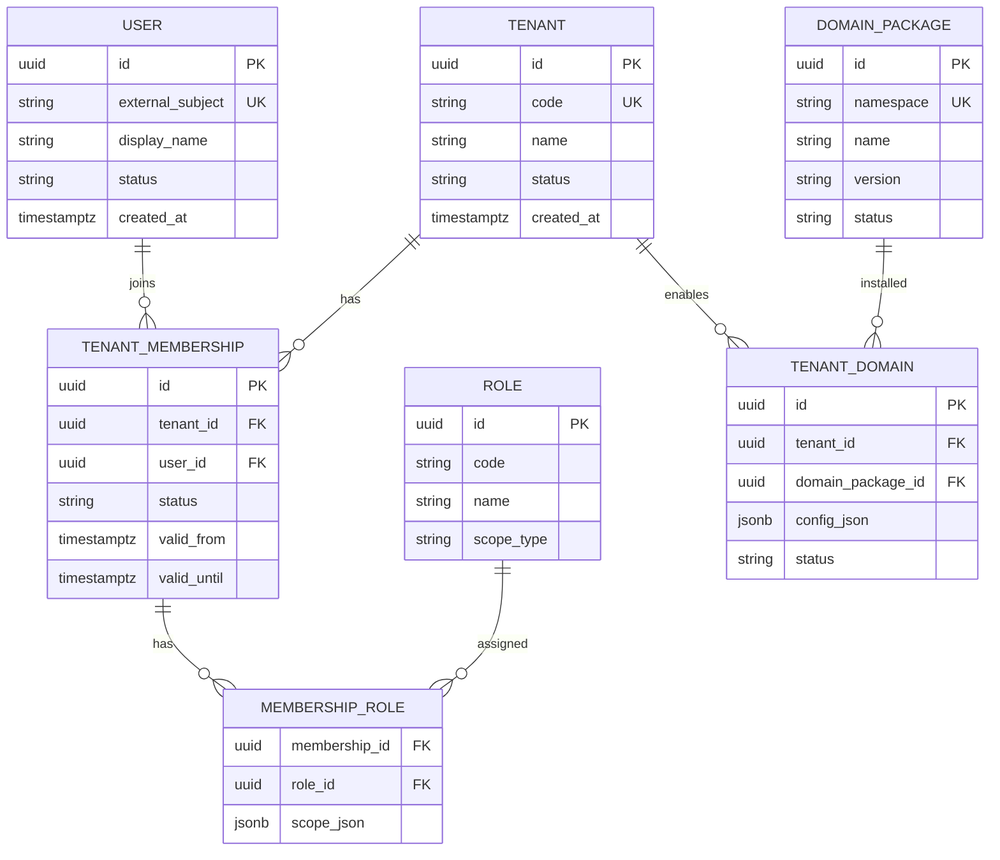
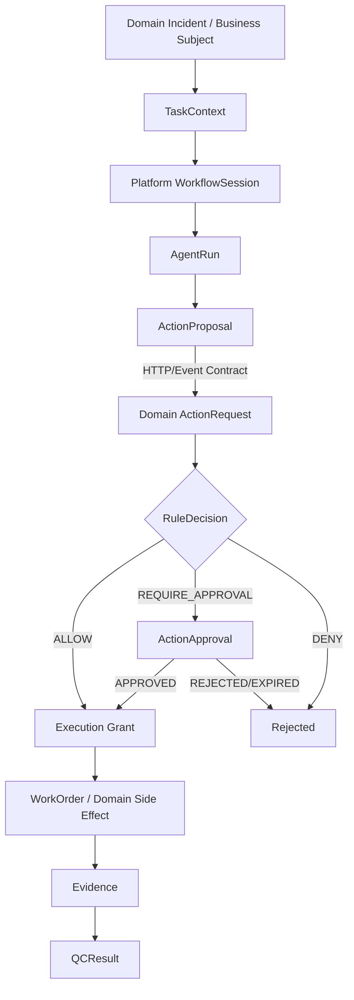
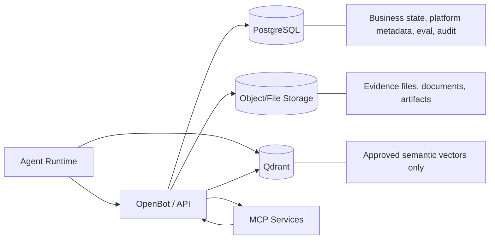

# 01 — System ERD Complete
## AI Platform + Domain Architecture

**Status:** Proposed architecture freeze v1.0  
**Scope:** Generic AI Platform + pluggable business domains, with Vinhomes as the first domain package.

## 1. Architectural decision

The system is split into three logical boundaries:

1. **Shared Kernel** — identity, tenant, membership and domain registration.
2. **AI Platform** — Agent Factory, Agent Registry/Version, capability/tool/knowledge/policy catalog, evaluation, publish/deployment, runtime, memory and audit.
3. **Business Domain** — domain-owned business state. For the first implementation this is **Vinhomes**: property scope, resident intake, incident/ticket, task, action/approval, work order, evidence, QC and resident services.

The platform is **domain-agnostic**. Vinhomes is not the platform itself. A future domain such as Vinpearl can add its own package and ERD without changing Agent Factory, evaluation, runtime or governance contracts.

### Hard-reference rule

- Business domains **may reference Shared Kernel IDs** such as `tenant_id` and `user_id`.
- Business domains **must not require hard foreign keys to Agent runtime objects** such as `agent_run_id`, `agent_version_id` or `workflow_session_id`.
- Cross-boundary provenance uses stable references such as `ActorRef`, `correlation_id`, `trace_id`, `producer_id` and `producer_version`.
- An Agent proposes an action; the business domain still owns the decision and side effect.

---

## 2. System bounded contexts

```mermaid
flowchart LR
    UI[OpenBot Product/UI Shell]

    subgraph SK[Shared Kernel]
      TENANT[Tenant]
      USER[User]
      MEMBER[Tenant Membership]
      DOMAIN[Domain Registry]
    end

    subgraph AP[AI Platform]
      AF[Agent Factory]
      REG[Agent Registry + AgentVersion]
      CAP[Capability / Tool / Skill / KB]
      EVAL[Evaluation + Publish Gate]
      RUN[Runtime / Workflow Session]
      MEM[Semantic Memory Metadata]
      AUD[Platform Audit]
    end

    subgraph VH[Vinhomes Domain]
      PROP[Project / Tower / Apartment]
      INTAKE[Case / ResidentRequest / IssueCandidate]
      INC[ResidentReport / Incident]
      TASK[Task]
      ACTION[ActionRequest / Approval]
      WO[WorkOrder / Evidence / QC]
      EVT[Business Event / Notification]
    end

    subgraph FUTURE[Future Domain Example]
      VP[Vinpearl Domain Package]
    end

    UI --> SK
    UI --> AP
    UI --> VH

    SK --> AP
    SK --> VH
    SK --> VP

    AP -. ActionProposal / ActorRef .-> VH
    VH -. TaskContext / Domain Events .-> AP

    AP -. Generic Platform Contract .-> VP
```



---

## 3. Shared Kernel ERD

The Shared Kernel is intentionally small. It should not absorb Vinhomes-specific concepts such as tower, apartment, resident incident or sanitation.



---

## 4. Cross-system operational relationship

The key integration boundary is **Action Proposal → Business Action Request**.



### Boundary invariants

- `AgentRun` never directly updates `Incident`, `Task`, `Approval` or `WorkOrder`.
- The business domain validates actor, scope, version and payload before accepting an `ActionRequest`.
- All side effects are idempotent and auditable.
- Agent failure must not make the business domain unavailable; human/system flows continue to work.

---

## 5. Complete logical table inventory

### Shared Kernel
- `tenant`
- `user`
- `tenant_membership`
- `role`
- `membership_role`
- `domain_package`
- `tenant_domain`

### AI Platform
**Agent Factory / Registry**
- `agent`
- `agent_version`
- `agent_spec`
- `agent_change_request`

**Capability Catalog**
- `capability`
- `agent_capability_binding`
- `model_profile`
- `agent_model_binding`
- `mcp_server`
- `mcp_server_version`
- `tool`
- `tool_version`
- `agent_tool_binding`
- `skill`
- `skill_version`
- `agent_skill_binding`
- `knowledge_base`
- `knowledge_source`
- `knowledge_revision`
- `agent_knowledge_binding`
- `policy`
- `policy_version`
- `agent_policy_binding`

**Evaluation / Publish**
- `eval_suite`
- `eval_case`
- `eval_run`
- `eval_assertion`
- `eval_evidence`
- `regression_baseline`
- `publish_gate`
- `publish_gate_result`
- `publish_approval`

**Deployment / Runtime**
- `agent_deployment`
- `workflow_session`
- `run_step`
- `run_step_dependency`
- `agent_run`
- `tool_call`
- `runtime_artifact`
- `runtime_decision`
- `action_proposal`
- `execution_grant_ref`

**Memory**
- `memory_namespace`
- `memory_item`
- `memory_revision`
- `memory_review`
- `memory_vector_ref`

**Platform Operations**
- `platform_audit_event`
- `outbox_event`
- `idempotency_record`

### Vinhomes Domain
**Property / Scope**
- `vh_project`
- `vh_tower`
- `vh_apartment`
- `vh_property_membership`

**Intake**
- `vh_case`
- `vh_resident_request`
- `vh_issue_candidate`
- `vh_issue_relation`
- `vh_resident_report`

**Incident Operations**
- `vh_incident`
- `vh_incident_relation`
- `vh_task`
- `vh_task_dependency`
- `vh_action_request`
- `vh_rule_evaluation`
- `vh_action_approval`
- `vh_work_order`
- `vh_checklist`
- `vh_checklist_version`
- `vh_file_object`
- `vh_evidence_ref`
- `vh_qc_result`
- `vh_qc_result_evidence`
- `vh_message`
- `vh_business_event`
- `vh_notification`
- `vh_root_cause_finding`
- `vh_root_cause_incident`
- `vh_root_cause_evidence`

**Resident Service Modules**
- `vh_facility`
- `vh_time_slot`
- `vh_booking`
- `vh_service_request`
- `vh_visitor_pass`
- `vh_charging_session`
- `vh_pet_profile`
- `vh_invoice`
- `vh_invoice_line`
- `vh_payment_attempt`
- `vh_fee_schedule`
- `vh_content_item`
- `vh_community_event`
- `vh_event_registration`
- `vh_offer`
- `vh_sensor_reading`
- `vh_camera_request`
- `vh_transit_route`
- `vh_map_place`

---

## 6. Canonical naming decisions

| Ambiguous term | Canonical decision |
|---|---|
| Ticket | `Incident` is the canonical persisted business aggregate. UI may display “Ticket”. |
| Platform Task | Use `RunStep`; reserve `Task` for business-domain work. |
| Approval | Use `vh_action_approval` for business action approval and `publish_approval` for Agent publishing. |
| Evidence | Domain evidence is `vh_evidence_ref`; platform evaluation/runtime evidence uses platform tables. |
| Memory | Semantic Agent memory is not business state and never replaces Incident/Task data. |
| Agent side effect | Agent emits `ActionProposal`; domain creates/validates `ActionRequest`. |

---

## 7. Persistence topology



### Persistence rules

- PostgreSQL is the source of truth for business and platform metadata.
- Qdrant stores vectors only; every vector must map back to an approved PostgreSQL revision.
- Binary evidence/documents belong in object/file storage.
- Append-only records: audit events, business events, QC results, evaluation evidence and immutable published versions.
- Optimistic `version` is required for mutable business aggregates.
- Important commands require an idempotency key.

---

## 8. Domain extensibility

A future domain package should implement a stable adapter contract rather than modify the platform core.

Conceptual interfaces:

```text
DomainPackage
├── namespace
├── contextResolver(subjectRef)
├── capabilityProvider()
├── actionContract()
├── actionValidator()
├── evidenceContract()
├── actorScopeResolver()
└── eventPublisher()
```

Example:

```text
domains/
├── vinhomes/
│   ├── property
│   ├── incident
│   ├── sanitation
│   └── domain-adapter
└── vinpearl/
    ├── resort
    ├── guest
    ├── room-service
    └── domain-adapter
```

Agent Factory, AgentVersion, Evaluation, Runtime, MCP catalog and platform governance remain unchanged.

---

## 9. Source basis

This design reconciles:
- `Vinhomes_AI_Platform_Builder_Design_Structure_v1.2_AgentScope.md`
- `SYSTEM-FLOWS-FE-BE-CONTRACT-NO-AGENT.md`

The No-Agent contract remains the authority for the Vinhomes business core. The platform document provides the Agent Factory/runtime/control-plane extension.
