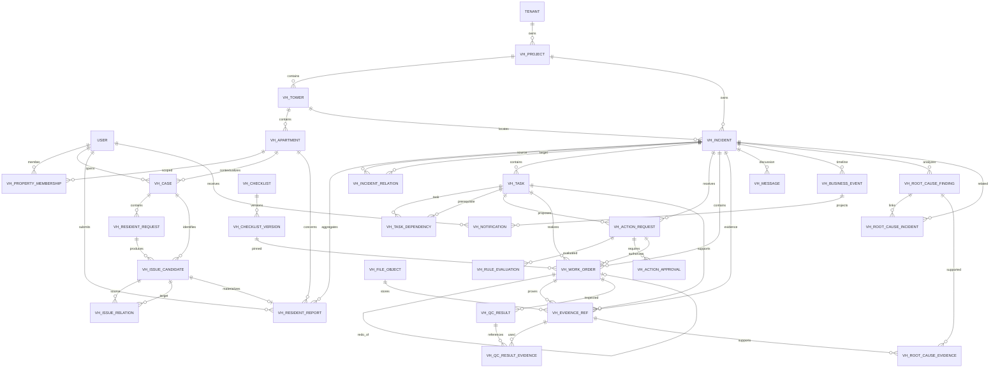
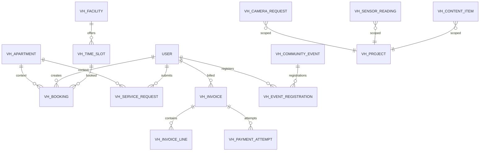

# 02 — Vinhomes Domain ERD
## Business Domain Package for the Generic AI Platform

**Status:** Proposed canonical domain model v1.0

## 1. Domain boundary

Vinhomes is a **business-domain package** plugged into the generic AI Platform. It owns resident/property/incident/work-order state. It does not own Agent Registry, AgentVersion, evaluation, runtime or semantic Agent memory.

The core must remain operational without AI.

### Canonical business flow

```text
ResidentRequest
  → Case
  → IssueCandidate
  → ResidentReport
  → Incident ("Ticket" in UI)
  → Task
  → ActionRequest
  → RuleDecision
  → Approval if required
  → WorkOrder
  → Evidence
  → QC
  → Incident RESOLVED
  → Resident confirmation
  → Incident CLOSED
```

---

## 2. Naming reconciliation

Two existing design streams use both **Ticket** and **Incident** for nearly the same operational aggregate. To avoid duplicate state machines:

> **Persist one canonical aggregate: `vh_incident`.**  
> UI and product language may call it “Ticket”.

`Case` and `IssueCandidate` remain pre-incident intake objects. `ResidentReport` is the resident's formal submitted report and multiple reports may map to the same Incident.

---

## 3. Core Vinhomes ERD



---

## 4. Entity definitions

### 4.1 Property and domain scope

#### `vh_project`
- `id uuid PK`
- `tenant_id uuid`
- `code varchar UNIQUE(tenant_id, code)`
- `name`
- `status`
- `created_at`, `updated_at`

#### `vh_tower`
- `id uuid PK`
- `project_id FK`
- `code`
- `name`
- `status`

Unique: `(project_id, code)`

#### `vh_apartment`
- `id uuid PK`
- `tower_id FK`
- `code`
- `floor`
- `status`

Unique: `(tower_id, code)`

#### `vh_property_membership`
Maps a platform user to a Vinhomes business scope.
- `id uuid PK`
- `tenant_id`
- `user_id`
- `project_id`
- `tower_id nullable`
- `apartment_id nullable`
- `membership_type` — RESIDENT / MANAGER / STAFF / CONTRACTOR / ...
- `valid_from`
- `valid_until nullable`
- `status`

---

## 5. Intake model

### `vh_case`
A resident support case that can contain several inputs and eventually several incidents.

- `id uuid PK`
- `tenant_id`
- `resident_user_id`
- `apartment_id nullable`
- `status` — OPEN / CLARIFYING / READY / TICKETED / CLOSED / CANCELLED
- `summary`
- `opened_at`
- `closed_at nullable`
- `version bigint`
- timestamps

### `vh_resident_request`
One inbound resident message/submission/additional information.

- `id uuid PK`
- `case_id FK`
- `channel`
- `request_type`
- `raw_content_ref nullable`
- `sanitized_content`
- `idempotency_key`
- `submitted_by`
- `created_at`

Unique: `(tenant_id, idempotency_key)` where applicable.

### `vh_issue_candidate`
An issue identified during clarification before an operational Incident exists.

- `id uuid PK`
- `case_id FK`
- `source_request_id nullable FK`
- `domain`
- `category`
- `severity`
- `normalized_summary`
- `location_json jsonb`
- `confidence numeric`
- `status` — DETECTED / NEEDS_CLARIFICATION / READY / MERGED / DISCARDED / MATERIALIZED
- `required_fields_json`
- `missing_fields_json`
- timestamps

### `vh_issue_relation`
Represents split/merge/causal relationships among issue candidates.

- `source_issue_id FK`
- `target_issue_id FK`
- `relation_type` — SPLIT_FROM / MERGED_INTO / RELATED / DEPENDS_ON
- `reason`

PK: `(source_issue_id, target_issue_id, relation_type)`

### `vh_resident_report`
Formal submitted report.

- `id uuid PK`
- `case_id FK`
- `issue_candidate_id nullable FK`
- `incident_id FK`
- `reporter_id`
- `apartment_id nullable`
- `category`
- `description`
- `location_json`
- `created_at`

**Cardinality:** many ResidentReports may link to one Incident.

---

## 6. Incident = canonical Ticket

### `vh_incident`

- `id uuid PK`
- `tenant_id`
- `project_id FK`
- `tower_id nullable FK`
- `category`
- `title`
- `location_json`
- `severity`
- `status` — NEW / OPEN / RESOLVED / CLOSED
- `stage` — INTAKE / TRIAGE / PLANNING / EXECUTION / QC / RESIDENT_CONFIRMATION
- `owner_user_id nullable`
- `sla_due_at nullable`
- `resolved_at nullable`
- `closed_at nullable`
- `version bigint`
- timestamps

### Important rule

`WAITING_APPROVAL` is **not** an Incident status. Approval may block one Task while other Tasks continue.

### `vh_incident_relation`
- `source_incident_id`
- `target_incident_id`
- `relation_type` — RELATED / DUPLICATE / CAUSED_BY / BLOCKS / RECURRING_WITH
- `reason`
- `created_by`
- `created_at`

---

## 7. Business Task model

### `vh_task`
- `id uuid PK`
- `incident_id FK`
- `title`
- `domain_type`
- `domain_data jsonb`
- `domain_schema_version int`
- `assignee_type`
- `assignee_id nullable`
- `status` — OPEN / ASSIGNED / IN_PROGRESS / BLOCKED / DONE / CANCELLED
- `priority`
- `due_at nullable`
- `version bigint`
- timestamps

`domain_data` is the extension point for domain-specific plans. For POC A5, `CleaningPlan` remains versioned JSON inside this field.

### `vh_task_dependency`
- `task_id FK`
- `depends_on_task_id FK`
- `dependency_type`
- `required boolean`
- `created_at`

PK `(task_id, depends_on_task_id)`

---

## 8. Action, rule and approval

### `vh_action_request`
The only accepted request for a business side effect.

- `id uuid PK`
- `incident_id FK`
- `task_id FK`
- `requested_by_type` — HUMAN / SYSTEM / AUTOMATION / AGENT / EXTERNAL_SERVICE
- `requested_by_id`
- `requested_by_version nullable`
- `action_type`
- `target_type`
- `target_id nullable`
- `payload jsonb`
- `payload_hash`
- `status`
- `version bigint`
- `correlation_id`
- `created_at`

### `vh_rule_evaluation`
- `id uuid PK`
- `action_request_id FK`
- `decision` — ALLOW / REQUIRE_APPROVAL / DENY
- `reason_code`
- `rule_version`
- `evaluated_at`
- `correlation_id`

### `vh_action_approval`
- `id uuid PK`
- `action_request_id FK`
- `action_payload_hash`
- `status` — PENDING / APPROVED / REJECTED / EXPIRED
- `requested_by_id`
- `reviewer_id nullable`
- `expires_at`
- `decided_at nullable`
- `reason nullable`
- `version bigint`

Rule: a changed action/payload requires a new ActionRequest and new approval.

---

## 9. Work execution

### `vh_work_order`
- `id uuid PK`
- `incident_id FK`
- `task_id FK`
- `action_request_id FK`
- `executor_type`
- `executor_id nullable`
- `status` — OPEN / ASSIGNED / IN_PROGRESS / COMPLETED / FAILED / CANCELLED
- `attempt_no int`
- `redo_of_work_order_id nullable FK`
- `checklist_version_id nullable FK`
- `execution_started_at nullable`
- `execution_completed_at nullable`
- `result jsonb`
- `version bigint`

Unique recommended: `(task_id, attempt_no)`.

### Redo chain

```text
WO attempt 1
  └─ QC FAIL
       └─ WO attempt 2 (redo_of=attempt1)
            └─ QC PASS
```

Old attempts remain immutable history.

---

## 10. Checklist, evidence and QC

### `vh_checklist`
- `id`
- `tenant_id`
- `code`
- `name`
- `category`
- `status`

### `vh_checklist_version`
- `id`
- `checklist_id`
- `version_no`
- `criteria_json`
- `status`
- `published_at`
- `created_by`

WorkOrder pins a specific checklist version.

### `vh_file_object`
- `id`
- `storage_provider`
- `storage_key`
- `mime_type`
- `size_bytes`
- `checksum`
- `created_at`

### `vh_evidence_ref`
- `id`
- `incident_id`
- `task_id nullable`
- `work_order_id nullable`
- `file_id`
- `kind`
- `capture_phase` — BEFORE / AFTER / QC / OTHER
- `metadata jsonb`
- `uploaded_by`
- `created_at`

Binary is stored outside PostgreSQL.

### `vh_qc_result`
Immutable QC decision.
- `id`
- `work_order_id`
- `outcome` — PASS / FAIL / INCONCLUSIVE
- `criteria jsonb`
- `failed_criteria jsonb`
- `redo_required`
- `note`
- `checked_by`
- `checked_at`

### `vh_qc_result_evidence`
- `qc_result_id`
- `evidence_ref_id`

---

## 11. Communication, event and notification

### `vh_message`
- `id`
- `incident_id`
- `body`
- `author_type`
- `author_id`
- `created_at`

**Message is not a business command.**

### `vh_business_event`
Append-only.
- `id`
- `tenant_id`
- `incident_id nullable`
- `subject_type`
- `subject_id`
- `event_type`
- `actor_type`
- `actor_id`
- `actor_version nullable`
- `data jsonb`
- `correlation_id`
- `occurred_at`

### `vh_notification`
Projection from domain events.
- `id`
- `business_event_id nullable`
- `recipient_id`
- `type`
- `subject_type`
- `subject_id`
- `read_at nullable`
- `created_at`

---

## 12. Recurrence and root-cause analysis

### `vh_root_cause_finding`
- `id`
- `incident_id`
- `suspected_domain` — TECHNICAL / SECURITY / PROCESS / SANITATION / UNKNOWN
- `description`
- `status`
- `created_by_type`
- `created_by_id`
- `created_at`

### `vh_root_cause_incident`
- `root_cause_finding_id`
- `related_incident_id`
- `relation_type`

### `vh_root_cause_evidence`
- `root_cause_finding_id`
- `evidence_ref_id`

---

## 13. A5 Sanitation & Landscape

A5 is a Vinhomes domain workflow, not an Agent.

`vh_task.domain_type`:
- `SANITATION`
- `LANDSCAPE`

`domain_data` holds versioned `CleaningPlan`.

Example shape:

```json
{
  "schemaVersion": 1,
  "issueType": "WASTE_OVERFLOW",
  "area": {"siteId": "SITE-01", "locationId": "S2.15-F8-TRASH"},
  "actions": [{"type": "REMOVE_WASTE", "executorType": "HUMAN"}],
  "requiredEvidence": ["IMAGE_BEFORE", "IMAGE_AFTER", "CHECKLIST"],
  "qcCriteria": ["NO_VISIBLE_WASTE", "AREA_CLEAN", "NO_BAD_ODOR"],
  "rootCauseCheckRequired": true
}
```

Do not create a separate A5 microservice or `cleaning_plan` table during the POC unless the domain schema becomes too large to manage as versioned JSON.

---

## 14. Resident service modules

These modules are adjacent to the incident core and can be implemented incrementally.



### Candidate tables
- `vh_facility`
- `vh_time_slot`
- `vh_booking`
- `vh_service_request`
- `vh_visitor_pass`
- `vh_charging_session`
- `vh_pet_profile`
- `vh_invoice`
- `vh_invoice_line`
- `vh_payment_attempt`
- `vh_fee_schedule`
- `vh_content_item`
- `vh_community_event`
- `vh_event_registration`
- `vh_offer`
- `vh_sensor_reading`
- `vh_camera_request`
- `vh_transit_route`
- `vh_map_place`

These are business-domain tables and do not belong in the AI Platform ERD.

---

## 15. Platform integration boundary

A future Agent receives:

```text
TaskContext
{
  tenantId,
  incidentId,
  incidentVersion,
  taskId,
  allowedScope,
  evidenceRefs
}
```

and returns:

```text
ActionProposal
{
  producerType: "AGENT",
  producerId,
  producerVersion,
  actionType,
  target,
  payload,
  correlationId,
  traceId
}
```

Vinhomes maps that to `vh_action_request`.

### Do not add hard FKs from Vinhomes tables to:
- `agent`
- `agent_version`
- `agent_run`
- `workflow_session`

Store provenance snapshots instead.

---

## 16. Recommended schema files

```text
server/src/db/schema/domains/vinhomes/
├── vh-tenancy.ts
├── vh-intake.ts
├── vh-operations.ts
├── vh-evidence.ts
├── vh-services.ts
└── vh-content.ts
```

Do not store Vinhomes Agent Factory tables here; those belong to the generic platform schema.

---

## 17. Critical indexes and constraints

Recommended:

```text
vh_incident(tenant_id, project_id, status, severity)
vh_incident(tower_id, status)
vh_task(incident_id, status)
vh_action_request(incident_id, status)
vh_action_approval(status, expires_at)
vh_work_order(task_id, attempt_no) UNIQUE
vh_business_event(incident_id, occurred_at DESC)
vh_notification(recipient_id, read_at, created_at DESC)
vh_resident_request(case_id, created_at)
vh_issue_candidate(case_id, status)
vh_property_membership(user_id, project_id, tower_id, apartment_id)
```

Optimistic concurrency:
- `vh_case.version`
- `vh_incident.version`
- `vh_task.version`
- `vh_action_request.version`
- `vh_action_approval.version`
- `vh_work_order.version`

---

## 18. Domain invariants

1. Chat/message never changes Incident state by itself.
2. One resident report may join an existing Incident.
3. Approval is bound to the exact ActionRequest payload hash.
4. WorkOrder redo creates a new attempt; old attempts are never reset.
5. QCResult is immutable.
6. Incident cannot be resolved while required Tasks, Approvals, WorkOrders or evidence remain incomplete.
7. Agent/system/human all use the same ActionRequest boundary.
8. Vinhomes remains fully usable if the AI Platform runtime is unavailable.
