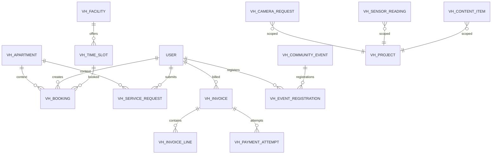
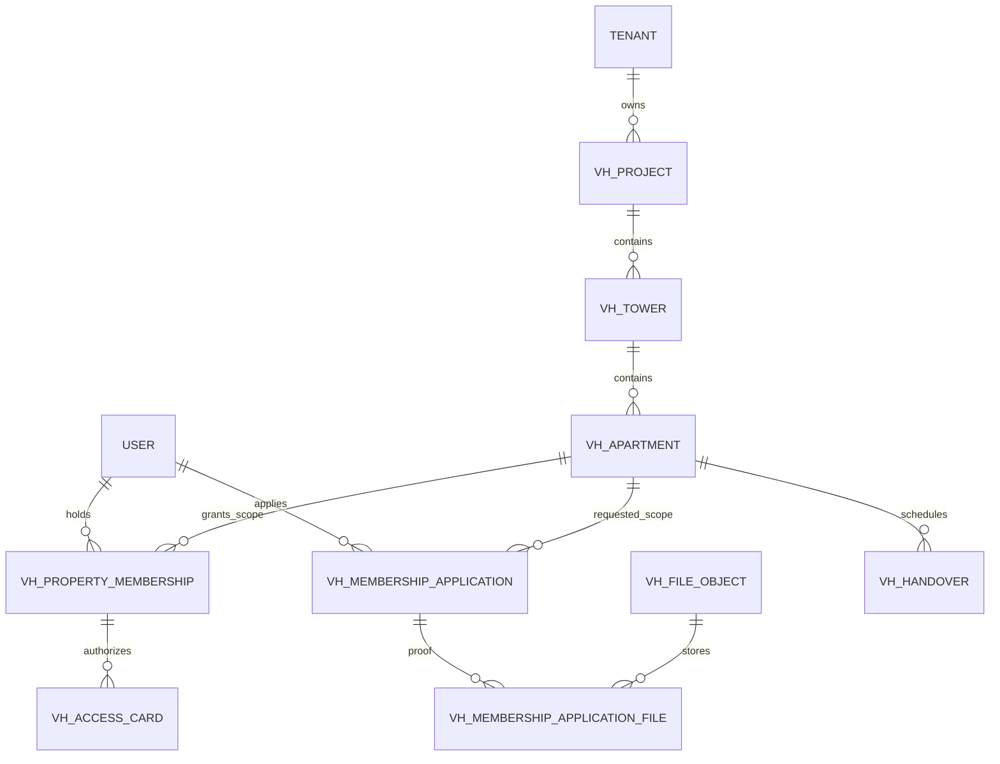
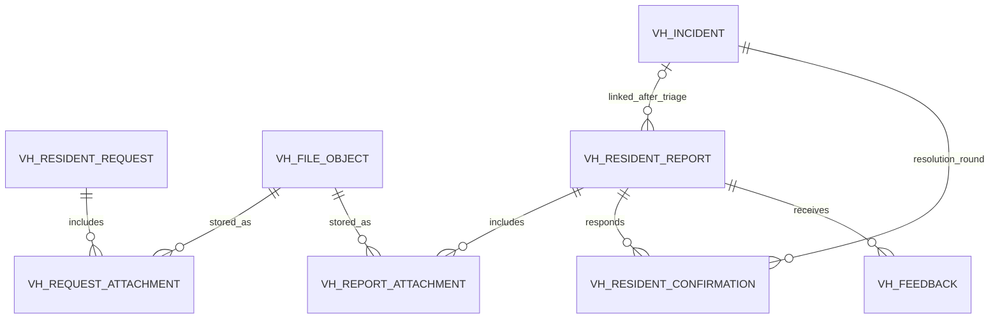

# 02 — Vinhomes Domain ERD
## Business Domain Package for the Generic AI Platform

**Status:** Proposed canonical domain model v1.1, resident UX review, 2026-09-27.

This document describes the target model, not deployed tables. Sections 19–24
complete the resident-service and tenancy design. Authentication and apartment
selection in the current resident UI are a clearly labelled, in-memory preview.
No production authentication, migration, payment or device integration is implied.

## 1. Domain boundary

Vinhomes is a **business-domain package** plugged into the generic AI Platform. It owns resident/property/incident/work-order state. It does not own Agent Registry, AgentVersion, evaluation, runtime or semantic Agent memory.

The core must remain operational without AI.

### Canonical business flow

```text
ResidentRequest
  → Case
  → IssueCandidate
  → ResidentReport
  → Incident ("Ticket" in UI)
  → Task
  → ActionRequest
  → RuleDecision
  → Approval if required
  → WorkOrder
  → Evidence
  → QC
  → Incident RESOLVED
  → Resident confirmation
  → Incident CLOSED
```

---

## 2. Naming reconciliation

Two existing design streams use both **Ticket** and **Incident** for nearly the same operational aggregate. To avoid duplicate state machines:

> **Persist one canonical aggregate: `vh_incident`.**  
> UI and product language may call it “Ticket”.

`Case` and `IssueCandidate` remain pre-incident intake objects. `ResidentReport` is the resident's formal submitted report and multiple reports may map to the same Incident.

---

## 3. Core Vinhomes ERD


---

## 4. Entity definitions

### 4.1 Property and domain scope

#### `vh_project`
- `id uuid PK`
- `tenant_id uuid`
- `code varchar UNIQUE(tenant_id, code)`
- `name`
- `status`
- `created_at`, `updated_at`

#### `vh_tower`
- `id uuid PK`
- `project_id FK`
- `code`
- `name`
- `status`

Unique: `(project_id, code)`

#### `vh_apartment`
- `id uuid PK`
- `tower_id FK`
- `code`
- `floor`
- `status`

Unique: `(tower_id, code)`

#### `vh_property_membership`
Maps a platform user to a Vinhomes business scope.
- `id uuid PK`
- `tenant_id`
- `user_id`
- `project_id`
- `tower_id nullable`
- `apartment_id nullable`
- `membership_type` — RESIDENT / MANAGER / STAFF / CONTRACTOR / ...
- `valid_from`
- `valid_until nullable`
- `status`

---

## 5. Intake model

### `vh_case`
A resident support case that can contain several inputs and eventually several incidents.

- `id uuid PK`
- `tenant_id`
- `resident_user_id`
- `apartment_id nullable`
- `status` — OPEN / CLARIFYING / READY / TICKETED / CLOSED / CANCELLED
- `summary`
- `opened_at`
- `closed_at nullable`
- `version bigint`
- timestamps

### `vh_resident_request`
One inbound resident message/submission/additional information.

- `id uuid PK`
- `case_id FK`
- `channel`
- `tenant_id FK`
- `request_type`
- `raw_content_ref nullable`
- `sanitized_content`
- `idempotency_key`
- `submitted_by`
- `created_at`

Unique: `(tenant_id, idempotency_key)` where applicable.

### `vh_issue_candidate`
An issue identified during clarification before an operational Incident exists.

- `id uuid PK`
- `case_id FK`
- `source_request_id nullable FK`
- `domain`
- `category`
- `severity`
- `normalized_summary`
- `location_json jsonb`
- `confidence numeric`
- `status` — DETECTED / NEEDS_CLARIFICATION / READY / MERGED / DISCARDED / MATERIALIZED
- `required_fields_json`
- `missing_fields_json`
- timestamps

### `vh_issue_relation`
Represents split/merge/causal relationships among issue candidates.

- `source_issue_id FK`
- `target_issue_id FK`
- `relation_type` — SPLIT_FROM / MERGED_INTO / RELATED / DEPENDS_ON
- `reason`

PK: `(source_issue_id, target_issue_id, relation_type)`

### `vh_resident_report`
Formal submitted report.

- `id uuid PK`
- `case_id FK`
- `issue_candidate_id nullable FK`
- `incident_id nullable FK` (unlinked until triage; attachment is atomic and tenant-scoped)
- `reporter_id`
- `apartment_id nullable`
- `category`
- `description`
- `location_json`
- `created_at`

**Cardinality:** many ResidentReports may link to one Incident.

---

## 6. Incident = canonical Ticket

### `vh_incident`

- `id uuid PK`
- `tenant_id`
- `project_id FK`
- `tower_id nullable FK`
- `category`
- `title`
- `location_json`
- `severity`
- `status` — NEW / OPEN / RESOLVED / CLOSED
- `stage` — INTAKE / TRIAGE / PLANNING / EXECUTION / QC / RESIDENT_CONFIRMATION
- `owner_user_id nullable`
- `sla_due_at nullable`
- `resolved_at nullable`
- `closed_at nullable`
- `version bigint`
- timestamps

### Important rule

`WAITING_APPROVAL` is **not** an Incident status. Approval may block one Task while other Tasks continue.

### `vh_incident_relation`
- `source_incident_id`
- `target_incident_id`
- `relation_type` — RELATED / DUPLICATE / CAUSED_BY / BLOCKS / RECURRING_WITH
- `reason`
- `created_by`
- `created_at`

---

## 7. Business Task model

### `vh_task`
- `id uuid PK`
- `incident_id FK`
- `title`
- `domain_type`
- `domain_data jsonb`
- `domain_schema_version int`
- `assignee_type`
- `assignee_id nullable`
- `status` — OPEN / ASSIGNED / IN_PROGRESS / BLOCKED / DONE / CANCELLED
- `priority`
- `due_at nullable`
- `version bigint`
- timestamps

`domain_data` is the extension point for domain-specific plans. For POC A5, `CleaningPlan` remains versioned JSON inside this field.

### `vh_task_dependency`
- `task_id FK`
- `depends_on_task_id FK`
- `dependency_type`
- `required boolean`
- `created_at`

PK `(task_id, depends_on_task_id)`

---

## 8. Action, rule and approval

### `vh_action_request`
The accepted authorization boundary for Incident/Task operational side effects.
Resident-service commands (booking, registration, payment) have their own aggregates
and policy-checked application services; do not create fake Incidents/Tasks for them.

- `id uuid PK`
- `incident_id FK`
- `task_id FK`
- `requested_by_type` — HUMAN / SYSTEM / AUTOMATION / AGENT / EXTERNAL_SERVICE
- `requested_by_id`
- `requested_by_version nullable`
- `action_type`
- `target_type`
- `target_id nullable`
- `payload jsonb`
- `payload_hash`
- `status`
- `version bigint`
- `correlation_id`
- `created_at`

### `vh_rule_evaluation`
- `id uuid PK`
- `action_request_id FK`
- `decision` — ALLOW / REQUIRE_APPROVAL / DENY
- `reason_code`
- `rule_version`
- `evaluated_at`
- `correlation_id`

### `vh_action_approval`
- `id uuid PK`
- `action_request_id FK`
- `action_payload_hash`
- `status` — PENDING / APPROVED / REJECTED / EXPIRED
- `requested_by_id`
- `reviewer_id nullable`
- `expires_at`
- `decided_at nullable`
- `reason nullable`
- `version bigint`

Rule: a changed action/payload requires a new ActionRequest and new approval.

---

## 9. Work execution

### `vh_work_order`
- `id uuid PK`
- `incident_id FK`
- `task_id FK`
- `action_request_id FK`
- `executor_type`
- `executor_id nullable`
- `status` — OPEN / ASSIGNED / IN_PROGRESS / COMPLETED / FAILED / CANCELLED
- `attempt_no int`
- `redo_of_work_order_id nullable FK`
- `checklist_version_id nullable FK`
- `execution_started_at nullable`
- `execution_completed_at nullable`
- `result jsonb`
- `version bigint`

Unique recommended: `(task_id, attempt_no)`.

### Redo chain

```text
WO attempt 1
  └─ QC FAIL
       └─ WO attempt 2 (redo_of=attempt1)
            └─ QC PASS
```

Old attempts remain immutable history.

---

## 10. Checklist, evidence and QC

### `vh_checklist`
- `id`
- `tenant_id`
- `code`
- `name`
- `category`
- `status`

### `vh_checklist_version`
- `id`
- `checklist_id`
- `version_no`
- `criteria_json`
- `status`
- `published_at`
- `created_by`

WorkOrder pins a specific checklist version.

### `vh_file_object`
- `id`
- `storage_provider`
- `storage_key`
- `mime_type`
- `size_bytes`
- `checksum`
- `created_at`

### `vh_evidence_ref`
- `id`
- `incident_id`
- `task_id nullable`
- `work_order_id nullable`
- `file_id`
- `kind`
- `capture_phase` — BEFORE / AFTER / QC / OTHER
- `metadata jsonb`
- `uploaded_by`
- `created_at`

Binary is stored outside PostgreSQL.

### `vh_qc_result`
Immutable QC decision.
- `id`
- `work_order_id`
- `outcome` — PASS / FAIL / INCONCLUSIVE
- `criteria jsonb`
- `failed_criteria jsonb`
- `redo_required`
- `note`
- `checked_by`
- `checked_at`

### `vh_qc_result_evidence`
- `qc_result_id`
- `evidence_ref_id`

---

## 11. Communication, event and notification

### `vh_message`
- `id`
- `incident_id`
- `body`
- `author_type`
- `author_id`
- `created_at`

**Message is not a business command.**

### `vh_business_event`
Append-only.
- `id`
- `tenant_id`
- `incident_id nullable`
- `subject_type`
- `subject_id`
- `event_type`
- `actor_type`
- `actor_id`
- `actor_version nullable`
- `data jsonb`
- `correlation_id`
- `occurred_at`

### `vh_notification`
Projection from domain events.
- `id`
- `business_event_id nullable`
- `recipient_id`
- `type`
- `subject_type`
- `subject_id`
- `read_at nullable`
- `created_at`

---

## 12. Recurrence and root-cause analysis

### `vh_root_cause_finding`
- `id`
- `incident_id`
- `suspected_domain` — TECHNICAL / SECURITY / PROCESS / SANITATION / UNKNOWN
- `description`
- `status`
- `created_by_type`
- `created_by_id`
- `created_at`

### `vh_root_cause_incident`
- `root_cause_finding_id`
- `related_incident_id`
- `relation_type`

### `vh_root_cause_evidence`
- `root_cause_finding_id`
- `evidence_ref_id`

---

## 13. A5 Sanitation & Landscape

A5 is a Vinhomes domain workflow, not an Agent.

`vh_task.domain_type`:
- `SANITATION`
- `LANDSCAPE`

`domain_data` holds versioned `CleaningPlan`.

Example shape:

```json
{
  "schemaVersion": 1,
  "issueType": "WASTE_OVERFLOW",
  "area": {"siteId": "SITE-01", "locationId": "S2.15-F8-TRASH"},
  "actions": [{"type": "REMOVE_WASTE", "executorType": "HUMAN"}],
  "requiredEvidence": ["IMAGE_BEFORE", "IMAGE_AFTER", "CHECKLIST"],
  "qcCriteria": ["NO_VISIBLE_WASTE", "AREA_CLEAN", "NO_BAD_ODOR"],
  "rootCauseCheckRequired": true
}
```

Do not create a separate A5 microservice or `cleaning_plan` table during the POC unless the domain schema becomes too large to manage as versioned JSON.

---

## 14. Resident service modules

These modules are adjacent to the incident core and can be implemented incrementally.



### Candidate tables
- `vh_facility`
- `vh_time_slot`
- `vh_booking`
- `vh_service_request`
- `vh_visitor_pass`
- `vh_charging_session`
- `vh_pet_profile`
- `vh_invoice`
- `vh_invoice_line`
- `vh_payment_attempt`
- `vh_fee_schedule`
- `vh_content_item`
- `vh_community_event`
- `vh_event_registration`
- `vh_offer`
- `vh_sensor_reading`
- `vh_camera_request`
- `vh_transit_route`
- `vh_map_place`

These are business-domain tables and do not belong in the AI Platform ERD.

---

## 15. Platform integration boundary

A future Agent receives:

```text
TaskContext
{
  tenantId,
  incidentId,
  incidentVersion,
  taskId,
  allowedScope,
  evidenceRefs
}
```

and returns:

```text
ActionProposal
{
  producerType: "AGENT",
  producerId,
  producerVersion,
  actionType,
  target,
  payload,
  correlationId,
  traceId
}
```

Vinhomes maps that to `vh_action_request`.

### Do not add hard FKs from Vinhomes tables to:
- `agent`
- `agent_version`
- `agent_run`
- `workflow_session`

Store provenance snapshots instead.

---

## 16. Recommended schema files

```text
server/src/db/schema/domains/vinhomes/
├── vh-tenancy.ts
├── vh-intake.ts
├── vh-operations.ts
├── vh-evidence.ts
├── vh-services.ts
└── vh-content.ts
```

Do not store Vinhomes Agent Factory tables here; those belong to the generic platform schema.

---

## 17. Critical indexes and constraints

Recommended:

```text
vh_incident(tenant_id, project_id, status, severity)
vh_incident(tower_id, status)
vh_task(incident_id, status)
vh_action_request(incident_id, status)
vh_action_approval(status, expires_at)
vh_work_order(task_id, attempt_no) UNIQUE
vh_business_event(incident_id, occurred_at DESC)
vh_notification(recipient_id, read_at, created_at DESC)
vh_resident_request(case_id, created_at)
vh_issue_candidate(case_id, status)
vh_property_membership(user_id, project_id, tower_id, apartment_id)
```

Optimistic concurrency:
- `vh_case.version`
- `vh_incident.version`
- `vh_task.version`
- `vh_action_request.version`
- `vh_action_approval.version`
- `vh_work_order.version`

---

## 18. Domain invariants

1. Chat/message never changes Incident state by itself.
2. One resident report may join an existing Incident.
3. Approval is bound to the exact ActionRequest payload hash.
4. WorkOrder redo creates a new attempt; old attempts are never reset.
5. QCResult is immutable.
6. Incident cannot be resolved while required Tasks, Approvals, WorkOrders or evidence remain incomplete.
7. Agent/system/human all use the same ActionRequest boundary for Incident/Task operational side effects.
8. Vinhomes remains fully usable if the AI Platform runtime is unavailable.

---

## 19. Physical conventions and tenant isolation

The following rules apply to **every** `vh_*` table, including link tables above.
They complete omitted physical fields rather than introducing a second model.

| Concern | Canonical rule |
| --- | --- |
| Identity | Entity `id uuid PK`; add `UNIQUE(tenant_id,id)` for composite references. Link tables retain their named composite PK plus tenant_id. |
| Ownership | `tenant_id NOT NULL` references platform tenant identity. A project is not a tenant. All domain FKs carry `(tenant_id, referenced_id)` so a cross-tenant reference cannot be inserted. |
| Platform identity | User references use the actual platform identity key type; existing OpenBot auth IDs must not be silently cast to UUID. Map logical USER/TENANT to the auth schema during the BE migration. No parallel credential store. |
| Time | `created_at timestamptz NOT NULL`, `updated_at timestamptz NOT NULL` on mutable records; immutable decisions/events have created/occurred timestamps only. Display in Asia/Ho_Chi_Minh; persist UTC. |
| Version | Every mutable aggregate (including membership, report, booking, invoice, service request) has `version bigint NOT NULL DEFAULT 1`, checked on mutation. |
| Scope | Every project-scoped aggregate has `project_id NOT NULL`; tower/apartment references must belong to this project. Use composite scoped keys, or a constraint trigger where needed. |
| Money | `amount_minor bigint`, `currency char(3)`; no float. VND exponent is zero. Currency and amounts are immutable on a submitted payment attempt. |
| Deletion | RESTRICT financial/evidence/history FKs. Retire master data via status. A separate retention policy governs PII removal; no blanket cascade from user/apartment. |
| Validation | CHECK enums and ranges in DB; state transitions and permissions enforced by application service in a transaction. Types and UI filters do not authorize anything. |

Authentication establishes a platform user. The server resolves ACTIVE, in-date
property memberships for that user, then offers accessible tenant/project/apartment
choices. A client-selected apartment is a request to switch scope, not proof of access.
Re-check membership on every read/write and file download. Never accept `tenant_id`
from a form as authority. Account with zero memberships gets an access-help screen.

### Membership completion

`vh_property_membership` additionally has `resident_role OWNER | TENANT | HOUSEHOLD`
(nullable for staff), `granted_by_user_id`, `revoked_at`, and version/timestamps.
`membership_type = RESIDENT` requires apartment_id; staff can have a project/tower scope.
`valid_until > valid_from`; effective access requires ACTIVE and time within the interval.
Prevent overlapping active grants for the same user/scope/type using normalized scope
keys and an exclusion constraint over validity ranges. A project can contain many towers,
a tower many apartments, and an apartment many resident memberships.

`vh_membership_application`: id, tenant_id, project_id, requested_apartment_id,
applicant_user_id, requested_role, status PENDING | APPROVED | REJECTED | WITHDRAWN,
reviewed_by nullable, reviewed_at nullable, decision_note nullable, version/timestamps.
Only trusted invitations/project discovery can select the target tenant. Approval creates
a membership atomically; uploading proof alone never grants access. Documents use
`vh_membership_application_file(application_id,file_id)` with private visibility.



The preview does not create a platform session or persist memberships. Its apartment
selector uses synthetic fixtures only. Real login, invitation verification and approval
remain a separate backend delivery, as agreed for this iteration.

## 20. Intake, privacy and resident outcome completion

| Entity | Additional fields / new definition |
| --- | --- |
| `vh_case` | project_id, opened_by_membership_id; apartment optional for common-area reports. |
| `vh_issue_candidate` | identified_by_type HUMAN/SYSTEM/AGENT; identified_by_id; confidence nullable for manual intake. Unique materialization per candidate. |
| `vh_resident_report` | tenant_id, project_id, reporter_membership_id, status SUBMITTED/LINKED/WITHDRAWN, version. incident_id nullable until triage. Partial UNIQUE(tenant_id,issue_candidate_id) when non-null. |
| `vh_file_object` | tenant_id, uploaded_by_user_id, upload_status PENDING/UPLOADED/QUARANTINED/AVAILABLE/REJECTED, visibility PRIVATE/RESIDENT_VISIBLE/INTERNAL, original_filename, uploaded_at nullable. Storage key unique per provider. Only AVAILABLE files can be attached to submitted reports. |
| `vh_request_attachment` | tenant_id, request_id FK, file_id FK, caption nullable. PK(tenant_id,request_id,file_id). Captures evidence before Incident exists. |
| `vh_report_attachment` | tenant_id, report_id FK, file_id FK. PK(tenant_id,report_id,file_id). Promote a reference, never copy the binary. |
| `vh_resident_confirmation` | id, tenant_id, report_id FK, incident_id FK, resolution_version bigint, response ACCEPTED/REOPEN_REQUESTED, note nullable, confirmed_by_user_id, created_at. UNIQUE(tenant_id,report_id,resolution_version). Immutable response per resolution round. |
| `vh_feedback` | id, tenant_id, report_id FK, author_user_id, rating integer CHECK 1..5, comment nullable, created_at. UNIQUE(tenant_id,report_id,author_user_id). Feedback does not change Incident state. |
| `vh_message` | visibility INTERNAL/RESIDENT_VISIBLE; resident_report_id nullable. Resident must own the report to view its conversation. An Incident link alone does not expose another resident's identity/messages/files. |
| `vh_evidence_ref` | visibility INTERNAL/RESIDENT_VISIBLE; all optional task/work_order refs must belong to its incident. |
| `vh_business_event` | visibility INTERNAL/RESIDENT_VISIBLE, schema_version, subject_version. UI receives a redacted projection, never raw event data. |



### Transitions and aggregation

- Case: OPEN → CLARIFYING → READY → TICKETED → CLOSED; pre-ticket cases can be CANCELLED. A direct form can move OPEN → READY without chat or AI.
- Report: SUBMITTED → LINKED; resident may WITHDRAW before linking. After linking, request withdrawal is reviewed; it cannot delete shared work.
- Incident: NEW → OPEN → RESOLVED → CLOSED. RESOLVED → OPEN on an accepted reopen request. CLOSED is historical; recurrence creates a related new Incident.
- RESOLVED requires all required tasks and work orders complete, applicable QC PASS, required evidence present, and no pending mandatory approvals. Resolution pins a version.
- Resident confirmation is per report and resolution version. An old confirmation cannot close a later resolution round. One resident cannot close other residents' reports.
- Closure policy is explicit per tenant (all required reporters accepted, or a documented timeout/manual decision). Until that policy is approved, **no automatic timeout closure**. Record who closed and why.
- Work order redo: attempt_no > 0, unique(task_id,attempt_no); predecessor must be same task, lower attempt and failed QC. A predecessor has at most one direct redo; retry of the command returns that same redo.
- Dependencies: no self-links or cycles. Blocked task state does not invent an Incident WAITING_APPROVAL status.
- ActionRequest statuses: PROPOSED → DENIED, AWAITING_APPROVAL or AUTHORIZED; AWAITING_APPROVAL → AUTHORIZED/REJECTED/EXPIRED; AUTHORIZED → EXECUTING → SUCCEEDED/FAILED. Policy checks are repeated before execution. Rules/approval bind immutable payload hash and policy version.
- Messages, ratings and notifications never act as business commands.

## 21. Resident service entities

All entities below inherit section 19 fields. `?` means nullable; every `*_id` below
references the named entity in the same tenant. USER references platform identity.
No generic JSON field replaces the ownership/status/foreign keys listed here.

### Apartment, access and service registration

| Table | Fields beyond common columns | Constraints / lifecycle |
| --- | --- | --- |
| `vh_handover` | apartment_id, resident_membership_id, scheduled_at, completed_at?, checklist_version_id?, status, note? | SCHEDULED/CONFIRMED/COMPLETED/CANCELLED. Only an authorized owner confirms handover. |
| `vh_access_card` | membership_id, card_token_ref, issued_at?, expires_at?, status | REQUESTED/ACTIVE/SUSPENDED/REVOKED; unique provider token; membership revocation disables access through an integration command. Never display raw access secrets. |
| `vh_service_request` | project_id, apartment_id, requester_membership_id, service_type, requested_start_at, requested_end_at?, details_json, details_schema_version, status, decision_reason? | DRAFT/SUBMITTED/APPROVED/REJECTED/IN_PROGRESS/COMPLETED/CANCELLED; allowlisted, versioned payload per service_type. |
| `vh_visitor_pass` | service_request_id, visitor_name, vehicle_plate?, valid_from, valid_until, pass_token_ref?, status | UNIQUE(service_request_id); REQUESTED/ACTIVE/EXPIRED/REVOKED; only approved service may activate pass. |
| `vh_charging_session` | apartment_id, requested_by_membership_id, station_place_id, connector_code, started_at?, ended_at?, energy_wh?, amount_minor?, currency, provider_ref?, status | REQUESTED/ACTIVE/COMPLETED/FAILED/CANCELLED; provider_ref unique when present; energy nonnegative. No pretend device activation. |
| `vh_pet_profile` | apartment_id, owner_membership_id, name, species, breed?, vaccination_valid_until?, status | PENDING/REGISTERED/REJECTED/ARCHIVED; files via vh_pet_document(pet_id,file_id), composite PK. |
| `vh_construction_permit` | service_request_id, contractor_name, start_date, end_date, permitted_hours_json, status | UNIQUE(service_request_id); PENDING/APPROVED/REJECTED/EXPIRED/REVOKED; end >= start. Attachments via vh_service_request_file(request_id,file_id). |
| `vh_parking_permit` | apartment_id, membership_id, vehicle_plate, vehicle_type, valid_from, valid_until?, status | PENDING/ACTIVE/SUSPENDED/EXPIRED/REVOKED; active plate uniqueness within project, explicit policy for shared vehicle. |
| `vh_face_enrollment` | membership_id, consent_version, consented_at, provider_subject_ref?, status, revoked_at? | PENDING/ACTIVE/REJECTED/REVOKED; provider refs only, no raw biometric template in domain DB. Withdrawal requests provider deletion and records outcome. |
| `vh_intercom_event` | apartment_id, visitor_pass_id?, provider_event_id, event_type, occurred_at, outcome | Immutable, UNIQUE(tenant_id,provider_event_id); no door-open button succeeds without provider receipt. |
| `vh_camera_request` | project_id, apartment_id, requester_membership_id, location_place_id, from_at, to_at, purpose, status, reviewed_by?, expires_at? | SUBMITTED/APPROVED/REJECTED/FULFILLED/EXPIRED; bounded interval, approved time-limited access only. |

Document link tables (`vh_pet_document`, `vh_service_request_file`) inherit tenant_id,
created_at and composite tenant-scoped FKs to their parent and `vh_file_object`.

### Facility booking

| Table | Fields beyond common columns | Constraints / lifecycle |
| --- | --- | --- |
| `vh_facility` | project_id, place_id?, code, name, category, capacity, fee_minor, currency, booking_policy_json, status | UNIQUE(project_id,code); capacity > 0; ACTIVE/MAINTENANCE/RETIRED. |
| `vh_time_slot` | facility_id, starts_at, ends_at, capacity, status | ends > starts; UNIQUE(facility_id,starts_at,ends_at); OPEN/BLOCKED; prevent overlapping exclusive-resource slots. |
| `vh_booking` | slot_id, apartment_id, booked_by_membership_id, party_size, status, hold_expires_at?, price_minor, currency, cancelled_at?, cancellation_reason? | HELD/CONFIRMED/CANCELLED/EXPIRED/COMPLETED; party_size > 0; duplicate active booking per membership/slot forbidden. Price is a booking-time snapshot. |

Reservation checks scope and capacity under a slot row lock, counts active holds and
confirmed bookings, inserts booking + outbox in one transaction. Expired holds do not
consume capacity. Cancelling restores capacity once; retries cannot double-book.

### Billing and loyalty

| Table | Fields beyond common columns | Constraints / lifecycle |
| --- | --- | --- |
| `vh_fee_schedule` | project_id, code, version_no, effective_from, effective_until?, description, amount_minor, currency, billing_unit, status | UNIQUE(project_id,code,version_no); DRAFT/PUBLISHED/RETIRED. Published versions immutable. |
| `vh_invoice` | apartment_id, billed_to_user_id, invoice_number, period_start, period_end, due_at, total_minor, currency, status | UNIQUE(tenant_id,invoice_number); DRAFT/ISSUED/PARTIALLY_PAID/PAID/VOID; outstanding calculated from confirmed allocations, not browser state. |
| `vh_invoice_line` | invoice_id, fee_schedule_id?, description, quantity numeric, unit_price_minor, total_minor | quantity > 0; immutable after issue; sum(lines.total_minor) = invoice.total_minor with a documented rounding rule. |
| `vh_payment_attempt` | invoice_id, initiated_by_user_id, amount_minor, currency, provider, provider_payment_ref?, idempotency_key, status, confirmed_at? | PENDING/REQUIRES_ACTION/SUCCEEDED/FAILED/CANCELLED/SIMULATED; unique tenant/idempotency_key and provider/payment_ref. SIMULATED never settles invoice. |
| `vh_payment_allocation` | payment_attempt_id, invoice_id, amount_minor | UNIQUE(payment_attempt_id,invoice_id); positive, same invoice/currency; only verified SUCCEEDED attempts allocate funds. |
| `vh_loyalty_account` | user_id, provider, external_account_ref?, status | UNIQUE(tenant_id,user_id,provider); ACTIVE/SUSPENDED/CLOSED. |
| `vh_loyalty_entry` | account_id, points_delta bigint, reason, provider_event_id, occurred_at | Append-only; UNIQUE(tenant_id,provider_event_id); balance is sum of ledger, not a client-editable value. |

Webhook signature + provider event deduplication are mandatory before success. Lock
invoice while applying allocation, reject over-allocation; client redirect is not proof
of payment. Refund/credit note design is deferred until payment integration scope is agreed.

### Content, community and discovery

| Table | Fields beyond common columns | Constraints / lifecycle |
| --- | --- | --- |
| `vh_content_item` | project_id, title, kind NEWS/HANDBOOK/NOTICE, body, status, published_at?, expires_at? | DRAFT/PUBLISHED/ARCHIVED; only in-date published content visible. |
| `vh_community_event` | project_id, place_id?, title, starts_at, ends_at, registration_closes_at, capacity, status | DRAFT/PUBLISHED/CANCELLED/COMPLETED; ends > starts, capacity > 0. |
| `vh_event_registration` | event_id, membership_id, guest_count, status | UNIQUE(event_id,membership_id); REGISTERED/CANCELLED/ATTENDED; capacity locked during registration; guest_count >= 0. |
| `vh_offer` | project_id, merchant_name, title, terms, starts_at, expires_at, destination_url?, status | DRAFT/PUBLISHED/EXPIRED/RETIRED; published validity enforced; URLs allowlisted. |
| `vh_sensor_reading` | project_id, place_id, sensor_code, metric, value numeric, unit, observed_at, source, quality | Immutable; UNIQUE(project_id,sensor_code,metric,observed_at); quality VALID/STALE/INVALID, show observation time. |
| `vh_transit_route` | project_id, code, name, operator, timetable_json, timetable_version, effective_from, status | UNIQUE(project_id,code); ACTIVE/SUSPENDED/RETIRED; timetable is not real-time arrivals. |
| `vh_transit_stop` | project_id, name, latitude, longitude | Latitude -90..90, longitude -180..180. |
| `vh_transit_route_stop` | route_id, stop_id, sequence_no | PK(tenant_id,route_id,sequence_no); ordered stops, stop belongs to route project. |
| `vh_map_place` | project_id, tower_id?, name, category, address, latitude?, longitude?, status | ACTIVE/RETIRED; validated coordinate pair or neither. |
| `vh_miniapp_catalog` | project_id, code, name, description, destination_url, status | UNIQUE(project_id,code); ACTIVE/DISABLED; allowlist destination origins, no tokens in URLs. |

`vh_notification` additionally has tenant_id, project_id, title, body, subject ref,
delivery_status QUEUED/DELIVERED/FAILED, dedupe_key. UNIQUE(tenant_id,recipient_id,dedupe_key).
Marking read requires recipient ownership. Notification metadata is redacted for the recipient.

```mermaid
erDiagram
    VH_PROJECT ||--o{ VH_FACILITY : offers
    VH_FACILITY ||--o{ VH_TIME_SLOT : schedules
    VH_TIME_SLOT ||--o{ VH_BOOKING : reserves
    VH_PROPERTY_MEMBERSHIP ||--o{ VH_BOOKING : books
    VH_APARTMENT ||--o{ VH_SERVICE_REQUEST : requests
    VH_SERVICE_REQUEST ||--o| VH_VISITOR_PASS : issues
    VH_SERVICE_REQUEST ||--o| VH_CONSTRUCTION_PERMIT : authorizes
    VH_SERVICE_REQUEST ||--o{ VH_SERVICE_REQUEST_FILE : attaches
    VH_FILE_OBJECT ||--o{ VH_SERVICE_REQUEST_FILE : stores
    VH_APARTMENT ||--o{ VH_PET_PROFILE : houses
    VH_PET_PROFILE ||--o{ VH_PET_DOCUMENT : documents
    VH_FILE_OBJECT ||--o{ VH_PET_DOCUMENT : stores
    VH_APARTMENT ||--o{ VH_INVOICE : billed
    VH_INVOICE ||--|{ VH_INVOICE_LINE : itemizes
    VH_FEE_SCHEDULE |o--o{ VH_INVOICE_LINE : priced_by
    VH_INVOICE ||--o{ VH_PAYMENT_ATTEMPT : attempted
    VH_PAYMENT_ATTEMPT ||--o{ VH_PAYMENT_ALLOCATION : settles
    VH_INVOICE ||--o{ VH_PAYMENT_ALLOCATION : receives
    USER ||--o{ VH_LOYALTY_ACCOUNT : owns
    VH_LOYALTY_ACCOUNT ||--o{ VH_LOYALTY_ENTRY : ledger
    VH_PROJECT ||--o{ VH_COMMUNITY_EVENT : hosts
    VH_COMMUNITY_EVENT ||--o{ VH_EVENT_REGISTRATION : registers
    VH_PROPERTY_MEMBERSHIP ||--o{ VH_EVENT_REGISTRATION : attends
    VH_PROJECT ||--o{ VH_CONTENT_ITEM : publishes
    VH_PROJECT ||--o{ VH_OFFER : scopes
    VH_PROJECT ||--o{ VH_MAP_PLACE : locates
    VH_MAP_PLACE ||--o{ VH_SENSOR_READING : measured
    VH_MAP_PLACE ||--o{ VH_CAMERA_REQUEST : requested
    VH_MAP_PLACE ||--o{ VH_CHARGING_SESSION : charging
    VH_APARTMENT ||--o{ VH_CHARGING_SESSION : billed
    VH_PROPERTY_MEMBERSHIP ||--o{ VH_FACE_ENROLLMENT : consents
    VH_APARTMENT ||--o{ VH_PARKING_PERMIT : parks
    VH_APARTMENT ||--o{ VH_INTERCOM_EVENT : receives
    VH_VISITOR_PASS |o--o{ VH_INTERCOM_EVENT : visitor
    VH_PROJECT ||--o{ VH_TRANSIT_ROUTE : serves
    VH_TRANSIT_ROUTE ||--o{ VH_TRANSIT_ROUTE_STOP : orders
    VH_TRANSIT_STOP ||--o{ VH_TRANSIT_ROUTE_STOP : stops_at
    VH_PROJECT ||--o{ VH_MINIAPP_CATALOG : lists
```



## 22. Commands, outbox and query indexes

`vh_command_receipt`: id, tenant_id, actor_user_id, command_type, idempotency_key,
payload_hash, subject_type, subject_id?, response_json?, status IN_PROGRESS/COMPLETED,
created_at, completed_at?. UNIQUE(tenant_id,actor_user_id,command_type,idempotency_key).
Same key + same hash returns original response; different hash returns conflict.
Receipt and business mutation commit together; never report success before commit.

`vh_outbox`: id, tenant_id, business_event_id FK, destination, payload_json,
attempt_count, available_at, delivered_at?, last_error_code?, created_at.
UNIQUE(tenant_id,business_event_id,destination). Outbox delivery is at least once;
consumers deduplicate by event id. BusinessEvent stays immutable; delivery bookkeeping
lives in Outbox. File upload and external provider operations use compensating cleanup.

Add tenant prefix to section 17 indexes, plus:

```text
vh_property_membership(tenant_id,user_id,status,valid_from,valid_until)
vh_resident_report(tenant_id,reporter_id,created_at DESC)
vh_resident_confirmation(tenant_id,incident_id,resolution_version)
vh_booking(tenant_id,slot_id,status,hold_expires_at)
vh_booking(tenant_id,apartment_id,created_at DESC)
vh_service_request(tenant_id,apartment_id,status,created_at DESC)
vh_invoice(tenant_id,apartment_id,status,due_at)
vh_event_registration(tenant_id,event_id,status)
vh_content_item(tenant_id,project_id,status,published_at DESC)
vh_outbox(available_at) WHERE delivered_at IS NULL
```

## 23. Resident screen and contract map

Target API prefix: `/api/domains/vinhomes`. These are **planned** endpoints; do not
return fake HTTP success from empty routes. Production writes accept expectedVersion
and Idempotency-Key, derive actor/tenant from authenticated context and return a DTO.
Scope change cancels outstanding requests and invalidates tenant/apartment query caches.

| Resident UX | Domain records | Planned endpoints |
| --- | --- | --- |
| Sign in, choose apartment, no access | Platform session + membership | Existing platform auth; GET /me/memberships, POST /membership-applications |
| Apartment, handover, resident card | apartment, membership, handover, access_card | GET /me/apartments, GET /handovers, GET /access-cards |
| Submit and track report | case, request, candidate, report, attachment, incident | POST /cases, POST /cases/:id/requests, POST /reports, GET /me/reports |
| Accept result / request reopen | resident_confirmation | POST /reports/:id/confirmations |
| Facilities and reservation history | facility, slot, booking | GET /facilities, GET /facilities/:id/slots, POST /bookings, POST /bookings/:id/cancel |
| Services, visitor, construction | service_request + typed children | POST /service-requests, GET /me/service-requests |
| Invoices and payment preview | invoice, lines, payment_attempt | GET /invoices, GET /invoices/:id, POST /invoices/:id/payment-attempts |
| News, handbook, offers, map, bus | content/catalog entities | GET /content, /offers, /places, /transit-routes, /miniapps |
| Events | event, registration | GET /events, POST /events/:id/registrations, POST /registrations/:id/cancel |
| Notifications | notification | GET /me/notifications, POST /notifications/:id/read |
| Device-linked services | face_enrollment, intercom, parking, charging, camera | Scoped GET lists; explicit commands routed through provider adapters |

No Agent runtime is required for these flows. UI uses a local preview adapter in this
iteration. It must show simulated receipts as simulated and never label an invoice
paid, a pass active or a device action completed based on a local button click.

## 24. Delivery boundaries and acceptance scenarios

**This iteration:** complete logical ERD + resident UX in app; login/scope selection and
service interactions use synthetic session-only data. Existing BQL UI is untouched.
No production credential collection, DB migration or integration delivery.

**BE implementation gates:** map platform user/tenant IDs to deployed auth schema;
choose closure and retention policy; approve service eligibility/cancellation rules;
agree provider contracts for payment, cards and devices. These are open deployment
decisions, not reasons to delay the UI preview or invent working integrations.

Required future DB/API acceptance tests:

1. User with apartments in two tenants cannot read/mutate the other scope by changing an ID; revoked/expired membership denied on the next request.
2. Two residents in one apartment get personal reports and household invoices according to explicit access policy; reports from another resident never leak through shared Incident.
3. Submission without an Incident retains its attachments; retry does not create a second report.
4. Two concurrent bookings for the final capacity cannot both succeed; cancellation retries release capacity once.
5. Payment redirect and SIMULATED attempts leave outstanding unchanged; verified duplicate webhooks allocate once.
6. QC failure creates a new work order attempt; stale resolution confirmation cannot close a new round.
7. Service registration does not issue a real access pass until approval and a verified provider response.
8. Scope switch clears draft/detail selection and excludes previous apartment data from subsequent screens.
9. Event registration enforces capacity atomically; cancelled event cannot accept new registration.
10. Internal messages, files and events remain inaccessible to residents even with a valid object ID.
