# 03 — Generic AI Platform ERD
## Agent Factory, Governance, Evaluation and Runtime

**Status:** Proposed platform ERD v1.0  
**Important:** This ERD is domain-agnostic. Vinhomes, Vinpearl or another business domain plugs into it through contracts and stable subject references.

## 1. Platform responsibilities

The platform owns:

- Agent Factory and Agent specification
- Agent Registry and immutable AgentVersion
- Capability / model / tool / MCP / skill / knowledge / policy catalogs
- Evaluation and publish gates
- Deployment and lifecycle
- Runtime orchestration metadata
- Agent memory metadata and Qdrant vector references
- Platform audit and idempotency
- Generic domain registration

The platform does **not** own:
- Vinhomes Incident/Task/WorkOrder/QC
- Vinpearl guest/reservation/room-service state
- domain-specific SLA or operational state machines

---

## 2. Framework boundary

The platform is not equal to an Agent framework.

```text
OpenBot = Product/UI shell
Platform Core = custom TypeScript business/control plane
RuntimeAdapter = stable platform interface
AgentScope 2.0 = primary P0 runtime implementation
MCP = tool protocol/layer
PostgreSQL = source of truth
Qdrant = approved semantic vectors
```

A later runtime such as Microsoft Agent Framework may be added behind `RuntimeAdapter` without changing the ERD.

---

## 3. Platform ERD

```mermaid
erDiagram

    TENANT ||--o{ DOMAIN_INSTALLATION : enables
    DOMAIN_PACKAGE ||--o{ DOMAIN_INSTALLATION : installed

    TENANT ||--o{ AGENT : owns
    AGENT ||--o{ AGENT_VERSION : versions
    AGENT_VERSION ||--|| AGENT_SPEC : specification

    AGENT_VERSION ||--o{ AGENT_CAPABILITY_BINDING : binds
    CAPABILITY ||--o{ AGENT_CAPABILITY_BINDING : granted

    MODEL_PROFILE ||--o{ AGENT_MODEL_BINDING : available
    AGENT_VERSION ||--o| AGENT_MODEL_BINDING : uses

    MCP_SERVER ||--o{ MCP_SERVER_VERSION : versions
    MCP_SERVER_VERSION ||--o{ TOOL_VERSION : exposes
    TOOL ||--o{ TOOL_VERSION : versions
    AGENT_VERSION ||--o{ AGENT_TOOL_BINDING : uses
    TOOL_VERSION ||--o{ AGENT_TOOL_BINDING : bound

    SKILL ||--o{ SKILL_VERSION : versions
    AGENT_VERSION ||--o{ AGENT_SKILL_BINDING : uses
    SKILL_VERSION ||--o{ AGENT_SKILL_BINDING : bound

    KNOWLEDGE_BASE ||--o{ KNOWLEDGE_SOURCE : contains
    KNOWLEDGE_SOURCE ||--o{ KNOWLEDGE_REVISION : versions
    AGENT_VERSION ||--o{ AGENT_KNOWLEDGE_BINDING : accesses
    KNOWLEDGE_BASE ||--o{ AGENT_KNOWLEDGE_BINDING : granted

    POLICY ||--o{ POLICY_VERSION : versions
    AGENT_VERSION ||--o{ AGENT_POLICY_BINDING : governed
    POLICY_VERSION ||--o{ AGENT_POLICY_BINDING : applied

    EVAL_SUITE ||--o{ EVAL_CASE : contains
    AGENT_VERSION ||--o{ EVAL_RUN : evaluated
    EVAL_SUITE ||--o{ EVAL_RUN : executes
    EVAL_RUN ||--o{ EVAL_ASSERTION : produces
    EVAL_RUN ||--o{ EVAL_EVIDENCE : stores

    AGENT_VERSION ||--o{ REGRESSION_BASELINE : compared

    AGENT_VERSION ||--o{ PUBLISH_GATE : gated
    PUBLISH_GATE ||--o{ PUBLISH_GATE_RESULT : checks
    PUBLISH_GATE ||--o{ PUBLISH_APPROVAL : approvals

    AGENT_VERSION ||--o{ AGENT_DEPLOYMENT : deployed
    DOMAIN_INSTALLATION ||--o{ AGENT_DEPLOYMENT : scoped

    WORKFLOW_SESSION ||--o{ RUN_STEP : contains
    RUN_STEP ||--o{ RUN_STEP_DEPENDENCY : step
    RUN_STEP ||--o{ RUN_STEP_DEPENDENCY : prerequisite

    AGENT_VERSION ||--o{ AGENT_RUN : executes
    RUN_STEP ||--o{ AGENT_RUN : invokes
    AGENT_RUN ||--o{ TOOL_CALL : calls
    AGENT_RUN ||--o{ RUNTIME_ARTIFACT : produces

    WORKFLOW_SESSION ||--o{ RUNTIME_DECISION : decisions
    RUNTIME_DECISION ||--o{ ACTION_PROPOSAL : proposes

    MEMORY_NAMESPACE ||--o{ MEMORY_ITEM : contains
    MEMORY_ITEM ||--o{ MEMORY_REVISION : revisions
    MEMORY_REVISION ||--o{ MEMORY_REVIEW : reviewed
    MEMORY_REVISION ||--o| MEMORY_VECTOR_REF : vectorized

    AGENT_VERSION ||--o{ PLATFORM_AUDIT_EVENT : audited
    WORKFLOW_SESSION ||--o{ PLATFORM_AUDIT_EVENT : audited
```



---

## 4. Domain registry

### `domain_package`
Registers a deployable business-domain extension.

- `id uuid PK`
- `namespace` — e.g. `vinhomes`, `vinpearl`
- `name`
- `version`
- `contract_version`
- `status`
- `metadata_json`

### `domain_installation`
Binds a domain package to a tenant/environment.

- `id uuid PK`
- `tenant_id`
- `domain_package_id`
- `environment`
- `config_json`
- `status`
- `installed_at`

This table is platform metadata only; domain business data remains in its own schema/module.

---

## 5. Agent Factory / Registry

### `agent`
Long-lived Agent identity.

- `id uuid PK`
- `tenant_id`
- `name`
- `slug`
- `description`
- `owner_type`
- `owner_id`
- `domain_namespace nullable`
- `status`
- timestamps

Unique: `(tenant_id, slug)`.

### `agent_version`
Immutable revision.

- `id uuid PK`
- `agent_id FK`
- `version_no int`
- `status`
- `spec_hash`
- `created_by`
- `created_at`
- `published_at nullable`
- `suspended_at nullable`
- `retired_at nullable`

Unique: `(agent_id, version_no)`.

### Recommended lifecycle

```text
DRAFT
→ NEEDS_INPUT
→ READY_FOR_EVAL
→ EVALUATING
→ READY_FOR_REVIEW
→ READY_FOR_PUBLISH
→ PUBLISHED
→ SUSPENDED
→ RETIRED
```

Do not modify a tested/published revision in place.

### `agent_spec`
- `id uuid PK`
- `agent_version_id FK UNIQUE`
- `schema_version`
- `goal`
- `instructions`
- `input_schema jsonb`
- `output_schema jsonb`
- `runtime_profile`
- `risk_level`
- `spec_json jsonb`
- `created_at`

Use normalized bindings for managed resources; keep flexible behavioral structure in versioned JSON.

### `agent_change_request`
Optional but useful for Factory workflows.
- `id`
- `agent_id`
- `requested_by`
- `request_type`
- `description`
- `status`
- `created_at`

---

## 6. Capability and model catalog

### `capability`
- `id`
- `tenant_id nullable`
- `code`
- `name`
- `type`
- `description`
- `risk_level`
- `owner_id`
- `status`

### `agent_capability_binding`
- `agent_version_id`
- `capability_id`
- `scope_json`
- `constraints_json`

### `model_profile`
Represents a governed model policy/profile, not an API key.
- `id`
- `tenant_id nullable`
- `code`
- `provider_ref`
- `model_ref`
- `config_json`
- `status`

### `agent_model_binding`
- `agent_version_id UNIQUE`
- `model_profile_id`
- `constraints_json`

Secrets belong in credential/secrets infrastructure, not AgentSpec.

---

## 7. MCP and tool catalog

### `mcp_server`
- `id`
- `tenant_id nullable`
- `name`
- `endpoint_ref`
- `owner_id`
- `status`

### `mcp_server_version`
- `id`
- `mcp_server_id`
- `version_no`
- `schema_hash`
- `fingerprint`
- `security_status`
- `created_at`

### `tool`
Logical tool identity.
- `id`
- `code`
- `name`
- `effect_type` — READ / WRITE / EXTERNAL_SIDE_EFFECT
- `risk_level`

### `tool_version`
- `id`
- `tool_id`
- `mcp_server_version_id`
- `version_no`
- `input_schema`
- `output_schema`
- `fingerprint`
- `status`

### `agent_tool_binding`
- `agent_version_id`
- `tool_version_id`
- `allowed_scope jsonb`
- `constraints_json`
- `approval_policy_ref nullable`

Agents should bind to a specific ToolVersion, not "latest".

---

## 8. Skills

### `skill`
- `id`
- `tenant_id nullable`
- `name`
- `owner_id`
- `status`

### `skill_version`
- `id`
- `skill_id`
- `version_no`
- `content_ref`
- `checksum`
- `created_at`

### `agent_skill_binding`
- `agent_version_id`
- `skill_version_id`
- `config_json`

---

## 9. Knowledge

### `knowledge_base`
- `id`
- `tenant_id`
- `name`
- `classification`
- `owner_id`
- `status`

### `knowledge_source`
- `id`
- `knowledge_base_id`
- `source_type`
- `uri`
- `title`
- `owner_id`

### `knowledge_revision`
- `id`
- `knowledge_source_id`
- `revision_no`
- `content_hash`
- `storage_ref`
- `status`
- `approved_by`
- `approved_at`

### `agent_knowledge_binding`
- `agent_version_id`
- `knowledge_base_id`
- `scope_json`
- `retrieval_policy_json`

Knowledge is authoritative content. It is not Agent memory.

---

## 10. Policy

### `policy`
- `id`
- `tenant_id nullable`
- `code`
- `name`
- `policy_type`
- `owner_id`
- `status`

### `policy_version`
- `id`
- `policy_id`
- `version_no`
- `language`
- `content_ref`
- `content_hash`
- `status`

### `agent_policy_binding`
- `agent_version_id`
- `policy_version_id`
- `phase` — PRE_RUN / PRE_TOOL / POST_TOOL / OUTPUT
- `config_json`

---

## 11. Evaluation

### `eval_suite`
- `id`
- `tenant_id`
- `name`
- `version_no`
- `type`
- `owner_id`
- `status`

### `eval_case`
- `id`
- `eval_suite_id`
- `case_code`
- `input_json`
- `expected_json`
- `severity`
- `tags`

### `eval_run`
- `id`
- `agent_version_id`
- `eval_suite_id`
- `status`
- `environment_snapshot jsonb`
- `model_snapshot jsonb`
- `started_at`
- `completed_at`

### `eval_assertion`
- `id`
- `eval_run_id`
- `eval_case_id`
- `assertion_type`
- `status`
- `score`
- `expected_json`
- `actual_json`
- `failure_reason`

### `eval_evidence`
- `id`
- `eval_run_id`
- `eval_assertion_id nullable`
- `evidence_type`
- `artifact_ref`
- `trace_id`
- `created_at`

### `regression_baseline`
- `id`
- `agent_id`
- `baseline_agent_version_id`
- `eval_suite_id`
- `accepted_by`
- `accepted_at`
- `status`

---

## 12. Publish gate

### `publish_gate`
- `id`
- `agent_version_id`
- `status`
- `created_at`
- `completed_at`

### `publish_gate_result`
- `id`
- `publish_gate_id`
- `gate_type` — CONTRACT / QUALITY / SAFETY / REGRESSION
- `status`
- `evidence_ref`
- `details_json`

### `publish_approval`
- `id`
- `publish_gate_id`
- `approval_type` — DOMAIN / EVALUATION / SECURITY / PLATFORM
- `reviewer_id`
- `status`
- `reason`
- `decided_at`

Publishing is allowed only after required gate results and approvals pass.

---

## 13. Deployment

### `agent_deployment`
- `id`
- `agent_version_id`
- `tenant_id`
- `domain_installation_id nullable`
- `environment`
- `scope_type`
- `scope_ref`
- `status`
- `deployed_at`
- `retired_at nullable`
- `previous_deployment_id nullable`

AgentVersion is an artifact; deployment is where that artifact is active.

Rollback activates a previously published deployment/version. It does not mutate history.

---

## 14. Runtime model

### Why `RunStep`, not `Task`

Business domains already use the word `Task`. The runtime uses `RunStep` to avoid ambiguity.

### `workflow_session`
- `id`
- `tenant_id`
- `domain_namespace`
- `subject_type`
- `subject_ref`
- `subject_version nullable`
- `runtime_provider`
- `status`
- `plan_snapshot jsonb`
- `started_at`
- `completed_at nullable`
- `trace_id`

`subject_ref` is a soft reference to domain data, not a cross-domain FK.

### `run_step`
- `id`
- `workflow_session_id`
- `step_key`
- `step_type`
- `status`
- `input_json`
- `output_json`
- `attempt_no`
- `started_at`
- `completed_at`

### `run_step_dependency`
- `run_step_id`
- `depends_on_run_step_id`
- `required`

### `agent_run`
- `id`
- `workflow_session_id`
- `run_step_id`
- `agent_id`
- `agent_version_id`
- `status`
- `input_snapshot`
- `output_snapshot`
- `trace_id`
- `started_at`
- `completed_at`

The AgentVersion is pinned for the lifetime of the run/session plan.

### `tool_call`
- `id`
- `agent_run_id`
- `tool_version_id`
- `request_json`
- `response_json`
- `decision`
- `status`
- `started_at`
- `completed_at`

### `runtime_artifact`
Structured evidence/finding produced by a run.
- `id`
- `agent_run_id`
- `artifact_type`
- `payload_json`
- `storage_ref nullable`
- `created_at`

### `runtime_decision`
- `id`
- `workflow_session_id`
- `decision_type`
- `payload_json`
- `created_by_run_id nullable`
- `created_at`

### `action_proposal`
- `id`
- `runtime_decision_id`
- `workflow_session_id`
- `producer_agent_run_id nullable`
- `action_type`
- `target_json`
- `payload_json`
- `status`
- `correlation_id`
- `created_at`

`ActionProposal` is sent to the installed domain's Action contract. The platform itself does not perform the domain side effect.

---

## 15. Memory

### `memory_namespace`
Defines scope.
- `id`
- `tenant_id`
- `namespace_type`
- `subject_ref`
- `retention_policy`
- `status`

### `memory_item`
- `id`
- `memory_namespace_id`
- `memory_type`
- `source_type`
- `source_ref`
- `status`
- timestamps

### `memory_revision`
- `id`
- `memory_item_id`
- `revision_no`
- `content_ref`
- `content_hash`
- `redaction_status`
- `created_at`

### `memory_review`
- `id`
- `memory_revision_id`
- `reviewer_id`
- `decision`
- `reason`
- `reviewed_at`

### `memory_vector_ref`
Metadata only.
- `memory_revision_id UNIQUE`
- `qdrant_collection`
- `qdrant_point_id`
- `embedding_model`
- `dimension`
- `sync_status`

Qdrant is not the source of truth.

---

## 16. Audit, outbox and idempotency

### `platform_audit_event`
Append-only.
- `id`
- `tenant_id`
- `event_type`
- `subject_type`
- `subject_ref`
- `actor_type`
- `actor_id`
- `actor_version nullable`
- `data_json`
- `correlation_id`
- `trace_id`
- `occurred_at`

### `outbox_event`
- `id`
- `aggregate_type`
- `aggregate_id`
- `event_type`
- `payload_json`
- `status`
- `created_at`
- `published_at nullable`

### `idempotency_record`
- `tenant_id`
- `idempotency_key`
- `operation`
- `request_hash`
- `response_ref`
- `status`
- timestamps

Unique `(tenant_id, idempotency_key)`.

---

## 17. Runtime abstraction

Platform code should target:

```text
RuntimeAdapter
├── create_session(plan)
├── execute_step(step)
├── checkpoint(session)
├── resume(session)
├── cancel(session)
└── stream_events(session)
```

P0 implementation:

```text
AgentScopeRuntimeAdapter
```

Future candidates:

```text
MicrosoftAgentFrameworkAdapter
LangGraphAdapter
RemoteA2AAdapter
```

The database schema does not change when a runtime implementation changes.

---

## 18. Recommended PostgreSQL schema organization

```text
platform_identity.*
platform_domain.*
platform_agent.*
platform_capability.*
platform_evaluation.*
platform_runtime.*
platform_memory.*
platform_audit.*
```

If using one PostgreSQL database for the POC, keep logical schema/module ownership even if Drizzle files are colocated.

---

## 19. Platform invariants

1. AgentVersion is immutable after entering formal evaluation/publish lifecycle.
2. Runtime only executes eligible published versions for production subjects.
3. Every external tool/action is attributable to AgentVersion and run/trace.
4. Agent permissions never expand implicitly.
5. Memory never overrides authoritative domain/business data.
6. Evaluation ownership is independent from the team creating the Agent.
7. Platform runtime failure must not corrupt domain business state.
8. Adding a new business domain must not require Agent Factory schema changes.
