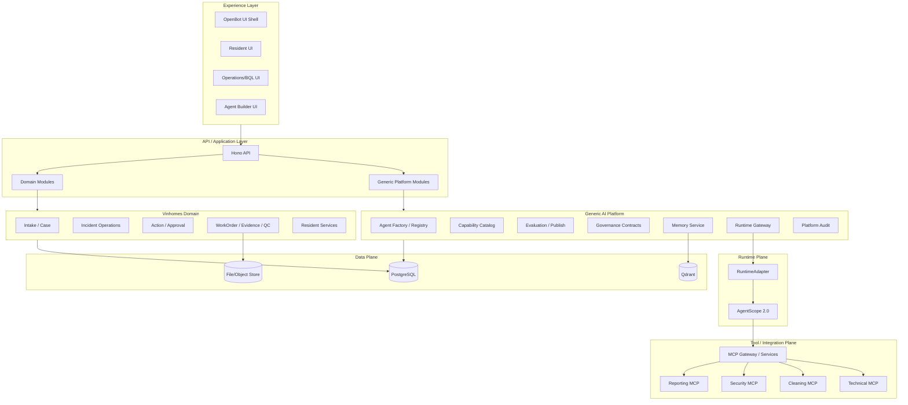
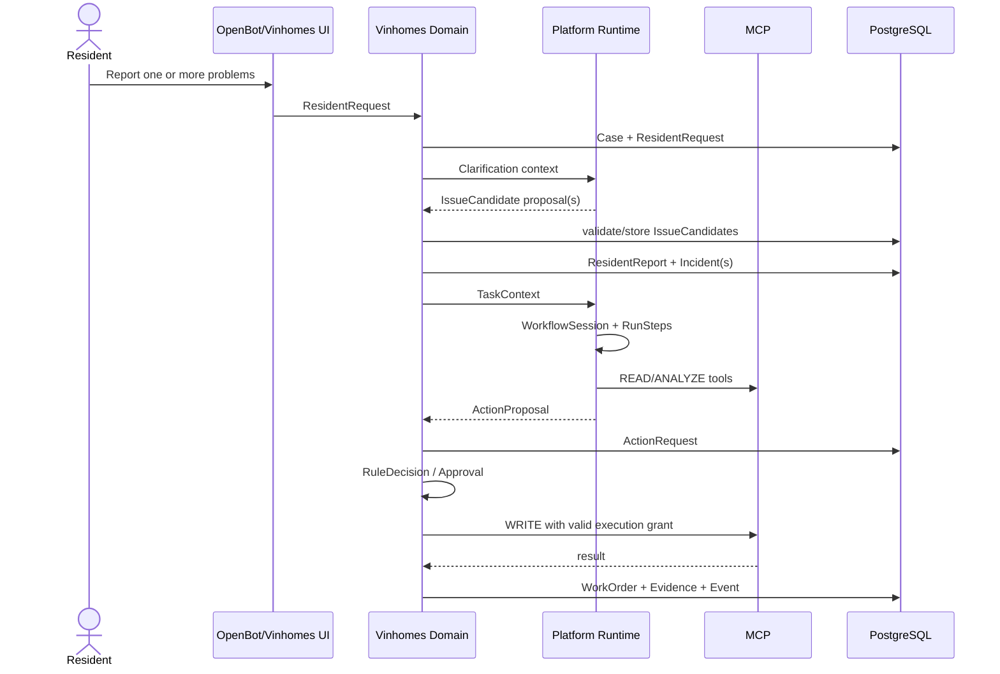
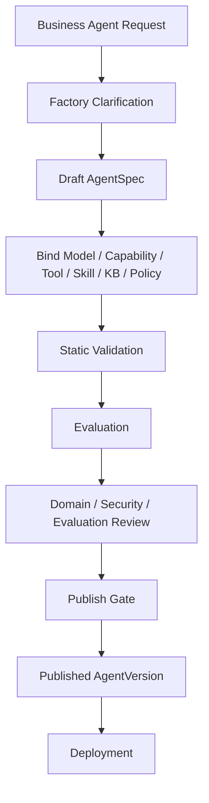

# 04 — System Design Structure & Code Architecture
## Generic AI Platform with Pluggable Domains

**Status:** Proposed code/architecture reorganization v1.0  
**Goal:** Convert the current Vinhomes-first OpenBot fork into a generic platform where Vinhomes is the first domain package and future domains such as Vinpearl can be added without rewriting platform core.

---

## 1. Final architectural decisions

### 1.1 Platform vs Domain

**Platform** is the reusable product/system.

It owns:
- UI shell and generic administration
- identity/tenant integration
- Agent Factory
- Agent Registry / AgentVersion
- capability/model/tool/MCP/skill/knowledge/policy catalogs
- evaluation and publish gate
- runtime orchestration
- semantic memory infrastructure
- platform audit/observability contracts

**Vinhomes** is a domain package.

It owns:
- project/tower/apartment scope
- resident intake/case/issue candidate
- ResidentReport/Incident
- business Task
- ActionRequest/Approval
- WorkOrder/Evidence/QC
- Vinhomes services such as booking, invoices, sanitation, security, technical operations

A future `vinpearl` package can add guest/resort/room/service-order business state without changing Agent Factory or runtime schemas.

---

## 2. Technology/framework freeze

### P0 critical path

| Layer | Decision |
|---|---|
| Product/UI shell | **OpenBot fork** |
| Generic platform control plane | **Custom TypeScript modules inside the existing Hono/OpenBot server** |
| Primary Agent runtime | **AgentScope 2.0 behind RuntimeAdapter** |
| Agent UI/runtime transport | Existing **AG-UI/HTTP integration boundary** where appropriate |
| Tool protocol | **MCP** |
| Business/platform source of truth | **PostgreSQL** |
| Semantic vector store | **Qdrant** |
| Files/evidence/artifacts | Object/file storage |
| Container/deployment | Existing OpenBot Docker/Helm conventions |

### P1/spike only
- Microsoft Agent Governance Toolkit — governance/policy/MCP security spike
- WSO2 Agent Manager — fleet/control-plane spike
- Microsoft Agent Framework — alternative runtime benchmark if GroupChat/Concurrent primitives materially reduce implementation cost

### Important correction to the current source document

The current design document contains a duplicated/contradictory AgentScope line: AgentScope 2.0 is described both as P0 critical runtime and again as a P1 candidate. For this architecture package the decision is frozen as:

> **AgentScope 2.0 = P0 runtime implementation.**  
> **Alternative runtimes = P1 benchmark behind RuntimeAdapter.**

---

## 3. Layered architecture



---

## 4. Recommended repository structure

This structure keeps the existing OpenBot repository usable while separating reusable platform code from Vinhomes domain code.

```text
repo/
├── app/                                  # Existing OpenBot React app
│   └── src/
│       ├── features/
│       │   ├── platform/                 # Generic platform UX
│       │   │   ├── agent-builder/
│       │   │   ├── agent-registry/
│       │   │   ├── capabilities/
│       │   │   ├── evaluation/
│       │   │   ├── memory/
│       │   │   └── admin/
│       │   └── domains/
│       │       └── vinhomes/
│       │           ├── resident/
│       │           ├── management/
│       │           ├── operations/
│       │           ├── sanitation/
│       │           └── shared/
│       └── routes/
│
├── server/
│   └── src/
│       ├── platform/                     # GENERIC PLATFORM
│       │   ├── context/
│       │   ├── tenancy/
│       │   ├── domains/
│       │   ├── agents/
│       │   │   ├── factory/
│       │   │   ├── registry/
│       │   │   ├── versions/
│       │   │   └── deployments/
│       │   ├── capabilities/
│       │   │   ├── models/
│       │   │   ├── mcp/
│       │   │   ├── tools/
│       │   │   ├── skills/
│       │   │   └── knowledge/
│       │   ├── policies/
│       │   ├── evaluation/
│       │   ├── runtime/
│       │   ├── actions/                  # generic action-proposal contract
│       │   ├── memory/
│       │   ├── audit/
│       │   ├── integrations/
│       │   └── routes.ts
│       │
│       ├── domains/
│       │   └── vinhomes/                 # VINHOMES BUSINESS DOMAIN
│       │       ├── context/
│       │       ├── property/
│       │       ├── intake/
│       │       ├── cases/
│       │       ├── incidents/
│       │       ├── tasks/
│       │       ├── actions/
│       │       ├── approvals/
│       │       ├── work-orders/
│       │       ├── evidence/
│       │       ├── qc/
│       │       ├── sanitation/
│       │       ├── resident-services/
│       │       ├── reporting/
│       │       ├── integrations/
│       │       ├── events/
│       │       └── routes.ts
│       │
│       └── db/
│           └── schema/
│               ├── platform/
│               │   ├── identity.ts
│               │   ├── domains.ts
│               │   ├── agents.ts
│               │   ├── capabilities.ts
│               │   ├── evaluation.ts
│               │   ├── runtime.ts
│               │   ├── memory.ts
│               │   └── audit.ts
│               └── domains/
│                   └── vinhomes/
│                       ├── property.ts
│                       ├── intake.ts
│                       ├── operations.ts
│                       ├── evidence.ts
│                       └── services.ts
│
├── agent-runtime/                        # GENERIC Python runtime service
│   ├── pyproject.toml
│   ├── Dockerfile
│   └── src/
│       ├── main.py
│       ├── contracts/
│       ├── runtime/
│       │   ├── base.py                  # RuntimeAdapter contract
│       │   ├── agentscope_adapter.py
│       │   ├── session.py
│       │   ├── checkpoint.py
│       │   └── events.py
│       ├── supervisor/
│       │   ├── planner.py
│       │   ├── participant_selector.py
│       │   └── replanner.py
│       ├── agents/
│       │   ├── reception.py             # generic role implementation
│       │   ├── factory.py
│       │   ├── evaluator.py
│       │   └── orchestrator.py
│       └── domain_adapters/
│           └── vinhomes.py
│
├── domain-tools/
│   ├── shared/
│   └── vinhomes/
│       ├── technical-mcp/
│       ├── cleaning-mcp/
│       ├── security-mcp/
│       └── reporting-mcp/
│
├── shared/
│   ├── platform/
│   │   ├── schemas.ts
│   │   ├── events.ts
│   │   ├── errors.ts
│   │   ├── agent-contracts.ts
│   │   ├── runtime-contracts.ts
│   │   └── action-contracts.ts
│   └── domains/
│       └── vinhomes/
│           ├── schemas.ts
│           ├── events.ts
│           ├── state-machines.ts
│           └── tool-contracts.ts
│
├── docs/
│   ├── architecture/
│   ├── erd/
│   ├── contracts/
│   │   ├── platform.openapi.yaml
│   │   └── domains/
│   │       └── vinhomes.openapi.yaml
│   └── adr/
│       ├── platform/
│       └── domains/
│           └── vinhomes/
│
├── research/
│   ├── platform/
│   └── domains/
│       └── vinhomes/
│
├── charts/openbot/
├── docker-compose.yml
└── .github/
```

---

## 5. Why rename `vin-platform`

The current `server/src/vin-platform` mixes:
- generic Agent Platform concerns, and
- Vinhomes business-domain concerns.

That becomes a structural problem as soon as Vinpearl is introduced.

### Migration target

```text
server/src/vin-platform/agents        → server/src/platform/agents
server/src/vin-platform/evaluation    → server/src/platform/evaluation
server/src/vin-platform/memory        → server/src/platform/memory

server/src/vin-platform/intake        → server/src/domains/vinhomes/intake
server/src/vin-platform/cases         → server/src/domains/vinhomes/cases
server/src/vin-platform/tickets       → server/src/domains/vinhomes/incidents
server/src/vin-platform/operations    → server/src/domains/vinhomes/...
server/src/vin-platform/approvals     → split:
                                        platform publish approvals
                                        vinhomes action approvals
```

Do this incrementally; no need for a big-bang refactor.

---

## 6. Domain plug-in contract

Every domain should expose a small adapter to the generic platform.

```typescript
interface DomainAdapter {
  namespace: string;

  resolveSubject(ref: DomainSubjectRef): Promise<DomainContext>;
  validateAction(proposal: ActionProposal): Promise<ActionValidation>;
  submitAction(proposal: ActionProposal): Promise<DomainActionReceipt>;

  listCapabilities(scope: DomainScope): Promise<DomainCapability[]>;
  resolveActorScope(actor: ActorRef): Promise<DomainScope>;

  getEvidence(refs: string[]): Promise<EvidenceDescriptor[]>;
}
```

### Platform never imports internal domain repositories

Correct:

```text
platform/runtime
  → DomainAdapter
  → domains/vinhomes/application service
```

Incorrect:

```text
platform/runtime
  → domains/vinhomes/db/repository
```

---

## 7. Runtime contract

```python
class RuntimeAdapter(Protocol):
    async def create_session(self, plan): ...
    async def execute_step(self, step): ...
    async def checkpoint(self, session_id): ...
    async def resume(self, session_id): ...
    async def cancel(self, session_id): ...
    async def stream_events(self, session_id): ...
```

P0:

```text
RuntimeAdapter
  └── AgentScopeRuntimeAdapter
```

Do not put AgentScope classes in TypeScript domain contracts.

---

## 8. Business vs runtime orchestration

Use two different vocabularies:

### Business domain
```text
Incident
Task
ActionRequest
Approval
WorkOrder
Evidence
QCResult
```

### Platform runtime
```text
WorkflowSession
RunStep
AgentRun
RuntimeArtifact
RuntimeDecision
ActionProposal
```

Never call a runtime node `Task` in the persisted platform schema.

---

## 9. Vinhomes request processing



---

## 10. Agent Factory flow



Factory never self-grants sensitive permissions and never self-publishes.

---

## 11. Action Executor boundary

Only the business domain owns its side effect.

```text
Agent
  → ActionProposal
  → DomainAdapter
  → ActionRequest
  → RuleDecision
  → Approval if required
  → Execution Grant
  → MCP WRITE
  → Business state update
```

Parallel agents should normally be limited to READ / ANALYZE / PROPOSE.

---

## 12. Database organization

Recommended logical schemas:

```text
platform_identity
platform_domain
platform_agent
platform_capability
platform_evaluation
platform_runtime
platform_memory
platform_audit

vh_property
vh_intake
vh_operations
vh_services
vh_content
```

### Cross-schema FK policy

Allowed:
- Vinhomes → shared `tenant/user` identity IDs.

Avoid:
- Vinhomes → `agent_run`
- Vinhomes → `agent_version`
- Vinhomes → `workflow_session`

Use provenance snapshots and correlation/trace IDs instead.

---

## 13. Qdrant rules

Qdrant stores only semantic vectors.

PostgreSQL stores:
- memory item identity
- revision
- review/approval
- redaction status
- `qdrant_point_id`
- embedding model
- dimension
- sync status

Retrieval must:
1. resolve tenant/domain scope;
2. retrieve candidate vectors;
3. re-check the PostgreSQL revision is still approved and accessible;
4. return only allowed context.

Qdrant is never used for Case/Incident/Task/Workflow state.

---

## 14. MCP organization

```text
domain-tools/
├── vinhomes/
│   ├── technical-mcp/
│   ├── cleaning-mcp/
│   ├── security-mcp/
│   └── reporting-mcp/
└── future/
    └── vinpearl/
        └── ...
```

Each service:
```text
src/
├── index.ts
├── tools.ts
├── client.ts
└── providers/
    ├── mock-provider.ts
    └── real-provider.ts
```

MCP services:
- do not access PostgreSQL/Qdrant directly;
- use service credentials;
- do not decide approval/policy;
- reject unauthorized WRITE execution.

---

## 15. Contract-first package layout

### Generic contracts
```text
shared/platform/
├── agent-contracts.ts
├── capability-contracts.ts
├── runtime-contracts.ts
├── action-contracts.ts
├── evaluation-contracts.ts
├── events.ts
└── errors.ts
```

### Vinhomes contracts
```text
shared/domains/vinhomes/
├── property.ts
├── intake.ts
├── incident.ts
├── task.ts
├── action.ts
├── work-order.ts
├── evidence.ts
├── state-machines.ts
└── events.ts
```

Platform code must not import `shared/domains/vinhomes/*` except through the domain adapter integration package.

---

## 16. Event model

Two event streams are conceptually different.

### Platform events
Examples:
- `AGENT_VERSION_CREATED`
- `EVALUATION_COMPLETED`
- `AGENT_PUBLISHED`
- `AGENT_SUSPENDED`
- `RUN_STARTED`
- `TOOL_CALL_DENIED`

### Vinhomes domain events
Examples:
- `RESIDENT_REPORT_CREATED`
- `INCIDENT_TRIAGED`
- `TASK_ASSIGNED`
- `ACTION_APPROVAL_REQUIRED`
- `WORK_ORDER_COMPLETED`
- `QC_FAILED`
- `INCIDENT_RESOLVED`

Do not merge both into one giant untyped event model.

---

## 17. Ownership recommendation

### Platform team
Owns:
- `server/src/platform/**`
- `agent-runtime/**`
- `shared/platform/**`
- platform DB schemas
- platform OpenAPI
- Agent Factory/Evaluation/Memory infrastructure

### Vinhomes domain team
Owns:
- `server/src/domains/vinhomes/**`
- `shared/domains/vinhomes/**`
- Vinhomes DB schemas
- Vinhomes OpenAPI
- domain MCP services
- domain fixtures/gold sets

### Cross-team review required for
- DomainAdapter contract
- ActionProposal/ActionRequest contract
- ActorRef
- correlation/idempotency conventions
- runtime subject reference
- schema migration across shared boundaries

---

## 18. Migration plan from current repository

### Phase 0 — no behavior change
1. Create `server/src/platform/`.
2. Create `server/src/domains/vinhomes/`.
3. Create `shared/platform/` and `shared/domains/vinhomes/`.
4. Define adapter contracts and dependency rules.
5. Add architecture tests/lint boundaries if possible.

### Phase 1 — move generic modules
Move:
- agent builder/registry/version
- evaluation
- memory infrastructure
- generic audit/runtime contracts

from `vin-platform` to `platform`.

### Phase 2 — move Vinhomes modules
Move:
- intake/cases
- incident/ticket
- operations
- domain action approvals
- WorkOrder/evidence/QC

into `domains/vinhomes`.

### Phase 3 — runtime genericization
Rename `agent-vinhomes` to a generic runtime service when practical:
```text
agent-runtime
```
and move Vinhomes-specific prompt/context mapping into:
```text
agent-runtime/src/domain_adapters/vinhomes.py
```

### Phase 4 — future domain proof
Add an empty `vinpearl` sample adapter with one mock subject/action contract. If Agent Factory/runtime do not require changes, the abstraction is validated.

---

## 19. ADRs to freeze

Create:

```text
docs/adr/platform/
0001-platform-vs-domain-boundary.md
0002-openbot-product-shell.md
0003-runtime-adapter-agentscope2.md
0004-domain-adapter-contract.md
0005-action-proposal-boundary.md
0006-agent-version-immutability.md
0007-evaluation-publish-gate.md
0008-memory-postgres-qdrant.md
0009-cross-domain-reference-policy.md
0010-event-and-idempotency.md
```

Vinhomes-specific ADRs:

```text
docs/adr/domains/vinhomes/
0001-incident-is-canonical-ticket.md
0002-case-issuecandidate-intake.md
0003-action-request-approval.md
0004-workorder-redo-qc.md
0005-a5-cleaning-plan-json.md
```

---

## 20. Architecture invariants

1. **Platform is reusable; Vinhomes is a plugin/domain package.**
2. **OpenBot is UI/product shell, not the source of business state.**
3. **AgentScope 2.0 is an implementation behind RuntimeAdapter, not a platform domain model.**
4. **PostgreSQL is authoritative.**
5. **Qdrant stores approved vectors only.**
6. **Business side effects stay inside the domain.**
7. **Agents propose; domains authorize and execute.**
8. **No mandatory Agent-runtime FK in business-domain tables.**
9. **AgentVersion is immutable after formal evaluation/publish.**
10. **A new domain must integrate through DomainAdapter without requiring changes to Agent Factory schema.**
