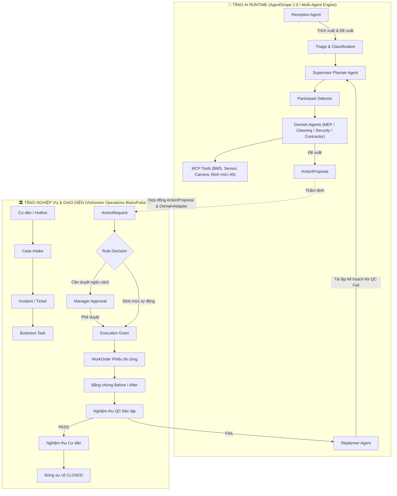

# 05 — Đặc Tả Chi Tiết Toàn Bộ Giao Diện & Luồng Nghiệp Vụ Vận Hành
## Vinhomes Operations & Workforce Platform (Chuẩn BistroPulse Admin)

**Phiên bản:** v1.0 (Hoàn chỉnh & Đầy đủ)  
**Tác giả:** Đội ngũ Phát triển Nền tảng Vận hành Vinhomes  
**Phạm vi:** Đặc tả chi tiết 100% màn hình, chức năng, luồng dữ liệu, tương tác giữa 7 vai trò (RBAC) và sự điều phối của hệ thống AI Multi-Agent.

---

## MỤC LỤC
1. [TỔNG QUAN KIẾN TRÚC & MÔ HÌNH ĐIỀU PHỐI HAI TẦNG (DUAL-PLANE)](#1-tổng-quan-kiến-trúc--mô-hình-điều-phối-hai-tầng-dual-plane)
2. [MA TRẬN PHÂN QUYỀN 7 VAI TRÒ VẬN HÀNH (RBAC MATRIX)](#2-ma-trận-phân-quyền-7-vai-trò-vận-hành-rbac-matrix)
3. [ĐẶC TẢ CHI TIẾT TOÀN BỘ 12 MÀN HÌNH GIAO DIỆN](#3-đặc-tả-chi-tiết-toàn-bộ-12-màn-hình-giao-diện)
   - [Màn hình 1: Tổng quan Vận hành (Dashboard)](#màn-hình-1-tổng-quan-vận-hành-operations-dashboard)
   - [Màn hình 2: Việc của tôi (My Tasks)](#màn-hình-2-việc-của-tôi-my-tasks-workspace)
   - [Màn hình 3: Tiếp nhận phản ánh & AI Triage (Triage)](#màn-hình-3-tiếp-nhận-phản-ánh--ai-triage-triage-workspace)
   - [Màn hình 4: Quản lý sự cố & Vòng đời Ticket (Incidents)](#màn-hình-4-quản-lý-sự-cố--vòng-đời-ticket-incidents-workspace)
   - [Màn hình 5: Bảng phân công nhiệm vụ (Kanban Board)](#màn-hình-5-bảng-phân-công-nhiệm-vụ-kanban-board)
   - [Màn hình 6: Phiếu thi công & Công tác (Work Orders)](#màn-hình-6-phiếu-thi-công--công-tác-work-orders-table--modal)
   - [Màn hình 7: Nghiệm thu chất lượng độc lập (QC Inspection)](#màn-hình-7-nghiệm-thu-chất-lượng-độc-lập-qc-workspace--modal)
   - [Màn hình 8: Hàng đợi phê duyệt chi phí (Approvals)](#màn-hình-8-hàng-đợi-phê-duyệt-chi-phí-approval-queue)
   - [Màn hình 9: Không gian Vệ sinh môi trường A5 (Sanitation A5)](#màn-hình-9-không-gian-vệ-sinh-môi-trường-a5-sanitation-workspace)
   - [Màn hình 10: An ninh & Trật tự hiện trường (Security)](#màn-hình-10-an-ninh--trật-tự-hiện-trường-security-workspace)
   - [Màn hình 11: Cổng nhà thầu kỹ thuật (Contractor Portal)](#màn-hình-11-cổng-nhà-thầu-kỹ-thuật-contractor-workspace)
   - [Màn hình 12: Thư viện hình ảnh bằng chứng (Evidence Gallery)](#màn-hình-12-thư-viện-hình-ảnh-bằng-chứng-evidence-gallery)
4. [CÁC LUỒNG NGHIỆP VỤ LIÊN TỤC & TƯƠNG TÁC GIỮA CÁC MÀN HÌNH](#4-các-luồng-nghiệp-vụ-liên-tục--tương-tác-giữa-các-màn-hình)
5. [BẢNG MÃ TRẠNG THÁI & RÀNG BUỘC TOÀN VẸN (STATE MACHINES & INVARIANTS)](#5-bảng-mã-trạng-thái--ràng-buộc-toàn-vẹn-state-machines--invariants)

---

## 1. TỔNG QUAN KIẾN TRÚC & MÔ HÌNH ĐIỀU PHỐI HAI TẦNG (DUAL-PLANE)

Hệ thống được thiết kế theo mô hình **Hai tầng độc lập nhưng liên kết chặt chẽ**:



### Nguyên tắc ranh giới an toàn:
1. **Agent chỉ có quyền READ, ANALYZE và PROPOSE**: AI lắng nghe phản ánh, tra cứu sơ đồ kỹ thuật, phân tích nguyên nhân và *đề xuất* giải pháp (`ActionProposal`).
2. **Domain & Con người nắm giữ quyền WRITE và Quyết định tài chính**: Chỉ khi Ban Quản Lý (Manager) hoặc Luật nghiệp vụ cấp `Execution Grant`, hệ thống mới được phép ghi vào cơ sở dữ liệu và ban hành lệnh thi công (`WorkOrder`) thực tế.
3. **Tính độc lập của dữ liệu**: Hệ thống vận hành bình thường ngay cả khi không có AI (Manual Fallback).

---

## 2. MA TRẬN PHÂN QUYỀN 7 VAI TRÒ VẬN HÀNH (RBAC MATRIX)

Giao diện áp dụng cơ chế **Dynamic Role-Based Access Control (RBAC)**: khi người dùng chọn một Persona ở dropdown góc trên bên trái, thanh Sidebar sẽ tự động co giãn, chỉ hiển thị đúng các phân hệ mà vai trò đó có thẩm quyền.

| STT | Mã Vai Trò (`OperationsPersona`) | Tên Nhân Sự Đại Diện | Chức Danh & Phòng Ban | Các Menu Được Phép Truy Cập | canQC | canApproveBudget | canAssignWork |
| :---: | :--- | :--- | :--- | :--- | :---: | :---: | :---: |
| **1** | `STAFF_TECHNICAL` | Nguyễn Văn Hùng | Kỹ thuật viên MEP & PCCC (Ban Kỹ Thuật Tòa Nhà) | `my-tasks`, `work-orders`, `evidence` | ❌ | ❌ | ❌ |
| **2** | `STAFF_SANITATION_A5` | Lê Thị Bích | Nhân viên Vệ sinh Môi trường & Cảnh quan A5 | `my-tasks`, `sanitation`, `evidence` | ❌ | ❌ | ❌ |
| **3** | `STAFF_SECURITY` | Phạm Văn Đạt | Nhân viên An ninh & Tuần tra Hiện trường | `my-tasks`, `security`, `incidents`, `evidence` | ❌ | ❌ | ❌ |
| **4** | `CONTRACTOR` | Hoàng Long | Đại diện Kỹ thuật Nhà thầu Thang máy Otis | `my-tasks`, `contractor`, `work-orders`, `evidence` | ❌ | ❌ | ❌ |
| **5** | `SUPERVISOR` | Trần Thị Mai | Trưởng ca & Giám sát Vận hành Hiện trường | `dashboard`, `my-tasks`, `kanban`, `work-orders`, `sanitation`, `security`, `incidents`, `evidence` | ❌ | ❌ | ✅ |
| **6** | `QC_INSPECTOR` | Đặng Quốc Tuấn | Kỹ sư Độc lập Kiểm định Chất lượng (Phòng QC) | `dashboard`, `my-tasks`, `qc`, `work-orders`, `evidence` | ✅ *(Độc quyền)* | ❌ | ❌ |
| **7** | `MANAGER` | Vũ Đức Thịnh | Trưởng Ban Quản Lý Đô Thị (Ban Giám Đốc BQL) | **Toàn bộ 12 màn hình** | ❌ *(Giám sát)* | ✅ *(Độc quyền)* | ✅ |

### Quy tắc bất biến về phân tách trách nhiệm (Segregation of Duties):
- **Kỹ thuật viên / Vệ sinh / Nhà thầu (`canQC = false`)**: Không bao giờ được tự nghiệm thu bài làm của chính mình.
- **Trưởng ca & Giám sát (`canQC = false`)**: Không được nghiệm thu các công việc do chính ca mình phân công hoặc trực tiếp giám sát, nhằm loại bỏ rủi ro bao che lỗi.
- **Chuyên viên QC (`canQC = true`)**: Là người duy nhất có quyền ký biên bản PASS / FAIL / INCONCLUSIVE. QC không kiêm nhiệm việc phê duyệt ngân sách hay phân công thợ.
- **Ban Quản Lý (`canApproveBudget = true`)**: Là người duy nhất có quyền duyệt chi phí phát sinh và duyệt đóng vĩnh viễn sự cố sau khi cư dân xác nhận hài lòng.

---

## 3. ĐẶC TẢ CHI TIẾT TOÀN BỘ 12 MÀN HÌNH GIAO DIỆN

---

### Màn hình 1: Tổng quan Vận hành (`Operations Dashboard`)
- **Đường dẫn URL:** `http://localhost:3020/operations`
- **Vai trò được xem:** `MANAGER`, `SUPERVISOR`, `QC_INSPECTOR`
- **Mục đích:** Cung cấp bức tranh toàn cảnh về sức khỏe vận hành của khu đô thị trong ngày theo thời gian thực.

#### Bố cục & Khối hiển thị:
1. **Thanh chỉ số KPI cốt lõi (Top Stat Cards):**
   - *Tổng số sự cố trong ngày:* Số lượng, phân tách theo đã xử lý / đang mở.
   - *Tỷ lệ tuân thủ cam kết chất lượng (SLA Compliance Rate):* Mục tiêu ≥ 98%.
   - *Cảnh báo khẩn cấp P1 đang mở:* Đèn cảnh báo nhấp nháy đỏ nếu có sự cố nghiêm trọng (vd: kẹt thang máy, tràn nước hầm, báo cháy).
   - *Khối lượng phiếu công tác hoàn thành (`WorkOrders Done`):* Số lượng phiếu kỹ thuật và vệ sinh đã xong.
2. **Biểu đồ phân bổ sự cố theo phân khu & lĩnh vực:**
   - Cơ điện MEP, Vệ sinh môi trường A5, An ninh trật tự, Nhà thầu thiết bị ngoài.
3. **Danh sách sự cố khẩn cấp cần can thiệp ngay:**
   - Hiển thị bảng tóm tắt các sự cố P1 quá hạn 30 phút mà chưa có nhân viên nhận việc.

---

### Màn hình 2: Việc của tôi (`My Tasks Workspace`)
- **Đường dẫn URL:** `http://localhost:3020/operations/my-tasks`
- **Vai trò được xem:** Tất cả 7 vai trò (Mỗi người sẽ thấy danh sách việc được giao đích danh cho cá nhân mình).
- **Mục đích:** "Bàn làm việc số" của nhân sự hiện trường, hướng dẫn từng bước thi công, chụp ảnh bằng chứng và báo hoàn thành.

#### Bố cục & Khối hiển thị:
1. **Thanh tóm tắt công việc cá nhân:**
   - Đang làm (`IN_PROGRESS`), Chờ nhận việc (`ASSIGNED`), Cần làm lại do QC trả về (`REDO / FAILED`).
2. **Bảng danh sách Phiếu công tác cá nhân (`Compact Table View`):**
   - *Cột Tiêu đề công việc:* Tên nhiệm vụ kèm badge mức khẩn cấp P1/P2/P3.
   - *Cột Vị trí cụ thể:* Tòa nhà, Tầng, Căn hộ hoặc Khu vực công cộng.
   - *Cột Hạn chót (Due Time):* Thời gian đếm ngược SLA.
   - *Cột Trạng thái:* Badge màu chuẩn xác (`ASSIGNED` xanh dương, `IN_PROGRESS` cam, `COMPLETED` xanh lá, `FAILED` đỏ).
   - *Cột Thao tác trực tiếp (Quick Actions):*
     - Nút **"Bắt đầu"**: Xuất hiện khi phiếu ở `ASSIGNED`, bấm để chuyển sang `IN_PROGRESS`.
     - Nút **"Chụp Before"**: Mở modal camera để tải ảnh hiện trạng trước khi thi công.
     - Nút **"Chụp After"**: Mở modal camera để tải ảnh hiện trạng đã khắc phục xong.
     - Nút **"Báo hoàn thành"**: Chỉ kích hoạt khi đã có đủ ảnh Before và After.
     - Nút **"Xem chi tiết" (Icon mắt/thông tin)**: Mở Modal chi tiết phiếu công tác.
3. **Modal Chi Tiết Phiếu Công Tác & Checklist:**
   - Mã phiếu công tác (`WO-2026-xxx`), mã Ticket gốc (`INC-2026-xxx`).
   - Danh sách checklist kỹ thuật từng bước (Checklist items có checkbox để tick).
   - Khung xem trước ảnh Before và After đã chụp.
   - Ghi chú từ Giám sát hoặc lý do từ chối của QC nếu là phiếu làm lại (Redo).

---

### Màn hình 3: Tiếp nhận phản ánh & AI Triage (`Triage Workspace`)
- **Đường dẫn URL:** `http://localhost:3020/operations/triage`
- **Vai trò được xem:** `MANAGER`
- **Mục đích:** Trung tâm tiếp nhận phản ánh thô từ cư dân, đối thoại làm rõ và ứng dụng AI phân loại để khởi tạo Ticket chính thức.

#### Bố cục & Khối hiển thị:
1. **Cột trái (4 Cột) — Danh sách Ý kiến cư dân (`Cases List`):**
   - Danh sách các hồ sơ phản ánh tiếp nhận từ App cư dân hoặc Tổng đài.
   - Hiển thị: Mã hồ sơ `CASE-2026-xxx`, tên cư dân, số điện thoại, căn hộ, tóm tắt ý kiến, mốc thời gian gửi.
   - Badge trạng thái: `TICKETED` (Đã mở sự cố), `READY` (Sẵn sàng xử lý), `CLARIFYING` (Đang làm rõ).
2. **Cột phải (8 Cột) — Chi tiết phản ánh & Đề xuất từ AI:**
   - *Khối thông tin cư dân:* Tên, căn hộ, số điện thoại liên hệ trực tiếp.
   - *Khối nội dung phản ánh thô:* Toàn văn câu chữ cư dân gửi qua app/chat.
   - *Khối Phương án đề xuất từ AI (AI Suggestions Card ✨):*
     - **Chỉ số tin cậy AI (Confidence Score):** Ví dụ `Độ khớp AI: 95%`.
     - **Bộ phận phụ trách tự động:** Gợi ý đúng phòng ban (`MEP`, `Sanitation`, `Elevator`...).
     - **Vị trí và Mức độ nghiêm trọng:** Tự động điền Tòa, Tầng, Khu vực và gán nhãn `P1/P2/P3`.
3. **Các nút hành động tương tác:**
   - Nút **"Tách việc (Split)"**: Mở modal cho phép tách 1 phản ánh phức hợp thành 2 nhiệm vụ riêng biệt (ví dụ: Tách thành 1 việc Kỹ thuật sửa ống nước + 1 việc Vệ sinh lau sàn).
   - Nút **"Gộp trùng (Merge)"**: Mở modal gộp phản ánh này vào một Ticket đã có sẵn nếu nhiều cư dân cùng báo một sự cố.
   - Nút **"Xác nhận & Chuyển giao (Materialize)"**: Phê duyệt đề xuất AI để chính thức sinh ra mã Ticket `INC-2026-xxx` và chuyển sang màn hình Quản lý sự cố.

---

### Màn hình 4: Quản lý sự cố & Vòng đời Ticket (`Incidents Workspace`)
- **Đường dẫn URL:** `http://localhost:3020/operations/incidents`
- **Vai trò được xem:** `MANAGER`, `SUPERVISOR`, `STAFF_SECURITY`
- **Mục đích:** Quản lý trọn vẹn vòng đời 6 giai đoạn của Ticket, điều phối nhiệm vụ con và theo dõi biên bản bàn giao cho cư dân.

#### Bố cục & Khối hiển thị:
1. **Cột trái — Danh sách Ticket (`Incident List`):**
   - Danh sách tất cả sự cố đô thị (`INC-2026-001`, `INC-2026-002`,...).
   - Hiển thị mức độ ưu tiên P1/P2/P3, thời gian mở, vị trí tòa nhà.
2. **Cột phải — Hồ sơ chi tiết Ticket:**
   - **Thanh tiến trình 6 giai đoạn trực quan:**
     `1. Tiếp nhận (INTAKE)` ➔ `2. Phân loại (TRIAGE)` ➔ `3. Lên phương án (PLANNING)` ➔ `4. Đang sửa chữa (EXECUTION)` ➔ `5. Nghiệm thu (QC)` ➔ `6. Cư dân xác nhận (RESIDENT_CONFIRMATION)`.
   - **Hệ thống 4 Tabs nghiệp vụ chuyên sâu:**
     - *Tab 1: Nhiệm vụ (`TASKS`):* Xem danh sách các Task con trực thuộc Ticket.
     - *Tab 2: Phiếu thi công (`WORK ORDERS`):* Danh sách các đợt thi công (Attempt 1, Attempt 2 redo).
     - *Tab 3: Thảo luận (`MESSAGES`):* Khung chat trao đổi nội bộ giữa Giám sát, Kỹ thuật và Quản lý tòa nhà kèm mốc thời gian.
     - *Tab 4: Dòng thời gian (`TIMELINE`):* Lịch sử kiểm toán ghi nhận từng bước đổi trạng thái, cảnh báo SLA và nhật ký phân công.
     - *Tab 5: Liên kết sự cố (`RELATIONS`):* Cây phả hệ liên kết sự cố trùng lặp (`DUPLICATE`) hoặc quan hệ nhân quả (`CAUSED_BY`).
3. **Các nút hành động nghiệp vụ quan trọng:**
   - Nút **"Hoàn tất xử lý (Resolve)"**: Chỉ sáng và bấm được khi **100% các nhiệm vụ con đều có phiếu thi công COMPLETED và đạt QC PASS**. Bấm nút này sẽ chuyển Ticket sang giai đoạn `RESIDENT_CONFIRMATION` và trạng thái `RESOLVED`.
   - Nút **"Mô phỏng: Cư dân đồng ý nghiệm thu"**: Đóng vai trò giả lập cư dân xác nhận hài lòng ➔ BQL duyệt chuyển Ticket sang trạng thái cuối cùng **`CLOSED`**.
   - Nút **"Mô phỏng: Cư dân khiếu nại"**: Trả Ticket ngược về giai đoạn `EXECUTION` để kiểm tra bổ sung.

---

### Màn hình 5: Bảng phân công nhiệm vụ (`Kanban Board`)
- **Đường dẫn URL:** `http://localhost:3020/operations/kanban`
- **Vai trò được xem:** `MANAGER`, `SUPERVISOR`
- **Mục đích:** Cung cấp giao diện trực quan dạng thẻ bài (Kanban) để Giám sát phân bổ và điều phối tải công việc giữa các đội ngũ.

#### Bố cục & Khối hiển thị:
1. **Bộ lọc thông minh đầu bảng:**
   - Lọc theo phân khu tòa nhà, lọc theo phòng ban chuyên môn (`MEP`, `Sanitation`, `Security`, `Contractor`).
2. **4 Cột trạng thái công việc chuẩn:**
   - *Cột 1: Chờ phân công (`OPEN`)* — Các nhiệm vụ mới sinh ra từ Ticket chưa có thợ nhận.
   - *Cột 2: Đã giao việc (`ASSIGNED`)* — Đã gán nhân viên phụ trách, đang chờ nhân viên tới hiện trường.
   - *Cột 3: Đang thi công (`IN_PROGRESS`)* — Nhân viên đang thao tác tại căn hộ/tòa nhà.
   - *Cột 4: Đã hoàn thành (`DONE`)* — Đã làm xong và hoàn tất nghiệm thu QC.
3. **Thao tác tương tác:**
   - Bấm vào thẻ nhiệm vụ để xem chi tiết người nhận việc, đổi người làm (Reassign) hoặc xem phiếu công tác gắn liền.

---

### Màn hình 6: Phiếu thi công & Công tác (`Work Orders Table & Modal`)
- **Đường dẫn URL:** `http://localhost:3020/operations/work-orders`
- **Vai trò được xem:** `MANAGER`, `SUPERVISOR`, `QC_INSPECTOR`, `STAFF_TECHNICAL`, `CONTRACTOR`
- **Mục đích:** Bảng tra cứu tập trung toàn bộ các phiếu thi công chi tiết, quản lý số lần thử nghiệm (`Attempt 1`, `Attempt 2`) và truy xuất nguồn gốc chất lượng.

#### Bố cục & Khối hiển thị:
1. **Bộ lọc đa chiều:**
   - Tìm kiếm theo mã phiếu `WO-2026-xxx`, lọc theo trạng thái thi công, lọc theo lĩnh vực chuyên môn.
2. **Bảng dữ liệu chuẩn Enterprise:**
   - *Cột Mã Phiếu:* Hiển thị mã WO, nếu là phiếu làm lại sẽ có nhãn `REDO OF WO-xxx`.
   - *Cột Ticket liên kết:* Mã Incident gốc.
   - *Cột Người thực hiện:* Avatar và tên nhân viên/nhà thầu được gán.
   - *Cột Checklist:* Tỷ lệ các bước đã kiểm tra (vd: `4/4 bước`).
   - *Cột Bằng chứng:* Icon thể hiện đã nộp ảnh Before / After hay chưa.
   - *Cột Kết quả QC:* Badge xanh `PASS`, đỏ `FAIL`, hoặc xám `CHỜ QC`.
   - *Cột Thao tác:* Nút mở hộp thoại chi tiết (`Dialog`).

---

### Màn hình 7: Nghiệm thu chất lượng độc lập (`QC Workspace & Modal`)
- **Đường dẫn URL:** `http://localhost:3020/operations/qc`
- **Vai trò được xem:** `QC_INSPECTOR`, `MANAGER`
- **Mục đích:** Phân hệ độc quyền của Chuyên viên Kiểm định Chất lượng (QC) để đối chiếu bằng chứng, chấm tiêu chí kỹ thuật và đưa ra phán quyết chất lượng.

#### Bố cục & Khối hiển thị:
1. **Hàng đợi công việc chờ kiểm định (`Pending QC Queue`):**
   - Danh sách các phiếu công tác đã được nhân viên bấm báo hoàn thành (`COMPLETED`) và đang chờ nghiệm thu thực tế.
   - Nút hành động nổi bật: **"Nghiệm thu ngay"** (mở Modal kiểm định).
2. **Modal Kiểm Định Chất Lượng Chuyên Sâu (QC Inspector Modal):**
   - **Khung so sánh ảnh song song (Side-by-Side Comparison):**
     - Cửa sổ bên trái: **Ảnh hiện trạng ban đầu (BEFORE)** có tọa độ GPS và thời gian báo hỏng.
     - Cửa sổ bên phải: **Ảnh sau khắc phục (AFTER)** có tọa độ GPS và thời gian hoàn thành.
   - **Bảng Checklist tiêu chuẩn kỹ thuật:**
     - Danh sách từng tiêu chí nghiệm thu chi tiết kèm checkbox đạt/không đạt (ví dụ: Áp lực nước đạt 3.5 bar, Đã thu dọn phế liệu, Không rò rỉ điện).
   - **Ô nhập nhận xét & đánh giá chuyên môn:** Ghi chú nguyên nhân nếu từ chối.
3. **3 Nút quyết định nghiệm thu cốt lõi:**
   - 🟢 **Nút "Ký duyệt ĐẠT (PASS)":**
     - Đóng dấu QC đạt chuẩn. Ghi nhận bản ghi kiểm tra bất biến `vh_qc_result`.
     - Cho phép Ticket tiến tới giai đoạn hoàn tất bàn giao cư dân.
   - 🔴 **Nút "Ký duyệt KHÔNG ĐẠT (FAIL) — Tự động kích hoạt Redo Chain":**
     - Hệ thống từ chối nghiệm thu và **ngay lập tức tự động sinh ra `WorkOrder Attempt 2` (Lần 2)** với thuộc tính `redo_of = Attempt 1`.
     - Chuyển trạng thái Task liên quan quay về `IN_PROGRESS` để nhân viên vào sửa lại ngay mà không cần con người tạo phiếu thủ công.
   - 🟡 **Nút "CHƯA RÕ (INCONCLUSIVE) — Yêu cầu bổ sung bằng chứng":**
     - Áp dụng khi ảnh mờ, góc chụp không rõ hoặc thiếu thông tin đo đạc. Phiếu công tác được trả về trạng thái `IN_PROGRESS` để nhân viên bổ sung ảnh mới.

---

### Màn hình 8: Hàng đợi phê duyệt chi phí (`Approval Queue`)
- **Đường dẫn URL:** `http://localhost:3020/operations/approvals`
- **Vai trò được xem:** `MANAGER` *(Độc quyền Ban Quản Lý)*
- **Mục đích:** Kiểm soát tài chính và rủi ro vận hành. Duyệt các đề xuất mua sắm linh kiện, thuê nhà thầu hoặc xử lý vượt hạn mức ngân sách định kỳ.

#### Bố cục & Khối hiển thị:
1. **Thống kê phê duyệt:**
   - Số lượng yêu cầu đang chờ (`PENDING`), Đã duyệt trong tuần (`APPROVED`), Đã từ chối (`REJECTED`).
2. **Thẻ yêu cầu phê duyệt chi tiết (`ActionRequest Card`):**
   - *Đối tượng khởi tạo đề xuất:* Ghi rõ người gửi là **AI Agent** (`agent-mep-copilot`) hoặc Giám sát hiện trường.
   - *Hạng mục đề xuất:* Tên vật tư thay thế, thông số kỹ thuật, nhà cung cấp dự kiến.
   - *Số tiền ngân sách:* Ví dụ `6.500.000 VNĐ` (kèm so sánh với hạn mức tự quyết cho phép).
   - *Mã băm bảo mật (`Payload Hash`):* Chuỗi hash kiểm tra tính toàn vẹn dữ liệu, đảm bảo nội dung mua sắm không bị chỉnh sửa sau khi gửi.
3. **Thao tác hành động:**
   - Nút **"Phê duyệt (Approve)"**: Hệ thống ban hành **Giấy phép thực thi (`Execution Grant`)**. Chỉ khi có giấy phép này, phiếu mua sắm và thi công mới được quyền triển khai.
   - Nút **"Từ chối (Reject)"**: Hủy yêu cầu và trả về cho người lập đề xuất kèm lý do.

---

### Màn hình 9: Không gian Vệ sinh môi trường A5 (`Sanitation Workspace`)
- **Đường dẫn URL:** `http://localhost:3020/operations/sanitation`
- **Vai trò được xem:** `STAFF_SANITATION_A5`, `SUPERVISOR`, `MANAGER`
- **Mục đích:** Không gian số chuyên biệt phục vụ phân khu A5 và cảnh quan, chuẩn hóa quy trình khử khuẩn, thu gom rác thải và làm sạch khuôn viên.

#### Bố cục & Khối hiển thị:
1. **Thông tin phân khu & Định mức tiêu chuẩn A5:**
   - Tên phân khu phụ trách (`Grand Sapphire`), số lượng thùng rác, diện tích mặt sàn hành lang.
   - Bảng tra cứu định mức pha hóa chất tẩy rửa an toàn sinh học.
2. **Thẻ nhiệm vụ vệ sinh hiện tại (`Active Cleaning WorkOrder`):**
   - Hiển thị công việc đang xử lý (ví dụ: `WO-2026-082` — Xử lý nước tràn tầng 12).
   - Danh sách 5 bước làm sạch có checkbox.
3. **Thao tác hành động:**
   - Chụp ảnh Before hiện trường bẩn.
   - Chụp ảnh After sau khi sàn nhà đã khô ráo, sạch bóng.
   - Nút **"Xác nhận hoàn thành ca vệ sinh"** để đẩy sang hàng đợi QC.

---

### Màn hình 10: An ninh & Trật tự hiện trường (`Security Workspace`)
- **Đường dẫn URL:** `http://localhost:3020/operations/security`
- **Vai trò được xem:** `STAFF_SECURITY`, `SUPERVISOR`, `MANAGER`
- **Mục đích:** Số hóa hoạt động tuần tra chốt chặn, xử lý sự vụ an ninh khẩn cấp P1 và bàn giao ca trực thông minh.

#### Bố cục & Khối hiển thị:
1. **Khối 1: Điểm danh trạm tuần tra thông minh (`Patrol Checkpoints`):**
   - Danh sách 4 trạm tuần tra trọng yếu: Cổng số 2, Hầm B1, Tủ PCCC tầng 5, Thang thoát hiểm S1.
   - Nút bấm **"Check-in trạm"** (mô phỏng quét mã QR / thẻ NFC hiện trường).
   - Thanh tiến độ tuần tra: Khi hoàn thành đủ 100% trạm (4/4), thẻ hoàn thành phiếu công tác tuần tra `WO-2026-090` sẽ tự động hiển thị để bấm kết thúc ca.
2. **Khối 2: Lập biên bản sự việc khẩn cấp P1 (`Emergency Escalation Form`):**
   - Form báo cáo nhanh: Nhập tiêu đề sự vụ (Cháy nổ, va chạm xe, người lạ xâm nhập), chọn vị trí tòa nhà và mức độ khẩn cấp.
   - Nút **"Báo động sự việc P1"**: Hệ thống tự động tạo ngay Ticket P1 và kích hoạt chuông cảnh báo đỏ trên thanh Header của toàn bộ nhân sự quản lý.
3. **Khối 3: Bàn giao ca trực an ninh (`Shift Handover`):**
   - Kiểm kê số lượng công cụ hỗ trợ: Bộ đàm (3 chiếc), Gậy chỉ huy (2 chiếc), Sổ trực ca.

---

### Màn hình 11: Cổng nhà thầu kỹ thuật (`Contractor Workspace`)
- **Đường dẫn URL:** `http://localhost:3020/operations/contractor`
- **Vai trò được xem:** `CONTRACTOR`, `MANAGER`
- **Mục đích:** Cổng thông tin tương tác B2B giữa Ban Quản Lý Vinhomes và các đơn vị cung cấp dịch vụ bên ngoài (Thang máy Otis, Bảo trì PCCC chuyên sâu).

#### Bố cục & Khối hiển thị:
1. **Thông tin hợp đồng dịch vụ SLA:**
   - Tên đối tác (`Công ty Thang máy Otis Việt Nam`), phạm vi bảo trì cụm thang máy Tòa S2.01 - S2.03.
2. **Thẻ tiếp nhận điều động sửa chữa (`Pending Acceptance`):**
   - Hiển thị phiếu công tác mới điều động (ví dụ `WO-2026-091` — Bảo trì khẩn cấp cáp tải thang máy).
   - Nút **"Tiếp nhận bảo trì (Accept Task)"**: Nhà thầu chính thức nhận việc.
3. **Phân bổ kỹ sư nhà thầu & Kê khai phụ tùng xuất kho:**
   - Chọn thợ kỹ thuật của nhà thầu vào ca trực.
   - Bảng kê phụ tùng đã thay thế (Mã vật tư, số lượng, ngày lắp đặt).

---

### Màn hình 12: Thư viện hình ảnh bằng chứng (`Evidence Gallery`)
- **Đường dẫn URL:** `http://localhost:3020/operations/evidence`
- **Vai trò được xem:** Tất cả các vai trò
- **Mục đích:** Kho lưu trữ tập trung toàn bộ dữ liệu đa phương tiện (ảnh chụp, video hiện trường), phục vụ đối soát, kiểm định chất lượng và báo cáo cư dân.

#### Bố cục & Khối hiển thị:
1. **Bộ lọc theo giai đoạn thu thập (`Capture Phase`):**
   - Lọc theo ảnh `BEFORE` (Hiện trạng ban đầu), `AFTER` (Sau hoàn thiện), `QC` (Ảnh kiểm định độc lập).
2. **Lưới hình ảnh bằng chứng (Photo Grid):**
   - Mỗi ảnh hiển thị: Thẻ loại ảnh (Before/After), mã Ticket liên kết, tên người chụp, giờ chụp và tọa độ GPS thực tế.
3. **Modal xem ảnh phóng to (`Lightbox`):**
   - Xem ảnh chất lượng cao để đối chiếu chi tiết các vết nứt, mối hàn hoặc sàn nhà sau vệ sinh.

---

## 4. CÁC LUỒNG NGHIỆP VỤ LIÊN TỤC & TƯƠNG TÁC GIỮA CÁC MÀN HÌNH

Dưới đây là 3 kịch bản vận hành thực tế minh họa sự kết nối liền mạch giữa các màn hình và vai trò:

### Kịch bản A: Xử lý phản ánh Cư dân về sự cố tràn nước (P1)

```text
[Cư dân báo qua App]
       │
       ▼
[Màn hình Tiếp nhận - TriageWorkspace] (Vai trò: MANAGER)
       │  AI Reception đề xuất độ khớp 95%, phân loại MEP + Vệ sinh
       ▼
[Nút: Tạo sự cố Materialize] ──► Mở Ticket INC-2026-001
       │
       ▼
[Màn hình Quản lý sự cố - IncidentsWorkspace] (Vai trò: SUPERVISOR)
       │  Tạo 2 Task: TSK-101 (Sửa van) & TSK-102 (Hút nước)
       ▼
[Màn hình Bảng Kanban - KanbanBoard] (Vai trò: SUPERVISOR)
       │  Giao TSK-101 cho Kỹ thuật viên (Hùng) & TSK-102 cho Vệ sinh (Bích)
       ▼
[Màn hình Việc của tôi - MyTasksWorkspace] (Vai trò: Kỹ thuật viên Hùng)
       │  1. Nhận phiếu WO-081 (Bắt đầu IN_PROGRESS)
       │  2. Chụp ảnh Before hiện trường nước tràn
       │  3. Phát hiện cần thay van mới trị giá 6.5tr (> Hạn mức 2tr)
       ▼
[Màn hình Phê duyệt chi phí - ApprovalQueue] (Vai trò: MANAGER)
       │  Manager xem xét báo giá, bấm APPROVE ──► Cấp Execution Grant
       ▼
[Màn hình Việc của tôi - MyTasksWorkspace] (Vai trò: Kỹ thuật viên Hùng)
       │  4. Nhận vật tư, thay van theo checklist
       │  5. Chụp ảnh After van mới khô ráo
       │  6. Bấm Báo hoàn thành COMPLETED
       ▼
[Màn hình Nghiệm thu chất lượng - QcWorkspace] (Vai trò: QC_INSPECTOR Tuấn)
       │  Đối chiếu ảnh Before vs After, kiểm tra checklist áp lực 3.5 bar
       ▼
[Bấm nút: PASS] ──► Ghi nhận kết quả QC Đạt
       │
       ▼
[Màn hình Quản lý sự cố - IncidentsWorkspace] (Vai trò: MANAGER)
       │  Sự cố tự động chuyển sang RESOLVED (Chờ cư dân xác nhận)
       │  Cư dân nhận ảnh After qua app, đánh giá hài lòng
       ▼
[Bấm nút: Đóng sự cố CLOSED] ──► Hoàn tất hồ sơ kiểm toán
```

---

### Kịch bản B: QC từ chối nghiệm thu & Chuỗi làm lại tự động (Redo Chain)

```text
[Kỹ thuật viên nộp phiếu WO-081 báo hoàn thành]
       │
       ▼
[Màn hình Nghiệm thu - QcWorkspace] (Vai trò: QC_INSPECTOR Tuấn)
       │  QC kiểm tra thấy cụm van vẫn bị rỉ nước, áp lực chưa đủ 3.5 bar
       ▼
[QC bấm nút: FAIL (Không đạt)]
       │
       ▼
[Hệ thống tự động kích hoạt Replanner & Redo Chain]
       ├── 1. Ghi nhận biên bản QC FAIL bất biến cho WO-081 (Attempt 1)
       ├── 2. Tự động sinh ra phiếu mới WO-085 (Attempt 2) với thuộc tính redo_of = WO-081
       └── 3. Task TSK-101 tự động chuyển trạng thái quay lại IN_PROGRESS
       │
       ▼
[Màn hình Việc của tôi - MyTasksWorkspace] (Vai trò: Kỹ thuật viên Hùng)
       │  Xuất hiện phiếu mới WO-085 có badge đỏ "REDO (Làm lại do QC từ chối)"
       │  Kỹ thuật viên vào siết lại gioăng, thử lại áp lực nước
       │  Chụp ảnh After mới và báo hoàn thành lần 2
       ▼
[Màn hình Nghiệm thu - QcWorkspace] (Vai trò: QC_INSPECTOR Tuấn)
       │  QC kiểm tra lần 2 đạt chuẩn ──► Bấm nút PASS
```

---

### Kịch bản C: An ninh tuần tra chốt trạm & Kích hoạt báo động khẩn cấp

```text
[Màn hình An ninh - SecurityWorkspace] (Vai trò: STAFF_SECURITY Đạt)
       │
       ├──► [Nghiệp vụ 1: Tuần tra ca trực]
       │      Quét check-in Trạm 1 (Cổng 2) ➔ Trạm 2 (Hầm B1) ➔ Trạm 3 (Tủ PCCC) ➔ Trạm 4 (Thoát hiểm)
       │      Đạt tiến độ 100% (4/4 trạm)
       │      Bấm nút Hoàn tất tuần tra ──► Tự động kết thúc phiếu WO-090
       │
       └──► [Nghiệp vụ 2: Phát hiện sự cố khẩn cấp P1]
              Nhập form: "Chập điện bốc khói tại tủ điện hầm B1"
              Bấm nút: BÁO ĐỘNG SỰ VIỆC P1
              Hệ thống tự động:
              ├── 1. Mở ngay Ticket khẩn cấp INC-2026-004 (Stage: TRIAGE)
              ├── 2. Tự động tạo Task An ninh phong tỏa hiện trường
              └── 3. Bật chuông cảnh báo đỏ nhấp nháy trên Header của Manager và Giám sát
```

---

## 5. BẢNG MÃ TRẠNG THÁI & RÀNG BUỘC TOÀN VẸN (STATE MACHINES & INVARIANTS)

Để đảm bảo dữ liệu toàn vẹn và không xảy ra xung đột nghiệp vụ, hệ thống tuân thủ nghiêm ngặt các máy trạng thái sau:

### 1. Máy trạng thái Phiếu thi công (`WorkOrder Status Transitions`):
```text
OPEN ──────────► ASSIGNED ──────────► IN_PROGRESS ──────────► COMPLETED (Chờ QC)
  │                │                    │
  ▼                ▼                    ▼
CANCELLED        CANCELLED           BLOCKED ◄──► IN_PROGRESS
                                        │
                                        ▼
                                     FAILED (Hỏng/Không thể sửa)
```
- **Ràng buộc:** Trạng thái `COMPLETED` là trạng thái cuối của việc thi công. Muốn làm lại sau khi QC từ chối, hệ thống phải sinh ra phiếu mới `WorkOrder Attempt 2` chứ không ghi đè lên phiếu cũ.

### 2. Quy tắc ràng buộc ảnh bằng chứng (`Evidence Invariants`):
- Ảnh `BEFORE`: Chỉ được phép chụp khi phiếu ở trạng thái `ASSIGNED` hoặc `IN_PROGRESS`.
- Ảnh `AFTER`: Chỉ được phép chụp khi phiếu ở trạng thái `IN_PROGRESS` (đang trực tiếp làm việc tại hiện trường).
- Bắt buộc phải có **cả ảnh Before và After** thì nút "Báo hoàn thành" mới được phép mở.
- Tọa độ GPS phải là tọa độ thực của thiết bị, không dùng tọa độ giả lập cố định.

### 3. Quy tắc đóng sự cố (`Incident Resolution Invariants`):
- Ticket chỉ được phép chuyển sang `RESOLVED` khi:
  $$\forall \text{Task}_i \in \text{Incident}: \text{LatestWorkOrder}(\text{Task}_i).\text{status} = \text{COMPLETED} \land \text{QC}(\text{LatestWorkOrder}) = \text{PASS}$$
- Nếu còn dù chỉ 1 nhiệm vụ chưa xong hoặc chưa đạt QC PASS, hệ thống sẽ chặn nút "Hoàn tất xử lý" và báo lỗi cảnh báo.
