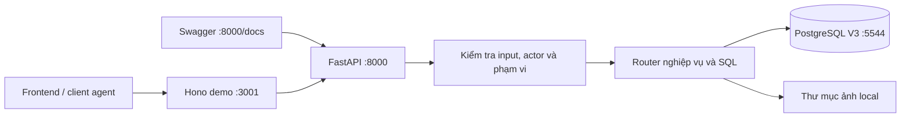
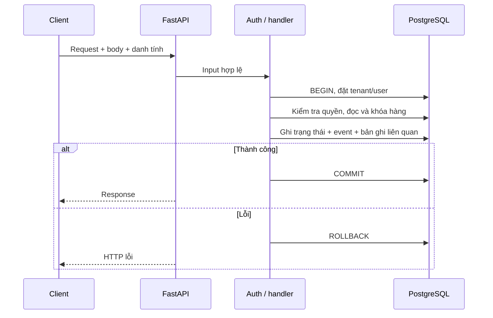
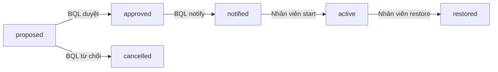

# Giải thích code và các luồng API V3

- Ngày tổng hợp: 01/10/2026.
- Mục đích: giúp đọc hiểu code đang chạy, thứ tự gọi API, dữ liệu được ghi ở đâu và lý do thiết kế.
- Tài liệu mô tả implementation hiện tại; các phần chưa hoàn thiện được ghi riêng. Đây không phải danh sách khẳng định mọi nghiệp vụ đã hoàn tất.

## 1. Hệ thống hiện đang làm gì?

FastAPI trên cổng **8000** đọc/ghi **PostgreSQL V3**. Database demo chạy bằng Docker trên cổng **5544**, chứa dữ liệu giả như cư dân, nhân viên, căn hộ, ticket và hóa đơn. Khi gọi API, code thực hiện truy vấn SQL trên các bảng đó. Restart FastAPI không xóa dữ liệu trong volume database.

Swagger `/docs` là giao diện gọi thử HTTP endpoint. Nó không tự chạy toàn bộ quy trình: người thử cần gọi từng bước, lấy ID/version trả về rồi dùng cho bước sau.

Hono demo trên cổng **3001** nhận request tại `/api/vinhomes-demo/...` và chuyển tiếp đến FastAPI. Client FE hoặc client agent có thể gọi qua cùng gateway. Code này chưa chạy tool hay LLM thật; phản hồi agent demo là nội dung mẫu được lưu vào database.



**Vì sao làm như vậy?** Dữ liệu demo phải tuân theo quan hệ và ràng buộc của schema thực tế. Chạy trên PostgreSQL giúp phát hiện lỗi FK, transaction, quyền database và trigger; những lỗi này có thể không xuất hiện nếu chỉ lưu dữ liệu vào dictionary trong RAM.

`demo_api.py` là implementation RAM từ giai đoạn trước, **không được `main.py` chọn** trong chế độ hiện tại. Các module legacy không được mount cũng không mặc nhiên là API đang hoạt động.

## 2. Những file cần đọc và trách nhiệm

Các link tương đối bên dưới mở file code trong repository.

| File | Trách nhiệm |
| --- | --- |
| [main.py](../services/vinhomes-api/src/vinhomes_api/main.py) | Tạo app, engine database, health/ready và nạp router |
| [v3_config.py](../services/vinhomes-api/src/vinhomes_api/v3_config.py) | Đọc/kiểm tra biến môi trường và chế độ demo |
| [v3_auth.py](../services/vinhomes-api/src/vinhomes_api/v3_auth.py) | Xác định actor, mở transaction, đặt tenant/user và kiểm tra quyền nền |
| [v3_routes.py](../services/vinhomes-api/src/vinhomes_api/v3_routes.py) | Đọc ticket/work order, tìm BQL và hàng chờ |
| [v3_mutations.py](../services/vinhomes-api/src/vinhomes_api/v3_mutations.py) | Ghi ticket, assessment, work order, assignment, tiến độ, evidence và event |
| [v3_operations.py](../services/vinhomes-api/src/vinhomes_api/v3_operations.py) | Catalog/dashboard/tasks, nhân viên rảnh, routing ACK và BQL duyệt yêu cầu |
| [v3_resident.py](../services/vinhomes-api/src/vinhomes_api/v3_resident.py) | Chat/ticket của cư dân, nghiệm thu và thông báo |
| [v3_triage.py](../services/vinhomes-api/src/vinhomes_api/v3_triage.py) | Đề xuất phân loại và BQL duyệt phân loại |
| [v3_water.py](../services/vinhomes-api/src/vinhomes_api/v3_water.py) | Khóa/mở nước và thông báo phạm vi ảnh hưởng |
| [v3_files.py](../services/vinhomes-api/src/vinhomes_api/v3_files.py) | Upload/download ảnh local và metadata V3 |
| [v3_specialized.py](../services/vinhomes-api/src/vinhomes_api/v3_specialized.py) | QC/redo, vệ sinh, nhà thầu, ngân sách và an ninh cơ bản |
| [v3_rooms.py](../services/vinhomes-api/src/vinhomes_api/v3_rooms.py) | Room, message và trạng thái mention |
| [v3_knowledge.py](../services/vinhomes-api/src/vinhomes_api/v3_knowledge.py) | Tìm tài liệu đã xuất bản theo scope/ACL |
| [v3_memory.py](../services/vinhomes-api/src/vinhomes_api/v3_memory.py) | Admin xem và duyệt/từ chối memory candidate |
| [v3_reports.py](../services/vinhomes-api/src/vinhomes_api/v3_reports.py) | Báo cáo sự cố/hóa đơn và xuất DOCX |
| [v3_demo.py](../services/vinhomes-api/src/vinhomes_api/v3_demo.py) | Trả ID fixture từ database demo |
| [vinhomes-demo.ts](../server/scripts/vinhomes-demo.ts) | Gateway Hono riêng cho demo |

**Vì sao chia module?** Mỗi nhóm nghiệp vụ có điều kiện và dữ liệu khác nhau. Router nước không phải đọc toàn bộ logic báo cáo; router cư dân dùng kiểm tra sở hữu khác router operations. Các thao tác chung như tìm ticket có quyền và ghi event được tái sử dụng trong `v3_mutations.py`.

## 3. Phân biệt các đối tượng để hiểu luồng

| Đối tượng | Câu hỏi nó trả lời | Bảng |
| --- | --- | --- |
| Chat | Cư dân/BQL đang trao đổi những gì? | `channels`, `channel_memberships`, `messages` |
| Ticket | Yêu cầu nào, thuộc căn hộ/tòa nào, ai quản lý, đã xử lý xong chưa? | `tickets` |
| Work order | Công việc cụ thể cần thực hiện là gì, tiến độ ra sao? | `work_orders` |
| Assignment | Công việc được mời giao cho nhân viên nào, người đó nhận hay từ chối? | `work_assignments` |
| Approval | Ai phải quyết định một đề xuất hoặc xác nhận hoàn tất? | `work_approvals` |
| Evidence | Bằng chứng nào gắn với ticket/công việc? | `evidence_items`, `files`, `file_objects` |
| Event | Hành động nào đã xảy ra và ai thực hiện? | `ticket_events` |

**Vì sao không gộp tất cả vào ticket?** Một yêu cầu có thể phát sinh các công việc hoặc việc làm lại. Việc giao cho nhân viên, quyết định khóa nước và nghiệm thu có người quyết định/thời điểm riêng. Gộp chúng thành vài field của ticket sẽ làm mất lịch sử và khó quản lý trạng thái.

Không phải mọi ID đều là UUID: ticket/work order/assignment thường là UUID; user, channel và agent dùng ID text theo schema. `code` như `VH-...` phục vụ hiển thị, không thay thế khóa `id` trong URL.

## 4. Một request đi qua code như thế nào?

Ví dụ nhân viên gọi `PATCH /work-orders/{id}/status`:

1. FastAPI đọc path/body/header; Pydantic kiểm tra kiểu, trường bắt buộc và enum.
2. Dependency `scoped_connection` xác định actor và mở transaction bằng `engine.begin()`.
3. Đặt `app.tenant_id`, `app.user_id` cho connection, trong phạm vi transaction.
4. Kiểm tra user active và quyền operations hoặc platform admin.
5. Handler kiểm tra ticket thuộc phạm vi và nhân viên có assignment đã nhận.
6. Khóa hàng liên quan; kiểm tra `version` và chuyển trạng thái có hợp lệ không.
7. Cập nhật công việc; ghi event; nếu hoàn tất thì tạo approval nghiệm thu và cập nhật ticket.
8. Handler trả dữ liệu. Transaction được commit khi xử lý thành công; có exception thì rollback phần SQL.



**Vì sao transaction?** Không muốn có công việc đã hoàn tất nhưng yêu cầu nghiệm thu chưa tạo vì câu SQL sau bị lỗi. Transaction giữ các thay đổi database trong cùng request nhất quán. File ghi xuống ổ đĩa không nằm trong transaction SQL, nên upload có thể còn file rời nếu phần database sau đó lỗi.

## 5. Danh tính và quyền

### 5.1. Demo cục bộ

`VINHOMES_API_DEMO_MODE=1` cho phép chọn nhân vật bằng `X-Demo-Actor`:

| Header | User trong database |
| --- | --- |
| `resident` | `local-v3-resident` |
| `management` | `local-v3-management` |
| `technical` | `local-v3-technical` |
| `security` | `local-v3-security` |
| `admin` | `local-v3-admin` |

Đây là cách chọn nhân vật demo trên loopback, với tenant fixture được cấu hình cố định. Sau khi ánh xạ, code vẫn đọc trạng thái/quyền từ DB. Header không phải cơ chế đăng nhập thật.

### 5.2. Khi tắt demo

`_actor_id()` dùng `VINHOMES_API_DEV_USER_ID` trong môi trường phát triển loopback hoặc gọi Hono `/api/me` với cookie của request để lấy user đã xác thực. Nếu không có cấu hình phù hợp, trả lỗi thay vì tự chọn admin.

### 5.3. Vì sao có hai dependency?

- `resident_connection`: yêu cầu user và tenant membership active. Handler tiếp tục kiểm tra sở hữu chat/ticket/approval; dependency này cũng được dùng cho room có membership.
- `scoped_connection`: dành cho operations; ngoài user active, yêu cầu platform admin hoặc role `management`/`staff` còn hiệu lực.

RLS giúp giới hạn tenant. Điều kiện SQL như `TICKET_VISIBILITY`, kiểm tra cư dân sở hữu và các helper kiểm tra BQL đảm nhiệm phạm vi nghiệp vụ cụ thể. Có role không có nghĩa được thao tác tất cả ticket trong hệ thống.

## 6. Luồng cư dân: chat → ticket → BQL tiếp nhận

| Bước | API | Code thực hiện |
| --- | --- | --- |
| 1 | `POST /resident/chats` | Tạo channel reception và membership của người tạo |
| 2 | `POST /resident/chats/{channel_id}/messages` | Kiểm tra chat của mình, lấy sequence, ghi message |
| 3 | `POST /resident/chats/{channel_id}/tickets` | Xác minh căn hộ, chọn BQL, tạo ticket và routing history |
| 4 | `GET /tickets`, `GET /tickets/{ticket_id}` | BQL đọc ticket trong phạm vi |
| 5 | `POST /tickets/{ticket_id}/routing/ack` | BQL xác nhận routing; ghi event và thông báo cư dân |

### Khi tạo ticket, vì sao phải kiểm tra căn hộ?

Handler nối `unit_residents → units → buildings → sites → domains`. Người tạo phải là cư dân đã verified, quan hệ còn hiệu lực và ID căn hộ/tòa/domain khớp. Nhờ đó client không tùy ý khai một căn hộ khác rồi tạo ticket dưới danh tính của mình.

### BQL được chọn như thế nào?

Code đọc `management_coverage` đúng category và còn hiệu lực. Phạm vi cụ thể được ưu tiên: tòa → zone → site → tenant; sau đó xét `priority`. Nếu hai coverage cùng mức ưu tiên nhưng trỏ đến BQL khác nhau, trả 409 để tránh định tuyến tùy tiện.

`GET /management-units/resolve` giúp tra BQL bằng `buildingId`, `domainId`, tùy chọn `serviceCategoryId`. Route hiện dùng quyền operations; cư dân tạo ticket sử dụng bước chọn coverage ngay trong handler tạo ticket.

### Vì sao một chat chỉ có một ticket?

Schema có unique trên `tickets.channel_id`; handler cũng kiểm tra trước khi tạo. Mô hình hiện tại là mỗi chat xử lý một yêu cầu. Muốn báo vấn đề khác thì tạo chat mới.

### Message gửi lại có bị trùng không?

Code tìm `client_message_id` của cùng người gửi/channel. Nội dung giống thì trả message đã có; nội dung khác với khóa cũ trả 409. Channel được khóa khi cấp sequence để các message có thứ tự.

Trong demo, phản hồi Reception mẫu được ghi vào `messages`. Không có bước tự suy luận bằng LLM hoặc tự gọi API tạo ticket; client vẫn cần gọi endpoint tạo ticket.

**Chi tiết implementation:** routing ACK xác nhận bản ghi định tuyến và ghi event; hiện không tự chuyển `tickets.status` sang `triaging`. Tạo work order chấp nhận ticket `open` hoặc `triaging`, rồi chuyển ticket sang `assigned`.

## 7. Luồng phân loại: assessment → đề xuất triage → duyệt

```text
POST /tickets/{id}/assessments
    → POST /tickets/{id}/triage-decisions
    → GET /triage-reviews
    → POST /triage-reviews/{review_id}/decision
```

Assessment lưu thông tin đánh giá của ticket. Đề xuất triage yêu cầu assessment đúng ticket và đúng generation (`reopen_count`), version còn mới, policy binding active và policy version đã published.

Handler tạo `ticket_triage_decisions` với `outcome=review_required`, rồi tạo `ticket_triage_reviews` có scope và hạn duyệt. BQL có quyền hoặc admin duyệt đề xuất. Khi chấp thuận, code lưu quyết định được áp dụng và cập nhật severity/priority/emergency của ticket.

**Vì sao tách đề xuất với quyết định áp dụng?** Cần biết thông tin phân loại ban đầu, ai duyệt và thông tin cuối cùng được áp dụng. Đề xuất chưa duyệt không được coi là quyết định chính thức.

Đây là luồng đề xuất có người duyệt, chưa phải engine tự động đánh giá toàn bộ SOP. Luồng tạo work order hiện cũng chưa bắt buộc mọi ticket phải đi qua triage confirmed; đó là một khoảng cần rà nếu nghiệp vụ yêu cầu triage là điều kiện bắt buộc.

## 8. Luồng work order và phân công nhân viên

| Bước | API | Điểm chính |
| --- | --- | --- |
| Tạo việc | `POST /tickets/{ticket_id}/work-orders` | Kiểm tra BQL/admin, version ticket; tạo việc queued, ticket assigned |
| Tìm người rảnh | `GET /staff/available` | Theo management unit, category, ca trực và capacity |
| Xem hàng chờ | `GET /dispatch-queue` | Đọc work order queued trong phạm vi; chưa phải worker tự phân công |
| Mời nhận việc | `POST /work-orders/{id}/assignments` | Kiểm tra version, chuyên môn, ca trực, BQL và tải hiện tại |
| Nhận/từ chối | `POST /assignments/{assignment_id}/response` | Chỉ nhân viên được giao trả lời; offer phải còn hạn |
| Cập nhật tiến độ | `PATCH /work-orders/{id}/status` | Assignment accepted, trạng thái hợp lệ, version mới |

### Vì sao assignment có ID riêng?

Work order là công việc; assignment là lần mời giao việc cho một người. Nhân viên có thể từ chối và công việc quay lại hàng chờ. Không nên mất thông tin người từng được mời và lý do từ chối.

Nhận việc dùng `status: accepted` và `eta_at`. Từ chối dùng `status: rejected`, `rejection_reason`. URL phải dùng **assignment ID** trả từ API phân công, không dùng work order ID như bản RAM cũ.

### Cách chống giao vượt capacity

Trong transaction, handler khóa hàng `staff_profiles`, đếm assignment accepted hoặc offer còn hạn trên các công việc chưa kết thúc, rồi so với `max_concurrent_jobs`. Nếu nhân viên bận, trả 409 và việc vẫn nằm hàng chờ.

**Vì sao vừa có API availability vừa kiểm tra lại khi phân công?** Kết quả người rảnh chỉ đúng tại thời điểm đọc. Một người có thể được giao việc khác trước lúc client gửi lệnh; kiểm tra dưới khóa mới là bước quyết định.

### Trạng thái work order

Luồng thuận thường dùng:

```text
queued → offered → accepted → en_route → arrived → in_progress → completed
```

Có các nhánh `rejected`, `cancelled`, `awaiting_approval` theo `ALLOWED_TRANSITIONS`. Không thể tùy ý nhảy từ accepted thẳng sang completed. BQL không tự cập nhật tiến độ thay nhân viên chỉ nhờ role management: handler tiến độ yêu cầu assignment đã accepted hoặc platform admin.

## 9. Luồng nước: đề xuất → duyệt → thông báo → khóa → mở



1. Nhân viên đã nhận assignment gọi `POST /work-orders/{id}/water-shutdown-request` với lý do, scope ảnh hưởng và thời gian dự kiến.
2. Handler kiểm tra scope thuộc tòa/zone của ticket, thời gian có timezone và start trước end.
3. Tạo `work_approvals.kind=management_water_shutdown`, `service_interruptions.status=proposed`, liên kết scope trong `interruption_scopes` và ghi event.
4. BQL gọi `POST /approvals/{approval_id}/decision` với `status: approved/rejected`, `note`. Người duyệt phải có scope BQL phụ trách; admin không tự được duyệt thay BQL ở handler này.
5. BQL gọi `/water-interruptions/{id}/notify`. Code tạo notification in-app cho cư dân verified trong phạm vi ảnh hưởng.
6. Nhân viên gọi `/start` sau trạng thái notified, rồi `/restore` sau active. Restore cũng tạo thông báo cho cư dân.

**Vì sao có cả approval và interruption?** Approval trả lời “đã được phép chưa”; interruption ghi thời gian và trạng thái thực tế của việc ngừng dịch vụ. Đã duyệt không có nghĩa nước đã khóa hoặc đã mở lại.

Thông báo là bản ghi in-app trong DB, không đồng nghĩa SMS/push đã gửi. Nếu nước còn ở trạng thái chưa restored/cancelled, API hoàn tất work order sẽ bị chặn.

## 10. Luồng ảnh → bằng chứng → hoàn tất → nghiệm thu

### 10.1. Upload và gắn bằng chứng là hai bước

1. `POST /tickets/{ticket_id}/files`: gửi raw bytes ảnh và query filename/MIME/purpose.
2. File được lưu local; code ghi `files`, `file_objects`, `ticket_files` và trả `fileId`.
3. `POST /tickets/{ticket_id}/evidence`: truyền `file_id`, `work_order_id`, tùy chọn assignment, purpose/caption.
4. Handler kiểm tra file ready thuộc ticket và quan hệ work order/assignment trước khi ghi `evidence_items`.

**Vì sao tách?** Có một ảnh trên ticket chưa đủ biết ảnh đó chứng minh công việc nào hoặc giai đoạn nào. Evidence cung cấp liên kết nghiệp vụ; file/file object quản lý metadata, phiên bản và nội dung ảnh.

Upload local kiểm tra tên file, giới hạn 10 MB và magic bytes MIME được hỗ trợ. Object key chứa `tenant_prefix` của storage location vì trigger V3 yêu cầu như vậy. Download kiểm tra quyền ticket và đường dẫn nằm trong thư mục lưu ảnh. Đây là storage phát triển cục bộ, chưa phải object store/quét ảnh tích hợp bên ngoài.

**Giới hạn gateway:** Hono demo nhận body tối đa 1 MB, thấp hơn giới hạn upload trực tiếp FastAPI 10 MB. FE đi qua Hono hiện phải gửi ảnh dưới giới hạn gateway.

### 10.2. Nhân viên báo hoàn tất

`PATCH /work-orders/{id}/status` với `status: completed` kiểm tra:

- Work order đang ở trạng thái được phép chuyển và version đúng.
- Có evidence active gắn work order, purpose after hoặc verification.
- Không còn ngừng nước chưa restored/cancelled.

Sau đó cập nhật work order completed, ghi event, tạo approval `customer_completion` gửi người yêu cầu ticket, chuyển ticket resolved.

### 10.3. Cư dân nghiệm thu

```text
GET /resident/approvals
    → POST /resident/approvals/{approval_id}/decision
        approved=true  → ticket closed
        approved=false → ticket và work order in_progress
```

Chỉ người được yêu cầu và là requester của ticket được quyết định; approval phải pending và còn hạn. Body dùng `approved` và `note`.

**Vì sao completed chưa đóng ticket ngay?** Nhân viên hoàn tất là lời xác nhận của người xử lý. Cư dân còn cần kiểm tra kết quả, nên ticket qua resolved rồi mới closed khi nghiệm thu.

**Giới hạn hiện tại:** handler hoàn tất cập nhật ticket resolved theo work order đang hoàn tất; chưa tổng hợp điều kiện tất cả work order/redo của một ticket đều xong. QC pass cũng chưa được bắt buộc trước nghiệm thu. Cần hoàn thiện các điều kiện này nếu demo dùng nhiều việc trên cùng ticket hoặc quy trình QC bắt buộc.

## 11. QC, redo và các API chuyên biệt

### QC và làm lại

`GET/POST /work-orders/{id}/qc` lưu/đọc kiểm tra trong `vh_qc_results`. Ghi QC yêu cầu việc completed và quyền BQL/admin qua helper quản lý. `redo_required=true` chỉ hợp lệ khi outcome fail.

`POST /work-orders/{id}/redo` yêu cầu work order version đúng, việc completed và kết quả QC mới nhất fail + redo_required. Code tạo **work order mới queued**, liên kết nguồn/kết quả QC trong `vh_qc_redo_orders`, ghi event. Không tạo lặp redo cho cùng QC.

**Vì sao tạo việc mới?** Giữ lịch sử lần xử lý cũ và lần sửa lại riêng, có thể giao nhân viên và theo dõi tiến độ khác nhau. Nhánh này khác cư dân từ chối nghiệm thu: nhánh cư dân hiện mở lại chính work order cũ.

### Các nhóm đã có handler

| Nhóm | Endpoint chính | Dữ liệu |
| --- | --- | --- |
| Vệ sinh | `GET/PUT /work-orders/{id}/cleaning-plan` | `vh_cleaning_plans` |
| Nhà thầu | `GET/PUT /work-orders/{id}/contractor` | `vh_contractor_updates` |
| Ngân sách | `GET /budget-approvals`, `POST /work-orders/{id}/budget-approvals`, `POST /budget-approvals/{id}/decision` | `vh_budget_approvals` |
| Checkpoint | `GET/POST /security/checkpoints`, `PATCH /security/checkpoints/{id}` | `vh_security_checkpoints` |
| Sự cố an ninh | `GET/POST /security/incidents`, `PATCH /security/incidents/{id}` | `vh_security_incidents` |
| Bàn giao ca | `GET/POST /security/handovers`, `POST /security/handovers/{id}/confirm` | `vh_security_handovers` |

Các bảng `vh_*` này là extension trong migration V3, vẫn liên kết ticket/work order/tenant V3. Chúng khác database legacy độc lập trước đây.

Sự cố an ninh nhận business severity P0–P3 và ánh xạ p1–p4. Triage dùng enum khác như minor/major/critical; không dùng cùng phép ánh xạ cho mọi severity trong hệ thống.

Có handler không có nghĩa toàn bộ chuỗi camera → cảnh báo → điều động đã có. Phần camera/contact, ACK/leo thang và phê duyệt điều động/hủy chưa có đầy đủ router V3.

## 12. Room và mention agent

Luồng:

```text
GET /rooms
  → GET /rooms/{room_id}/messages
  → POST /rooms/{room_id}/messages
  → GET /rooms/{room_id}/mentions/{message_id}
```

Code yêu cầu user là member của management room. Agent được mention phải có trong `channel_agents` của room. Message có khóa chống trùng và sequence; mention lưu ở `message_mentions`.

- Khi tắt demo: mention được ghi queued; chưa có worker trong các router này để chạy agent.
- Khi bật demo: ghi thêm message phản hồi mẫu, mention chuyển done; `resolved_run_id` có thể null vì không có lần chạy LLM thật.

**Vì sao API lưu mention riêng?** Tin nhắn người dùng và yêu cầu xử lý của agent là hai đối tượng khác nhau; FE có thể đọc trạng thái xử lý mà không suy từ nội dung chat.

Room đang kiểm tra membership; không nên hiểu rằng mọi endpoint room tự xác minh lại một role BQL chỉ dựa vào tên phòng. API tạo/thêm agent trong room trên V3 còn cần triển khai.

## 13. Tri thức, memory và báo cáo

### 13.1. Tri thức

`GET /knowledge/search?query=...&domainId=...` tìm `knowledge_chunks` qua PostgreSQL full-text search. Handler chỉ lấy tài liệu published, version hiệu lực, đúng scope được cấp, có ACL allow và không bị ACL deny phù hợp.

**Vì sao không trả toàn bộ tài liệu?** Tài liệu kỹ thuật hoặc quản lý có thể chỉ áp dụng cho một tòa/nhóm. Code lọc trước khi trả kết quả cho client.

Đây là tìm kiếm full-text, chưa phải vector search hoặc hệ thống RAG hoàn chỉnh. Route hiện dùng dependency operations, nên cư dân thông thường chưa được gọi như route FAQ công khai.

### 13.2. Memory

Admin gọi `GET /admin/memory-candidates`, rồi `POST /admin/memory-candidates/{id}/review` với `decision: approve/reject`, `reason`.

Handler khóa candidate pending, kiểm tra đã redacted PII trước khi approve, ghi `knowledge_reviews` kèm revision/hash, cập nhật trạng thái candidate. **Approve candidate chưa tự xuất bản thành knowledge document.** Endpoint đề xuất candidate và quy trình publish/revoke đầy đủ còn thiếu.

**Vì sao lưu review riêng?** Cần giữ được ai duyệt phiên bản đề xuất nào, lý do gì; thay một field status sẽ không đủ dấu vết quyết định.

### 13.3. Báo cáo

| API | Cách lấy dữ liệu |
| --- | --- |
| `GET /reports/incident-frequency` | Đếm ticket incident theo tháng/loại sự cố của tòa trong kỳ |
| `GET /reports/issued-revenue` | Nối invoice_lines → invoices → tickets, chỉ lấy invoices issued và category được chọn |
| Các path `.docx` | Truy vấn cùng dữ liệu rồi tạo file DOCX trực tiếp |

Body báo cáo không cần actor do client tự khai. Handler kiểm tra quyền BQL phụ trách tòa; query có `buildingId`, `fromDate`, `toDate`, và `categoryId` cho doanh thu. Kỳ ngày là `[fromDate, toDate)`: gồm ngày đầu, không gồm ngày cuối.

**Vì sao lấy invoice_lines?** Một hóa đơn có thể chứa nhiều loại dịch vụ. Báo cáo kỹ thuật cần cộng đúng dòng thuộc category đó. Đây là số đã xuất hóa đơn, không phải số tiền đã thu từ payments.

DOCX tạo đồng bộ bằng ZIP/XML chuẩn DOCX; hiện chưa dùng job `report_requests`. Hóa đơn demo đã seed vào DB, chưa có bước tự phát hành hóa đơn cho mọi work order mới hoàn tất.

## 14. Các cơ chế dễ gây nhầm khi đọc code

### Version

`version` là số lần bản ghi thay đổi. Ví dụ client đọc work order version 4, người khác đã cập nhật thành 5 thì lệnh gửi version 4 bị trả 409. Client cần GET lại trước khi quyết định gửi tiếp.

**Vì sao cần?** Tránh ghi đè kết quả của người khác dựa trên dữ liệu cũ. Ticket và work order có version riêng. `record_event()` cũng tăng ticket version, nên các bước ghi event có thể làm version ticket thay đổi dù FE chưa đổi màn hình.

### Row lock

`SELECT ... FOR UPDATE` giữ hàng trong transaction để các request khác không đồng thời quyết định trên cùng trạng thái. Channel lock dùng cấp sequence, ticket lock dùng event/version, staff lock dùng kiểm tra capacity.

### Idempotency

Message dùng `client_message_id`, triage dùng `idempotency_key`, notification dùng dedupe key. Không phải mọi POST đều có cùng cơ chế retry; không tự gửi lại lệnh ghi chỉ vì mất response. Khóa chống trùng và version giải quyết các vấn đề khác nhau.

### Event

`record_event()` chèn `ticket_events`, tăng `last_event_seq` và `version` ticket. Truyền `to_status` chỉ ghi trạng thái vào event; **helper không tự cập nhật `tickets.status`**. Handler cần thực hiện câu UPDATE trạng thái riêng.

Ghi event không tự phát notification cho mọi hành động. Các handler tạo ticket, ACK và nước có SQL notification riêng; các sự kiện khác cần bổ sung nếu FE yêu cầu.

### Lỗi HTTP

| Mã | Cách hiểu trong code hiện tại |
| --- | --- |
| 401 | Không xác thực được phiên qua Hono |
| 403 | User/role/scope/sở hữu không cho phép thao tác |
| 404 | Không tìm thấy hoặc resource không thuộc phạm vi được xem |
| 409 | Version cũ, trạng thái không hợp lệ, yêu cầu đã quyết định hoặc xung đột constraint |
| 422 | Input sai kiểu/thiếu trường hoặc điều kiện dữ liệu không hợp lệ |
| 503 | Thiếu config, database/auth server chưa sẵn sàng hoặc lỗi SQL bị dependency quy về lỗi chung |

503 trong implementation hiện tại có thể bao gồm lỗi câu SQL/permission/trigger, không chỉ mất kết nối. Khi phát triển cần đọc nguyên nhân phía server/database; client không nhận stack trace hoặc secret.

## 15. Hono chuyển tiếp request như thế nào?

Ví dụ client gọi:

```text
GET http://localhost:3001/api/vinhomes-demo/tickets?limit=10
X-Demo-Actor: management
```

Gateway kiểm tra role trong danh sách nhân vật, gọi health của FastAPI và chỉ chấp nhận `dataMode=faker-database`. Nó bỏ prefix `/api/vinhomes-demo`, chuyển request đến `/tickets?limit=10` trên 8000, rồi trả response/status/content type cho client. CORS được cấu hình cho các origin frontend local đã liệt kê.

**Vì sao có health check?** Tránh gateway chọn nhân vật demo vô tình chuyển sang một app không bật chế độ database faker. Đây vẫn là gateway demo chạy riêng, không phải đã nối cơ chế callback/signed run của agent hoặc phiên Hono thật.

Gateway không tự map body RAM cũ sang contract V3, không tự tạo UUID và không thay quyền nghiệp vụ của handler FastAPI. Dùng đúng schema Swagger của app hiện tại.

## 16. Khởi động và seed dữ liệu hoạt động ra sao?

1. `setup_demo_database.ps1` gọi `prepare_demo_database.py prepare` để sinh cấu hình local, mật khẩu ngẫu nhiên và file env trong thư mục Git bỏ qua.
2. Docker Compose tạo PostgreSQL pgvector với volume riêng, chờ healthy.
3. Script gọi migrator gốc `server/scripts/migrate.ts` để áp dụng `server/drizzle` theo journal.
4. Python gọi `seed_v3_local.sql`, rồi `seed_v3_faker.sql`. Các bản ghi fixture dùng ID ổn định và ON CONFLICT để không tạo trùng.
5. Tạo/cấu hình role API không superuser/BYPASSRLS và cấp quyền đọc/ghi các bảng cần thiết. Quyền UPDATE một cột staff được cấp để SELECT FOR UPDATE kiểm tra capacity hoạt động.
6. `start_demo.ps1` đọc cấu hình đã sinh và chạy `python -m vinhomes_api`; `__main__.py` khởi động Uvicorn, `main.py` tạo app/engine.

**Vì sao tách setup khỏi startup API?** Migration và seed là thao tác chuẩn bị database. Không muốn mỗi lần khởi động FastAPI lại tự chạy thay đổi schema hoặc tạo lại toàn bộ dữ liệu.

Seed không xóa/reset trạng thái workflow. Một số field vị trí/owner của ticket fixture gốc vẫn được UPDATE để bổ sung quan hệ còn thiếu; không nên chỉnh tay các field đó rồi kỳ vọng reseed giữ nguyên mọi field.

`GET /health` chứng minh process đang phản hồi. `GET /ready` kiểm tra kết nối và một số bảng quan trọng; chưa chứng minh toàn bộ FK/seed/quyền và mọi API đều đúng. `GET /demo/fixtures` lấy UUID từ database để dùng trong Swagger.

## 17. Ví dụ đọc code một hàm từ đầu đến cuối

Hãy mở `change_work_order_status()` trong `v3_mutations.py` và đọc theo thứ tự:

| Đoạn logic | Câu hỏi cần trả lời |
| --- | --- |
| Model `WorkOrderTransition` | Client được gửi trường/trạng thái nào? |
| Dependency `Scope` | Ai đang gọi, transaction được tạo ở đâu? |
| Query work order + visibility | Resource này có thuộc quyền xem không? |
| Query accepted assignment | Người gọi có phải người nhận việc không? |
| Lock và version check | Có ai thay trạng thái trước request này không? |
| `ALLOWED_TRANSITIONS` | Có được đi từ trạng thái hiện tại sang trạng thái yêu cầu không? |
| Check water/evidence | Có đủ điều kiện báo hoàn tất không? |
| UPDATE work order | Những timestamp/version nào thay đổi? |
| `record_event()` | Timeline và version ticket được ghi ra sao? |
| Tạo completion approval | Ai sẽ xác nhận bước tiếp theo? |
| UPDATE ticket | Ticket hiện in_progress hay resolved? |
| Return | Client nhận ID/status/version nào để dùng tiếp? |

Cách đọc này áp dụng cho các handler khác: **input → actor → resource/scope → trạng thái → SQL ghi → event/side effect → response**.

## 18. Những gì đã có bằng chứng và những gì còn phải làm

Theo context triển khai ngày 30/09/2026, luồng kỹ thuật/nước/bằng chứng/nghiệm thu đã chạy bằng các HTTP request trên PostgreSQL; ticket demo kết thúc closed. Báo cáo qua Hono đọc 20 hóa đơn, tổng 4.100.000 VND từ invoice_lines. Mention room có bản ghi done. Đây là kết quả đã ghi ở lần triển khai trước, không phải khẳng định đã chạy lại toàn bộ trong lần viết tài liệu này.

Các phần cần hoàn thiện:

- Camera/contact, chuỗi cảnh báo ACK/leo thang và phê duyệt điều động/hủy trên V3.
- Quản trị tài khoản FastAPI/facade Hono, tạo agent trong room, đề xuất và publish/revoke memory.
- Quy tắc tổng hợp ticket khi có nhiều work order/redo; gate QC/triage nếu nghiệp vụ bắt buộc.
- Notifications cho mọi event cần hiển thị, tự phát hành hóa đơn nếu kịch bản cần, báo cáo job nếu cần xử lý nền.
- Gateway xác thực người yêu cầu thật; worker/LLM thực thi chưa nằm trong code endpoint hiện tại.
- Nối FE và thống nhất contract; dữ liệu các nhóm QC/triage/vệ sinh/ngân sách chưa seed đầy đủ.

## 19. Thứ tự đọc và thực hành đề xuất

1. Đọc `main.py`, `v3_config.py`, `v3_auth.py` để hiểu app, database và danh tính.
2. Theo một ticket từ `v3_resident.py` sang `v3_operations.py`, rồi `v3_mutations.py`.
3. Theo nhánh nước trong `v3_water.py`, ảnh trong `v3_files.py`, nghiệm thu quay lại `v3_resident.py`.
4. Đọc `record_event()` và quan sát `version`, timeline sau từng bước.
5. Sau khi hiểu luồng chính, đọc triage/QC, room, knowledge/memory và reports.

Lệnh chạy, ID và body mẫu: [HUONG_DAN_DEMO_DATABASE_V3.md](../services/vinhomes-api/HUONG_DAN_DEMO_DATABASE_V3.md). Kế hoạch hoàn thiện phần còn thiếu: [KE_HOACH_HOAN_THIEN_API_V3_VA_DEMO.md](KE_HOACH_HOAN_THIEN_API_V3_VA_DEMO.md).
