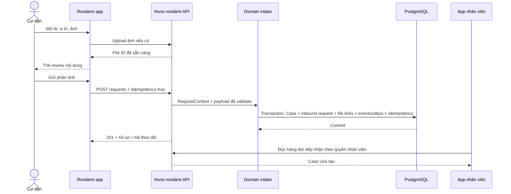

# 01 — Nghiệp vụ, quyền và dữ liệu cư dân

Đây là thiết kế P0 đề xuất; các entity ERD bên dưới chưa đồng nghĩa với bảng đã có migration.

## 1. Actor và phạm vi dữ liệu

| Actor | Hành động |
|---|---|
| Cư dân | Đọc thông tin công khai, gửi phản ánh, xem hồ sơ của mình, xác nhận kết quả hoặc yêu cầu kiểm tra lại |
| Nhân viên tiếp nhận/điều phối | Xem hàng đợi được phân quyền; làm rõ, tách/gộp vấn đề, tạo/link Incident và Task |
| Nhân viên/nhà thầu hiện trường | Thực hiện WorkOrder được giao, ghi bằng chứng/kết quả |
| QC Inspector | Nghiệm thu độc lập theo quyền và rule của domain |
| BQL | Phê duyệt theo quyền, công bố thông tin và điều phối |
| Trợ lý AI | Hỗ trợ hỏi đáp và soạn nội dung; không tự xác nhận thay cư dân hoặc tự cấp quyền thực thi |

**Mặc định P0 đề xuất:** cư dân chỉ xem hồ sơ do chính mình gửi. Cùng căn hộ không
tự động đồng nghĩa với được xem mọi hồ sơ của người khác. Server cần kiểm tra tenant,
identity, membership dự án/căn hộ và quyền trên hồ sơ ở mọi read/write.

**Cần chốt:** quyền dùng chung hồ sơ giữa thành viên căn hộ; quyền của người thuê/chủ sở hữu;
quyền đọc hồ sơ cũ khi chuyển đi. Chưa chốt thì từ chối mặc định, không mở rộng quyền tự động.

## 2. Flow gửi phản ánh



- Chat hỏi thông tin không tạo hồ sơ nghiệp vụ.
- Draft trước khi bấm gửi chưa là Case đã tiếp nhận; có thể lưu local hoặc một draft store riêng.
- P0 dùng `case.status = READY` cho hồ sơ đã đủ mô tả/vị trí, sẵn sàng triage; chi tiết status
  vật lý phải thống nhất với team intake trước migration.
- Không cần chờ LLM hoặc tạo Incident thành công mới trả receipt tiếp nhận.
- Nếu AI lỗi, cư dân vẫn có thể review/gửi dữ liệu bằng flow có cấu trúc.
- Không thông báo thành công khi request timeout hoặc database transaction chưa commit.
- Khi mạng đứt sau commit, retry cùng idempotency key để lấy cùng hồ sơ, không tạo bản thứ hai.
- Tách/gộp vấn đề do domain xử lý, có provenance; client không tự tạo hay gắn Incident ID.

## 3. Mapping quan trọng: chữ “yêu cầu” không phải cùng một entity ở mọi tầng

| Khái niệm | Ý nghĩa |
|---|---|
| `ResidentRequest` trong `resident-app/src/services/types.ts` | View model cho một thẻ theo dõi: title, status, photos, events |
| `vh_case` trong ERD | Hồ sơ hỗ trợ có thể chứa nhiều lần gửi thông tin và nhiều vấn đề |
| `vh_resident_request` trong ERD | Một lần gửi thông tin/inbound submission thuộc Case |
| `vh_issue_candidate` | Vấn đề chờ làm rõ/materialize, chưa phải Incident |
| `vh_resident_report` | Report chính thức có liên kết tới Incident; nhiều report có thể trỏ cùng Incident |
| `vh_incident` | Sự cố vận hành chuẩn; có Task và WorkOrder |

**Đề xuất P0:** `ResidentRequestView.id` trong API bằng ID ổn định của `vh_case`;
`code` là mã ngắn để cư dân tra cứu. Type FE hiện tại có thể giữ tên `ResidentRequest`
trong thời gian chuyển đổi, nhưng DTO shared nên gọi `ResidentRequestView` cho rõ.

Một `POST /requests` tạo Case và inbound `vh_resident_request` trong cùng transaction.
Chưa tạo `vh_resident_report` nếu chưa có Incident, vì ERD yêu cầu FK `incident_id`.
Triage sau đó tạo các candidate/report liên quan và link Incident.

```text
Case A (cư dân 1)
  ├─ Inbound request: “rò nước và đèn hỏng”
  ├─ Candidate nước → ResidentReport A1 → Incident nước
  └─ Candidate đèn  → ResidentReport A2 → Incident đèn

Case B (cư dân 2)
  └─ ResidentReport B1 → cùng Incident đèn
```

Case A/B luôn giữ ID/mã theo dõi riêng, không mất khỏi app sau gộp sự cố.
Cư dân A không được xem danh tính, ảnh hoặc hội thoại của B qua Incident chung.

## 4. Projection trạng thái cho cư dân

API trả đúng bốn trạng thái hiện tại của FE. Server tính trạng thái, không nhận `status`
tùy ý từ client và không map thẳng `WorkOrder.status` sang trạng thái cư dân.

| API status | Nhãn | Điều kiện đề xuất |
|---|---|---|
| `received` | Đã tiếp nhận | Case đã được nhận; chưa bắt đầu xử lý vận hành, đang intake/triage |
| `processing` | Đang xử lý | Có xử lý thực tế hoặc có vấn đề còn mở; gồm blocked, chờ duyệt, QC chưa đạt, rework |
| `confirmation` | Chờ bạn xác nhận | Toàn bộ vấn đề bắt buộc của Case đã có kết quả domain hợp lệ, QC bắt buộc đã đạt, kết quả công khai đã được phát hành cho cư dân |
| `completed` | Hoàn tất | Cư dân có quyền đã xác nhận đúng revision kết quả hiện hành của Case |

Quy tắc tổng hợp:

1. Một Task/WorkOrder xong không đủ để hoàn tất Case có nhiều vấn đề.
2. `WorkOrder COMPLETED` chưa đủ để gửi xác nhận nếu còn chờ QC hoặc QC FAIL.
3. Một vấn đề còn mở/rework làm Case tiếp tục `processing`; không để Case chờ xác nhận từ snapshot cũ.
4. `confirmation` yêu cầu server phát hành `resolutionRevision` và bản tóm tắt kết quả công khai.
5. Lần kiểm tra lại/kết quả mới phải tăng revision; xác nhận revision cũ bị từ chối.
6. Cư dân xác nhận Case A không tự động đóng Incident chung hoặc Case B. Domain quyết định
   đóng Incident theo policy tổng hợp các report và các điều kiện vận hành.

**Cần chốt với BQL:** đóng tự động khi cư dân không phản hồi, hồ sơ từ chối/trùng/hủy,
thời hạn phản hồi, xác nhận một phần và xử lý người gửi đã mất membership.
Chưa có chính sách thì không tự đóng, không gán `completed` để che trường hợp ngoài enum.
Nếu thêm trạng thái phải sửa API/FE/tests cùng PR.

## 5. Xác nhận và yêu cầu kiểm tra lại

### Xác nhận

- Chỉ hồ sơ `confirmation` mới được xác nhận trong P0.
- Caller phải có quyền xác nhận; server kiểm tra `expectedVersion` và `resolutionRevision`.
- Transaction ghi confirmation của Case/report scope, public event, audit và outbox;
  cập nhật projection; trả bản ghi mới cho FE.
- Double click/retry cùng key trả lại cùng response; key mới với trạng thái đã hoàn tất trả conflict.
- Đây là xác nhận của người sử dụng, không thay thế bản ghi QC kỹ thuật.

### Yêu cầu kiểm tra lại

- P0 chỉ từ `confirmation`, khớp khả năng FE hiện tại; không mở lại hồ sơ `completed` tùy ý.
- Cần lý do ít nhất 8 ký tự sau trim; tối đa 2.000 ký tự.
- Ghi một phản hồi/inbound submission liên kết Case và revision kết quả bị phản đối.
- Projection chuyển `processing`; tạo việc tiếp nhận/điều phối kiểm tra lại cho phía nhân viên.
- Không tự tạo WorkOrder có quyền thực thi hoặc tự bỏ qua Approval/ExecutionGrant.
- Với Case nhiều vấn đề, phản hồi chung cần nhân viên xác định vấn đề liên quan;
  không mở lại tất cả Incident một cách mù quáng. API mở rộng chọn vấn đề cụ thể là P1.
- Không sửa/xóa lịch sử QC; redo là attempt mới theo thiết kế domain.

## 6. Dữ liệu cần lưu và owner

| Dữ liệu | Owner / lưu trữ |
|---|---|
| User, identity | Tái sử dụng auth/identity hiện có; mapping sang tenant/membership phải bổ sung |
| Dự án, tòa, căn hộ, membership | Vinhomes property/context |
| Case, inbound submission, candidate, report | Vinhomes cases/intake |
| Incident, Task, WorkOrder, QC | Module nghiệp vụ tương ứng; không nhân đôi cho resident app |
| Ảnh đính kèm, file metadata | Vinhomes evidence + private object storage |
| Xác nhận/kiểm tra lại theo Case, resolution revision | Extension đề xuất, cần bổ sung schema; không khẳng định ERD đã có đầy đủ |
| Public timeline | Projection/event theo Case với visibility; không trả toàn bộ audit nội bộ |
| Audit, outbox, idempotency | PostgreSQL; transaction cùng command nghiệp vụ |

Ảnh của cư dân là bằng chứng đầu vào, **không mặc định là ảnh BEFORE/AFTER của WorkOrder**.
Nếu nhân viên dùng lại làm evidence phải có liên kết rõ, quyền truy cập và provenance;
không tự cho rằng ảnh do cư dân gửi đáp ứng checklist QC.

## 7. Ranh giới dữ liệu công khai

Được trả: nội dung cư dân gửi, mã hồ sơ, vị trí, trạng thái giản lược, thời gian,
kết quả được BQL công khai và ảnh thuộc scope được phép.

Không tự trả: ghi chú nội bộ, chi phí/approval/grant, prompt/model logs, nhân sự cá nhân,
thông tin căn hộ khác, raw storage key hoặc event chứa dữ liệu người gửi khác.
Danh sách, tìm kiếm, bộ đếm, notification và URL ảnh đều cần cùng policy scope,
không chỉ kiểm quyền trên màn hình chi tiết.
